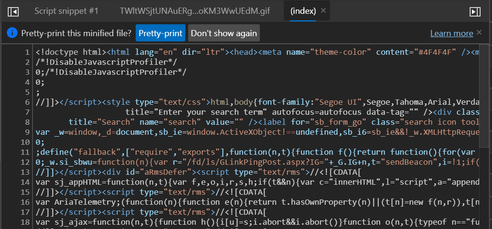
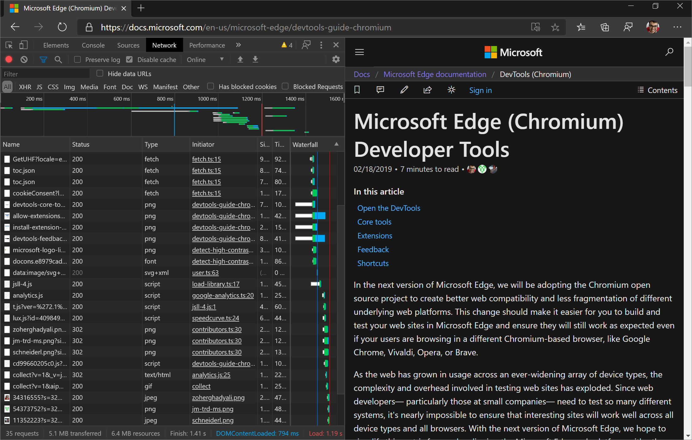

<!-- Copyright Kayce Basques

   Licensed under the Apache License, Version 2.0 (the "License");
   you may not use this file except in compliance with the License.
   You may obtain a copy of the License at

       https://www.apache.org/licenses/LICENSE-2.0

   Unless required by applicable law or agreed to in writing, software
   distributed under the License is distributed on an "AS IS" BASIS,
   WITHOUT WARRANTIES OR CONDITIONS OF ANY KIND, either express or implied.
   See the License for the specific language governing permissions and
   limitations under the License.  -->
# What's New in DevTools (Microsoft Edge 83)

Following the updated Chromium schedule, we are adjusting our schedule for upcoming Microsoft Edge releases and cancelling the Microsoft Edge 82 release. Check out our [blog post](https://blogs.windows.com/msedgedev/2020/03/20) for more info.

[!INCLUDE [Microsoft Edge team note for top of What's New](../../includes/edge-whats-new-note.md)]

<!-- ====================================================================== -->
## Announcements from the Microsoft Edge DevTools team

<!-- ====================================================================== -->
### Remotely debug Microsoft Edge on Windows 10 or later Devices

The [Remote Tools for Microsoft Edge (Beta)](https://www.microsoft.com/store/apps/9P6CMFV44ZLT) app is now available in the [Microsoft Store](https://www.microsoft.com/store/apps/windows). This app extends the [Windows Device Portal](/windows/uwp/debug-test-perf/device-portal).  You can connect from Microsoft Edge running on your development machine to a remote Windows 10 or later device and display a list of targets.  This list of targets includes all tabs in Microsoft Edge and [PWAs](../../../../progressive-web-apps-chromium/index.md) open on the Windows device.  Use DevTools on your development machine against a target running on the remote Windows device.

Read our guide for setting up your Windows 10 device and your development machine for remote debugging: [Remotely debug Windows devices](../../../remote-debugging/windows.md).

Let us know about your remote debugging experience by [tweeting](https://twitter.com/intent/tweet?text=@EdgeDevTools) or clicking the [Send Feedback](../../../contact.md) icon.

<!-- ====================================================================== -->
### New ways to access Settings

There are tons of settings for DevTools that you can customize to make DevTools look, feel, and work the way you need. In Microsoft Edge 83, accessing [Settings](../../../customize/index.md#settings) in DevTools is now much easier.  Open **Settings** by clicking the gear icon next to Console alerts and the main menu.

You can also open **Settings** from the **Main Menu** under **More tools**.

Chromium issue [#1050855](https://crbug.com/1050855)

<!-- ====================================================================== -->
### New and improved infobars

Informational notification bars (infobars) in DevTools now have an improved look and more functionality. In Microsoft Edge 83, infobars are easier to read and provide buttons so you can take the relevant action right away.

Chromium issue [#1056348](https://crbug.com/1056348)

<!-- no link to regular docs, since this is a cross-feature UI -->

<!-- ====================================================================== -->
### Navigate the Color Picker with your keyboard

In previous versions of Microsoft Edge, you couldn't navigate the **Shades** section of the [Color Picker](../../../css/reference.md#change-colors-with-the-color-picker) with the keyboard.  In Microsoft Edge 83, you can now use the keyboard to move the selector in the **Shades** section of the Color Picker.

The Color Picker is a GUI in the **Elements** panel for changing `color` and `background-color` declarations:

Chromium issue [#963183](https://crbug.com/963183)

See also:
* [Inspect, edit, and debug HTML and CSS with the Elements tool](../../../elements-tool/elements-tool.md)

<!-- ====================================================================== -->
### Properties tab now populates after a page refresh

In Microsoft Edge 81 and earlier, the **Properties tab** in the **Elements** panel was broken by page refreshes.  When you refreshed the page, the **Properties tab** didn't populate the properties of the currently selected element:

In Microsoft Edge 83, you can now display the properties of the currently selected element after a page refresh in the **Properties tab**:

Chromium issue [#1050999](https://crbug.com/1050999)

See also:
* [Inspect, edit, and debug HTML and CSS with the Elements tool](../../../elements-tool/elements-tool.md)

<!-- ====================================================================== -->
### Use the arrow keys to scroll in the Changes tool

The **Changes tool** tracks any changes you have made to CSS or JavaScript in DevTools.  You can use the **Changes tool** to quickly display all your changes and take those back to your editor/IDE.

To open the **Changes** tool, in DevTools, press **Ctrl+Shift+P** (Windows/Linux) or **Command+Shift+P** (macOS) to open the [Command Menu](../../../command-menu/index.md), and then type `changes`.  Select the **Show Changes** command and then press **Enter**.  The **Changes tool** opens in the Drawer.

When you have made a change to a minified file, the **Changes tool** enables you to scroll horizontally to display all of your minified code.  Starting in Microsoft Edge 83, you can now scroll horizontally using the arrow keys on your keyboard.

If you use screen readers or the keyboard to navigate around DevTools, send us your feedback by [tweeting](https://twitter.com/intent/tweet?text=@EdgeDevTools) at us or clicking the [Send Feedback](../../../contact.md) icon.

Chromium issue [#963183](https://crbug.com/963183)

See also:
* [Track changes to files using the Changes tool](../../../changes/changes-tool.md)

<!-- ====================================================================== -->
<!-- ====================================================================== -->
## Announcements from the Chromium project

The following sections announce additional features available in Microsoft Edge 83 that were contributed to the open source Chromium project.

<!-- ====================================================================== -->
### Emulate vision deficiencies

In the **Rendering** tool, use the new **Emulate vision deficiencies** feature to get a better idea of how people with different types of vision deficiencies experience your site:

DevTools can emulate blurred vision and the following types of color vision deficiencies:

| Color Vision Deficiency | Details |
|---|---|
| Protanopia | The inability to perceive any red light. |
| Deuteranopia | The inability to perceive any green light. |
| Tritanopia | The inability to perceive any blue light. |
| Achromatopsia | The inability to perceive any color, except for shades of grey (extremely rare). |

Less extreme versions of these color vision deficiencies exist, and are more common.  For example, protanomaly is a reduced sensitivity to red light (as opposed to protanopia, which is the complete inability to perceive red light).  However, these **-omaly** vision deficiencies aren't as clearly defined: every person with such a vision deficiency is different, and may see things differently (being able to perceive more or less of the relevant colors).

By designing for the more extreme simulations in DevTools, your web apps are guaranteed to be accessible to people with vision deficiencies as well.

Send your feedback by [tweeting](https://twitter.com/intent/tweet?text=@EdgeDevTools) or clicking the [Send Feedback](../../../contact.md) icon.

Chromium issue [#1003700](https://crbug.com/1003700)

See also:
* [Emulate vision deficiencies](../../../accessibility/emulate-vision-deficiencies.md)
* [Analyze rendering performance with the Rendering tool](../../../evaluate-performance/reference.md#analyze-rendering-performance-with-the-rendering-tool) in _Performance features reference_
* [Types of Colour Blindness](http://www.colourblindawareness.org/colour-blindness/types-of-colour-blindness), at Colourblindawareness.org.

<!-- ====================================================================== -->
### Emulate locales

To emulate locales, in the **Sensors** tool, select a location from the **Location** dropdown list.  (To access the **Sensors** tool, [open the **Command Menu**](../../../command-menu/index.md) and type `Sensors`.)  After you select a location, DevTools modifies the current default locale, which affects the following code:

*  `Intl.*` APIs, for example: `new Intl.NumberFormat().resolvedOptions().locale`
*  Other locale-aware JavaScript APIs such as `String.prototype.localeCompare` and `*.prototype.toLocaleString`, for example: `123_456..toLocaleString()`
*  DOM APIs such as `navigator.language` and `navigator.languages`
*  The [Accept-Language](https://developer.mozilla.org/docs/Web/HTTP/Headers/Accept-Language) HTTP request header

> [!NOTE]
> Updates to `navigator.language` and `navigator.languages` aren't visible immediately, but only after the next navigation or page refresh.  Changes to the `Accept-Language` HTTP header are only reflected for subsequent requests.

To try a demo, see [Locale-dependent code example](https://mathiasbynens.be/demo/locale).

Chromium issue [#1051822](https://crbug.com/1051822)

See also:
* [Override geolocation with the Sensors tool](../../../device-mode/geolocation.md)

<!-- ====================================================================== -->
### Cross-Origin Embedder Policy (COEP) debugging

The **Network** panel now provides [Cross-Origin Embedder Policy](https://docs.google.com/document/d/1zDlfvfTJ_9e8Jdc8ehuV4zMEu9ySMCiTGMS9y0GU92k/edit#bookmark=id.uo6kivyh0ge2) debugging information.

The **Status** column now provides a quick explanation of why a request was blocked as well as a link to view the headers of that request for further debugging:

The **Response Headers** section of the **Headers** tab provides more guidance on how to resolve the issues:

Send your feedback by [tweeting](https://twitter.com/intent/tweet?text=@EdgeDevTools) or clicking the [Send Feedback](../../../contact.md) icon.

Chromium issue [#1051466](https://crbug.com/1051466)

See also:
* [Block requests](../../../network/index.md#block-requests) in _Inspect network activity_.

<!-- ====================================================================== -->
### New icons for breakpoints, conditional breakpoints, and logpoints

Update: As of 2022, breakpoints are now indicated by a blue rectangle, instead of a red circle.

The **Sources** panel has new icons for breakpoints, conditional breakpoints, and logpoints:

*  Breakpoints () are represented by red circles.
*  Conditional Breakpoints () are represented by half-red half-white circles.
*  Logpoints () are represented by red circles with Console icons.

The motivation for the new icons was to make the UI more consistent with other GUI debugging tools (which usually color breakpoints red) and to make it easier to distinguish between the 3 features at a glance.

Chromium issue [#1041830](https://crbug.com/1041830)

See also:
* [Pause code with breakpoints](../../../javascript/breakpoints.md)

<!-- ====================================================================== -->
### View network requests that set a specific cookie path

Use the new `cookie-path` filter keyword in the **Network** tool to focus on the network requests that set a specific [cookie path](https://developer.mozilla.org/docs/Web/HTTP/Headers/Set-Cookie#Directives).

To discover more keywords like `cookie-path`, see [Filter requests by properties](../../../network/reference.md#filter-requests-by-properties) in _Network features reference_.

<!-- ====================================================================== -->
### Dock to left from the Command Menu

To move DevTools to the left of the viewport (rendered webpage), open the [Command Menu](../../../command-menu/index.md) and run the `Dock to left` command.  The **Dock to left** feature has been available since Microsoft Edge 75, but it was previously only accessible from the main menu.  You can now access the **Dock to left** feature from the Command Menu, as well.

"

Send your feedback by [tweeting](https://twitter.com/intent/tweet?text=@EdgeDevTools) or clicking the [Send Feedback](../../../contact.md) icon.

Chromium issue [#1011679](https://crbug.com/1011679)

See also:
* [Change DevTools placement (Undock, Dock to bottom, Dock to left)](../../../customize/placement.md)

<!-- ====================================================================== -->
### The Audits panel is now the Lighthouse panel

The DevTools team frequently got feedback from web developers that while it was possible to run [Lighthouse](https://github.com/GoogleChrome/lighthouse) from DevTools, when they tried it out, they couldn't find a "Lighthouse" panel.  So, the **Audits** panel is now called the **Lighthouse** panel.

Note: The **Lighthouse** panel provides links to content hosted on third-party websites.  Microsoft is not responsible for and has no control over the content of these sites and any data they may collect.

See also:
* [Lighthouse tool](../../../lighthouse/lighthouse-tool.md)

<!-- ====================================================================== -->
### Delete all Local Overrides in a folder

After setting up **Local Overrides**, you can right-click a directory and then select the new **Delete all overrides** option to delete all Local Overrides in that folder.

Send your feedback by [tweeting](https://twitter.com/intent/tweet?text=@EdgeDevTools) or clicking the [Send Feedback](../../../contact.md) icon.

Chromium issue [#1016501](https://crbug.com/1016501)

See also:
* [Override webpage resources with local copies (Overrides tab)](../../../javascript/overrides.md)

<!-- ====================================================================== -->
### Updated Long tasks UI

A **Long Task** is JavaScript code that monopolizes the main thread for a long time, causing a web page to freeze.

You've been able to [visualize Long Tasks in the Performance panel](../../../evaluate-performance/reference.md#view-main-thread-activity) for a while now, but in Microsoft Edge 83 the Long Task visualization UI in the **Performance** panel has been updated.  The Long Task portion of a task is now colored with a striped red background:

Send your feedback by [tweeting](https://twitter.com/intent/tweet?text=@EdgeDevTools) or clicking the [Send Feedback](../../../contact.md) icon.

Chromium issue [#1054447](https://crbug.com/1054447)

<!-- ====================================================================== -->
### Maskable icon support in the Manifest pane

There's a new checkbox, **Show only the minimum safe area for maskable icons**, in the **Manifest** pane of the **Application** tool.

Android Oreo introduced adaptive icons, which display app icons in a variety of shapes across different device models.  **Maskable icons** are a new icon format that support adaptive icons, which enable you to ensure that your [PWA](../../../../progressive-web-apps-chromium/index.md) icon looks good on devices that support the maskable icons standard.

To check that your maskable icon looks good on Android Oreo devices, in the **Manifest** pane of the **Application** tool, select the new checkbox **Show only the minimum safe area for maskable icons**:

<!-- Check out [Are my current icons ready?] to learn more.  -->

This feature launched in Microsoft Edge 81.  The updates covered here in Microsoft Edge 83 weren't covered in [What's New in DevTools (Microsoft Edge 81)](../01/devtools.md).

See also:
* [View, edit, and delete cookies](../../../storage/cookies.md) - Articles about the **Application** tool.

<!-- ====================================================================== -->
> [!NOTE]
> Portions of this page are modifications based on work created and [shared by Google](https://developers.google.com/terms/site-policies) and used according to terms described in the [Creative Commons Attribution 4.0 International License](https://creativecommons.org/licenses/by/4.0).
> The original page is found [here](https://developer.chrome.com/blog/new-in-devtools-83) and is authored by [Kayce Basques](https://developers.google.com/web/resources/contributors#kayce-basques) (Technical Writer, Chrome DevTools \& Lighthouse).

This work is licensed under a [Creative Commons Attribution 4.0 International License](https://creativecommons.org/licenses/by/4.0).
