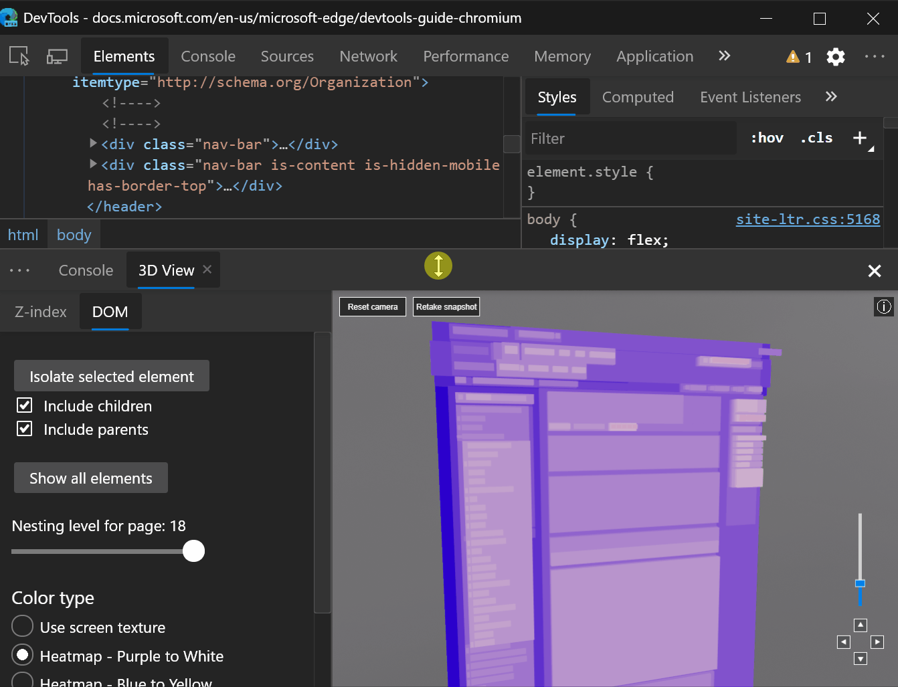
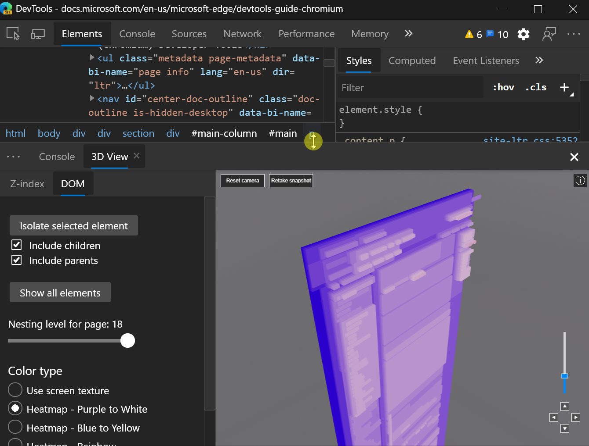
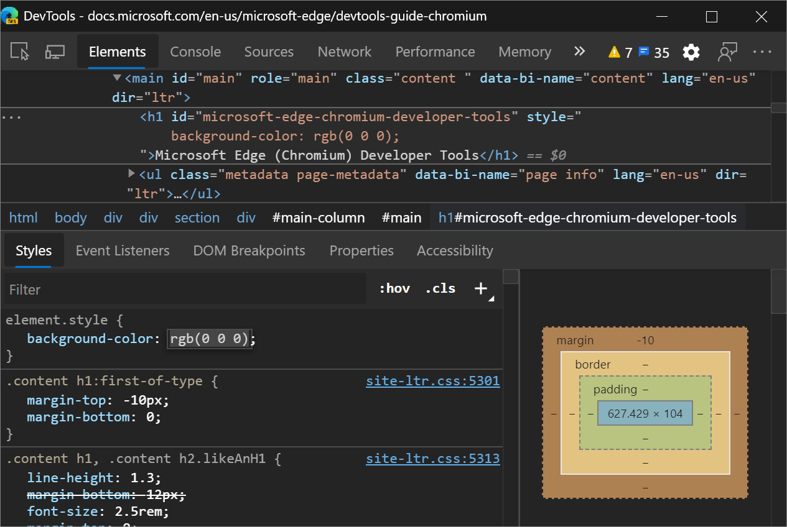

<!-- Copyright Kayce Basques

   Licensed under the Apache License, Version 2.0 (the "License");
   you may not use this file except in compliance with the License.
   You may obtain a copy of the License at

       https://www.apache.org/licenses/LICENSE-2.0

   Unless required by applicable law or agreed to in writing, software
   distributed under the License is distributed on an "AS IS" BASIS,
   WITHOUT WARRANTIES OR CONDITIONS OF ANY KIND, either express or implied.
   See the License for the specific language governing permissions and
   limitations under the License.  -->
# What's New in DevTools (Microsoft Edge 84)

[!INCLUDE [Microsoft Edge team note for top of What's New](../../includes/edge-whats-new-note.md)]

<!-- ====================================================================== -->
## Announcements from the Microsoft Edge DevTools team

<!-- ====================================================================== -->
### Use the DevTools in Windows high contrast mode

Microsoft Edge DevTools is now displayed in high-contrast mode when Windows is in high-contrast mode.

[Follow the instructions to turn on high-contrast mode in Windows](https://support.microsoft.com/help/4026951/windows-10-turn-high-contrast-mode-on-or-off).  To open DevTools in Microsoft Edge, select **F12** or **Ctrl+Shift+I**.  DevTools is displayed in high-contrast mode.

Note: DevTools currently supports high-contrast mode on Windows, but not on macOS.

Chromium issue [#1048378](https://crbug.com/1048378)

See also:
* [Apply a color theme to DevTools](../../../customize/theme.md)
* [Check for contrast issues with dark theme and light theme](../../../accessibility/test-dark-mode.md)

<!-- ====================================================================== -->
### Match keyboard shortcuts in the DevTools to Visual Studio Code

From your [feedback](../../../contact.md) and the [Chromium public issue tracker](https://bugs.chromium.org/p/chromium/issues/list), the Microsoft Edge DevTools team learned that you wanted to be able to customize keyboard shortcuts in DevTools.  In Microsoft Edge 84, you can now match keyboard shortcuts in DevTools to [Visual Studio Code](https://code.visualstudio.com/), which is just one of the features the team is working on for shortcut customization.

To try the experiment:

1. In DevTools, open **Settings** by pressing **?** or clicking the **Settings** () icon in DevTools.

1. In the **Experiments** section, select the checkbox **Enable custom keyboard shortcuts settings tab (requires reload)**.

1. Reload DevTools.

1. Open **Settings** again, and select the **Shortcuts** section.

1. Click the **Match shortcuts from preset** dropdown list, select **DevTools (Default)**, and then select **Visual Studio Code**.  

The keyboard shortcuts in DevTools now match the shortcuts for equivalent actions in Visual Studio Code.

For example, the keyboard shortcut for pausing or continuing running a script in [Visual Studio Code](https://code.visualstudio.com/shortcuts/keyboard-shortcuts-windows.pdf) is **F5**.  With the **DevTools (Default)** preset, that same shortcut in DevTools is **F8**, but with the **Visual Studio Code** preset, that shortcut is now also **F5**.

The feature is currently available in Microsoft Edge 84 as an experiment, so please share your [feedback](../../../contact.md) with the team!

Chromium issue [#174309](https://crbug.com/174309)

See also:
* [Customize keyboard shortcuts](../../../customize/shortcuts.md)

<!-- ====================================================================== -->
### Remote debug Surface Duo emulators

You can now remotely debug your web content that's running in the [Surface Duo emulator](/dual-screen/android/use-emulator) using the full power of Microsoft Edge DevTools.

With the Surface Duo emulator, you can test how your web content renders on a new class of foldable and dual-screen devices.  The emulator runs the Android operating system and provides the [Microsoft Edge Android app](https://play.google.com/store/apps/details?id=com.microsoft.emmx).  Load your web content in the [Microsoft Edge app](https://play.google.com/store/apps/details?id=com.microsoft.emmx) and debug it with DevTools:

The `edge://inspect` page in a desktop instance of Microsoft Edge shows the **SurfaceDuoEmulator** with a list of the open tabs or [PWAs](../../../../progressive-web-apps-chromium/index.md) that are running on the Surface Duo emulator:

Click **inspect** for the tab or PWA that you want to debug, to open DevTools.  Follow the step-by-step guide to remotely debug your web content on the Surface Duo emulator: [Remotely debug Surface Duo emulators](../../../remote-debugging/surface-duo-emulator.md).

<!-- ====================================================================== -->
### Resize the DevTools drawer more easily

In Microsoft Edge 83 or earlier, you resized the [DevTools Drawer](../../../customize/index.md#quick-view) by hovering inside the toolbar of the drawer.  The drawer behaved differently than the other resize controls for panes in DevTools where you hover on the border of the pane to resize it.  The following image shows how resizing the drawer worked in Microsoft Edge version 83 or earlier:

Starting with Microsoft Edge 84, you can resize the drawer by hovering over the border.  This change aligns the behavior for resizing the DevTools drawer with other panes in DevTools. The following image shows how resizing the drawer works in Microsoft Edge 84 or later:

Chromium issue [#1076112](https://crbug.com/1076112)

<!-- ====================================================================== -->
### Screencasting navigation buttons display focus

When remote debugging an [Android device](../../../remote-debugging/index.md), a [Windows 10 or later device](../../../remote-debugging/windows.md), or a [Surface Duo emulator](../../../remote-debugging/surface-duo-emulator.md), you can toggle screencasting with the  icon in the top-left corner of DevTools.  With screencasting enabled, you can navigate the tab in Microsoft Edge on the remote device from the DevTools window.

In Microsoft Edge 84, these navigation buttons are now also keyboard-accessible.  For example, pressing **Shift+Tab** from the screencasted URL bar puts focus on the **Refresh** button:

Chromium issue [#1081486](https://crbug.com/1081486)

<!-- ====================================================================== -->
### Network panel Details pane is now accessible

In Microsoft Edge 84, the [Details pane](../../../network/index.md#inspect-the-details-of-the-resource) in the **Network** tool now takes focus when you open it for a resource in the [Network Log](../../../network/index.md#log-network-activity).  This change allows screen readers to read out and interact with the content of the **Details** pane.

Chromium issue [#963183](https://crbug.com/963183)

<!-- ====================================================================== -->
<!-- ====================================================================== -->
## Announcements from the Chromium project

The following sections announce additional features available in Microsoft Edge 84 that were contributed to the open source Chromium project.

<!-- ====================================================================== -->
### Fix site issues with the new Issues tool in the DevTools Drawer

The new **Issues** tool in the Drawer at the bottom of DevTools reduces the notification fatigue and clutter of the **Console**.  Currently, the **Console** is the central place for website developers, libraries, frameworks, and Microsoft Edge to log messages, warnings, and errors.  The **Issues** tool aggregates warnings from the browser in a structured, aggregated, and actionable way.  The **Issues** tool links to affected resources within DevTools, and provides guidance on how to fix the issues.

Over time, more warnings will be surfaced in the **Issues** tool rather than in the **Console**, to streamline the **Console** messages.

To get started, see [Find and fix problems using the Issues tool](../../../issues/index.md).

Chromium issue [#1068116](https://crbug.com/1068116)

<!-- ====================================================================== -->
### View accessibility information in the Inspect Mode tooltip

The **Inspect Mode** tooltip now indicates whether the element has an accessible
[name and role](https://webhint.io/docs/user-guide/hints/hint-axe/name-role-value/) and is [keyboard-focusable](https://webhint.io/docs/user-guide/hints/hint-axe/keyboard/).

<!--todo:  add link inspect mode tooltip (WebdevCls) when section is live  -->
<!--todo:  add link name and role (WebdevLabelsText) when section is live  -->
<!--todo:  add link keyboard-focusable (WebdevControlFocus) when section is live  -->

Chromium issue [#1040025](https://crbug.com/1040025)

See also:
* [Analyze pages using the Inspect tool](../../../css/inspect.md)

<!-- ====================================================================== -->
### Performance panel updates

See also:
* [Performance features reference](../../../evaluate-performance/reference.md)

<!-- ====================================================================== -->
#### View Total Blocking Time information in the footer

After recording your load performance, the **Performance** panel now shows Total Blocking Time (TBT) information in the footer.  TBT is a load performance metric that helps quantify how long a page takes to become usable.  TBT essentially measures how long a page only _appears_ to be usable (because the content is rendered to the screen); but the page isn't actually usable, because JavaScript is blocking the main thread and therefore the page doesn't respond to user input.  TBT is the main metric for approximating First Input Delay.

<!--todo:  add link Total Blocking Time (TBT) (WebdevTbt) when section is live  -->
<!--todo:  add link lab metric (WebdevMeasureSpeedLabField) when section is live  -->
<!--todo:  add link Core Web Vitals (WebdevCoreWebVitals) when section is live  -->

To get Total Blocking Time information, don't use the **Refresh Page**  workflow for recording page load performance.

Instead, select **Record** , manually reload the page, wait for the page to load, and then stop recording.

If `Total Blocking Time: Unavailable` is displayed, Microsoft Edge DevTools did not get the required information from the internal profiling data in Microsoft Edge.

Chromium issue [#1054381](https://crbug.com/1054381)

See also:
* [Performance features reference](../../../evaluate-performance/reference.md)

<!-- ====================================================================== -->
#### Layout Shift events in the new Experience section

The new **Experience** section of the **Performance** panel helps you detect layout shifts.  Cumulative Layout Shift (CLS) is a metric that helps you quantify unwanted visual instability.

<!--todo:  add link Core Web Vitals (WebdevCoreWebVitals) when section is live  -->
<!--todo:  add link layout shifts (WebdevCls) when section is live  -->

Click the **Layout Shift** event to display the details of the layout shift in the **Summary** pane.  Hover on the **Moved from** and **Moved to** fields to visualize where the layout shift occurred.

See also:
* [Performance features reference](../../../evaluate-performance/reference.md)

<!-- ====================================================================== -->
### More accurate promise terminology in the Console

When logging a `Promise`, the **Console** incorrectly provided `PromiseStatus` value set to `resolved`.

The **Console** now uses the term `fulfilled`, which aligns with the `Promise` specification.  For more information about the `Promise` specification, see [States and Fates on GitHub](https://github.com/domenic/promises-unwrapping/blob/master/docs/states-and-fates.md).<!-- changing master to main doesn't work 5/19/2022 -->

V8 issue [#6751](https://bugs.chromium.org/p/v8/issues/detail?id=6751)

See also:
* [Console overview](../../../console/index.md)

<!-- ====================================================================== -->
### Styles pane updates

See also:
* [Edit CSS font styles and settings in the Styles pane](../../../inspect-styles/edit-fonts.md)

<!-- ====================================================================== -->
#### Support for the revert keyword

The autocomplete UI of the **Styles** pane now detects the [revert](https://developer.mozilla.org/docs/Web/CSS/revert) CSS keyword, which reverts the cascaded value of a property to the previous value applied to the styling of the element.

Chromium issue [#1075437](https://crbug.com/1075437)

See also:
* [Edit CSS font styles and settings in the Styles pane](../../../inspect-styles/edit-fonts.md)

<!-- ====================================================================== -->
#### Image previews

Hover on a `background-image` value in the **Styles** pane to display a preview of the image in a tooltip.

Chromium issue [#1040019](https://crbug.com/1040019)

See also:
* [Edit CSS font styles and settings in the Styles pane](../../../inspect-styles/edit-fonts.md)

<!-- ====================================================================== -->
#### Color Picker now uses space-separated functional color notation

[CSS Color Module Level 4](https://drafts.csswg.org/css-color#changes-from-3) specifies that color functions, such as `rgb()`, should support space-separated
arguments.  For example, `rgb(0, 0, 0)` is equivalent to `rbg(0 0 0)`.

When you select colors with the [Color Picker](../../../css/reference.md#change-colors-with-the-color-picker) or alternate between color representations in the **Styles** pane by holding **Shift** and selecting the **background-color** value, the space-separated argument syntax is displayed.

You should also display the syntax in the **Computed** pane and the **Inspect Mode** tooltip.

Microsoft Edge DevTools is using the new syntax because upcoming CSS features such as [color()](https://drafts.csswg.org/css-color#the-color-property) don't support the deprecated comma-separated argument syntax.

The space-separated argument syntax has been supported in most browsers for a while.  See [Can I use: Space-separated functional color notations?](https://caniuse.com/#feat=mdn-css_types_color_space_separated_functional_notation)

Chromium issue [#1072952](https://crbug.com/1072952)

<!-- ====================================================================== -->
### Deprecation of the Properties pane in the Elements panel

The **Properties** pane in the **Elements** tool is deprecated.  Run `console.dir($0)` in the **Console** instead.

#### Reference

* [console.dir()](../../../console/api.md#dir)
* [$0](../../../console/utilities.md#recently-selected-element-or-javascript-object-0-4)

<!-- ====================================================================== -->
### App shortcuts support in the Manifest pane

In the **Application** tool, the **Manifest** page now shows app shortcuts.  App shortcuts help users quickly start common or recommended tasks within a web app.  The app shortcuts menu is shown only for Progressive Web Apps that are installed on the user's desktop or mobile device.

<!-- For more information, see [Get things done quickly with app shortcuts](https://alphabet-dev/app-shortcuts). -->

<!--todo: add link Get things done quickly with app shortcuts (WebdevAppShortcuts) when section is live -->

See also:
* [Overview of Progressive Web Apps (PWAs)](../../../../progressive-web-apps-chromium/index.md)
* [Debug Progressive Web Apps (PWAs)](../../../progressive-web-apps/index.md)

<!-- ====================================================================== -->
> [!NOTE]
> Portions of this page are modifications based on work created and [shared by Google](https://developers.google.com/terms/site-policies) and used according to terms described in the [Creative Commons Attribution 4.0 International License](https://creativecommons.org/licenses/by/4.0).
> The original page is found [here](https://developer.chrome.com/blog/new-in-devtools-84) and is authored by [Kayce Basques](https://developers.google.com/web/resources/contributors#kayce-basques) (Technical Writer, Chrome DevTools \& Lighthouse).

This work is licensed under a [Creative Commons Attribution 4.0 International License](https://creativecommons.org/licenses/by/4.0).
