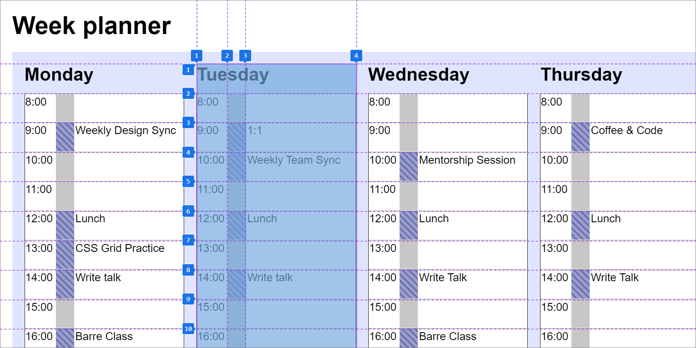
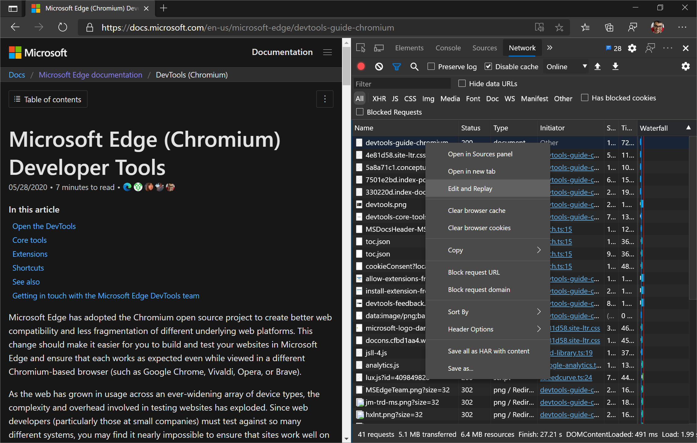
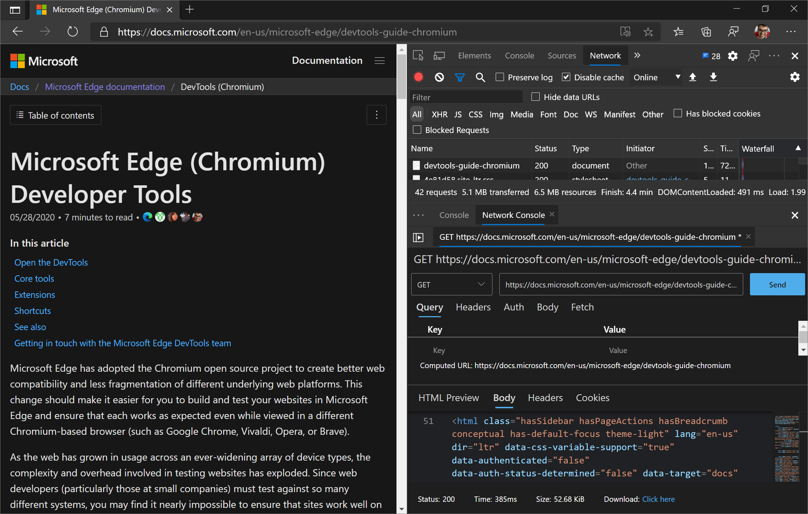
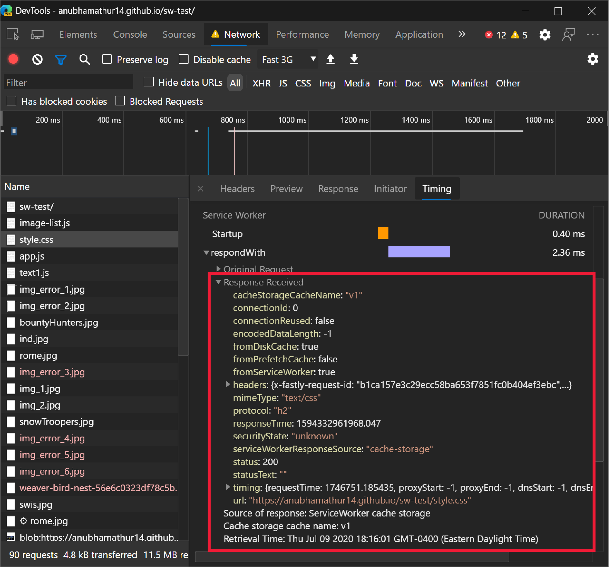
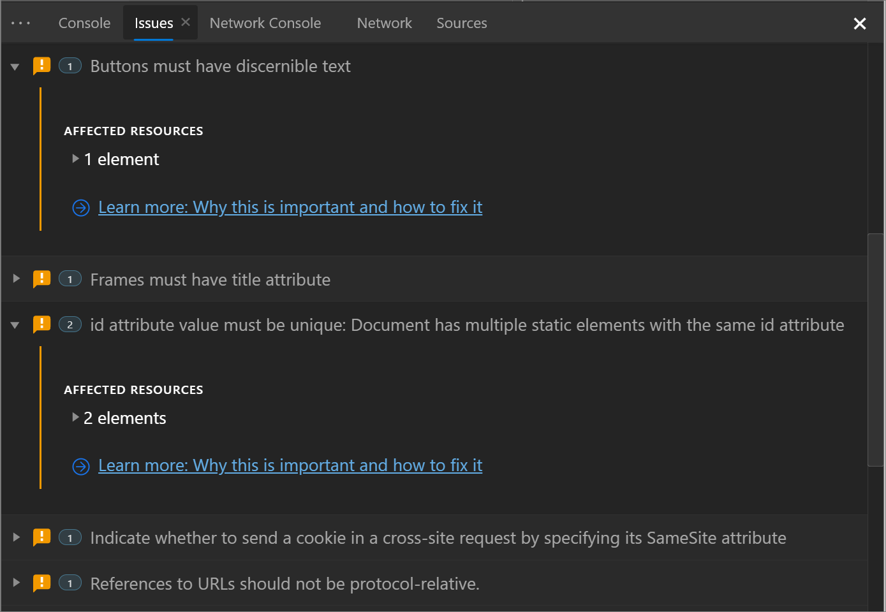
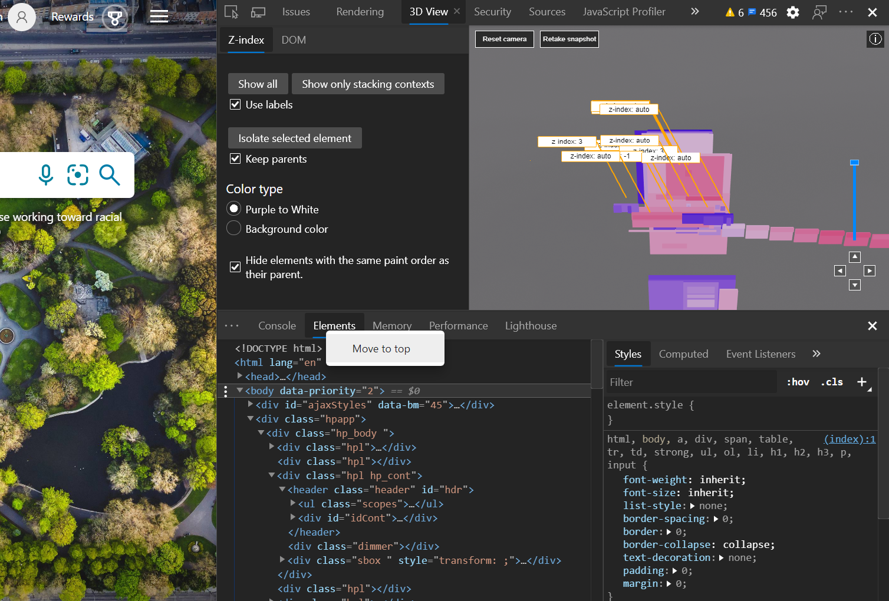
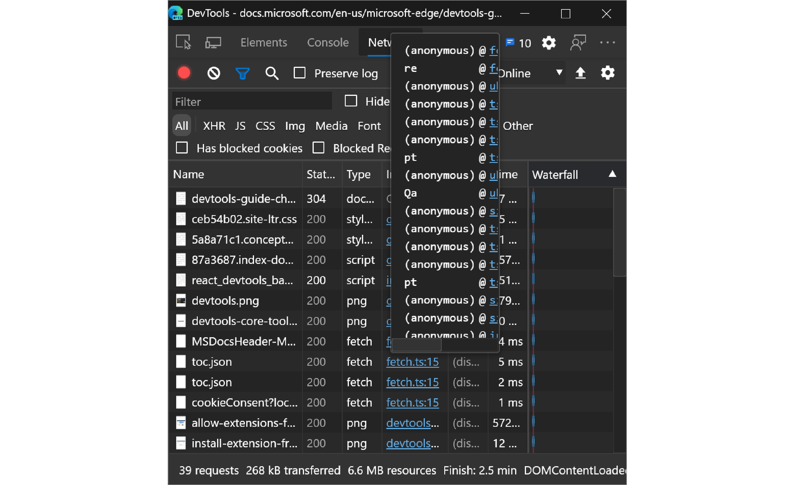
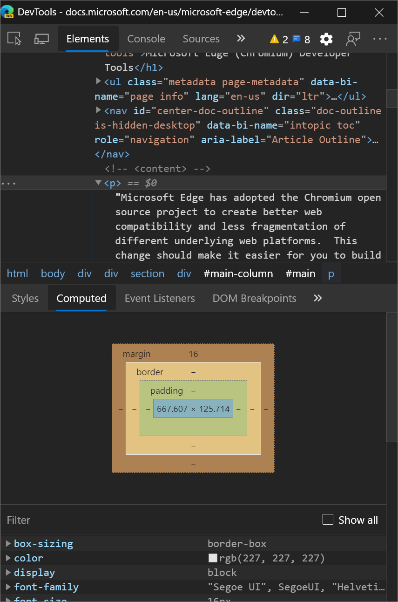

<!-- Copyright Jecelyn Yeen

   Licensed under the Apache License, Version 2.0 (the "License");
   you may not use this file except in compliance with the License.
   You may obtain a copy of the License at

       https://www.apache.org/licenses/LICENSE-2.0

   Unless required by applicable law or agreed to in writing, software
   distributed under the License is distributed on an "AS IS" BASIS,
   WITHOUT WARRANTIES OR CONDITIONS OF ANY KIND, either express or implied.
   See the License for the specific language governing permissions and
   limitations under the License.  -->
# What's New in DevTools (Microsoft Edge 85)

<!-- ====================================================================== -->
## Announcements from the Microsoft Edge DevTools team

The following sections are a list of announcements you may have missed from the Microsoft Edge DevTools team.  Check out the announcements to try new features in the DevTools, Microsoft Visual Studio Code extensions, and more.  To stay up to date on all the latest and greatest features in your developer tools, download the [Microsoft Edge preview channels](https://www.microsoftedgeinsider.com/download/) and [follow the Microsoft Edge DevTools team on Twitter](https://twitter.com/EdgeDevTools).

<!-- careful changing heading wording: Welcome tool potentially links to it -->
<!-- ====================================================================== -->
### CSS grid debugging features

<!-- todo: indicate no longer experimental? -->

The Microsoft Edge DevTools team is collaborating with the Chrome DevTools team and Chromium community to add new CSS grid debugging features to DevTools.  You can now display grid line numbers, grid gaps, and extended grid lines as an on-page overlay.  Plus, more improvements to the grid tools are coming soon.

To enable the experiment, see [Turning an experiment on or off](../../../experimental-features/index.md#turning-an-experiment-on-or-off) and select the checkbox next to **Enable new CSS Grid debugging features**.  To try out the experiment with a sample, see [CSS Grid planner example](https://codepen.io/hxlnt/full/YzwBzKM).

Chromium issue [#1047356](https://crbug.com/1047356)

See also:
* [Inspect CSS Grid](https://docs.microsoft.com/en-us/microsoft-edge/devtools-guide-chromium/css/grid)

<!-- careful changing heading wording: Welcome tool potentially links to it -->
<!-- ====================================================================== -->
### Edit and Replay requests with the Network Console

You can now use **Edit and Replay** on requests in the [Network Log](../../../network/index.md#log-network-activity) using the **Network Console**.

A new panel, the **Network Console** opens in the [DevTools Drawer](../../../customize/index.md#drawer) and automatically populates with information for the HTTP request.  To display the response returned from the server, edit the request (if needed) and select **Send**.

You can also use the **Network Console** to create and send HTTP requests directly from the DevTools.

Tip: To display **Network Console** in the main (top) panel instead of the [DevTools Drawer](../../../customize/index.md#drawer), see [moving tools between panels](#move-tools-between-panels).

To enable the experiment, see [Turning an experiment on or off](../../../experimental-features/index.md#turning-an-experiment-on-or-off) and select the checkbox next to **Enable Network Console**.  Open the [Network Log](../../../network/index.md#log-network-activity), right-click, and then select **Edit and Replay**.

Chromium issue [#1093687](https://crbug.com/1093687)

<!-- careful changing heading wording: Welcome tool potentially links to it -->
<!-- ====================================================================== -->
### Service worker respondWith events in the Timing tab

The **Timing** tab of the **Network** tool now includes `respondWith` service worker events.  The `respondWith` service worker event shows the duration from the time immediately before the service worker `fetch` event handler starts running to the time when the `respondWith` promise of the `fetch` handler is settled.

Expand **Response received** to display additional information from the `fetch` response like `CacheStorageCacheName`, `serviceWorkerResponseSource`, and `ResponseTime`.

Chromium issue [#1066579](https://crbug.com/1066579)

See also:
* [Display the timing relationship of requests](https://docs.microsoft.com/en-us/microsoft-edge/devtools-guide-chromium/network/reference#display-the-timing-relationship-of-requests) in _Network features reference_.
* [Display the timing breakdown of a request](https://docs.microsoft.com/en-us/microsoft-edge/devtools-guide-chromium/network/reference#display-the-timing-breakdown-of-a-request) in _Network features reference_.

<!-- careful changing heading wording: Welcome tool potentially links to it -->
<!-- ====================================================================== -->
### webhint feedback in the Issues panel

[webhint](https://webhint.io) is an open-source tool that provides real-time feedback on the accessibility, cross-browser compatibility, security, performance, PWAs, and other common web development issues of websites.  You can view webhint feedback in the [Issues](../../../issues/index.md) panel.

To enable the experiment, see [Turning an experiment on or off](../../../experimental-features/index.md#turning-an-experiment-on-or-off) and select the checkbox next to **Enable webhint**.  Open the [Issues](../../../issues/index.md) panel to display feedback from webhint.

Chromium issue [#1070378](https://crbug.com/1070378)

See also:
* [The webhint extension for Visual Studio Code](https://docs.microsoft.com/en-us/microsoft-edge/visual-studio-code/webhint)
* [Enable webhint](https://docs.microsoft.com/en-us/microsoft-edge/devtools-guide-chromium/experimental-features/#enable-webhint) in _Experimental features_

<!-- careful changing heading wording: Welcome tool potentially links to it -->
<!-- ====================================================================== -->
### Move tools between panels

Normally, tools such as **Elements** and **Network** may only be opened in the main (top) panel of DevTools.  Similarly, tools such as **3D View** and **Issues** may only be opened in the drawer (bottom) panel of DevTools.  You can now customize your DevTools layout by moving tools between the top and bottom panels.

> [!NOTE]
> To enable the experiment, see [Turning an experiment on or off](../../../experimental-features/index.md#turning-an-experiment-on-or-off) and select the checkbox next to **Enable support to move tabs between panels**.

Chromium issue [#897944](https://crbug.com/897944)

See also:
* [About Panel and Drawer tools](https://docs.microsoft.com/en-us/microsoft-edge/devtools-guide-chromium/overview#about-panel-and-drawer-tools) in _Overview of DevTools_.

<!-- careful changing heading wording: Welcome tool potentially links to it -->
<!-- ====================================================================== -->
### Improved Initiator tooltip in the Network panel

In Microsoft Edge 83 and 84, tooltips for the Initiator column, which shows the cause of the resource request, in the [Network Log](../../../network/index.md#log-network-activity) displayed with a horizontal scrollbar.  You were only able to display the call stack that initiated the request by scrolling horizontally in the tooltip.

Starting with Microsoft Edge 85, you can now display the Initiator call stack in the tooltip without scrolling horizontally.

Chromium issue [#1069404](https://crbug.com/1069404)

<!-- ====================================================================== -->
## Announcements from the Chromium project

The following sections announce additional features available in Microsoft Edge 85 that were contributed to the open source Chromium project.

<!--
See also:
* 
* 
-->

<!-- careful changing heading wording: Welcome tool potentially links to it -->
<!-- ====================================================================== -->
### Style editing for CSS-in-JS frameworks

The **Styles** pane now has better support for editing styles that were created with the [CSS Object Model (CSSOM)](https://drafts.csswg.org/cssom) APIs.  Many CSS-in-JS frameworks and libraries use the CSSOM APIs under the hood to construct styles.

You can now edit styles added in JavaScript using [Constructable Stylesheets](https://wicg.github.io/construct-stylesheets/).  Constructable Stylesheets are a new way to create and distribute reusable styles when using [Shadow DOM](https://developer.mozilla.org/docs/Web/Web_Components/Using_shadow_DOM).

For example, the `h1` styles added with `CSSStyleSheet` (CSSOM APIs) were not editable previously.  The styles are editable now in the **Styles** panel.

Give this feature a try with a [sample that uses CSS-in-JS](https://codepen.io/zoherghadyali/full/abdGrPZ).  See [Style editing for CSS-in-JS frameworks](../../../css/css-in-js.md).

Chromium issue [#946975](https://crbug.com/946975)

<!--
See also:
* 
* 
-->

<!-- careful changing heading wording: Welcome tool potentially links to it -->
<!-- ====================================================================== -->
### Lighthouse 6 in the Lighthouse panel

The **Lighthouse** panel is now running Lighthouse 6.  For a full list of all changes, see [v6.0.0 release notes](https://github.com/GoogleChrome/lighthouse/releases/tag/v6.0.0).

Lighthouse 6.0 introduces three new metrics to the report:  Largest Contentful Paint (LCP), Cumulative Layout Shift (CLS), and Total Blocking Time (TBT).

The performance score formula has also been reweighted to better reflect the loading experience of the user.

Chromium issue [#772558](https://crbug.com/772558)

#### First Meaningful Paint deprecation

First Meaningful Paint (FMP) is deprecated in Lighthouse 6.0.  FMP has also been removed from the **Performance** panel.  **Largest Contentful Paint** is the recommended replacement for FMP.  <!--For an explanation of why it was deprecated, see [First Meaningful Paint](https://web.dev/first-meaningful-paint).  -->

<!--todo: add Largest Contentful Paint when section available  -->
<!--todo: add First Meaningful Paint link and note when available  -->

Chromium issue [#1096008](https://crbug.com/1096008)

<!--
See also:
* 
* 
-->

<!-- careful changing heading wording: Welcome tool potentially links to it -->
<!-- ====================================================================== -->
### Support for new JavaScript features

DevTools now has better support for some of the latest JavaScript language features:

* [Optional chaining](https://v8.dev/features/optional-chaining) syntax autocompletion.  Property auto-completion in the **Console** now supports optional chaining syntax, for example,  `name?.` now works in addition to `name.` and `name[`.

*  Syntax highlighting for [private fields](https://v8.dev/features/class-fields#private-class-fields).  Private class fields are now properly syntax-highlighted and pretty-printed in the **Sources** panel.

*  Syntax highlighting for [Nullish coalescing operator](https://v8.dev/features/nullish-coalescing).  DevTools now properly pretty-prints the nullish coalescing operator in the **Sources** panel.

Chromium issues [#1073903](https://crbug.com/1073903), [#1083214](https://crbug.com/1083214), [#1083797](https://crbug.com/1083797)

<!--
See also:
* 
* 
-->

<!-- careful changing heading wording: Welcome tool potentially links to it -->
<!-- ====================================================================== -->
### New app shortcut warnings in the Manifest pane

**App shortcuts** help users quickly start common or recommended tasks within a web app.

<!--todo: add App shortcuts when section is live  -->

The **Manifest** pane now shows warnings for the following conditions.

*  When the app shortcut icons are smaller than 96x96 pixels.
*  When the app shortcut icons and manifest icons aren't square (since the icons are ignored).

Chromium issue [#955497](https://crbug.com/955497)

<!--
See also:
* 
* 
-->

<!-- careful changing heading wording: Welcome tool potentially links to it -->
<!-- ====================================================================== -->
### Consistent display of the Computed pane

The **Computed** pane in the **Elements** tool is now displayed consistently as a pane across all viewport sizes.  Previously, the **Computed** pane merged inside of the **Styles** pane when DevTools was narrow.

Chromium issue [#1073899](https://crbug.com/1073899)

<!--
See also:
* 
* 
-->

<!-- careful changing heading wording: Welcome tool potentially links to it -->
<!-- ====================================================================== -->
### Bytecode offsets for WebAssembly files

DevTools now uses bytecode offsets for displaying line numbers of Wasm disassembly.  The line numbers make it clearer that you are looking at binary data, and is more consistent with how the Wasm runtime references locations.

Chromium issue [#1071432](https://crbug.com/1071432)

<!--
See also:
* 
* 
-->

<!-- careful changing heading wording: Welcome tool potentially links to it -->
<!-- ====================================================================== -->
### Line-wise copy and cut in Sources Panel

When performing copy or cut with no selection in the [Sources panel editor](../../../sources/index.md#using-the-editor-pane-to-view-or-edit-files), DevTools copies or cuts the current line of content.

Chromium issue [#800028](https://crbug.com/800028)

<!--
See also:
* 
* 
-->

<!-- careful changing heading wording: Welcome tool potentially links to it -->
<!-- ====================================================================== -->
### Console Settings updates

#### Ungroup same console messages

The **Group similar** toggle in Console Settings now applies to duplicate messages.  Previously it just applied to similar messages.

For example, previously, DevTools did not ungroup the `hello` messages even though **Group similar** is unchecked.  Now, the `hello` messages are ungrouped.

Give this feature a try with a [sample that sends duplicate messages to the Console](https://codepen.io/zoherghadyali/full/zYrjgdJ).

Chromium issue [#1082963](https://crbug.com/1082963)

<!--
See also:
* 
* 
-->

<!-- careful changing heading wording: Welcome tool potentially links to it -->
<!-- ====================================================================== -->
### Persisting Selected context only settings

The **Selected context only** settings in Console Settings is now persisted.  Previously the settings were reset every time you closed and reopened DevTools.  The change makes the setting behavior consistent with other Console Settings options.

Chromium issue [#1055875](https://crbug.com/1055875)

<!--
See also:
* 
* 
-->

<!-- careful changing heading wording: Welcome tool potentially links to it -->
<!-- ====================================================================== -->
### Performance panel updates

#### JavaScript compilation cache information in **Performance** tool

[JavaScript compilation cache information](https://v8.dev/blog/code-caching-for-devs) is now always displayed in the **Summary** panel of the **Performance** tool.  Previously, DevTools did not show anything related to code caching if code caching did not happen.

Chromium issue [#912581](https://crbug.com/912581)

<!--
See also:
* 
* 
-->

<!-- ====================================================================== -->
#### Navigation timing alignment in the Performance panel

The **Performance** panel used to show times in the rulers based on when the recording started.  The timing has now changed for recordings where the user navigates, where DevTools now shows ruler times relative to the navigation instead.

The times for `DOMContentLoaded`, First Paint, First Contentful Paint, and Largest Contentful Paint events are updated to be relative to the start of the navigation, which means the timing matches the timings reported by `PerformanceObserver`.

Chromium issue [#974550](https://crbug.com/974550)

<!--
See also:
* 
* 
-->

<!-- ====================================================================== -->
### New icons for breakpoints, conditional breakpoints, and logpoints

The **Sources** panel has new designs for breakpoints, conditional breakpoints, and logpoints.  Breakpoints are represented by a red circle, just like [Visual Studio Code](https://code.visualstudio.com/) and [Visual Studio](https://visualstudio.microsoft.com/).  Icons are added to differentiate conditional breakpoints and logpoints.

Chromium issue [#1041830](https://crbug.com/1041830)

<!--
See also:
* 
* 
-->

<!-- careful changing heading wording: Welcome tool potentially links to it -->
<!-- ====================================================================== -->
## Download the Microsoft Edge preview channels

If you are on Windows or macOS, consider using the [Microsoft Edge preview channels](https://www.microsoftedgeinsider.com/download/) as your default development browser.  The preview channels give you access to the latest DevTools features.

<!-- ====================================================================== -->
> [!NOTE]
> Portions of this page are modifications based on work created and [shared by Google](https://developers.google.com/terms/site-policies) and used according to terms described in the [Creative Commons Attribution 4.0 International License](https://creativecommons.org/licenses/by/4.0).
> The original page is found [here](https://developer.chrome.com/blog/new-in-devtools-85) and is authored by [Jecelyn Yeen](https://developers.google.com/web/resources/contributors#jecelyn-yeen) (Developer advocate, Chrome DevTools).

This work is licensed under a [Creative Commons Attribution 4.0 International License](https://creativecommons.org/licenses/by/4.0).
