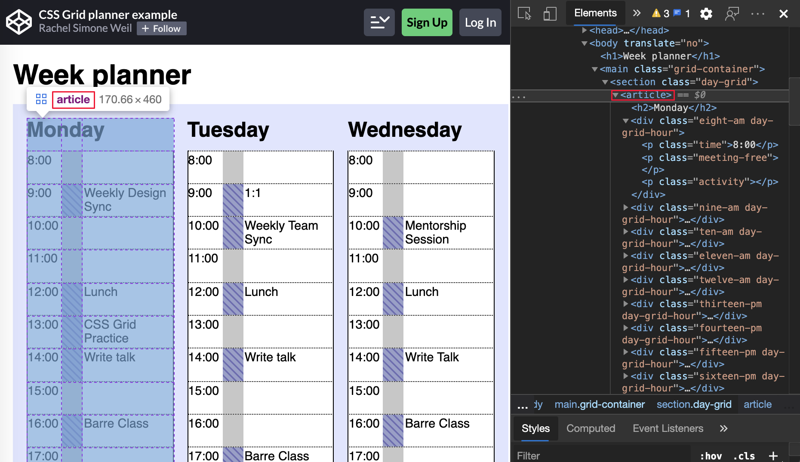
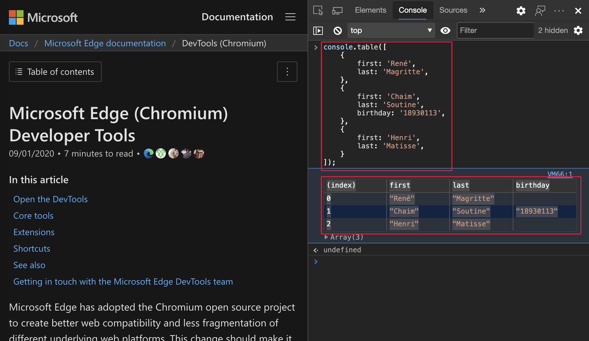
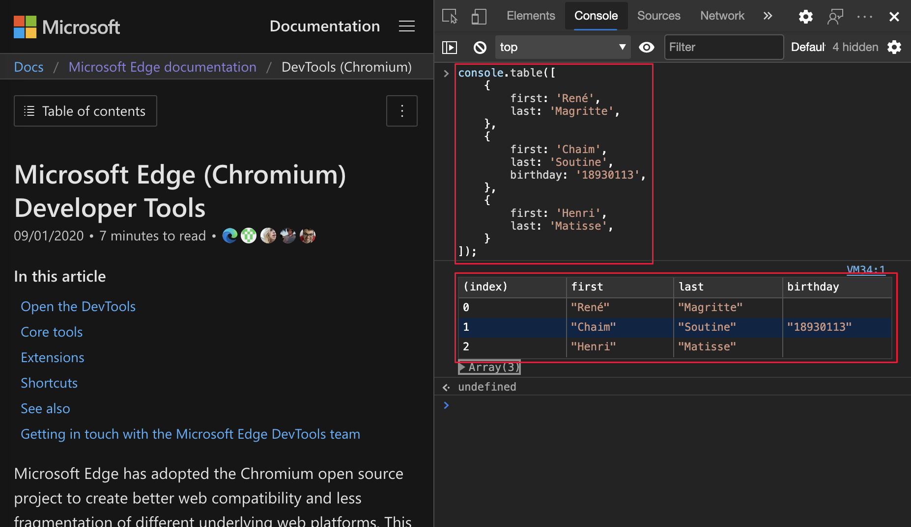

<!-- Copyright Jecelyn Yeen

   Licensed under the Apache License, Version 2.0 (the "License");
   you may not use this file except in compliance with the License.
   You may obtain a copy of the License at

       https://www.apache.org/licenses/LICENSE-2.0

   Unless required by applicable law or agreed to in writing, software
   distributed under the License is distributed on an "AS IS" BASIS,
   WITHOUT WARRANTIES OR CONDITIONS OF ANY KIND, either express or implied.
   See the License for the specific language governing permissions and
   limitations under the License.  -->
# What's New in DevTools (Microsoft Edge 86)

[!INCLUDE [Microsoft Edge team note for top of What's New](../../includes/edge-whats-new-note.md)]

<!-- ====================================================================== -->
## Announcements from the Microsoft Edge DevTools team

<!-- ====================================================================== -->
### Match keyboard shortcuts in DevTools to Visual Studio Code

In Microsoft Edge 86, you can match keyboard shortcuts in the DevTools to your shortcuts in [Microsoft Visual Studio Code](https://code.visualstudio.com).

To activate this feature, see [Customize keyboard shortcuts in DevTools](../../../customize/shortcuts.md).

For example, the keyboard shortcut for pausing or continuing running a script in [Visual Studio Code](https://code.visualstudio.com/shortcuts/keyboard-shortcuts-windows.pdf) is **F5**.  With the **DevTools (Default)** preset, that same shortcut in DevTools is **F8**, but when you select the **Visual Studio Code** preset, that shortcut is now also **F5**.

Chromium issue [#174309](https://crbug.com/174309)

<!-- ====================================================================== -->
### Emulate Surface Duo and Samsung Galaxy Fold

You can now test the look and feel of your website or app on two new devices: [Surface Duo](https://www.microsoft.com/surface/devices/surface-duo) and [Samsung Galaxy Fold](https://www.samsung.com/us/mobile/galaxy-fold) in Microsoft Edge.

To help enhance your website or app for the dual-screen and foldable devices, use the following features when [emulating the device](../../../device-mode/index.md):

* [Spanning](../../../device-mode/dual-screen-and-foldables.md), which is when your website (or app) appears across both screens.

* [Rendering the seam](/dual-screen/introduction#how-to-work-with-the-seam), which is the space between the two screens.

*  Enabling experimental Web Platform APIs to access the new [CSS media screen-spanning feature](/dual-screen/web/css-media-spanning) and [JavaScript getWindowSegments API](/dual-screen/web/javascript-getwindowsegments).

Update: This feature has been released and is no longer experimental.<!-- To turn on this experimental feature, see [Turning an experiment on or off](../../../experimental-features/index.md#turning-an-experiment-on-or-off) and select the checkbox next to **Emulation: Support dual screen mode**. -->

See also:
*  [Emulate dual-screen and foldable devices in Microsoft Edge DevTools](../../../device-mode/dual-screen-and-foldables.md)

Chromium issue: [#1054281](https://crbug.com/1054281)

<!-- ====================================================================== -->
### CSS grid overlay improvements and new experimental grid features

The Microsoft Edge DevTools team and the Chrome DevTools team collaborate on additional features.  The new features include multiple overlays that are persistent and configurable from a new **Layout** pane on the **Elements** tool:

Update: This feature has been released and is no longer experimental.<!-- To turn on this experimental feature, see [Turning an experiment on or off](../../../experimental-features/index.md#turning-an-experiment-on-or-off) and select the checkbox next to **Enable new CSS Grid debugging features (configuration options available in Layout sidebar pane in Elements after restart)**. -->

See also:
* [CSS grid debugging features](../06/devtools.md#css-grid-debugging-features) in _What's New in DevTools (Microsoft Edge 85)_.
* [Inspect CSS Grid in Microsoft Edge DevTools](../../../css/grid.md).

Chromium issue: [#1047356](https://crbug.com/1047356)

<!-- ====================================================================== -->
### Table copied from the Console preserves formatting

In Microsoft Edge 85 or earlier, in the **Console**, the formatting of a copied `console.table` <!--where, what tool?--> was lost.  If you copied the output from the [table](../../../console/api.md#table) Console API, and pasted it, only the text of the table was kept.

`table` Console API output in Microsoft Edge 85 or earlier:

`table` Console API output from Microsoft Edge 85 or earlier pasted into Visual Studio Code:

In Microsoft Edge 86 or later, when you copy a table from the **Console**, the formatting is now preserved.

`table` Console API output in Microsoft Edge 86 or later:

`table` Console API output from Microsoft Edge 86 or later pasted into Visual Studio Code:

Chromium issue: [#1115011](https://crbug.com/1115011)

See also:
* [Console features reference](../../../console/reference.md)

<!-- ====================================================================== -->
### Source Order Viewer for easier accessibility testing

The new accessibility helper displays the order in which elements reside in the source file:

This feature makes it easier to test the way screen reader and keyboard users experience your website or app.  Screen readers and keyboard navigation depend on content being placed in a particular order in the source code of your website or app, so that it matches the rendered page.  The Source Order Viewer displays potential differences in order between the rendered page and the source code.

Update: This feature has been released and is no longer experimental.<!-- To turn on this experimental feature, see [Turning an experiment on or off](../../../experimental-features/index.md#turning-an-experiment-on-or-off) and select the checkbox next to **Enable Source Order Viewer**. -->

See also:
* [Test keyboard support using the Source Order Viewer](../../../accessibility/test-tab-key-source-order-viewer.md)

Chromium issue: [#1094406](https://crbug.com/1094406)

<!-- ====================================================================== -->
<!--
### DevTools language enhancements

Your feedback and internal discoveries uncovered which text strings used in the Microsoft Edge feedback should remain untranslated or create confusion when translated.

Microsoft Edge DevTools 85 and earlier in Traditional Chinese:

Microsoft Edge DevTools 86 or later in Traditional Chinese:

To meet your translation needs, the Microsoft Edge DevTools team is focused on improving translation quality.

The current effort to improve translation quality enables easier support for more languages in the future.

See also:
* [Change DevTools language settings](https://learn.microsoft.com/microsoft-edge/devtools-guide-chromium/customize/localization)
-->

<!-- ====================================================================== -->
### Highlight all search results in Elements tool

In Microsoft Edge 84 and 85, the first search result in the **Elements** tool did not highlight.  The remaining search results were highlighted correctly.

Thank you for sending your feedback and helping improve Chromium.  Your feedback uncovered Issue [#1103316](https://crbug.com/1103316) in the open-source Chromium project.

The issue is now fixed in all versions of Microsoft Edge.

Chromium issue: [#1103316](https://crbug.com/1103316)

See also:
* [Search for nodes](../../../dom/index.md#search-for-nodes) in _Get started viewing and changing the DOM_

<!-- ====================================================================== -->
## Announcements from the Chromium project

The following sections announce additional features available in Microsoft Edge that were contributed to the open-source Chromium project.

<!-- ====================================================================== -->
### New Media tool

DevTools now displays media players information in the [Media](../../../media-panel/index.md) tool.

To open the new **Media** tool, select **Customize and control DevTools** (`...`) > **More tools** > **Media**.

Before the new **Media** tool in DevTools, the logging and debug information about video players was located under the **Recent Players** setting.  To open the **Recent Players** setting, go to `edge://media-internals` and then select the **Players** tool.

View live content and inspect potential issues more quickly, such as investigating:
*  Why frames are dropped.
*  Why JavaScript is interacting with the player in an unexpected way.

<!-- ====================================================================== -->
### Capture node screenshots using the Elements tool context menu

You can now capture node screenshots using the right-click menu in the **Elements** tool.

For example, to take a screenshot of the table of contents, right-click the element, and then select **Capture node screenshot**.

Chromium issue: [#1100253](https://crbug.com/1100253)

See also:
* [Capture node screenshot beyond viewport](../../2021/01/devtools.md#capture-node-screenshot-beyond-viewport) in _What's New in DevTools (Microsoft Edge 89)_

<!-- ====================================================================== -->
### Issues tool updates

The Issues warning bar on the **Console** tool is now replaced with a regular message.

<!--todo: update this figure -->

See also:
* [Find and fix problems using the Issues tool](../../../issues/index.md)

#### Third-party issues

Third-party issues are now hidden by default in the **Issues** tool.  Select the new **Include third-party issues** checkbox to view the issues.

Chromium issues: [1096481](https://crbug.com/1096481), [1068116](https://crbug.com/1068116), [1080589](https://crbug.com/1080589)

For more information, see [Filter issues by origin](../../../issues/index.md#filter-issues-by-origin) in _Find and fix problems using the Issues tool_.

<!-- ====================================================================== -->
### Emulate missing local fonts

<!-- copied section to regular docs -->

In the **Rendering** tool, use the new **Disable local fonts** checkbox to emulate missing `local()` sources in `@font-face` rules.

For example, when the `Rubik` font is installed on your device and the `@font-face src` rule uses it as a `local()` font, Microsoft Edge uses the local font file from your device.

When **Disable local fonts** is selected, DevTools ignores the `local()` fonts and fetches each font from the network:

This feature is useful if you use two different copies of the same font during development, such as:
*  A local font for your design tools.
*  A web font for your code.

Use **Disable local fonts** to make it easier to:
*  Debug and measure loading performance and optimization of web fonts.
*  Verify accuracy of your CSS `@font-face` rules.
*  Discover differences between local versions installed on your device and a web font.

Chromium issue: [#384968](https://crbug.com/384968)

For more information, see [Disable local fonts](../../../evaluate-performance/reference.md#disable-local-fonts) in _Performance features reference_.

See also [Analyze rendering performance with the Rendering tool](../../../evaluate-performance/reference.md#analyze-rendering-performance-with-the-rendering-tool) in _Performance features reference_.

<!-- ====================================================================== -->
### Emulate inactive users

The [Idle Detection API](https://web.dev/idle-detection) allows developers to detect inactive users and react on idle state changes.  You can now use DevTools to emulate idle state changes in the **Sensors** tool for both the user state and the screen state instead of waiting for the actual idle state to change.  You can open the **Sensors** tool from the [Drawer](../../../customize/index.md#quick-view).

Chromium issue: [#1090802](https://crbug.com/1090802)

See also:
* [Override geolocation with the Sensors tool](../../../device-mode/geolocation.md)

<!-- ====================================================================== -->
### Emulate prefers-reduced-data

> [!NOTE]
> In Microsoft Edge 86, to enable this feature, go to `edge://flags#enable-experimental-web-platform-features` and turn on the **Experimental Web Platform features** flag.  The emulation option is only displayed if the flag is enabled.

The [prefers-reduced-data](https://drafts.csswg.org/mediaqueries-5#descdef-media-prefers-reduced-data) media query detects user content preferences for reduced data.  If selected, the user receives alternate page content that uses less data.

You can now use DevTools to emulate the `prefers-reduced-data` media query, in the **Rendering** tool:

Chromium issue: [#1096068](https://crbug.com/1096068)

See also:
* [Emulate dark or light schemes in the rendered page](../../../accessibility/preferred-color-scheme-simulation.md)

<!-- ====================================================================== -->
### Support for new JavaScript features

DevTools now has better support for the following JavaScript language features:

| JavaScript language feature | Details |
|:--- |:--- |
| [Logical assignment operators](https://v8.dev/features/logical-assignment) | DevTools now supports logical assignment with the new `&&=`, `||=`, and `??=` operators in the **Console** and **Sources** tools.  |
| Pretty-print [numeric separators](https://v8.dev/features/numeric-separators) | DevTools now properly pretty-prints the numeric separators in the **Sources** tool.  |

Chromium issues: [1086817](https://crbug.com/1086817), [1080569](https://crbug.com/1080569)

See also:
* [Run JavaScript in the Console](../../../console/console-javascript.md)
* [Using the Editor pane to view or edit files](../../../sources/index.md#using-the-editor-pane-to-view-or-edit-files) in _Sources tool overview_

<!-- ====================================================================== -->
### Lighthouse 6.2 in the Lighthouse panel

The **Lighthouse** tool is now running Lighthouse 6.2.  For a full list of changes, see the [Lighthouse release notes](https://github.com/GoogleChrome/lighthouse/releases/tag/v6.2.0).

Chromium issue: [#772558](https://crbug.com/772558)

For more information, see [Lighthouse tool](../../../lighthouse/lighthouse-tool.md).

<!-- ====================================================================== -->
### Deprecation of other origins listing in the Service Workers pane

The **Application** tool now provides a link from the **Service workers** pane to view the full list of service workers from other origins.  To access the list of service workers without opening DevTools, go to `edge://service-worker-internals/?devtools`.

Previously DevTools displayed a list nested under the **Application** tool > **Service workers** pane.

Chromium issue: [#807440](https://crbug.com/807440)

See also:
* [Service Worker improvements](../../../service-workers/index.md)
* [Application tool, to manage storage](../../../storage/application-tool.md)

<!-- ====================================================================== -->
### Show coverage summary for filtered items

DevTools now recalculates and displays a summary of coverage information dynamically.  The dynamic display is triggered when filters are applied in the [Coverage](../../../coverage/index.md) tool.  Previously, the **Coverage** tool always displayed a summary of all coverage information.

In the following example, the Coverage summary initially shows `344 kB of 1.7 MB (20%) used so far.  1.4 MB unused.`:

After CSS filtering is applied, the Coverage summary shows `26.8 kB of 408 kB (7%) used so far.  381 kB unused.`:

Chromium issue: [#1061385](https://crbug.com/1090802)

<!-- ====================================================================== -->
### New frame details view in Application panel

In the **Application** tool, there's now a **Frames** section that provides a detailed view for each frame.  To access the detailed view, click a frame under the **Frames** menu in the **Application** tool.

Chromium issue: [#1093247](https://crbug.com/1093247)

See also:
* [Application tool, to manage storage](../../../storage/application-tool.md)

<!-- ====================================================================== -->
#### Frame details for opened windows

Open windows and pop-up windows now display under the frame tree as well.  The detailed view of the opened windows includes additional security information.

Chromium issue: [#1107766](https://crbug.com/1107766)

See also:
* [Application tool, to manage storage](../../../storage/application-tool.md)

<!-- ====================================================================== -->
#### Security and isolation information

Secure context, [Cross-Origin-Embedder-Policy (COEP)](https://web.dev/coop-coep), and [Cross-Origin-Opener-Policy (COOP)](https://web.dev/coop-coep) are now displayed in the frame details.

The Chromium project plans to add more security information to the frame details.

Chromium issue: [#1051466](https://crbug.com/1051466)

See also:
* [Application tool, to manage storage](../../../storage/application-tool.md)
* [Understand security issues using the Security tool](../../../security/index.md)

<!-- ====================================================================== -->
### Elements and Network panel updates

See also:
* [Inspect, edit, and debug HTML and CSS with the Elements tool](../../../elements-tool/elements-tool.md)
* [Network features reference](../../../network/reference.md)

<!-- ====================================================================== -->
#### Accessible color suggestion in the Styles pane

DevTools now provides color suggestions for low color contrast text.

In the example below, `h1` has low-contrast text.  To fix the contrast, open the color picker of the `color` property in the **Styles** pane.  After you expand the **Contrast ratio** section, DevTools provides AA and AAA color suggestions.  Select the suggested color, to apply the color.

Chromium issue: [#1093227](https://crbug.com/1093227)

See also:
* [Change colors with the Color Picker](../../../css/reference.md#change-colors-with-the-color-picker) in _CSS features reference_
* [Test text-color contrast using the Color Picker](../../../accessibility/color-picker.md)

<!-- ====================================================================== -->
#### Reinstate Properties pane in the Elements panel

In the **Elements** tool, the **Properties** pane is back.  The **Properties** pane was [deprecated in Microsoft Edge 84](../05/devtools.md#deprecation-of-the-properties-pane-in-the-elements-panel).  The Microsoft Edge DevTools team and the Chrome DevTools team are planning improvements for inspecting properties of elements.

Chromium issue: <!-- [#1105205](https://crbug.com/1105205), --> [#1116085](https://crbug.com/1116085)

See also:
* [Inspect, edit, and debug HTML and CSS with the Elements tool](../../../elements-tool/elements-tool.md)

<!-- ====================================================================== -->
<!--
#### Human-readable X-Client-Data header values in the Network panel

When inspecting a network resource in the Network panel, DevTools now formats any `X-Client-Data` header values in **Headers** pane as code.

The `X-Client-Data` HTTP header contains a list of experiment IDs and Microsoft Edge flags that are enabled in your browser.  The raw header values look like opaque strings since the values are `base-64-encoded`, serialized [protocol buffers](https://developers.google.com/protocol-buffers).  To make the contents more transparent to developers, DevTools now shows the decoded values.

Chromium issue: [#1103854](https://crbug.com/1103854)

See also:
* [Network features reference](../../../network/reference.md)
-->

<!-- ====================================================================== -->
#### Autocomplete custom fonts in the Styles pane

Imported font faces are now added to the list of CSS autocompletion when editing the `font-family` property in the **Styles** pane.

For example, if `monospace` is a custom font installed on the local machine, it appears in the CSS completion list.  In previous versions of Microsoft Edge, the font was not displayed.

Chromium issue: [#1106221](https://crbug.com/1106221)

See also:
* [Edit CSS font styles and settings in the Styles pane](../../../inspect-styles/edit-fonts.md)
* [CSS features reference](../../../css/reference.md)

<!-- ====================================================================== -->
#### Consistently display resource type in Network panel

In the **Network** tool, DevTools now consistently displays the same resource type as the original network request.  When redirection (HTTP status code 302) happens, DevTools appends **/ Redirect** to the value in the **Type** column.

Previously, DevTools sometimes changed the value in the **Type** column to **Other**.

Chromium issue: [#997694](https://crbug.com/997694)

See also:
* [Network features reference](../../../network/reference.md)

<!-- ====================================================================== -->
#### Clear buttons in the Elements and Network tools

The following text boxes now have **Clear** buttons:

*  The filter text boxes in the **Styles** pane and **Network** tool.
*  The DOM search text box in the **Elements** tool.

Click the **Clear** button to remove any inputted text.

**Clear** buttons in the **Elements** tools:

**Clear** buttons in the  **Network** tools:

Chromium issue: [#1067184](https://crbug.com/1067184)

See also:
* [Inspect, edit, and debug HTML and CSS with the Elements tool](../../../elements-tool/elements-tool.md)
* [Network features reference](../../../network/reference.md)

<!-- ====================================================================== -->
> [!NOTE]
> Portions of this page are modifications based on work created and [shared by Google](https://developers.google.com/terms/site-policies) and used according to terms described in the [Creative Commons Attribution 4.0 International License](https://creativecommons.org/licenses/by/4.0).
> The original page is found [here](https://developer.chrome.com/blog/new-in-devtools-86) and is authored by [Jecelyn Yeen](https://developers.google.com/web/resources/contributors#jecelyn-yeen) (Developer advocate, Chrome DevTools).

This work is licensed under a [Creative Commons Attribution 4.0 International License](https://creativecommons.org/licenses/by/4.0).
