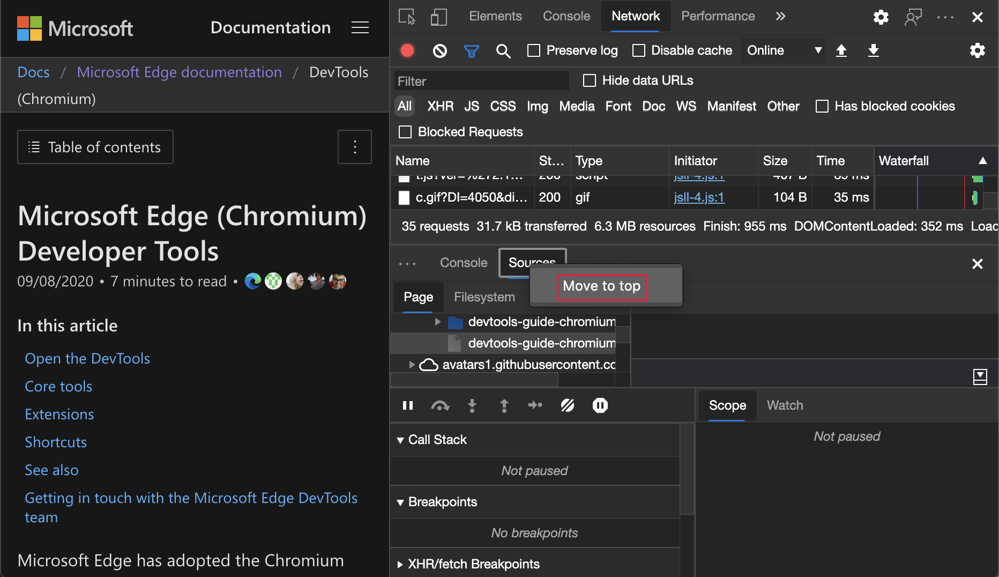
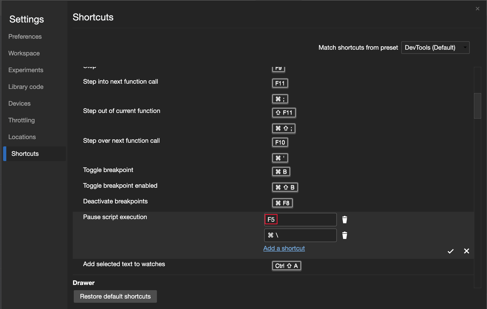
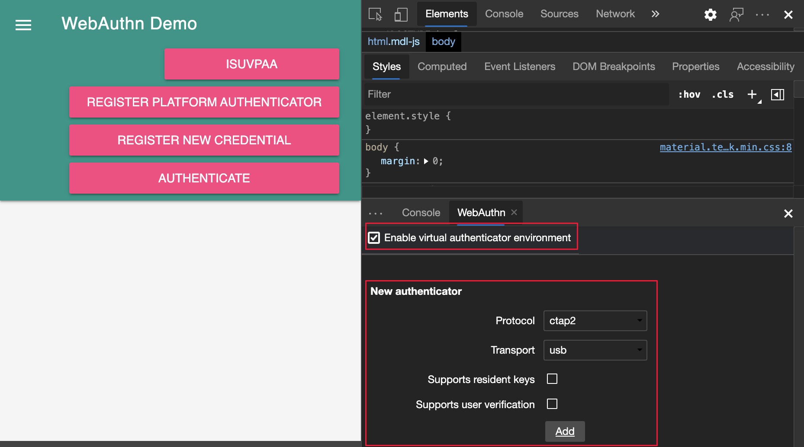
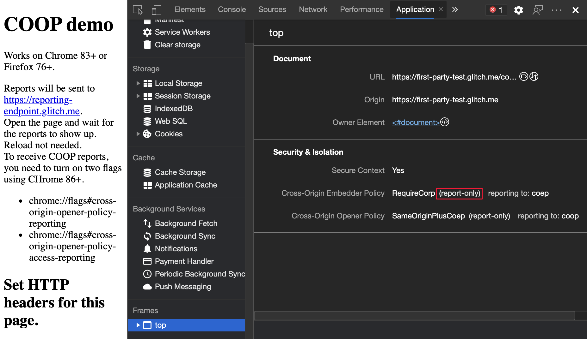

<!-- Copyright Jecelyn Yeen

   Licensed under the Apache License, Version 2.0 (the "License");
   you may not use this file except in compliance with the License.
   You may obtain a copy of the License at

       https://www.apache.org/licenses/LICENSE-2.0

   Unless required by applicable law or agreed to in writing, software
   distributed under the License is distributed on an "AS IS" BASIS,
   WITHOUT WARRANTIES OR CONDITIONS OF ANY KIND, either express or implied.
   See the License for the specific language governing permissions and
   limitations under the License.  -->
# What's New in DevTools (Microsoft Edge 87)

[!INCLUDE [Microsoft Edge team note for top of What's New](../../includes/edge-whats-new-note.md)]


<!-- ====================================================================== -->
## Improving DevTools localization

To meet your translation needs, the Microsoft Edge DevTools team is focused on improving translation quality.  Starting in Microsoft Edge version 87, several strings and terms are locked and don't change, even when the rest of the DevTools are displayed in other languages.  The list of affected strings and terms include the following:

*  The strings in the **Lighthouse** tool.
*  The term `service worker`.
*  Some of the **Network** tool filters such as `URL`, `XHR`, `JS`, and `CSS`.
*  The [$0](../../../console/utilities.md#recently-selected-element-or-javascript-object-0-4) Console Utilities API.

[$0](../../../console/utilities.md#recently-selected-element-or-javascript-object-0-4) is now available in the [Console](../../../console/index.md) for users on localized versions of the DevTools.   Thank you to the global developer community for helping improve localization of the Microsoft Edge DevTools.  Continue to [send feedback on localization quality](../../../contact.md) to improve support for DevTools in all locales.  For real-time updates on this feature in the Chromium open-source project, see Issue [#1136655](https://crbug.com/1136655).


See also:
* [Change DevTools language settings](../../../customize/localization.md)


<!-- ====================================================================== -->
## Move tools between top and bottom panels

DevTools now supports moving tools between the top and bottom panels.  Customize your DevTools and improve your productivity by viewing any combination of two tools at the same time.  For example, view the **Elements** and the **Sources** tools at the same time (by moving the **Sources** tool to the bottom).

To move any top tool to the bottom, right-click a tab and then select **Move to bottom**:


To move any bottom tool to the top, right-click a tab and then select **Move to top**:



For the history of this feature in the Chromium open-source project, see Issue [#1075732](https://crbug.com/1075732).

See also:
* [Activity Bar tools vs. Quick View tools](../../../about-tools.md#activity-bar-tools-vs-quick-view-tools) in _About the list of tools_


<!-- ====================================================================== -->
## Save and export using the Network Console

<!-- copied section to linked article -->

The **Network Console** tool now has improved compatibility with the [Postman v2.1](https://schema.getpostman.com/json/collection/v2.1.0/docs/index.html) and [OpenAPI v2](https://swagger.io/specification/v2) schemas.

The **Network Console** tool now supports the following actions:

*  Save and export Collections and Environments.
*  Edit and export sets of environment variables within the **Network Console** tool.

Entering a name for the new environment:


Selecting the format for the new environment:


Update: This feature has been released and is no longer experimental.<!-- To enable the experiment, see [Turning an experiment on or off](../../../experimental-features/index.md#turning-an-experiment-on-or-off) and select the checkbox next to **Enable Network Console**. -->

See also:
* [Save and export Collections, Environments, and environment variables](../../../network-console/network-console-tool.md#save-and-export-collections-environments-and-environment-variables) in _Compose and send web API requests using the Network Console tool_.

For history, in the Chromium open-source project, see Issue [#1093687](https://crbug.com/1093687).


<!-- ====================================================================== -->
## Improved CSS Grid tooling

The Microsoft Edge DevTools now support the following features for inspecting, viewing, and debugging your CSS grids.

*  Display a simplified grid overlay using the **Inspect** tool, or get more detailed information with persistent overlays.

*  To enable persistent grid overlays, click the grid icon next to a grid container element in the **Elements** tool, or click the grid in the **Layout** tool.

*  You can enable persistent overlays for multiple grids.

*  The new **Layout** tool allows you to easily toggle grid overlays and configure the appearance and the content for each.

The features are turned on by default.


Update: This feature has been released and is no longer experimental.<!-- valid. -->

See also:
* [CSS grids](../../../css/grid.md)

For history, in the Chromium open-source project, see Issue [#1047356](https://crbug.com/1047356).

The Microsoft Edge DevTools team is collaborating with the Chrome DevTools team and Chromium community to add new flexbox tooling features to DevTools.  For updates on flexbox tooling in the Chromium open-source project, see Issue [#1136394](https://crbug.com/1136394).


<!-- ====================================================================== -->
## Customize keyboard shortcuts in Settings

You can now customize the keyboard shortcut for any action in the DevTools.  Since Microsoft Edge version 84, you can choose between **Visual Studio Code** and **DevTools (default)** presets for keyboard shortcuts.  Starting in Microsoft Edge version 87, you can further customize keyboard shortcuts.



Update: This feature has been released and is no longer experimental.<!-- To enable the experiment, see [Turning an experiment on or off](../../../experimental-features/index.md#turning-an-experiment-on-or-off) and select the checkbox next to **Enable keyboard shortcut editor**. -->

See also:
* [Edit the keyboard shortcut for a DevTools action](../../../customize/shortcuts.md#edit-the-keyboard-shortcut-for-a-devtools-action) in _Customize keyboard shortcuts_.

For history, in the Chromium open-source project, see Issue [#174309](https://crbug.com/174309).


<!-- ====================================================================== -->
## Introducing the Microsoft Edge Tools for Visual Studio Code extension

The **Elements for Visual Studio Code** and **Network for Visual Studio Code** extensions are now merged into the new [Microsoft Edge Developer Tools for Visual Studio Code](https://marketplace.visualstudio.com/items?itemName=ms-edgedevtools.vscode-edge-devtools) extension.  Use the Microsoft Edge DevTools for the following activities without leaving Microsoft Visual Studio Code.

*  Debug the DOM
*  Edit CSS
*  Inspect network traffic

With the extension, launch Microsoft Edge, connect to an existing instance of the browser, or use a headless browser directly from your editor.  To start contributing and filing issues with your feedback about this extension, see the [Microsoft Edge Developer Tools for Visual Studio Code](https://github.com/Microsoft/vscode-edge-devtools) repo on GitHub.

Using the extension in full browser mode:


Using the extension in headless mode:


For more information, see [Microsoft Edge DevTools extension for Visual Studio Code](../../../../visual-studio-code/microsoft-edge-devtools-extension.md).


<!-- ====================================================================== -->
## Announcements from the Chromium project

The following sections announce additional features available in Microsoft Edge that were contributed to the open-source Chromium project.


<!-- ====================================================================== -->
### New WebAuthn tool

In earlier versions of Microsoft Edge, there was no native WebAuthn debugging support.  You needed physical authenticators to test your web application with the [Web Authentication API](https://w3c.github.io/webauthn).  With the new **WebAuthn** tool, you can do the following without the use of any physical authenticators:

*  Emulate authenticators.
*  Customize attributes of authenticators.
*  Inspect states of authenticators.

You can emulate authenticators and debug the [Web Authentication API](https://w3c.github.io/webauthn) with the new **WebAuthn** tool.  To open the **WebAuthn** tool, click **the Customize and control DevTools** (`...`) icon > **More tools** > **WebAuthn**.  For real-time updates on this feature in the Chromium open-source project, see Issue [#1034663](https://crbug.com/1034663).

Opening the **WebAuthn** tool:


The **WebAuthn** tool:



For more information, see [Emulate authenticators and debug WebAuthn](../../../webauthn/index.md).


<!-- ====================================================================== -->
### Elements tool updates

See also:
* [Inspect, edit, and debug HTML and CSS with the Elements tool](../../../elements-tool/elements-tool.md)


<!-- ====================================================================== -->
#### View the Computed sidebar pane in the Styles pane

Toggle the **Computed** pane in the **Styles** pane.  The **Computed** pane in the **Styles** pane is collapsed by default.  To display or hide the **Computed** pane within the **Styles** pane, click the **Show Computed Styles sidebar** () button.

Opening the **Computed sidebar** pane:


The **Computed sidebar** pane:


For real-time updates on this feature in the Chromium open-source project, see Issue [#1073899](https://crbug.com/1073899).

<!-- lacks the new feature: -->
See also:
* [View only the CSS that is actually applied to an element](../../../css/reference.md#view-only-the-css-that-is-actually-applied-to-an-element) in _CSS features reference_


<!-- ====================================================================== -->
#### Grouping CSS properties in the Computed pane

To view your applied CSS with less scrolling, group the CSS properties by categories in the **Computed** pane.  You can also selectively focus on a set of related properties while you inspect your CSS.  From the **Elements** tool, select an element.  To group (or ungroup) the CSS properties, toggle the **Group** checkbox.


For real-time updates on this feature in the Chromium open-source project, see Issues [#1096230](https://crbug.com/1096230), [#1084673](https://crbug.com/1084673), and [#1106251](https://crbug.com/1106251).

<!-- probably lacks the new feature: -->
See also:
* [View only the CSS that is actually applied to an element](../../../css/reference.md#view-only-the-css-that-is-actually-applied-to-an-element) in _CSS features reference_


<!-- ====================================================================== -->
### Lighthouse 6.4 in the Lighthouse tool

The **Lighthouse** tool is now running Lighthouse 6.4.  For a full list of changes, see the [Lighthouse release notes](https://github.com/GoogleChrome/lighthouse/releases/v6.4.1).  For real-time updates on this feature in the Chromium open-source project, see Issue [#772558](https://crbug.com/772558).

See also:
* [Lighthouse tool](../../../lighthouse/lighthouse-tool.md)


<!-- ====================================================================== -->
### performance.mark() events in the Timings section

The **Timings section** of a recording in the [Performance](../../../evaluate-performance/reference.md) tool now marks `performance.mark()` <!--[performance mark](https://jec.fyi/demo/perf-mark) -->events.  To try this feature and measure the performance of your JavaScript code, add `performance.mark()` events to your code.

The following code adds `start` and `end` performance markers before and after a `for` loop:

```javascript
performance.mark('start');
for (var i = 0; i < 1000; i+=7;){
  console.log(i);
}
performance.mark('end');
```

Then, open the [Performance](../../../evaluate-performance/reference.md) tool and see the **Timings section** to record your JavaScript code.  The `performance.mark()` events you added are now displayed in the recording.


<!-- ====================================================================== -->
### New resource-type and url filters in the Network tool

Use the new `resource-type` and `url` keywords in the **Network** tool to filter network requests.  For example, use `resource-type:image` to focus on the network requests that are images:


To discover more special keywords such as `resource-type` and `url`, see [filter requests by properties](../../../network/reference.md#filter-requests-by-properties).

For real-time updates on this feature in the Chromium open-source project, see Issues [#1121141](https://crbug.com/1121141) and [#1104188](https://crbug.com/1104188).


<!-- ====================================================================== -->
### Frame details view updates

In the **Application** tool, in the list of pages on the left, the bottom page is **Frames**, which often lists a frame named **top**.


<!-- ====================================================================== -->
#### Display COEP and COOP reporting to endpoint

In the **Application** tool, in the list of pages on the left, the bottom page is **Frames**, which often lists a frame named **top**.  Select the frame to view the frame detail view, which includes the **Security & Isolation** section.

In the **Security & Isolation** section of the frame detail page, view the Cross-Origin Embedder Policy (COEP) and Cross-Origin Opener Policy (COOP) `reporting to` endpoint.  The [Reporting API](https://developer.mozilla.org/docs/Web/API/Reporting_API) defines `Report-To`, which is a new HTTP header that gives you a way to specify the server endpoints for the browser to send warnings and errors.


For real-time updates on this feature in the Chromium open-source project, see Issue [#1051466](https://crbug.com/1051466).

See also:
* [Display opener frame details for opened windows](../11/devtools.md#display-opener-frame-details-for-opened-windows) in _What's New in DevTools (Microsoft Edge 88)_
* [The Application tool, to manage storage](../../../storage/application-tool.md)


<!-- ====================================================================== -->
#### Display COEP and COOP report-only mode

In the **Application** tool, in the list of pages on the left, the bottom page is **Frames**, which often lists a frame named **top**.  Select the frame to view the frame detail view, which includes the **Security & Isolation** section.

The **Security & Isolation** section of the frame detail page now displays the `report-only` label for COEP and COOP that are set to `report-only` mode.



For real-time updates on this feature in the Chromium open-source project, see Issue [#1051466](https://crbug.com/1051466).

See also:
* [Display opener frame details for opened windows](../11/devtools.md#display-opener-frame-details-for-opened-windows) in _What's New in DevTools (Microsoft Edge 88)_
* [The Application tool, to manage storage](../../../storage/application-tool.md)


<!-- ====================================================================== -->
### View and fix color contrast issues in the CSS Overview tool

The **CSS Overview** tool now displays a list of elements on your page that have color contrast issues.  The [CSS Overview Accessible Colors Demo](https://css-overview-accessible-colors-demo.glitch.me) page has an example of a color contrast issue.

To view a list of elements that have a color contrast issue, on **Contrast issues**, click **Text**.  To open the element in the **Elements** tool, click an element in the list.  To help fix contrast issues, the Microsoft Edge DevTools [automatically provide color suggestions](../08/devtools.md#accessible-color-suggestion-in-the-styles-pane).


Update: This feature has been released and is no longer experimental.<!-- To enable this experiment, under **Settings** > **Experiments**, select the **CSS Overview** checkbox. -->

See also:
* [CSS Overview tool](../../../css/css-overview-tool.md)

For history, in the Chromium open-source project, see Issue [#1120316](https://crbug.com/1120316).


<!-- ====================================================================== -->
> [!NOTE]
> Portions of this page are modifications based on work created and [shared by Google](https://developers.google.com/terms/site-policies) and used according to terms described in the [Creative Commons Attribution 4.0 International License](https://creativecommons.org/licenses/by/4.0).
> The original page is found [here](https://developer.chrome.com/blog/new-in-devtools-87) and is authored by [Jecelyn Yeen](https://developers.google.com/web/resources/contributors#jecelyn-yeen) (Developer advocate, Chrome DevTools).

[](https://creativecommons.org/licenses/by/4.0)
This work is licensed under a [Creative Commons Attribution 4.0 International License](https://creativecommons.org/licenses/by/4.0).
