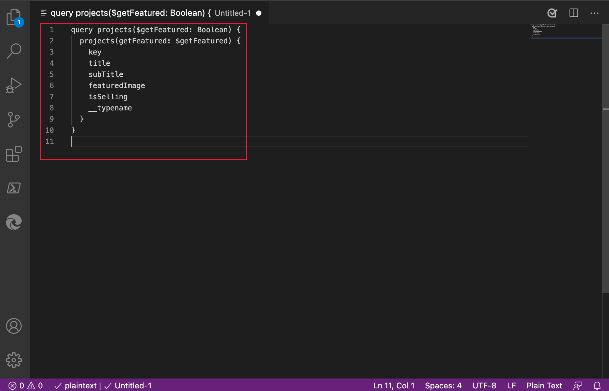
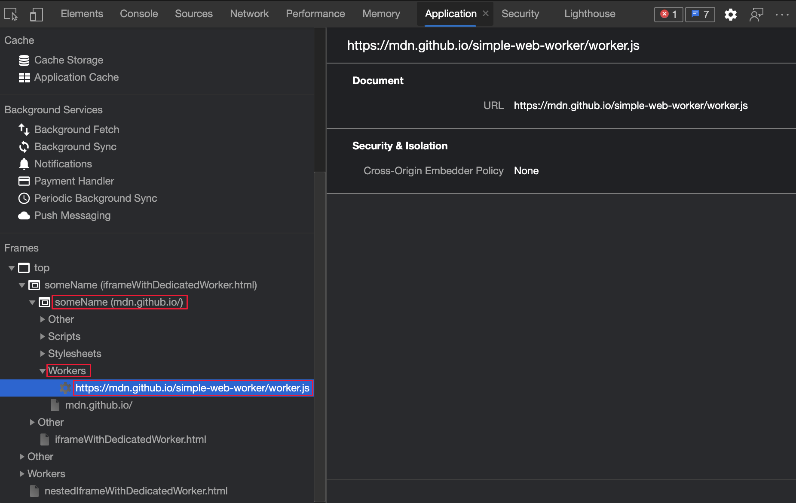
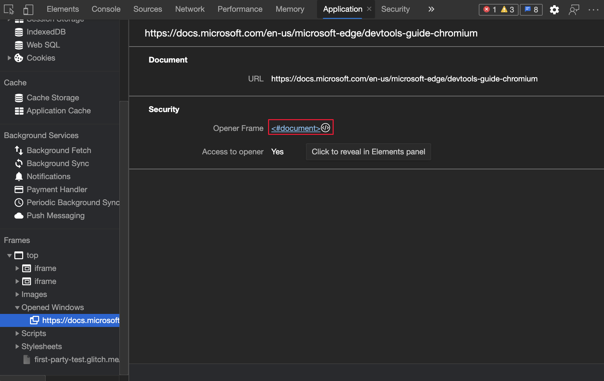
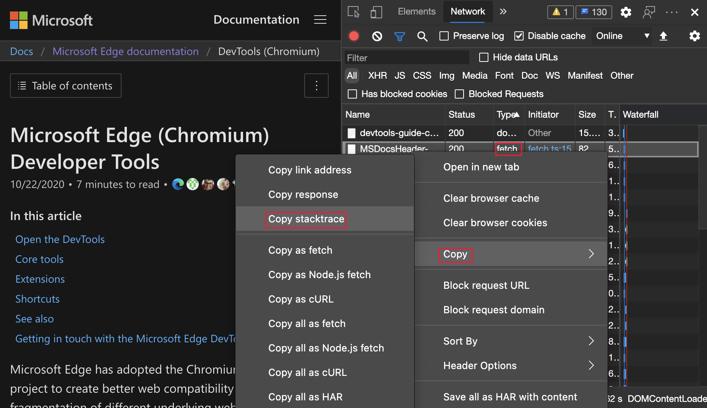

<!-- Copyright Jecelyn Yeen

   Licensed under the Apache License, Version 2.0 (the "License");
   you may not use this file except in compliance with the License.
   You may obtain a copy of the License at

       https://www.apache.org/licenses/LICENSE-2.0

   Unless required by applicable law or agreed to in writing, software
   distributed under the License is distributed on an "AS IS" BASIS,
   WITHOUT WARRANTIES OR CONDITIONS OF ANY KIND, either express or implied.
   See the License for the specific language governing permissions and
   limitations under the License.  -->
# What's New in DevTools (Microsoft Edge 88)

[!INCLUDE [Microsoft Edge team note for top of What's New](../../includes/edge-whats-new-note.md)]


<!-- ====================================================================== -->
## Microsoft Edge and Microsoft Edge WebDriver now available on Linux

<!-- Title: Microsoft Edge and Microsoft Edge WebDriver on Linux  -->
<!-- Subtitle: Get Microsoft Edge Dev on Ubuntu, Debian, Fedora, and openSUSE distributions and start automating in CI/CD environments with Microsoft Edge WebDriver. -->

Microsoft Edge Dev is now supported on Ubuntu, Debian, Fedora, and openSUSE distributions.  Download and install the Microsoft Edge Dev `.deb` or `.rpm` package directly from the [Microsoft Edge Insider site](https://www.microsoft.com/edge/download/insider?platform=linux) or use the standard package management tools of your Linux distribution.

If you are using a Linux environment in your continuous integration and delivery (CI/CD) solutions, Microsoft Edge WebDriver is also available on Linux.  To get started automating Microsoft Edge with Microsoft Edge WebDriver, see [Recent versions](https://developer.microsoft.com/microsoft-edge/tools/webdriver#downloads) at the Microsoft Edge WebDriver page.  For help with automating Microsoft Edge with Microsoft Edge WebDriver, see [Use WebDriver for test automation](../../../../webdriver-chromium/index.md).


See also:
* [Use WebDriver to automate Microsoft Edge](../../../../webdriver-chromium/index.md)


<!-- ====================================================================== -->
## Improved webhint and platform tips in the Issues tool

<!-- Title: Improvements to Issues tool and webhint integration  -->
<!-- Subtitle: Categories and third-party filtering make it easier to survey issues in the Issues tool.  Issues surfaced by webhint now have improved code snippets and documentation links to help you fix problems in your website.  -->

[webhint](https://webhint.io) is an open-source tool that provides real-time feedback for websites and local webpages.  Starting with [Microsoft Edge version 85](../06/devtools.md#webhint-feedback-in-the-issues-panel), see webhint feedback in the [Issues](../../../issues/index.md) tool.  Issues that appear in the **Issues** tool are now easier to see with the addition of the following categories.

* [Accessibility](https://webhint.io/docs/user-guide/hints/accessibility)
* [Compatibility](https://webhint.io/docs/user-guide/hints/compatibility)
* [Performance](https://webhint.io/docs/user-guide/hints/performance)
* [Pitfalls](https://webhint.io/docs/user-guide/hints/pitfalls)
* [PWA](https://webhint.io/docs/user-guide/hints/pwa)
* [Security](https://webhint.io/docs/user-guide/hints/security)

You can now filter out third-party issues using a new checkbox.  The filter functionality helps you hide issues related to code from third-party libraries or other sources.

To help you see issues that are found by [webhint](https://webhint.io), the **Issues** tool now displays the following information:

*  Improved code snippets.
*  Links to other relevant panels.
*  Links to documentation to help you fix problems in your website.


See also:
* [Find and fix problems using the Issues tool](../../../issues/index.md)
* [webhint extension for Visual Studio Code](../../../../test-and-automation/webhint.md)


<!-- ====================================================================== -->
## Composited Layers are now in 3D View

<!-- Title: 3D View is now integrated with Composited Layers  -->
<!-- Subtitle: Composited Layers are now in 3D View.  -->

You can now visualize **Layers** content alongside z-index values and the Document Object Model (DOM).  This feature helps you debug without switching between the **3D View** tool and **Layers** tools as often.


Update: This feature has been released and is no longer experimental.  The **Layers** tool has been removed and replaced by the **3D View** tool.

See also:
* [Navigate z-index, DOM, and layers using the 3D View tool](../../../3d-view/index.md)


<!-- ====================================================================== -->
## CSS variable definitions in Styles pane

<!-- Title: Jump to CSS variable definitions  -->
<!-- Subtitle: Click any CSS variable to navigate directly to the definition in the Styles tool. -->

In the **Styles** pane of the **Elements** tool, [CSS variables](https://developer.mozilla.org/docs/Web/CSS/Using_CSS_custom_properties) now link directly to each definition.  Click the variable to easily view or change the CSS variable definition.  In the example, DevTools displays the CSS attributes for the `body` element.

For example, to display the variable definition for the `--theme-body-background` CSS variable:

1. In the **Styles** pane of the **Elements** tool, hover over the style `--theme-body-background` of the CSS variable `var(--theme-body-background)`.  The tooltip appears, **Jump to definition**:


1. Click the style `--theme-body-background`.  The **Styles** pane displays the definition of the style:


See also:
* [Edit CSS font styles and settings in the Styles pane](../../../inspect-styles/edit-fonts.md)
* [CSS features reference](../../../css/reference.md)


<!-- ====================================================================== -->
## Service worker debugging improvements

<!-- Title:  Service worker debugging improvements in the Network, Application, and Sources tools  -->
<!-- Subtitle:  Making service workers easier to debug for progressive web applications and more.  -->

The following new features in the **Network** tool, **Application** tool, and **Sources** tool help you build your [PWA](../../../../progressive-web-apps-chromium/index.md).  Use the following features when you have difficulty debugging your service worker.

The routing of a request displays the `startup` and `fetch` events based on the network requests that run through service workers.  The timelines are accessed from either the **Application** or **Network** tool.  The timelines help when you are having trouble with service workers and want to see if something is wrong with the `startup` or `fetch` event.

See also:
* [Service Worker improvements](../../../service-workers/index.md)


<!-- ====================================================================== -->
### Application tool

<!-- Title: Open Network tool from the Service Workers pane  -->
<!-- Subtitle: Display additional context when debugging a service worker.  -->

In the **Application** tool, view all service worker request routing information by using the new **Network requests** link.

To display additional context when debugging a service worker:

1. In the **Application** tool, on the left, select **Service Workers**.

1. Click the **Network requests** link:

   

   The **Network** tool opens in the **Drawer** and displays all service worker-related network requests.  The network requests are filtered using `is:service-worker-intercepted`:

   

1. To move the **Network** tool to the top panel, close the **Drawer**:

   

See also:
* [Application tool, to manage storage](../../../storage/application-tool.md)
* [Service Worker improvements](../../../service-workers/index.md)


<!-- ====================================================================== -->
### Network tool

In the **Network** tool, you can debug network requests that are run by service workers.  (You can also open network requests from within the **Application** tool, instead of the **Network** tool.)  In the **Timing** pane of the **Network** tool, for each request, DevTools displays the following information:

*  The start of a request and duration of the bootstrap.
*  Changes to service worker registration.
*  The runtime of a `fetch` event handler.
*  The runtime of all `fetch` events for loading a client.


See also:
* [Display the timing breakdown of a request](../../../network/reference.md#display-the-timing-breakdown-of-a-request) in _Network features reference_.
* [Service Worker improvements](../../../service-workers/index.md)


<!-- ====================================================================== -->
### Sources tool

In previous versions of Microsoft Edge, the level of depth in the call stack was limited to the JavaScript code in your service worker.  In Microsoft Edge 88, the call stack now displays the initiator of requests that run through your service worker.

To locate the initiator of the request, use the call stack of your JavaScript code in the service worker.  The call stack in the following figure starts with the JavaScript code in your service worker (`service-worker.js`), and displays a reference to the original webpage request as `(index):157`.  The `service-worker.js` file is shown, and the call stack highlights the request originator, `(index):157`:<!--"request initiator?"-->


In the following figure, the reference is selected, and has opened the initiator that made the request.  The `(index)` webpage is the request initiator:<!--"request originator?" is there a reason for changing the terminology, in the alt-text?-->


See also:
* [View the call stack](../../../javascript/reference.md#view-the-call-stack) in _JavaScript debugging features_
* [Service Worker improvements](../../../service-workers/index.md)


<!-- ====================================================================== -->
## Copy property value of a network request

<!-- Title: Copy response JSON in Network tool using the right-click menu  -->
<!-- Subtitle:  The Network tool now has a more consistent UX.  Easily copy the JSON response using the right-click menu.  -->

In the **Network** tool, copy the property value of a network request using the new **Copy value** option.  The property value is copied as a decoded JSON value.  In previous versions of Microsoft Edge, you had to copy a value using one of the following actions:

*  Highlight the entire text and copy it.
*  Store the value as global variable, as applicable, and copy it from the DevTools **Console**.

To copy the property value to your clipboard, see [Copy formatted response JSON to the clipboard](../../../network/reference.md#copy-formatted-response-json-to-the-clipboard) in _Network features reference_.

Copying a property value in DevTools:


Pasting a property value in Microsoft Visual Studio Code:



See also:
* [Console overview](../../../console/index.md)

For history, in the Chromium open-source project, see Issue [1132084](https://crbug.com/1132084).


<!-- ====================================================================== -->
## Customize multi-press keyboard shortcuts

<!-- Title: Customize multi-press keyboard shortcuts  -->
<!-- Subtitle: Create custom multi-press keyboard shortcuts in the shortcut editor.  -->

[Since Microsoft Edge version 87](../10/devtools.md#customize-keyboard-shortcuts-in-settings), you can customize keyboard shortcuts for any action in DevTools.  In Microsoft Edge version 88, you can now create multi-press keyboard shortcuts.

For example, the red highlight below shows a custom multi-press keyboard shortcut for the **Start recording events** action:


Update: This feature has been released and is no longer experimental.<!-- To set a shortcut for an action in the DevTools, see [Settings](../../../customize/index.md#settings) > **Experiments**  and select the checkbox next to **Enable keyboard shortcut editor**. -->

See also:
* [Edit the keyboard shortcut for a DevTools action](../../../customize/shortcuts.md#edit-the-keyboard-shortcut-for-a-devtools-action) in _Customize keyboard shortcuts_.

For history, in the Chromium open-source project, see [Issue #174309](https://crbug.com/174309).


<!-- ====================================================================== -->
## The DevTools UI now matches the browser language

In Microsoft Edge version 87, if you turned on the **Match browser language** setting in [DevTools Settings](../../../customize/index.md#settings), the DevTools UI language didn't match the browser UI language.  In Microsoft Edge version 88, DevTools now matches the browser language if you turn on the **Match browser language** setting.  See [Change DevTools language settings](../../../customize/localization.md).


<!-- ====================================================================== -->
## Announcements from the Chromium project

The following sections announce additional features available in Microsoft Edge that were contributed to the open-source Chromium project.


<!-- ====================================================================== -->
### New CSS angle visualization tools

DevTools now has better support for CSS angle debugging.  When an HTML element on your page has CSS angle applied to it, a clock icon is displayed next to the angle in the **Styles** tool.  To toggle the clock overlay, click the clock icon.  To change the angle, click anywhere in the clock, drag the needle, or use mouse and keyboard shortcuts.

The following CSS angle is used for the example:

```css
background: linear-gradient(100deg, lightblue, pink);
```


For more information, see [Change angle value with the Angle Clock](../../../css/reference.md#change-angle-value-with-the-angle-clock) in _CSS features reference_.

For updates on this feature in the Chromium open-source project, see Issues [1126178](https://crbug.com/1126178) and [1138633](https://crbug.com/1138633).


<!-- ====================================================================== -->
### Simulate storage quota size in the Storage pane

You can now override storage quota size in the **Storage** pane.  This feature allows you to simulate different devices and test the behavior of your website or app in low disk availability scenarios.  To simulate the storage quota:

1. Navigate to **Application** > **Storage**.
1. Select the **Simulate custom storage quota** checkbox.
1. Enter a valid number.


For more information, see [Emulate mobile devices (Device Emulation)](../../../device-mode/index.md).  To see updates on this feature in the Chromium open-source project, see Issues [945786](https://crbug.com/945786) and [1146985](https://crbug.com/1146985).


<!-- ====================================================================== -->
### Report CORS errors in the Network tool

Try out this feature by navigating to [CORS error demo](https://cors-errors.glitch.me).  Open the **Network** tool, refresh the page, and observe the failed CORS network request.  The status column displays the **CORS error**.  When you hover on the error, the tooltip now displays the error code.  In Microsoft Edge version 87 and earlier, DevTools only displayed generic **(failed)** status for CORS errors.


For real-time updates on this feature in the Chromium open-source project, see Issue [1141824](https://crbug.com/1141824).

See also:
* [Enhanced CORS debugging support](../../2021/05/devtools.md#enhanced-cors-debugging-support) in _What's New in DevTools (Microsoft Edge 92)_
* [Network features reference](../../../network/reference.md)


<!-- ====================================================================== -->
### Frame details view updates

In the **Application** tool, there's a **Frames** section that provides a detailed view for each frame.  

See also:
* [Application tool, to manage storage](../../../storage/application-tool.md)


<!-- ====================================================================== -->
#### Cross-origin isolation information in the Frame details view

In the **Application** tool, there's a **Frames** section that provides a detailed view for each frame.  When you select a frame, the frame detail page appears, including the **Security & Isolation** section.

The cross-origin isolated status is now displayed under the **Security & Isolation** section.  The new **API availability** section displays the availability of `SharedArrayBuffer`s (SAB) and whether the buffers can be shared using `postMessage()`.  A deprecation warning appears if the SAB and `postMessage()` is currently available, but the context isn't cross-origin isolated.


For more information about cross-origin isolation and why it is required for features like `SharedArrayBuffers`, see [WindowOrWorkerGlobalScope.crossOriginIsolated](https://developer.mozilla.org/docs/Web/API/WindowOrWorkerGlobalScope/crossOriginIsolated).

For real-time updates of this feature in the Chromium open-source project, see Issue [1139899](https://crbug.com/1139899).

See also:
* [Application tool, to manage storage](../../../storage/application-tool.md)


<!-- ====================================================================== -->
#### New Web Workers information in the Frame details view

DevTools now organizes web workers under the relevant parent frame.  For example, if the `someName` frame creates `worker.js`, then `worker.js` appears under `someName` in the **Frames** list.  To view the details of the web worker:

1. Open the **Application** tool.
1. In the list on the left, in the **Frames** section, expand a frame that contains web workers.
1. Expand the **Workers** tree.
1. Click a worker.

For real-time updates on this feature in the Chromium open-source project, see Issues [1122507](https://crbug.com/1122507) and [1051466](https://crbug.com/1051466).



See also:
* [Application tool, to manage storage](../../../storage/application-tool.md)


<!-- ====================================================================== -->
#### Display opener frame details for opened windows

DevTools now organizes opened [Windows](https://developer.mozilla.org/docs/Web/API/Window#Constructors) under the relevant parent [frame](https://developer.mozilla.org/docs/Web/API/Window/frames).  For example, if the `top` frame opens a `Window` to `https://learn.microsoft.com/microsoft-edge/devtools-guide-chromium`, then the `Window` appears under `top` in the **Frames** list.

To reveal the frame that's responsible for opening another Window, and see that frame in the **Elements** tool:

1. Open the **Application** tool.
1. On the left, in the **Frames** section at the bottom, expand a frame.
1. Expand **Opened Windows** and click the `Window` for the parent frame you want to know about.
1. Click the **Opener Frame** link.

The details are displayed about which frame caused the opening of another `Window`.  To reveal the opener in the **Elements** tool:

1. Open the **Application** tool.
1. On the left, in the **Frames** section at the bottom, expand a frame.
1. Click an opened window to open the `Window` details.
1. Click the **Opener Frame** link.

For the history of this feature in the Chromium open-source project, see Issue [1107766](https://crbug.com/1107766).



See also:
* [Application tool, to manage storage](../../../storage/application-tool.md)


<!-- ====================================================================== -->
### Copy stacktrace for network initiator

In the **Network** tool, to copy the stacktrace to your clipboard, right-click the stacktrace, and then select **Copy** > **Copy stacktrace**:



For the history of this feature in the Chromium open-source project, see Issue [1139615](https://crbug.com/1139615).

See also:
* [Display the stack trace that caused a request](../../../network/reference.md#display-the-stack-trace-that-caused-a-request) in _Network features reference_


<!-- ====================================================================== -->
### Preview Wasm variable value on mouseover

In the **Sources** tool, use this feature to see the value of a WebAssembly (Wasm) variable when your code is paused.  To display the current value of a variable, hover on a variable:


For real-time updates on this feature in the Chromium open-source project, see Issues [1058836](https://crbug.com/1058836) and [1071432](https://crbug.com/1071432).

See also:
* [Using the Debugger pane to debug JavaScript code](../../../sources/index.md#using-the-debugger-pane-to-debug-javascript-code) in _Sources tool overview_


<!-- ====================================================================== -->
### Consistent units of measurement for sizes of files and memory

DevTools now consistently uses `kB` for displaying sizes of files and memory.  Previously, DevTools mixed `kB` and `KiB`.

*  `kB` or kilobyte (10^3 or 1000 bytes)
*  `KiB` or kibibyte (2^10 or 1024 bytes)

For example, the **Network** tool previously used `kB` in the labels, but used `KiB` in calculations.  Your feedback showed that this inconsistency caused confusion.

For the history of this feature in the Chromium open-source project, see Issue [1035309](https://crbug.com/1035309).


<!-- ====================================================================== -->
> [!NOTE]
> Portions of this page are modifications based on work created and [shared by Google](https://developers.google.com/terms/site-policies) and used according to terms described in the [Creative Commons Attribution 4.0 International License](https://creativecommons.org/licenses/by/4.0).
> The original page is found [here](https://developer.chrome.com/blog/new-in-devtools-88) and is authored by [Jecelyn Yeen](https://developers.google.com/web/resources/contributors#jecelyn-yeen) (Developer advocate, Chrome DevTools).

[](https://creativecommons.org/licenses/by/4.0)
This work is licensed under a [Creative Commons Attribution 4.0 International License](https://creativecommons.org/licenses/by/4.0).
