<!-- Copyright Jecelyn Yeen

   Licensed under the Apache License, Version 2.0 (the "License");
   you may not use this file except in compliance with the License.
   You may obtain a copy of the License at

       https://www.apache.org/licenses/LICENSE-2.0

   Unless required by applicable law or agreed to in writing, software
   distributed under the License is distributed on an "AS IS" BASIS,
   WITHOUT WARRANTIES OR CONDITIONS OF ANY KIND, either express or implied.
   See the License for the specific language governing permissions and
   limitations under the License.  -->
# What's New in DevTools (Microsoft Edge 89)

[!INCLUDE [Microsoft Edge team note for top of What's New](../../includes/edge-whats-new-note.md)]

<!-- ====================================================================== -->
## What's New is now Welcome

<!--  Title: What's New is now Welcome  -->
<!--  Subtitle: The What's New tool now has a new appearance and a new name:  Welcome -->

The **What's New** tool in the Microsoft Edge DevTools now has a new appearance and a new name:  **Welcome**.  The **Welcome** tool still displays the latest DevTools news and updates.  It now also includes links to Microsoft Edge DevTools documentation, ways to submit feedback, and more.  To display the **Welcome** tool after each update to Microsoft Edge, select the checkbox next to **Open tab after each update** under the title.

To close the **Welcome** tool, click the **X** on the right-side of the tab title.

Update: This feature has been released and is no longer experimental.<!-- If you prefer the original **What's New** tool, select [Settings](../../../customize/index.md#settings) > **Experiments** and then clear the checkbox next to **Enable Welcome tab**. -->

See also:
* [Welcome tool](../../../welcome/welcome-tool.md)

<!-- ====================================================================== -->
## Visual Font Editor in the Styles pane

<!--  Title: Visual font editor in the Styles pane  -->
<!--  Subtitle: Visual font editor in the Styles pane -->

<!-- valid 05/13/2022 -->

When you work with fonts in CSS, use the new visual Font Editor.  You can define fallback fonts, and use sliders to define font weight, size, line-height, and spacing:

The **Font Editor** helps you to:

*  Switch between units for different font properties.
*  Switch between keywords for different font properties.
*  Convert units.
*  Generate accurate CSS code.

To turn on this experiment, see [Settings](../../../customize/index.md#settings) > **Experiments** and select the checkbox next to **Enable new Font Editor tools within Styles pane**.

For the history of this feature in the Chromium open-source project, see Issue [1093229](https://crbug.com/1093229).

See also:
* [Enable the Font Editor tool within the Styles pane](../../../experimental-features/index.md#enable-the-font-editor-tool-within-the-styles-pane) in _Experimental features in Microsoft Edge DevTools_.
* [Edit CSS font styles and settings in the Styles pane in DevTools](../../../inspect-styles/edit-fonts.md).

<!-- ====================================================================== -->
## CSS Flexbox debugging tools

DevTools now support Flexbox layout, as well as Grid layout.

Update: This feature has been released and is no longer experimental.<!-- To turn on the experiment for the following two features, select [Settings](../../../customize/index.md#settings) > **Experiments** and then select the checkbox next to **Enable new CSS Flexbox debugging features**. -->

See also:
* [Getting element information from the Inspect overlay](../../../css/inspect.md#getting-element-information-from-the-inspect-overlay) in _Analyze pages using the Inspect tool_.
* [Use the Inspect tool to detect accessibility issues by hovering over the webpage](../../../accessibility/test-inspect-tool.md).
* [Update .css files from within the Styles tab (CSS mirror editing)](../../../../visual-studio-code/microsoft-edge-devtools-extension/css-mirror-editing-styles-tab.md).

Grid:
* [CSS grids](../../../css/grid.md)
* [Improved CSS Grid tooling](../../2020/10/devtools.md#improved-css-grid-tooling) in _What's New in DevTools (Microsoft Edge 87)_.
<!-- todo: doc flexbox, probably next to grid.md -->

MDN:
* [CSS Flexible Box Layout](https://developer.mozilla.org/docs/Web/CSS/CSS_Flexible_Box_Layout)
* [CSS Grid Layout](https://developer.mozilla.org/docs/Web/CSS/CSS_Grid_Layout)

For history, in the Chromium open-source project, see Issues [1136394](https://crbug.com/1136394) and [1139949](https://crbug.com/1139949).

<!-- ------------------------------ -->
#### New Flexbox (flex) icon helps identify and display flex containers

<!--  Title: Display Flexbox containers with Flexbox (flex) icon  -->
<!--  Subtitle: New Flexbox (flex) icon in the Elements tool help you identify Flexbox containers in your code.  When toggled, the adorner displays and hides outlines of the flex container to help you debug the layout -->

In the **Elements** tool, the new **Flexbox** (flex) icon helps you identify Flexbox containers in your code.  Click the **Flexbox** (flex) icon to turn on or off the overlay effect that outlines a Flexbox container.  You can customize the color of the overlay in the **Layout** pane, which is located next to **Styles** and **Computed**.

To turn on and off the overlay effect that outlines the Flexbox container, click the **Flexbox** (`flex`) icon.

You can customize the color of the overlay in the **Layout** pane next to **Styles** and **Computed**.

The **Flexbox** (`flex`) icon and webpage highlighted:

The **Flexbox overlays** highlighted in the **Layout** pane:

Update: This feature has been released and is no longer experimental.<!-- valid. -->

See also:
* [Getting element information from the Inspect overlay](../../../css/inspect.md#getting-element-information-from-the-inspect-overlay) in _Analyze pages using the Inspect tool_.
* [Inspect CSS Grid](../../../css/grid.md).

<!-- ------------------------------ -->
#### Display alignment icons and visual guides when Flexbox layouts change using CSS properties

<!--  Title: Display alignment icons and visual guides for changes to Flexbox layouts from CSS properties -->
<!--  Subtitle:  CSS autocomplete in the Styles tool now displays icons next to Flexbox properties to help you see the effect a property has on your Flexbox layout. -->

When you edit CSS for your Flexbox layout, CSS autocompletes in the **Styles** pane now displays helpful icons next to relevant Flexbox properties.  To try this new feature, open the **Elements** tool and select a flex container.  Then add or change a property on that container in the **Styles** pane.

The autocomplete menu now displays icons that indicate the effect of alignment properties such as `align-content` and `align-items`.

Additionally, DevTools now displays a guiding line to help you better see the `align-items` CSS property.  The `gap` CSS property is supported as well.  In the following figure, the `gap` CSS property is set to `gap: 12px;` and the hatching pattern for each gap is displayed.

Autocomplete menu highlighted for CSS properties that start with `align-`:

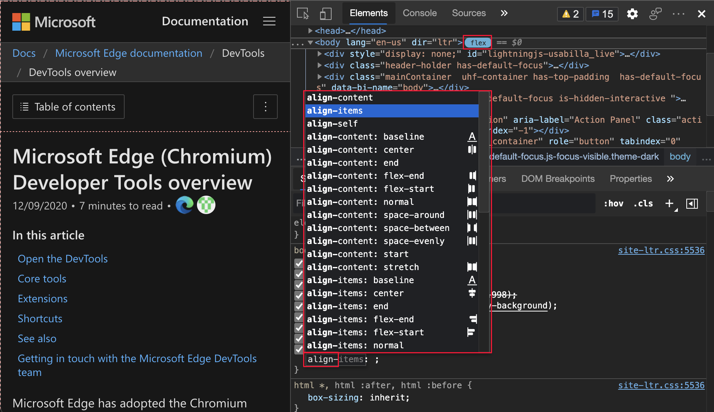

Flexbox `gap` in CSS properties and webpage highlighted:

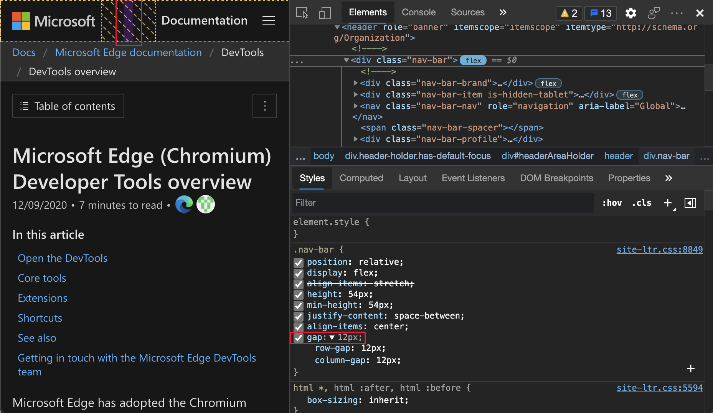

Update: This feature has been released and is no longer experimental.<!-- valid. -->

See also:
* [Getting element information from the Inspect overlay](../../../css/inspect.md#getting-element-information-from-the-inspect-overlay) in _Analyze pages using the Inspect tool_.
* [Inspect CSS Grid](../../../css/grid.md).

<!-- ====================================================================== -->
## Add tools quickly with new More Tools button

<!--  Title: Add tools quickly with new More Tools button  -->
<!--  Subtitle: A convenient way to open new tools in Microsoft Edge DevTools -->

You now have a new way to open more tools in Microsoft Edge DevTools.  The **More Tools** icon is a plus sign (`+`) to the right of the main panel.  To show a list of other tools that you can add to the main panel, click the **More Tools** (`+`) icon:

Update: This feature has been released and is no longer experimental.<!-- To turn on this experiment, see [Settings](../../../customize/index.md#settings) > **Experiments**, and then select the checkbox next to **Enable + button tab menus to open more tools**. -->

See also:
* [About the list of tools](../../../about-tools.md)

<!-- ====================================================================== -->
## Assistive technologies now announce position and count of CSS suggestions

<!--  Title: Assistive technologies now announce position and count of CSS suggestions  -->
<!--  Subtitle: CSS suggestions are now easier to navigate using screen readers -->

When you edit CSS rules, you get a dropdown list of features.  This feature wasn't available to users of assistive technologies, since it is announced in Microsoft Edge version 89.  A user of assistive technologies can now navigate CSS suggestions in the **Styles** pane.  In Microsoft Edge version 88 and earlier, assistive technology announced `Suggestion` as a user navigated through the list of suggestions when editing CSS in the **Styles** pane.

In Microsoft Edge version 89, a user of assistive technology now hears the position and count of the current suggestion.  Each suggestion is announced as the user navigates through the list of suggestions, such as Suggestion 3 of 5.  To learn more about writing CSS in DevTools, see [CSS features reference](../../../css/reference.md).  To view the history of this feature in the Chromium open-source project, see Issue [1157329](https://crbug.com/1157329).

To view a video that displays and reads aloud several suggestions with this experiment turned on, see [Voiceover announcing devtools options](https://youtu.be/9TcUpleEwwA) on YouTube.

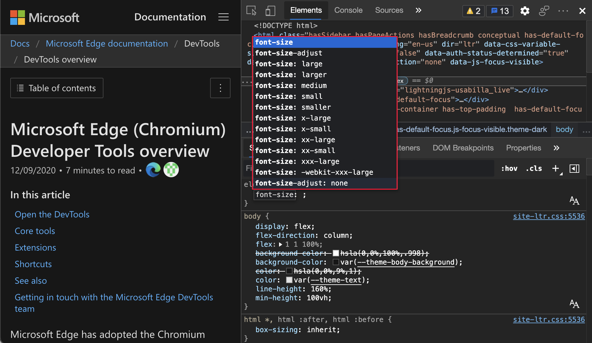

See also:
* [Navigate the Styles pane](../../../accessibility/navigation.md#navigate-the-styles-pane) in _Navigate DevTools with assistive technology_.
* [CSS features reference](../../../css/reference.md)

<!-- ====================================================================== -->
## Emulate Surface Duo and Samsung Galaxy Fold

<!--  Title: Emulate new dual-screen and foldable devices  -->
<!--  Subtitle: Test the appearance and feel of your website or app with Surface Duo and Samsung Galaxy Fold emulators -->

Test the appearance of your website or app on the following devices in Microsoft Edge.

* [Surface Duo](https://www.microsoft.com/surface/devices/surface-duo)
* [Samsung Galaxy Fold](https://www.samsung.com/us/mobile/galaxy-fold)

To access the new CSS media screen-spanning feature and the `getWindowSegments` (now `visualViewport.segments`) JavaScript API, go to `edge://flags` and toggle the flag next to **Experimental Web Platform features**:<!-- present as of April 19, 2022: -->

To help enhance your website or app for the dual-screen and foldable devices, use the following features when emulating the device:

* [Spanning](../../../device-mode/dual-screen-and-foldables.md#test-on-foldable-and-dual-screen-devices), which is when your website (or app) appears across both screens.
* [Rendering the seam](/dual-screen/introduction#how-to-work-with-the-seam), which is the space between the two screens.

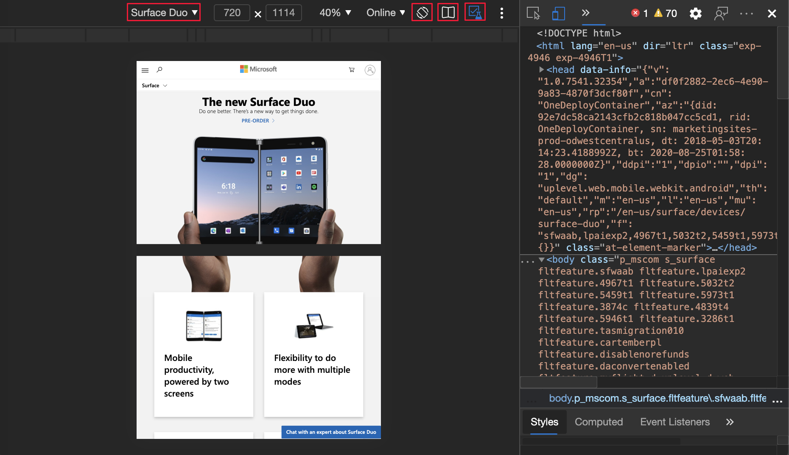

For the history of this feature in the Chromium open-source project, see Issue [1054281](https://crbug.com/1054281).

See also:
* [Emulate mobile devices (Device Emulation)](../../../device-mode/index.md).
* [CSS viewport segments media query for dual-screen detection](/dual-screen/web/css-media-spanning) - CSS media screen-spanning feature.
* [JavaScript visualViewport.segments API for dual-screen devices](/dual-screen/web/javascript-getwindowsegments).

<!-- ====================================================================== -->
## Microsoft Edge Developer Tools for Visual Studio Code version 1.1.2

The [Microsoft Edge Developer Tools for Visual Studio Code](https://marketplace.visualstudio.com/items?itemName=ms-edgedevtools.vscode-edge-devtools) extension version 1.1.2 for Microsoft Visual Studio Code has the following changes since the previous release.  Microsoft Visual Studio Code updates extensions automatically.  To manually update to version 1.1.2, see [Update an extension manually](https://code.visualstudio.com/docs/editor/extension-gallery#_update-an-extension-manually).

*  Added a **Close instance** button to each item on the target list ([#248](https://github.com/microsoft/vscode-edge-devtools/pull/248))
*  Bumped [Microsoft Edge DevTools](../../../index.md) version from 84.0.522.63 to [85.0.564.40](../../2020/06/devtools.md) ([#235](https://github.com/microsoft/vscode-edge-devtools/pull/235))
*  Included "Debugger for Microsoft Edge" as a dependency  ([#233](https://github.com/microsoft/vscode-edge-devtools/pull/233)).  
<!-- todo: consult w SME on desired presentation here -->
<!-- old url: https://marketplace.visualstudio.com/items?itemName=msjsdiag.debugger-for-edge -->
*  Implemented settings option to change extension themes ([#229](https://github.com/microsoft/vscode-edge-devtools/pull/229))

You can file issues and contribute to the extension on the [vscode-edge-devtools GitHub repo](https://github.com/microsoft/vscode-edge-devtools).

See also:
* [Microsoft Edge DevTools extension for Visual Studio Code](../../../../visual-studio-code/microsoft-edge-devtools-extension.md)

<!-- ====================================================================== -->
## Announcements from the Chromium project

The following sections announce additional features available in Microsoft Edge that were contributed to the open-source Chromium project.

<!-- ------------------------------ -->
#### Capture node screenshot beyond viewport

In Microsoft Edge version 89, node screenshots are more accurate, capturing the full node even if content from the node isn't visible in the viewport.  In the **Elements** tool, right-click an element, and then select **Capture node screenshot**.

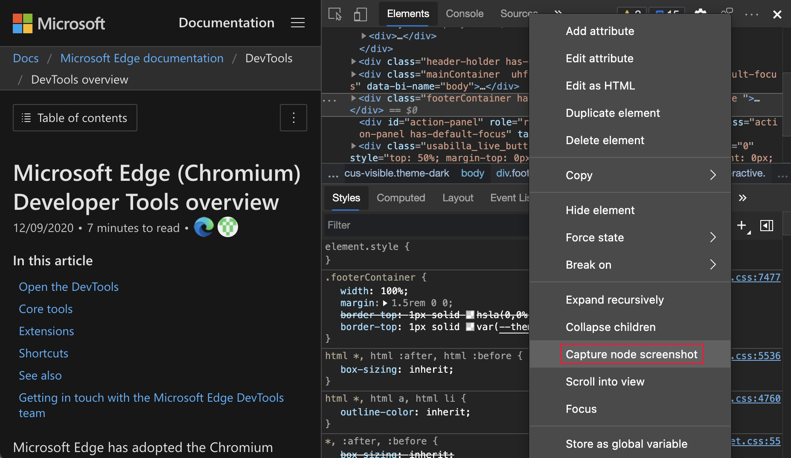

For the history of this feature in the Chromium open-source project, see Issue [1003629](https://crbug.com/1003629).

See also:
* [Capture node screenshots using the Elements tool context menu](../../2020/08/devtools.md#capture-node-screenshots-using-the-elements-tool-context-menu) in _What's New in DevTools (Microsoft Edge 86)_

<!-- ------------------------------ -->
#### Elements tool updates

###### Support forcing the :target CSS state

In the **Elements** tool, you can now force the [:target](https://developer.mozilla.org/docs/web/css/:target) CSS pseudo-class.  The `:target` pseudo-class is triggered when a unique element (the target element) has an `id` that matches a fragment of the URL.  For example, the `http://www.example.com/index.html#section1` URL triggers the `:target` pseudo-class on an HTML element with `id="section1"`.  To try a demo with section 1 highlighted, see [CSS :target demo](https://microsoftedge.github.io/Demos/devtools-target-pseudo/#section-1).

Webpage highlighted with no forced CSS:

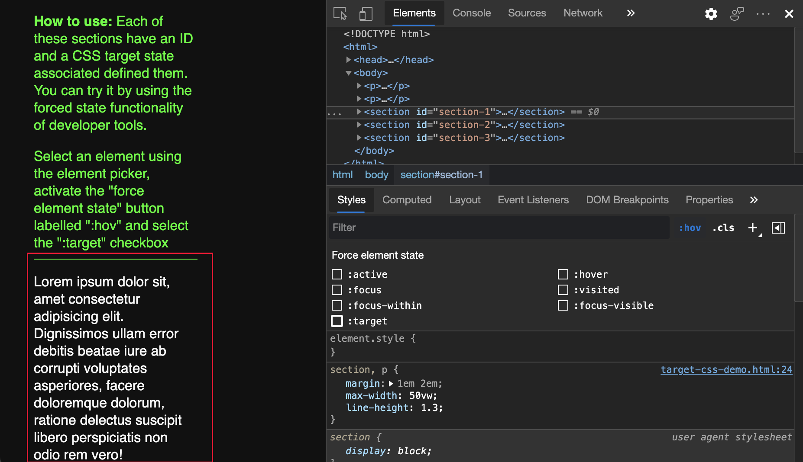

`:target` CSS forced and webpage highlighted:

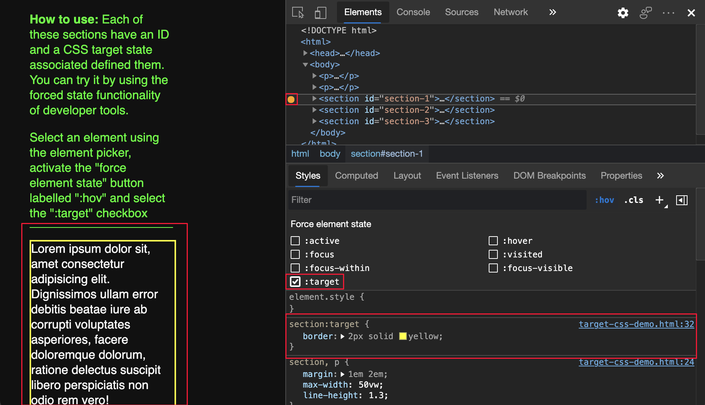

For the history of this feature in the Chromium open-source project, see Issue [1156628](https://crbug.com/1156628).

See also:
* [Use state simulation to simulate the hover state of an animated menu item](../../../accessibility/test-inspect-states.md#use-state-simulation-to-simulate-the-hover-state-of-an-animated-menu-item) in _Verify accessibility of all states of elements_.

###### Use Duplicate elements to copy elements

Use the new **Duplicate element** shortcut to clone an element.  In the **Elements** tool, right-click an element, and then select **Duplicate element**.  A new element is created under the selected element.  To duplicate the element by using the keyboard, press **Shift+Alt+Down Arrow** (Windows, Linux) or **Shift+Option+Down Arrow** (macOS).

For the history of this feature in the Chromium open-source project, see Issue [1150797](https://crbug.com/1150797).

See also:
* [Inspect, edit, and debug HTML and CSS with the Elements tool](../../../elements-tool/elements-tool.md)

###### Color pickers for custom CSS properties

The **Styles** pane now displays color pickers for custom CSS properties.  To cycle through the RGBA, HSLA, and Hex formats of the color value, press and hold **Shift** and then click the color picker:

For the history of this feature in the Chromium open-source project, see Issue [1147016](https://crbug.com/1147016).

See also:
* [Change colors with the Color Picker](../../../css/reference.md#change-colors-with-the-color-picker) in _CSS features reference_

###### Copy CSS classes and properties

You can now copy CSS properties quicker with a few new options in the right-click menu.  In the **Elements** tool, select an element.  To copy the value, in the **Styles** pane, right-click a CSS class or a CSS property, and then select a copy option.

Copy options for a CSS class in the right-click menu:

| Option | Details |
|:--- |:--- |
| **Copy selector** | Copy the current selector name. |
| **Copy rule** | Copy the rule of the current selector. |
| **Copy all declarations** | Copy all declarations under the current rule, including non-valid and prefixed properties. |

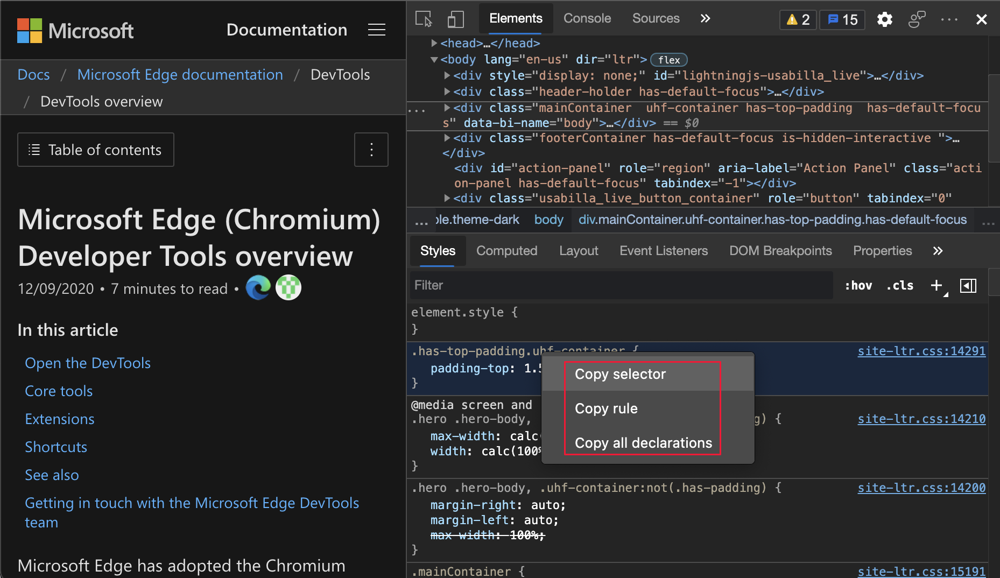

Copy options for a CSS property in the right-click menu:

| Option | Details |
|:--- |:--- |
| **Copy declaration** | Copy the declaration of the current line. |
| **Copy property** | Copy the property of the current line. |
| **Copy value** | Copy the value of the current line. |

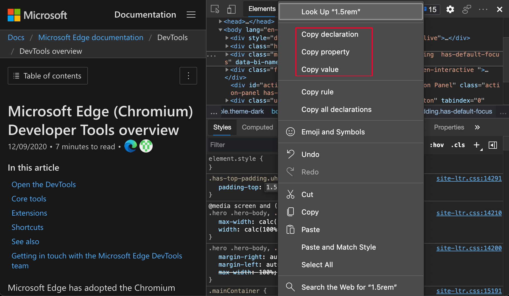

For the history of this feature in the Chromium open-source project, see Issue [1152391](https://crbug.com/1152391).

See also:
* [CSS features reference](../../../css/reference.md)

<!-- ------------------------------ -->
#### Cookies updates

###### New option to display URL-decoded cookies

You can now display the URL-decoded cookies value in the **Cookies** pane.  To display the decoded cookie, select **Application** > **Cookies**, click any cookie on the list, and then select the checkbox next to **Show URL decoded**:

For the history of this feature in the Chromium open-source project, see Issue [997625](https://crbug.com/997625).

See also:
* [View, edit, and delete cookies](../../../storage/cookies.md)

###### Filter and clear visible cookies

In Microsoft Edge version 88 or earlier, the **Application** tool only provided a way to clear all cookies with the **Clear all cookies** button.  In Microsoft Edge version 89, you can now select **Clear filtered cookies** to delete only the filtered cookies.

To filter cookies, select **Application** > **Cookies**, and then type in the **Filter** text box.  To delete the displayed cookies, click the **Clear filtered cookies** button.  To display all other cookies, clear the filter text.

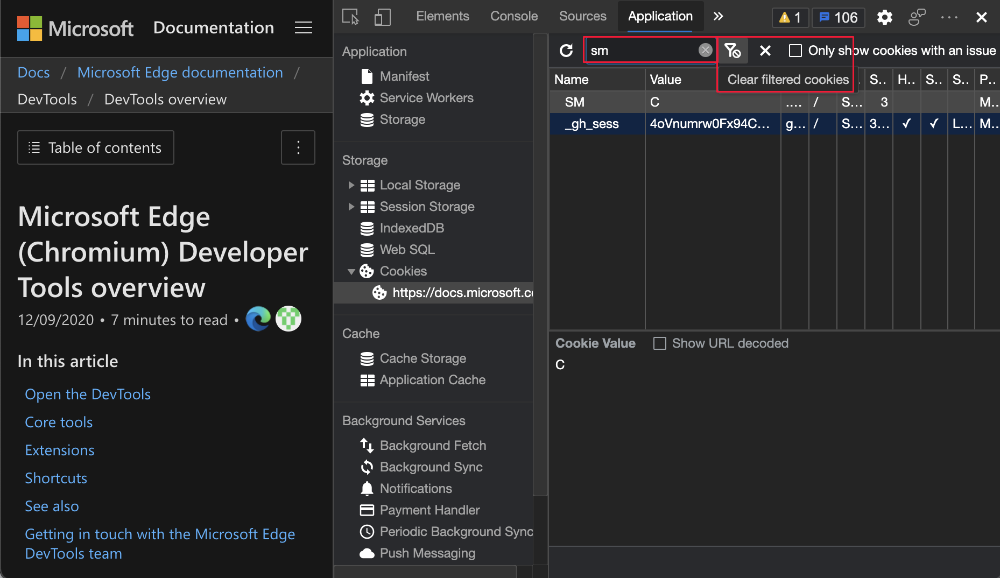

For the history of this feature in the Chromium open-source project, see Issue [978059](https://crbug.com/978059).

See also:
* [View, edit, and delete cookies](../../../storage/cookies.md)

###### New option to clear third-party cookies in the Storage pane

DevTools now clears only first-party cookies by default.  To clear website data and first-party cookies only, in the **Application** tool, in the **Application** section in the upper left, click **Storage**, and then click the **Clear site data** button.

To clear website data and all cookies, select **Application** > **Storage**.  Select the checkbox next to **including third-party cookies**, and then click **Clear site data**:

For the history of this feature in the Chromium open-source project, see Issue [1012337](https://crbug.com/1012337).

See also:
* [Application tool, to manage storage](../../../storage/application-tool.md)

<!-- ------------------------------ -->
#### Network tool updates

See also:
* [Network features reference](../../../network/reference.md)

###### Persist Record network log setting

In Microsoft Edge version 88 or earlier, DevTools reset the **Record network log** setting when a webpage refreshes.  In Microsoft Edge version 89, DevTools now persists the **Record network log** setting:

For the history of this feature in the Chromium open-source project, see Issue [1122580](https://crbug.com/1122580).

See also:
* [Record network requests](../../../network/reference.md#record-network-requests) in _Network features reference_.

###### Online option is now No throttling option

The network emulation option **Online** is now renamed to **No Throttling**.

For the history of this feature in the Chromium open-source project, see Issue [1028078](https://crbug.com/1028078).

See also:
* [Simulate a slower network connection](../../../network/index.md#simulate-a-slower-network-connection) in _Inspect network activity_.
* [Emulate slow network connections](../../../network/reference.md#emulate-slow-network-connections) in _Network features reference_.

<!-- ------------------------------ -->
#### New copy options in the Console tool, Sources tool, and Styles pane

###### Copy object in the Console and Sources tool

You can now copy object values in the **Console** and **Sources** tools.  The ability to copy object values is useful when working with large objects.

In the **Console** tool, right-click an object, and then select **Copy object**.

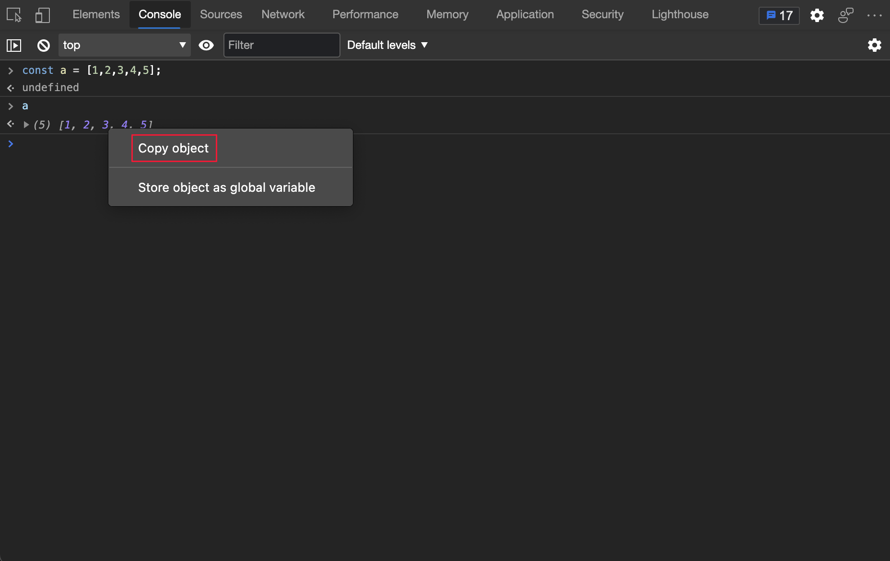

In the **Sources** tool, on a breakpoint, hover on an object, in the **Object** popup window, right-click an object, and then select **Copy object**.

For the history of this feature in the Chromium open-source project, see Issues [1148353](https://crbug.com/1148353) and [1149859](https://crbug.com/1149859).

See also:
* [Console overview](../../../console/index.md)
* [Sources tool overview](../../../sources/index.md)
<!-- 0 hits on "Copy object" -->

###### Copy file name in the Sources tool and Styles pane

You can now copy a file name by using the right-click menu.

In the **Sources** tool, right-click a file name, and then select **Copy file name**.

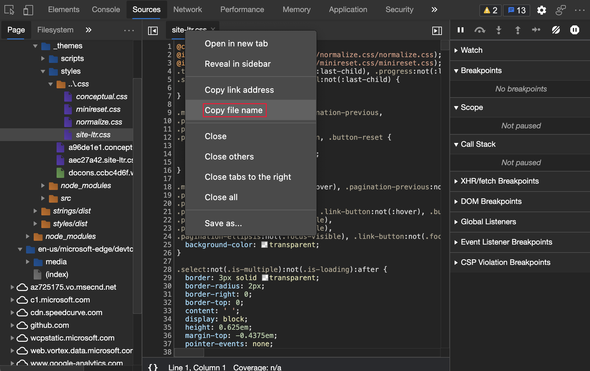

In the **Elements** tool > **Styles** pane, right-click a file name, and then select **Copy file name**.

For the history of this feature in the Chromium open-source project, see Issues [1155120](https://crbug.com/1155120).

See also:
* [Sources tool overview](../../../sources/index.md)
* [Inspect, edit, and debug HTML and CSS with the Elements tool](../../../elements-tool/elements-tool.md)
<!-- 0 hits on "Copy file name" -->

<!-- ------------------------------ -->
#### Updates to Frame details

In the **Application** tool, the **Frames** page has the following updates.

###### Service Workers information in Frame details

The **Application** tool now lists a dedicated service worker under the parent frame.  In the following figure, service worker details are displayed.  To display the service worker details, select **Application** > **Frames** > `top` > **Service Workers** and then click a service worker.

For the history of this feature in the Chromium open-source project, see Issue [1122507](https://crbug.com/1122507).

See also:
* [Application tool, to manage storage](../../../storage/application-tool.md)

###### Measure Memory information in Frame details

In the **Frames** page of the **Application** tool, the `performance.measureMemory()` API status is now displayed in the **API availability** section.  The new `performance.measureMemory()` API estimates the memory usage of the entire webpage.

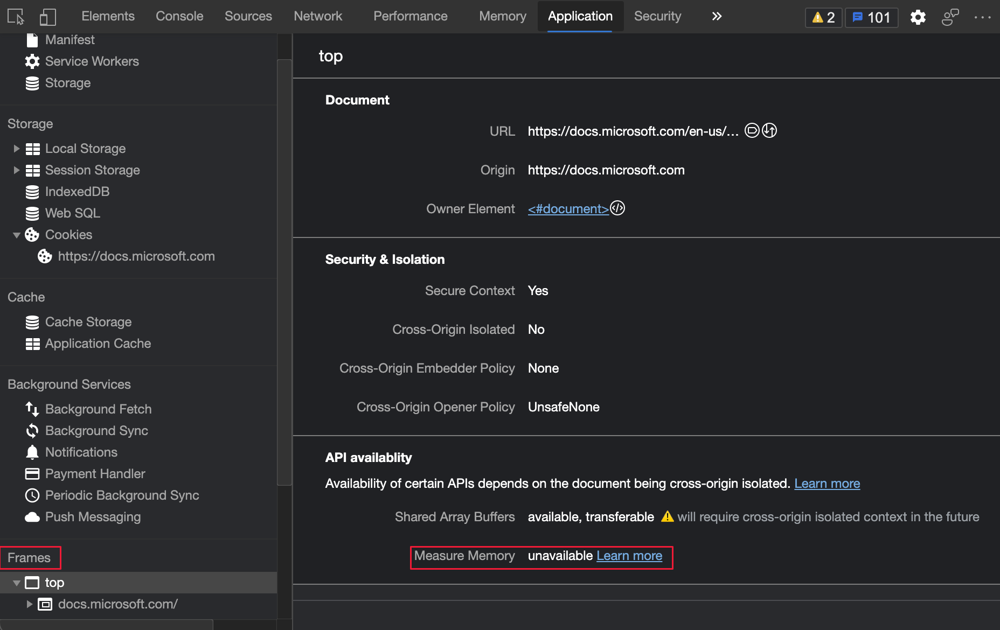

For the history of this feature in the Chromium open-source project, see Issue [1139899](https://crbug.com/1139899).

See also:
* [Application tool, to manage storage](../../../storage/application-tool.md)

<!-- ------------------------------ -->
#### Dropped frames in the Performance tool

When you analyze load performance in the Performance tool, the **Frames** section now marks dropped frames as red.  To display the frame rate, hover on a dropped frame:

For the history of this feature in the Chromium open-source project, see Issue [1075865](https://crbug.com/1075865).

See also:
* [Record load performance](../../../evaluate-performance/reference.md#record-load-performance) in _Performance features reference_

###### New color contrast calculation - Advanced Perceptual Contrast Algorithm (APCA)

<!-- valid 05/13/2022 -->

The [Advanced Perceptual Contrast Algorithm (APCA)](https://w3c.github.io/silver/guidelines/methods/Method-font-characteristic-contrast.html) replaces the [AA](https://www.w3.org/WAI/WCAG21/quickref#contrast-minimum)/[AAA](https://www.w3.org/WAI/WCAG21/quickref#contrast-enhanced) guidelines contrast ratio in the Color Picker.  The Color Picker is used in the **Styles** tab in the **Elements** tool.

APCA is a new way to compute contrast.  It is based on modern research on color perception.  Compared to AA/AAA guidelines, APCA is more context-dependent.  The contrast is calculated based on the following spatial properties of the text, color, and context.

*  Spatial properties of text that include font weight and size.
*  Spatial properties of color that include perceived contrast between text and background.
*  Spatial properties of context that include ambient light, surroundings, and intended purpose.

To turn on this experiment, select **Settings** > **Experiments** and then select the checkbox next to **Enable new Advanced Perceptual Contrast Algorithm (APCA) replacing previous contrast ratio and AA/AAA guidelines**.  To view the history of this feature in the Chromium open-source project, see Issue [1121900](https://crbug.com/1121900).

See also:
* [Enable new Advanced Perceptual Contrast Algorithm (APCA) replacing previous contrast ratio and AA/AAA guidelines](../../../experimental-features/index.md#enable-new-advanced-perceptual-contrast-algorithm-apca-replacing-previous-contrast-ratio-and-aaaaa-guidelines) in _Experimental features in Microsoft Edge DevTools_.
Edge 89)_.
* [Change colors with the Color Picker](../../../css/reference.md#change-colors-with-the-color-picker) in _CSS features reference_.
* [Test text-color contrast using the Color Picker](../../../accessibility/color-picker.md)

<!-- ====================================================================== -->
> [!NOTE]
> Portions of this page are modifications based on work created and [shared by Google](https://developers.google.com/terms/site-policies) and used according to terms described in the [Creative Commons Attribution 4.0 International License](https://creativecommons.org/licenses/by/4.0).
> The original page is found [here](https://developer.chrome.com/blog/new-in-devtools-89) and is authored by [Jecelyn Yeen](https://developers.google.com/web/resources/contributors#jecelyn-yeen) (Developer advocate, Chrome DevTools).

This work is licensed under a [Creative Commons Attribution 4.0 International License](https://creativecommons.org/licenses/by/4.0).
