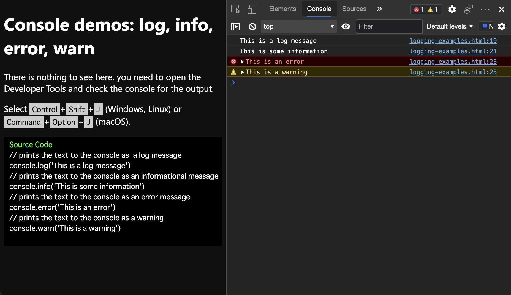
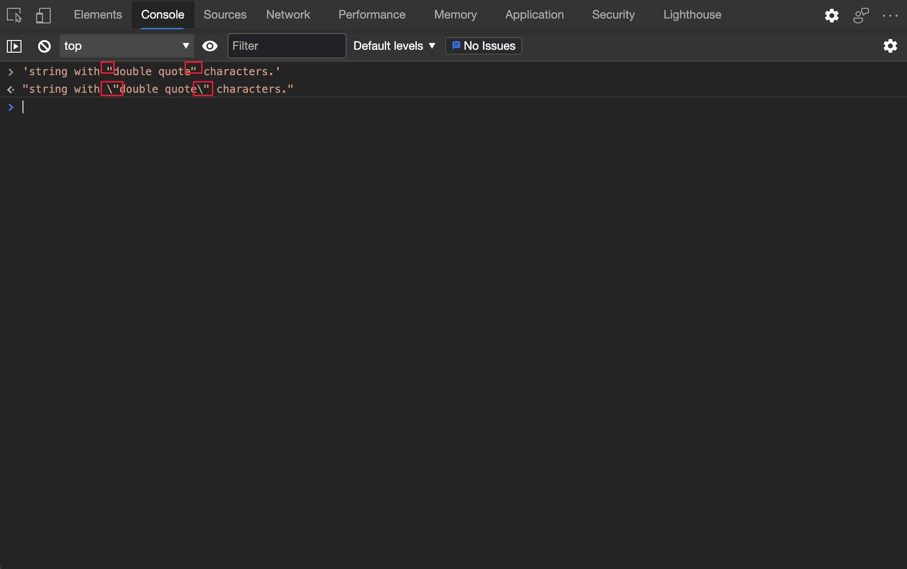
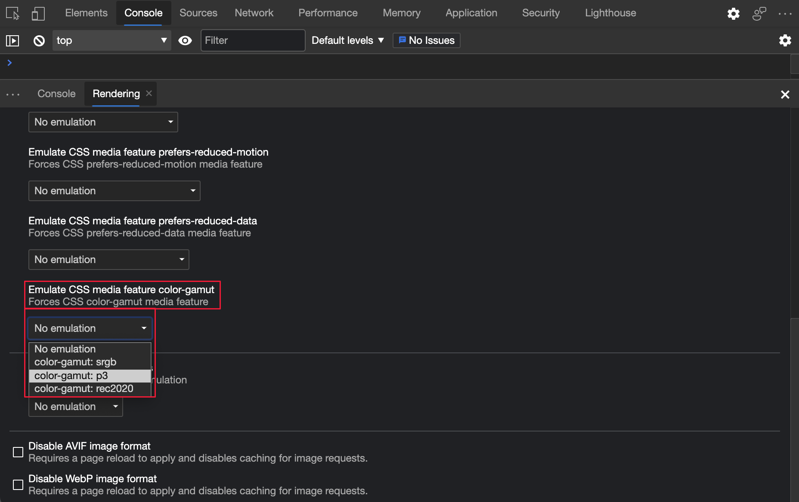
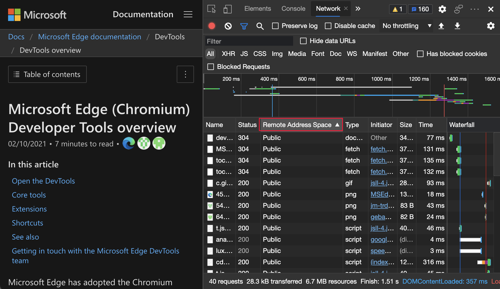
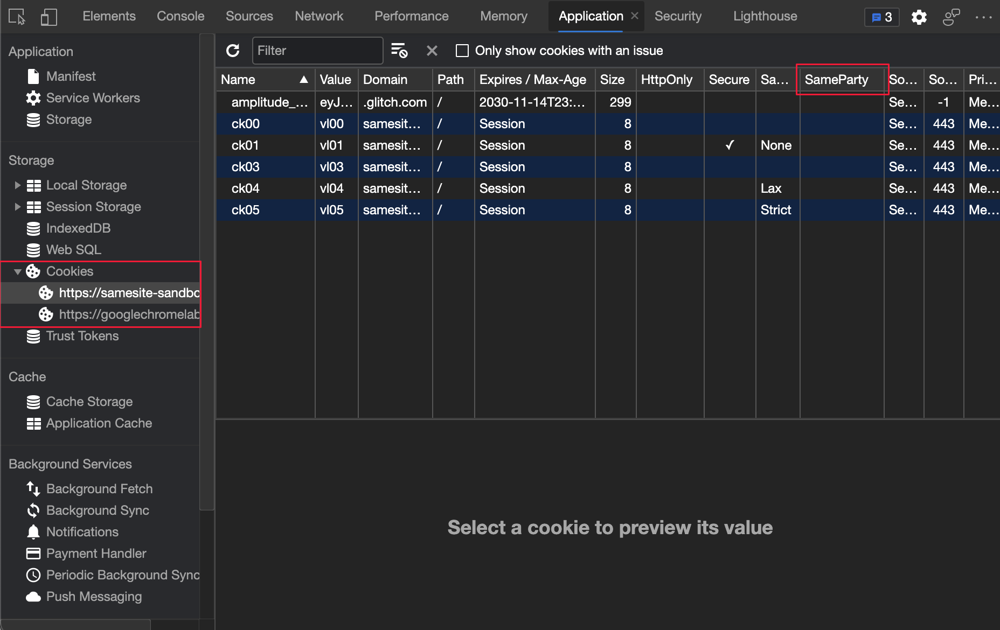

<!-- Copyright Jecelyn Yeen

   Licensed under the Apache License, Version 2.0 (the "License");
   you may not use this file except in compliance with the License.
   You may obtain a copy of the License at

       https://www.apache.org/licenses/LICENSE-2.0

   Unless required by applicable law or agreed to in writing, software
   distributed under the License is distributed on an "AS IS" BASIS,
   WITHOUT WARRANTIES OR CONDITIONS OF ANY KIND, either express or implied.
   See the License for the specific language governing permissions and
   limitations under the License.  -->
# What's New in DevTools (Microsoft Edge 90)

[!INCLUDE [Microsoft Edge team note for top of What's New](../../includes/edge-whats-new-note.md)]

<!-- ====================================================================== -->
## Group tools together in Focus Mode

<!-- Title: Grouping the tools in Focus Mode  -->
<!-- Subtitle: Organize your favorite tools into groups with the new Focus Mode UI.  -->

Focus Mode is an experimental interface that allows you to group different tools together based on your own debugging scenarios.  The new **Activity Bar** displayed on the left includes predefined tool groups such as **Layout** and **Debugging**.  To customize each tool group, close tools with the **Close** (`X`) icon or add new tools with the **More tools** (`+`) icon.

To turn on the experiment, see [Turning an experiment on or off](../../../experimental-features/index.md#turning-an-experiment-on-or-off) and select the checkboxes next to **Focus Mode and DevTools Tooltips** and **Enable + button tab menus to open more tools**.  For more information about this feature or to comment with questions and ideas, see [DevTools: Focus Mode UI](https://github.com/MicrosoftEdge/DevTools/blob/main/explainers/FocusMode/explainer.md).

<!-- ====================================================================== -->
## Learn about DevTools with informative tooltips

<!-- Title: DevTools Tooltips  -->
<!-- Subtitle: Learn more about how to use DevTools with informative DevTools tooltips.  -->

The DevTools Tooltips feature helps you learn about all the different tools and panes.  Hover over each outlined region of DevTools to learn more about how to use the tool.  To turn on Tooltips, do one of the following: 

*  Select **Customize and control DevTools** (`...`) > **Help** > **Toggle the DevTools Tooltips**.
*  Press **Ctrl+Shift+H** (Windows, Linux) or **Command+Shift+H** (macOS).
*  [Open the Command Menu](../../../command-menu/index.md#open-the-command-menu) and then type **tooltips**.

Then hover over each outlined region of DevTools:

To turn off Tooltips, press **Esc**.  

Update: This feature has been released and is no longer experimental.<!-- valid. -->
<!-- To turn on the experiment, see [Turning an experiment on or off](../../../experimental-features/index.md#turning-an-experiment-on-or-off) and select the following checkboxes:
*  **Focus Mode**
*  **DevTools Tooltips**
*  **Enable + button tab menus to open more tools**
-->

Note: As of May 2022, tooltips aren't supported from the **Activity Bar**.
<!--Click the Help (**?**) icon at the bottom of the **Activity Bar** to toggle tooltips in the DevTools.-->
<!--  -->
<!--
See also:
* [Focus Mode](../../../experimental-features/index.md#focus-mode) in _Experimental features in Microsoft Edge DevTools_.
-->

<!-- ====================================================================== -->
## Customize keyboard shortcuts in Settings

<!-- Title: Change keyboard shortcuts in Settings  -->
<!-- Subtitle: Make DevTools work better for you by creating new keyboard shortcuts for any action in the DevTools.  -->

You can now customize the keyboard shortcut for any action in the DevTools.

To edit a keyboard shortcut:

1. Open DevTools, and then select **Settings** > **Shortcuts**.

1. Select the action you want to customize.

1. Click the **Edit** () icon.

1. Press the keys you want to bind to the action.

1. Click the checkmark () icon.

For more information about customizing and editing shortcuts, see [Customize keyboard shortcuts in DevTools](../../../customize/shortcuts.md).  For real-time updates on this feature in the Chromium open-source project, see Issue [174309](https://crbug.com/174309).

<!-- ====================================================================== -->
## Microsoft Edge DevTools for Visual Studio Code extension update 1.1.4

<!-- Title: Edge Devtools for Visual Studio code extension update 1.1.4  -->
<!-- Subtitle: Latest changes including a favicon is displayed next to each of the instances and console messages from the browser are displayed in the console of Visual Studio Code.  -->

The [Microsoft Edge Developer Tools for Visual Studio Code](https://marketplace.visualstudio.com/items?itemName=ms-edgedevtools.vscode-edge-devtools) extension version 1.1.4 for Microsoft Visual Studio Code now displays a favicon next to each of the DevTools instances.  Console messages from Microsoft Edge now display in the **DevTools Console** under **Output** of Microsoft Visual Studio Code.  Microsoft Visual Studio Code updates extensions automatically.  To manually update to version 1.1.4, see [Update an extension manually](https://code.visualstudio.com/docs/editor/extension-gallery#_update-an-extension-manually).  You can file issues and contribute to the extension on the [vscode-edge-devtools](https://github.com/microsoft/vscode-edge-devtools) GitHub repo.

The following figure displays messages from an example webpage logged in the **Console** tool in Microsoft Edge:

The following figure displays the same messages from the example webpage logged in the **DevTools Console** under **Output** of Microsoft Visual Studio Code:

See also:
* [Microsoft Edge DevTools extension for Visual Studio Code](../../../../visual-studio-code/microsoft-edge-devtools-extension.md)

<!-- ====================================================================== -->
## Improved CSS flexbox editing with visual flexbox editor and multiple overlays

<!-- Title: Try different CSS flexbox layouts with the visual flexbox editor  -->
<!-- Subtitle: In the Styles pane, click the icon that appears next to display: flex to try different layout properties for flex containers.  -->

DevTools now has dedicated CSS flexbox debugging tools.  If the `display: flex` or `display: inline-flex` CSS style is applied to an HTML element, a **flex** icon appears next to that element in the **Elements** tool.  To display (or hide) a flex overlay on the webpage, click the **flex** icon.

To open the **Flexbox** editor, in the **Elements** tool, go to the **Styles** tab and then click the new icon next to the `display: flex` or `display: inline-flex` style.  The **Flexbox** editor provides a quick way to edit the flexbox properties:

In addition, the **Flexbox** section in the **Layout** pane displays all of the flexbox elements on the webpage.  You can toggle the overlay of each element:

For the history of this feature in the Chromium open-source project, see Issues [1166710](https://crbug.com/1166710) and [1175699](https://crbug.com/1175699).

See also:
* [Edit CSS font styles and settings in the Styles pane](../../../inspect-styles/edit-fonts.md)
* [Update .css files from within the Styles tab (CSS mirror editing)](../../../../visual-studio-code/microsoft-edge-devtools-extension/css-mirror-editing-styles-tab.md)<!-- eg "flex-direction" is only mentioned in this extension article -->
<!-- todo: copy section content to regular docs -->

<!-- ====================================================================== -->
## Keyboard navigation improvements for network requests

<!-- Title: Navigate the request initiator chain in the Network tool with the keyboard  -->
<!-- Subtitle: The Initiator pane may now be expanded or collapsed with the arrow keys.  -->

Previously, you were not able to expand or collapse the chain of requests using the arrow keys on the keyboard in the **Initiator** pane, unlike the DOM in the **Elements** tool.  When a network request is selected in the **Network** tool, the **Initiator** pane displays the chain of requests that initiated the currently selected request.

In Microsoft Edge version 90, you can expand or collapse the chain of requests using the arrow keys on the keyboard in the **Initiator** pane.  The focused network request in the chain is also now highlighted.

Click a Network request and then click the **Initiator** pane:

Expand or collapse the request initiator chain and follow the highlighted row:

To learn more about initiators in the **Network** tool, see [Display initiators and dependencies](../../../network/reference.md#display-initiators-and-dependencies).

For the history of this feature in the Chromium open-source project, see Issues [1158276](https://crbug.com/1158276) and [1160637](https://crbug.com/1160637).

<!-- ====================================================================== -->
## Filtering in the Console is more consistent

<!-- Title: Console improvements make filtering more consistent  -->
<!-- Subtitle: The Log Levels dropdown list is more clearly disabled when using filters in the Console sidebar.  -->

While you filter with the [Console Sidebar](../../../console/reference.md#open-the-console-sidebar), the filters in the [Log Levels](../../../console/reference.md#filter-by-log-level) dropdown list aren't available.  Previously, the **Log Levels** dropdown list was highlighted when you hovered over it, even while a filter from the **Console Sidebar** was selected.  In Microsoft Edge version 90, the **Log Levels** dropdown list is no longer highlighted when you hover over it while a filter from the **Console Sidebar** is selected.

To learn more about filtering in the **Console**, see [Filter Messages](../../../console/reference.md#filter-messages) in _Console features reference_.

Previously, if you open the **Console sidebar** and hover on **Default levels**, it was highlighted:

Starting in Microsoft Edge 90, if you click the **Console sidebar** and hover on **Default levels**, it doesn't highlight:

<!-- ====================================================================== -->
## Announcements from the Chromium project

The following sections announce additional features available in Microsoft Edge that were contributed to the open-source Chromium project.

<!-- ====================================================================== -->
### The Console now escapes double-quote characters

Previously, the **Console** didn't output valid double-quote (`"`) characters in JavaScript strings.  Starting in Microsoft Edge version 90, the **Console** outputs JavaScript strings using escaped double-quote (`"`) characters:

For the history of this feature in the Chromium open-source project, see Issue [1178530](https://crbug.com/1178530).

See also:
* [Console features reference](../../../console/reference.md)

<!-- ====================================================================== -->
### Emulate the CSS color-gamut media feature

The [color-gamut](https://www.chromestatus.com/feature/5354410980933632) media query emulates the approximate range of colors that are supported by the browser and device that you're testing.  The dropdown list under **Emulate CSS media feature color-gamut** contains color spaces that DevTools can emulate.  For example, to trigger a `color-gamut: p3` media query, select **color-gamut: p3** from the dropdown list.

To emulate the CSS color-gamut media feature:

1. To open DevTools, right-click the webpage, and then select **Inspect**.  Or, press **Ctrl+Shift+I** (Windows, Linux) or **Command+Option+I** (macOS).  DevTools opens.
1. In DevTools, on the main toolbar, select the **Rendering** tab.  If that tab isn't visible, click the **More tabs** () button, or else the **More Tools** () button.  The **Rendering** tool opens.
1. In the **Emulate CSS media feature color-gamut** dropdown list, select a **color-gamut** option:

To learn more about the `color-gamut` feature, see [Color Display Quality: the 'color-gamut' feature](https://drafts.csswg.org/mediaqueries-4#color-gamut).
<!-- todo: add regular docs?  this link destination is a file listing, not user docs. -->

For the history of this feature in the Chromium open-source project, see Issue [1073887](https://crbug.com/1073887).

See also:
* [Rendering tool, to see what a webpage looks like with different display options or vision deficiencies](../../../rendering-tools/rendering-tool.md)

<!-- ====================================================================== -->
### Improved tooling for Progressive Web Apps

<!-- ====================================================================== -->
#### PWA installability warning in the Console

The **Console** now displays a more detailed installability warning message for Progressive Web Apps (PWAs), with a link to [Improving Progressive Web App offline support detection](https://developer.chrome.com/blog/improved-pwa-offline-detection).

See also:
* [Overview of Progressive Web Apps (PWAs)](../../../../progressive-web-apps-chromium/index.md)

<!-- ====================================================================== -->
#### PWA description length warning in the Manifest pane

In the **Application** tool, the **Manifest** pane now displays a warning message if the manifest description exceeds 324 characters:

For the history of this feature in the Chromium open-source project, see Issues [965802](https://crbug.com/965802), [1146450](https://crbug.com/1146450), and [1169689](https://crbug.com/1169689).

See also:
* [Application tool, to manage storage](../../../storage/application-tool.md)
<!-- todo: the Application tool seems under-doc'd; contrast the TOC > Tools > Application tool vs. the left-side tree in the tool:
https://learn.microsoft.com/microsoft-edge/devtools-guide-chromium/storage/application-tool -->

<!-- ====================================================================== -->
### New Remote Address Space column in the Network tool

<!-- doesn't work in canary 90.0.813.0 -->
In the **Network** tool, the new **Remote Address Space** column displays the network IP address space of each network resource.  To display the new **Remote Address Space** column:

1. In DevTools, open the **Network** tool.

1. In the Requests table (the main, lower part of the **Network** tool), right-click the header row, and then select **Remote Address Space**:

   

   The Requests table now displays the **Remote Address Space** column:

   

To view the history of this feature in the Chromium open-source project, see Issue [1128885](https://crbug.com/1128885).

See also:
* [Add or remove columns](../../../network/reference.md#add-or-remove-columns), in _Network features reference_.

<!-- ====================================================================== -->
### Display allowed and disallowed features in the Frame details view

In the **Application** tool, the **Frames** node in the lower left opens the Frame details view.  The Frame details view now includes a **Permissions Policy** section, which displays a list of allowed and disallowed browser features:

This list is controlled by the Permissions Policy web platform API, which allows a webpage to use, or blocks a webpage from using, specified browser features in an individual frame or in iframes that the frame embeds.

For the history of this feature in the Chromium open-source project, see Issue [1158827](https://crbug.com/1158827).

See also:
* [Permissions Policy Explainer](https://github.com/w3c/webappsec-permissions-policy/blob/main/permissions-policy-explainer.md)
* [Application tool, to manage storage](../../../storage/application-tool.md)
<!-- todo: it seems like a new "Application > Webpage Frames" .md page is needed; many What's New items cover the Frame node/page in lower left of Application tool -->

<!-- ====================================================================== -->
### New SameParty column in the Cookies pane

The **Cookies** pane in the **Application** tool now displays the `SameParty` attribute for each cookie:

The `SameParty` attribute is a new boolean attribute to indicate whether a cookie is included in requests to origins of the same [First-Party Sets](https://github.com/privacycg/first-party-sets).

For the history of this feature in the Chromium open-source project, see Issue [1161427](https://crbug.com/1161427).

See also:
* [View, edit, and delete cookies](../../../storage/cookies.md)

<!-- ====================================================================== -->
### fn.displayName property in the Console tool is now deprecated

Previously, the `fn.displayName` property allowed you to control debug names for functions to display in `error.stack` and in DevTools stack traces.  Starting in Microsoft Edge version 90, the `fn.displayName` property is now deprecated, and replaced by the `fn.name` property:

Use the standard `Object.defineProperty` method to define the `fn.name` property.  To learn more about `fn.name`, see [Function.name](https://developer.mozilla.org/docs/Web/JavaScript/Reference/Global_Objects/Function/name).

For the history of this feature in the Chromium open-source project, see Issue [1177685](https://crbug.com/1177685).

See also:
* [Console features reference](../../../console/reference.md)
* [Console tool utility functions and selectors](../../../console/utilities.md)
<!-- todo: is this function a partial overlap w/ devtools console & JS Ref?  do we have similar doc'n? -->

<!-- ====================================================================== -->
### Full accessibility tree view in the Elements tool

<!-- valid 05/10/2022 -->

This experiment provides a **full accessibility tree view** in the **Elements** tool.  The **Accessibility** tab (grouped with the **Styles** tab) provides a partial accessibility tree view, that displays the direct ancestor chain from the root node to the inspected node.  After you turn on this experiment and reload DevTools, click the button area at the top of the **Elements** panel to switch the display in the Elements tool for all elements on the webpage.

To display the DOM tree view, click the **Switch to DOM Tree view** button area at the top:

To display the full accessibility tree, click the **Switch to Accessibility Tree view** button area at the top:

<!-- todo: redo capture showing Accessibility tab (instead of Styles tab) for comparison and to clarify its behavior -->

To turn on the experiment, see [Turning an experiment on or off](../../../experimental-features/index.md#turning-an-experiment-on-or-off) and select the checkbox next to **Enable full accessibility tree view in the Elements panel**.

For the history of this feature in the Chromium open-source project, see Issue [887173](https://crbug.com/887173).

See also:
* [Test accessibility using the Accessibility tab](../../../accessibility/accessibility-tab.md)
* [Inspect, edit, and debug HTML and CSS with the Elements tool](../../../elements-tool/elements-tool.md)

<!-- ====================================================================== -->
> [!NOTE]
> Portions of this page are modifications based on work created and [shared by Google](https://developers.google.com/terms/site-policies) and used according to terms described in the [Creative Commons Attribution 4.0 International License](https://creativecommons.org/licenses/by/4.0).
> The original page is found [here](https://developer.chrome.com/blog/new-in-devtools-90) and is authored by [Jecelyn Yeen](https://developers.google.com/web/resources/contributors#jecelyn-yeen) (Developer advocate, Chrome DevTools).

This work is licensed under a [Creative Commons Attribution 4.0 International License](https://creativecommons.org/licenses/by/4.0).
