# What's New in DevTools (Microsoft Edge 92)

[!INCLUDE [Microsoft Edge team note for top of What's New](../../includes/edge-whats-new-note.md)]

> [!TIP]
> The **Microsoft Build 2021** conference was on May 25-27.  Here's a video from Build about the updates to DevTools:
> [Microsoft Edge | State of the Platform](https://www.youtube.com/watch?v=sU0WRZ0kkNo) - Microsoft Edge brings a compelling and consistent platform with tools for developers.  As our legacy browsers phase out of support, Edge will soon be the only supported browser from Microsoft on Windows 10 or later.  Join us to learn about the latest across the Edge platform, tools, and web apps.

<!-- ====================================================================== -->
## The Close button is no longer hidden when DevTools is narrow

<!-- Title: DevTools is now easier to close -->
<!-- Subtitle: The Close button in DevTools is always displayed, even when DevTools is docked to the right and the DevTools viewport is narrow. -->

In Microsoft Edge version 91 or earlier, the **Close** button to close DevTools isn't displayed when the DevTools viewport is narrow.  In Microsoft Edge version 92, the **Close** button in the DevTools is always present, regardless of the DevTools viewport width.

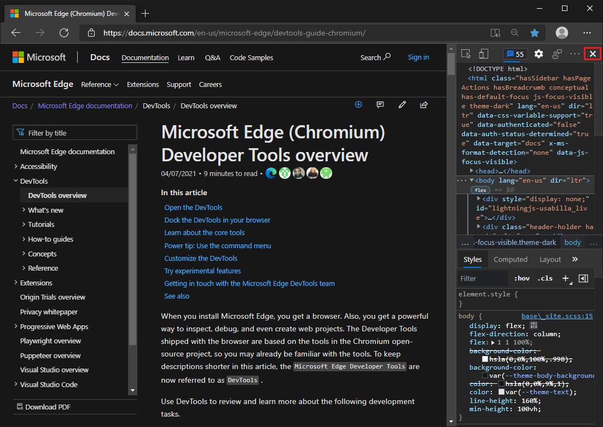

<!-- no cta link needed -->

<!-- ====================================================================== -->
## Add tools quickly with the new More Tools button

<!-- Title: Add tools quickly with the new More Tools button -->
<!-- Subtitle: Learn about a new convenient way to open tools in Microsoft Edge DevTools. -->

There's a new way to open more tools in Microsoft Edge DevTools: the **More Tools** (`+`) menu.  The **More Tools** menu appears on the toolbar in the main panel and on the toolbar of the drawer. Selecting a tool from the **More Tools** menu adds the tool to the toolbar.

To reorder the tabs on either toolbar, select and drag the tabs.

The **More Tools** menu was available as an experiment in Microsoft Edge version 89, and is now always present.

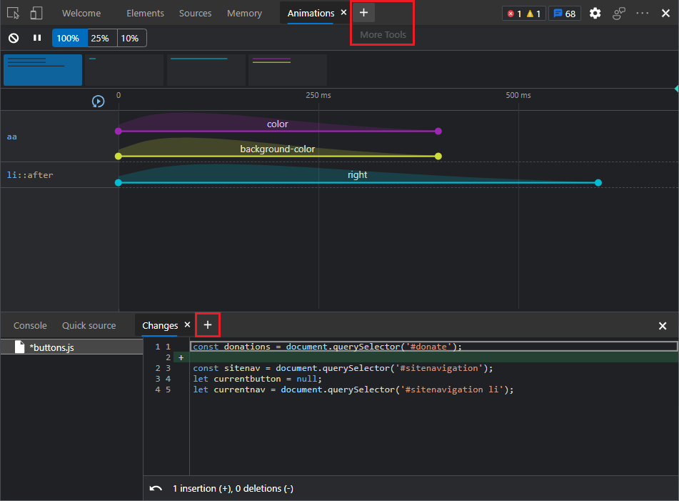

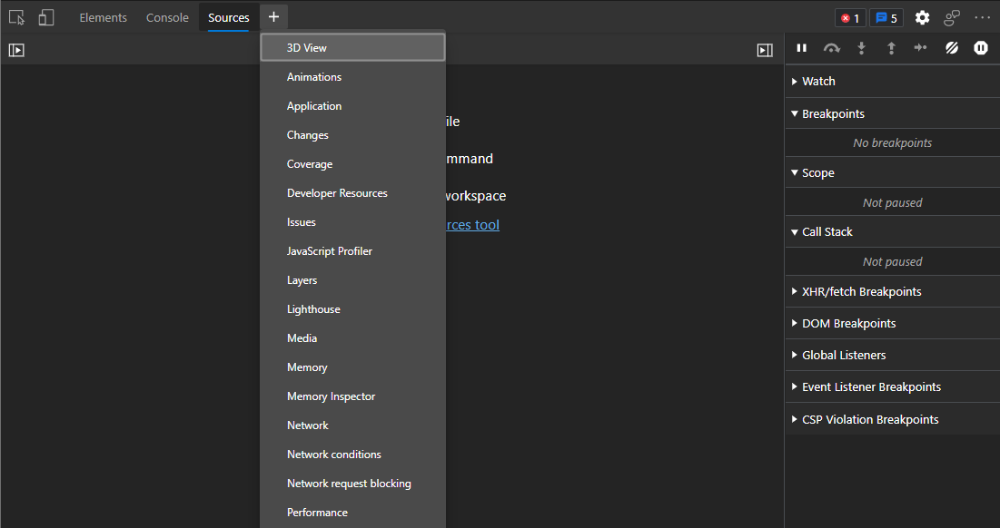

See also:
* [The More Tools menus](../../../about-tools.md#the-more-tools-menus) in _About the list of tools_

<!-- ====================================================================== -->
## Improvements for hovering, selecting, and closing tools

<!-- Title: Improvements to tab interactions -->
<!-- Subtitle: Interactions related to hovering, selecting, and closing tools are more predictable. -->

Tabs for each tool have been reformatted to reduce the chance of accidentally closing a tool.  On each tab in the main toolbar and in the toolbar of the drawer, we added:
*  Spacing around the tab.
*  Spacing around the close (`x`) button in the tab.
*  A background color when hovering over the tab.
*  A tooltip for the close (`x`) button of the tab.
*  Higher contrast for the close (`x`) button of the tab.

For example, when you are in the **Performance** tool and you hover over the **Network** tool's tab, these improvements help prevent accidentally closing the **Network** tool.

Tabs before reformatting:

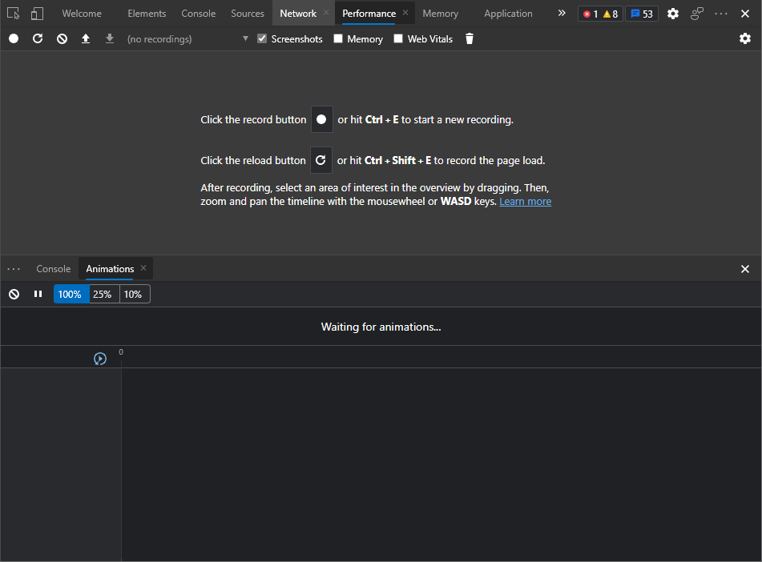

Tabs after reformatting:

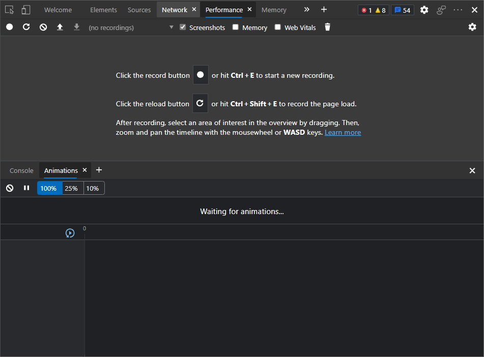

These improvements are especially relevant for users of localized DevTools, in which the tabs may be narrower and easier to accidentally close:

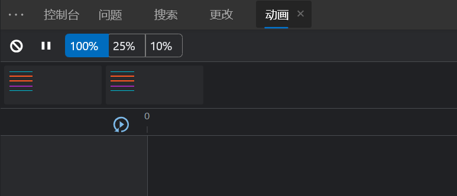

We also made it easier to re-add a tool that you closed by adding a [More Tools menu](#add-tools-quickly-with-the-new-more-tools-button) to the main toolbar and drawer toolbar.

See also:
* [About the list of tools](../../../about-tools.md#the-more-tools-menus)

<!-- ====================================================================== -->
## Better support for screen readers in the Console

<!-- Title: Better screen reader support in the Console -->
<!-- Subtitle: Assistive technologies can now announce autocomplete suggestions and evaluated expressions in the Console. -->

Prior to Microsoft Edge version 92, in the **Console**, assistive technologies such as screen readers didn't announce autocomplete suggestions or the results of evaluated expressions. This has been fixed now.

In the **Console**, screen readers now announce the currently selected autocomplete suggestion:

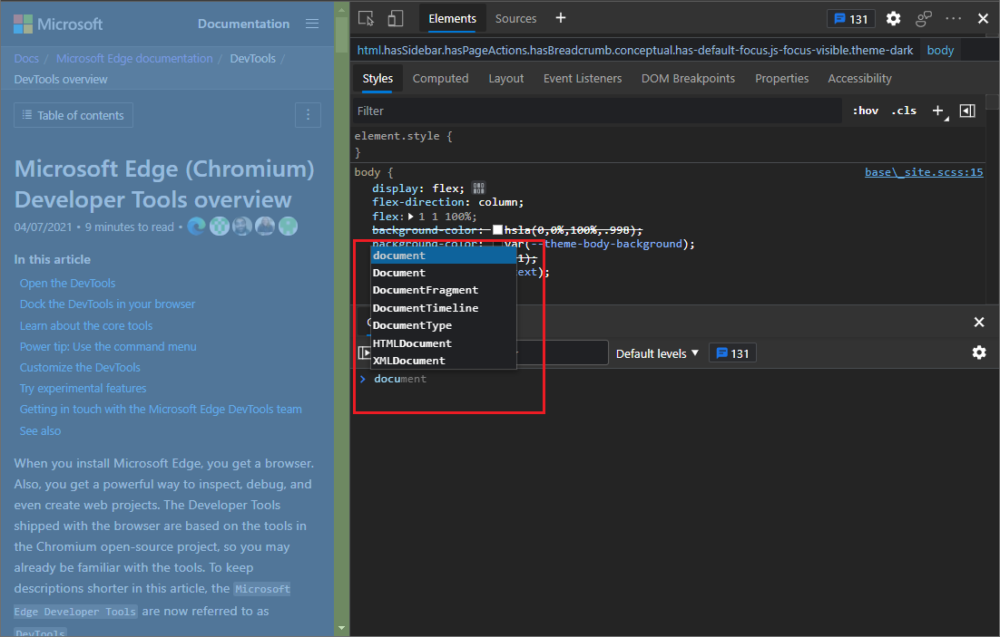

In the **Console**, screen readers now announce the result of an evaluated expression:

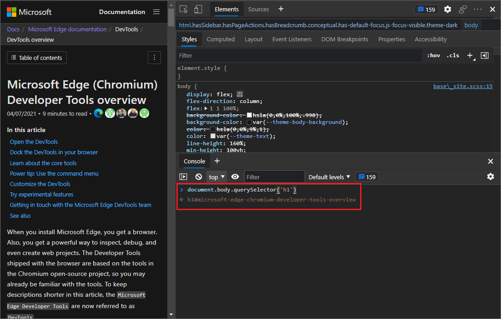

See also:
* [Navigate DevTools with assistive technology](../../../accessibility/navigation.md)

<!-- ====================================================================== -->
## Source Order Viewer

<!--  Title: Source Order Viewer -->
<!--  Subtitle: The new Source Order Viewer displays numbers on the webpage indicating the order of page elements in the source file, independently of how the page sections are positioned by CSS. -->

You can now view the order of source elements overlaid on the rendered webpage, for better accessibility inspection.

The order of content in an HTML document is important for search engine optimization and accessibility.  CSS allows developers to create content that looks different in its on-screen order than the order in the HTML source document.  This is an accessibility problem, because screen-reader users could get a confusing experience.

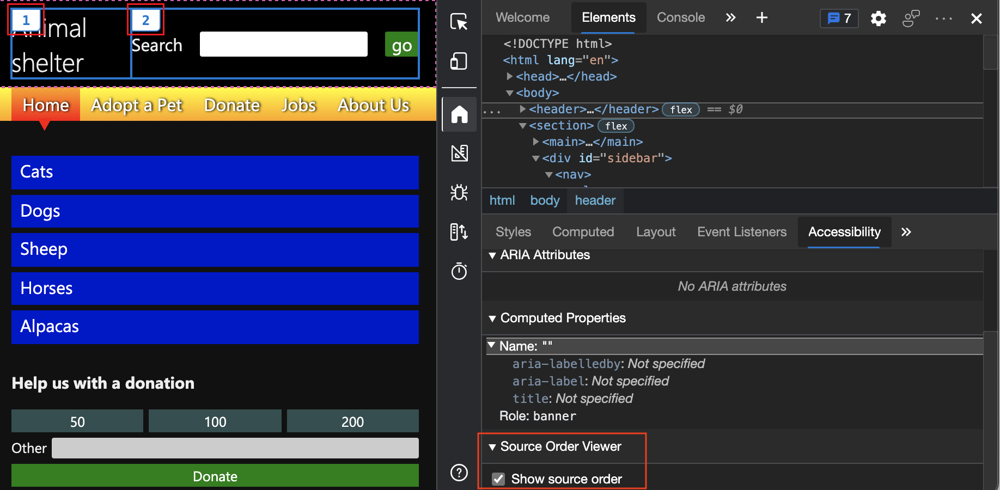

See [Test keyboard support using the Source Order Viewer](../../../accessibility/test-tab-key-source-order-viewer.md).

For the history of this feature in the Chromium open-source project, see Issue [1094406](https://crbug.com/1094406).

<!-- ====================================================================== -->
## User-Agent Client Hints for devices in the Network conditions tab

<!--  Title: User-Agent Client Hints -->
<!--  Subtitle: Access information about a user's browser in an ergonomic way that preserves privacy. -->

User-Agent Client Hints are now applied for devices in the **User agent** field in the **Network conditions** tool.  User-Agent Client Hints are a new expansion to the Client Hints API that enables you to access information about a user's browser in an ergonomic way that preserves privacy.

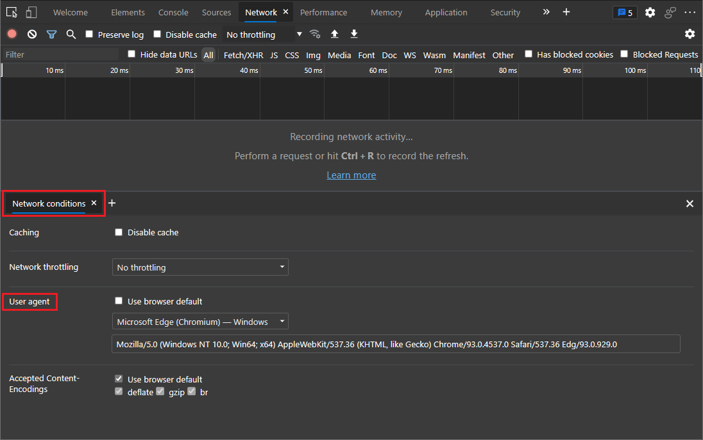

See [User-Agent Client Hints](../../../../web-platform/user-agent-guidance.md#user-agent-client-hints).

For the history of this feature in the Chromium open-source project, see Issue [1174299](https://crbug.com/1174299).

<!-- ====================================================================== -->
## Microsoft Edge Developer Tools for Visual Studio Code version 1.1.8

The [Microsoft Edge Developer Tools for Visual Studio Code](https://marketplace.visualstudio.com/items?itemName=ms-edgedevtools.vscode-edge-devtools) extension version 1.1.8 for Microsoft Visual Studio Code has the following changes since the previous release.  Microsoft Visual Studio Code updates extensions automatically.  To manually update to version 1.1.8, see [Update an extension manually](https://code.visualstudio.com/docs/editor/extension-gallery#_update-an-extension-manually).

You can file issues and contribute to the extension on the [vscode-edge-devtools GitHub repo](https://github.com/microsoft/vscode-edge-devtools).

<!-- ====================================================================== -->
### In-context documentation and UI to make it easier to use the DevTools extension

<!-- Title: In-context documentation and UI make it easier to get started using the Developer Tools extension -->
<!-- Subtitle: The Microsoft Edge Developer Tools for Visual Studio Code extension now presents helpful text, buttons, and links, and opens a documentation page with guidance on how to get started. -->

Version 1.1.8 of the [Microsoft Edge Developer Tools for Visual Studio Code](https://marketplace.visualstudio.com/items?itemName=ms-edgedevtools.vscode-edge-devtools) extension now features a simpler way to start a new instance of Microsoft Edge, by presenting instructions, buttons, links, and a documentation page to guide you.

*  When you select the **Microsoft Edge Tools** button in the **Activity Bar** of Visual Studio Code, the **Microsoft Edge Tools: Targets** panel now presents explanatory text, buttons, and links to guide you, instead of a blank panel.

*  When you open a new instance of Microsoft Edge from within Visual Studio Code, Microsoft Edge now shows a start page that explains how to use the Developer Tools extension, instead of a blank page.

*  The **Microsoft Edge Tools: Targets** panel now has a **Generate launch.json** button and instructions, to help launch your project for debugging in Microsoft Edge.

See also:
* [Microsoft Edge DevTools extension for Visual Studio Code](../../../../visual-studio-code/microsoft-edge-devtools-extension.md)

<!-- ====================================================================== -->
## Announcements from the Chromium project

The following sections announce additional features available in Microsoft Edge that were contributed to the open-source Chromium project.

<!-- ====================================================================== -->
### CSS Grid editor

You can now preview and author CSS Grid layouts, using the new CSS Grid editor.

When an HTML element on your page has `display: grid` or `display: inline-grid` applied to it, a grid icon is displayed next to it in the **Styles** tab. Click the grid icon to display or hide the CSS grid editor. In the CSS grid editor, select any of the icons (such as `justify-content: space-around`) to preview the layout in the rendered page.  Flex layout works similarly.

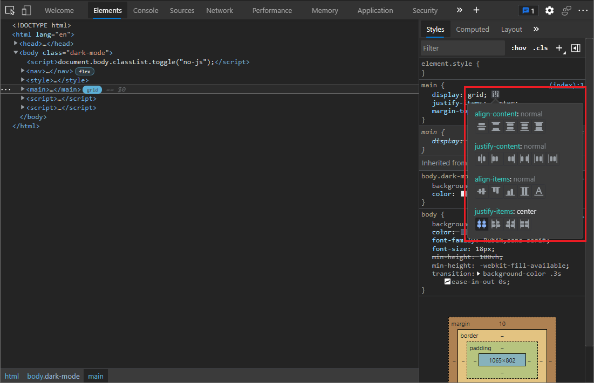

<!-- screenshot uses https://jec.fyi -->

For the history of this feature in the Chromium open-source project, see Issue [1203241](https://crbug.com/1203241).

See also:
* [Inspect CSS Grid](../../../css/grid.md)

<!-- ====================================================================== -->
### Support for const redeclarations in the Console

The Console now supports redeclaration of `const` variables across separate REPL scripts (such as when you run a statement in the Console), in addition to the existing `let` and `class` redeclarations.  This support allows you to experiment with different declarations for `const` variables without refreshing the page.  Previously, DevTools threw a syntax error if you redeclared a `const` binding.

Refer to the example below. `const` redeclaration is supported across separate REPL scripts (refer to variable `a`).  Note that the following scenarios aren't supported, by design:

*  `const` redeclaration of page scripts isn't allowed in REPL scripts.
*  `const` redeclaration within the same REPL script isn't allowed (refer to variable `b`).

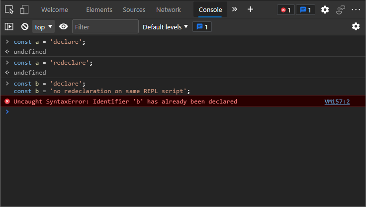

To learn how to run a single REPL script or a multi-line REPL script, see [Run JavaScript in the Console](../../../console/console-javascript.md).

For the history of this feature in the Chromium open-source project, see Issue [1076427](https://crbug.com/1076427).

<!-- ====================================================================== -->
### New shortcut to view iframe details

To quickly view `iframe` details, you can now right-click an `iframe` element in the **Elements** tool, and then select **Show iframe details**.

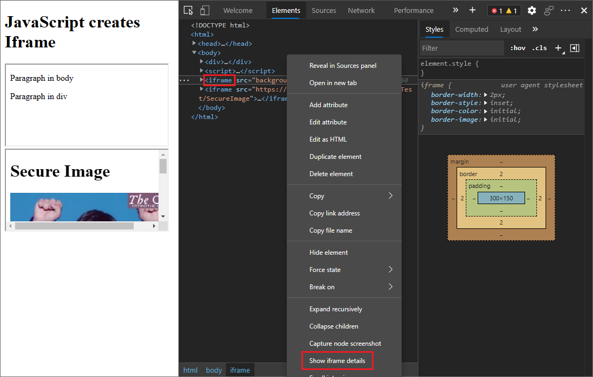

This displays the details about the `iframe` in the **Application** tool.  In the **Application** tool, you can examine document details, security and isolation status, permissions policy, and more, to debug potential issues.

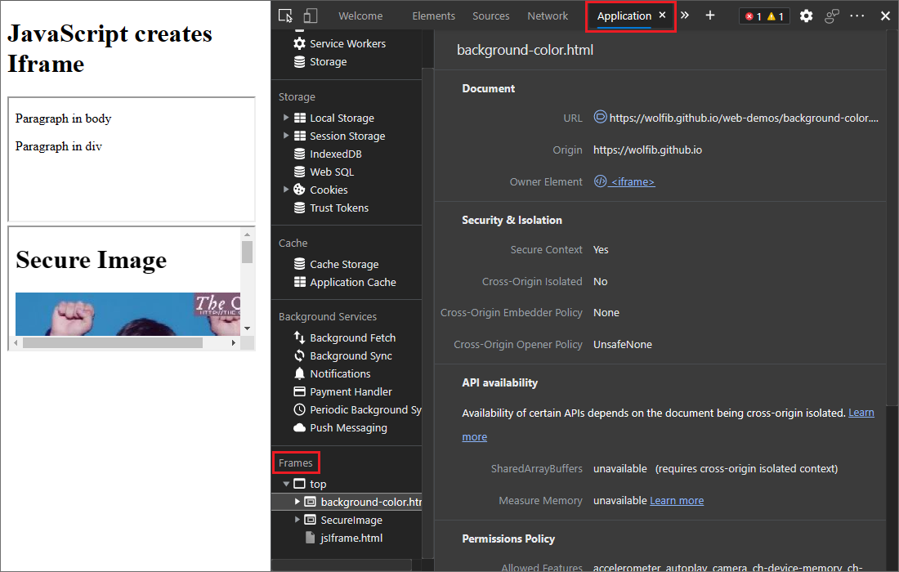

<!-- demo page: https://wolfib.github.io/web-demos/ esp https://wolfib.github.io/web-demos/jsIframe.html -->

See also:
* [Application tool, to manage storage](../../../storage/application-tool.md)
* [Inspect, edit, and debug HTML and CSS with the Elements tool](../../../elements-tool/elements-tool.md)

For the history of this feature in the Chromium open-source project, see Issue [1192084](https://crbug.com/1192084).

<!-- ====================================================================== -->
### Enhanced CORS debugging support

Cross-origin resource sharing (CORS) errors are now surfaced in the **Issues** tool.  There are various potential causes of CORS errors.  Click each issue to expand it and see potential causes and solutions.

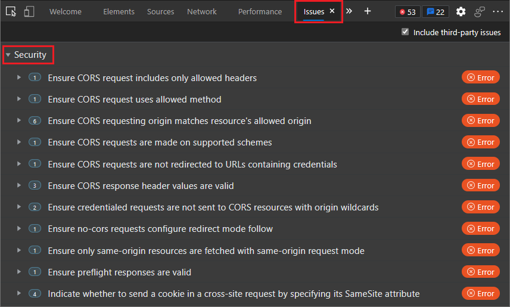

<!-- screenshot uses http://cors-errors.glitch.me -->

See also:
* [Report CORS errors in the Network tool](../../2020/11/devtools.md#report-cors-errors-in-the-network-tool) in _What's New in DevTools (Microsoft Edge 88)_
* [Find and fix problems using the Issues tool](../../../issues/index.md)

For the history of this feature in the Chromium open-source project, see Issue [1141824](https://crbug.com/1141824).

<!-- ====================================================================== -->
### Renamed XHR filter to Fetch\/XHR

In the **Network** tool, the **XHR** filter is now renamed to **Fetch/XHR**. This change makes it clearer that this filter includes both `XMLHttpRequest` and `Fetch` API network requests.

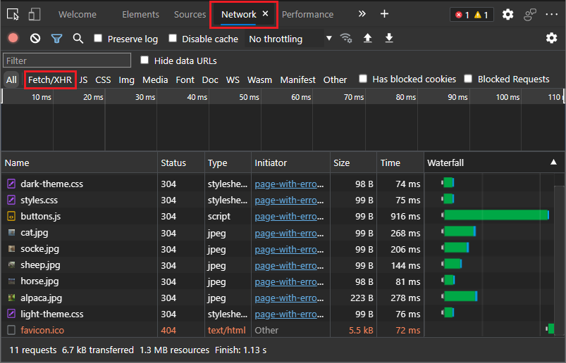

See also:
* [Inspect network activity](../../../network/index.md)
* [XMLHttpRequest spec](https://xhr.spec.whatwg.org)
* [Fetch spec](https://fetch.spec.whatwg.org)

For the history of this feature in the Chromium open-source project, see Issue [1201398](https://crbug.com/1201398).

<!-- ====================================================================== -->
### Filter Wasm resource type in the Network tool

In the **Network** tool, you can now select the new **Wasm** filter to filter the WebAssembly network requests.

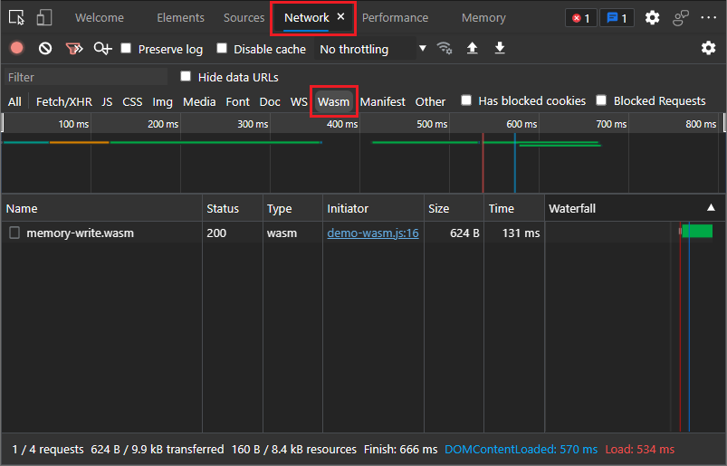
<!-- screenshot uses http://memory-inspector.glitch.me/demo-wasm.html -->

See also:
* [Filter resources](../../../network/index.md#filter-resources) in _Inspect network activity_

For the history of this feature in the Chromium open-source project, see Issue [1103638](https://crbug.com/1103638).

<!-- ====================================================================== -->
### Compute Intersections are now included in the Performance tool

In the **Performance** tool, DevTools now displays **Compute Intersections** in the flame chart. These changes help you identify intersection observers events and debug the potential performance overhead of intersection observers.

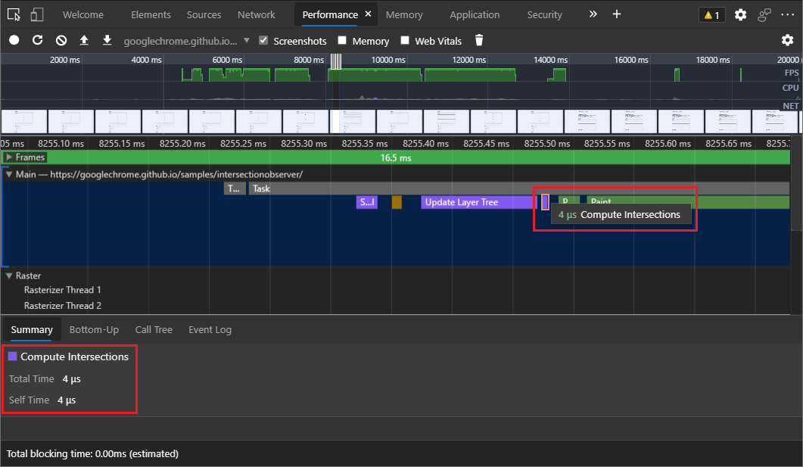
<!-- screenshot uses https://googlechrome.github.io/samples/intersectionobserver -->

See also:
* [Trust is good, observation is better: Intersection Observer v2](https://web.dev/intersectionobserver-v2)
* [Analyze a performance recording](../../../evaluate-performance/reference.md#analyze-a-performance-recording)

For the history of this feature in the Chromium open-source project, see Issue [1199137](https://crbug.com/1199137).

<!-- ====================================================================== -->
> [!NOTE]
> Portions of this page are modifications based on work created and [shared by Google](https://developers.google.com/terms/site-policies) and used according to terms described in the [Creative Commons Attribution 4.0 International License](https://creativecommons.org/licenses/by/4.0).
> The original page is found [here](https://developer.chrome.com/blog/new-in-devtools-92) and is authored by [Jecelyn Yeen](https://developers.google.com/web/resources/contributors#jecelynyeen) (Developer advocate, Chrome DevTools).

This work is licensed under a [Creative Commons Attribution 4.0 International License](https://creativecommons.org/licenses/by/4.0).
