# What's New in DevTools (Microsoft Edge 93)

[!INCLUDE [Microsoft Edge team note for top of What's New](../../includes/edge-whats-new-note.md)]

<!-- ====================================================================== -->
## Apply themes from Visual Studio Code to DevTools

<!-- Title: Apply themes from Visual Studio Code to DevTools -->
<!-- Subtitle: You can now use some of the most popular color themes from Visual Studio Code, such as Monokai and Solarized Dark, in Microsoft Edge DevTools. -->

In addition to the existing light and dark themes, Microsoft Edge DevTools now supports some of the most popular color themes from Visual Studio Code.  To select a color theme, click the DevTools **Settings** () button, and then select a theme from the **Theme** dropdown list.

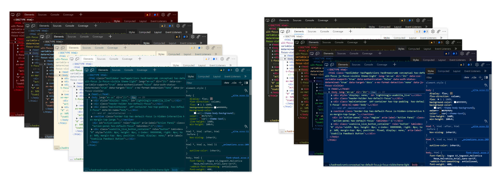

The supported Visual Studio Code themes are:

Light themes:
*  Solarized Light
*  Quiet Light

Dark themes:
*  Abyss
*  Kimbie Dark
*  Monokai
*  Monokai Dimmed
*  Solarized Dark
*  Red
*  Tomorrow Night Blue

See [Apply color themes to DevTools](../../../customize/theme.md).

<!-- ====================================================================== -->
## Debug DOM node memory leaks with the new Detached Elements tool

<!-- Title: Introducing the Detached Elements tool -->
<!-- Subtitle: Use the Detached Elements tool to find and fix DOM node memory leaks. -->

A DOM node is considered "detached" when it is no longer attached to any element of the DOM but is still being retained in memory by Microsoft Edge. The browser cannot garbage-collect the element, because some JavaScript is still referencing the element even though it's no longer on the page or a part of the DOM.

The new **Detached Elements** tool finds all of the detached elements on your page and displays them. You can expand and collapse a detached element to see the parent and child nodes that are also being retained. You can trigger the browser's garbage collection by selecting **Collect garbage** and validate that you have a memory leak when a detached element cannot be garbage-collected. Finally, you can jump into JavaScript that's referencing the detached element by taking a heap snapshot with the **Analyze** button.

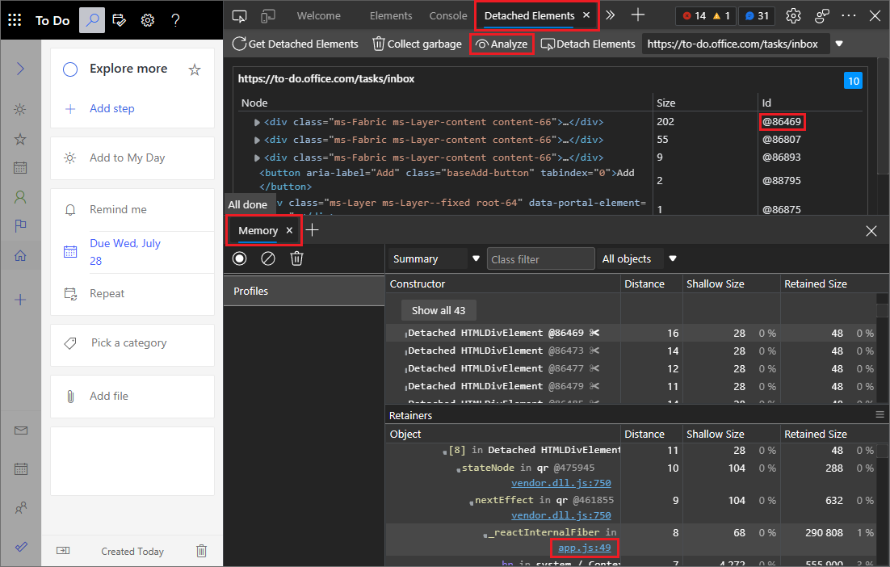

Update: This feature has been released and is no longer experimental.<!-- To turn on this experiment, go to **Settings** > **Experiments** and select the checkbox next to **Detached Elements**. -->

See also:
* [Debug DOM memory leaks with the Detached Elements tool](../../../memory-problems/dom-leaks.md)

<!-- ====================================================================== -->
## The Visual Studio Code debugger now integrates with the DevTools extension

<!-- Title: While debugging, launch the DevTools extension by selecting the Inspect button -->
<!-- Subtitle: Microsoft Edge DevTools for Visual Studio Code now integrates seamlessly with the JavaScript debugging workflow in the editor. -->

If you use JavaScript debugging in Visual Studio Code, you can now launch the **Microsoft Edge Developer Tools for Visual Studio Code** extension by selecting the **Inspect** button.

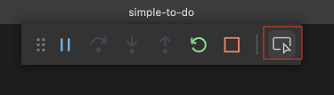

This feature integrates DOM and CSS debugging with JavaScript debugging in Visual Studio Code. If you don't have the DevTools extension installed, when you select the **Inspect** button, Visual Studio Code prompts you to install the extension.

Other new features are:
*  The tools refresh automatically when you switch between different debugging targets.
*  Several bug fixes.
*  More detailed documentation of the extension.

For more details about improvements and fixes, check the [changelog file](https://github.com/microsoft/vscode-edge-devtools/blob/main/CHANGELOG.md) in the `vscode-edge-devtools` repo.

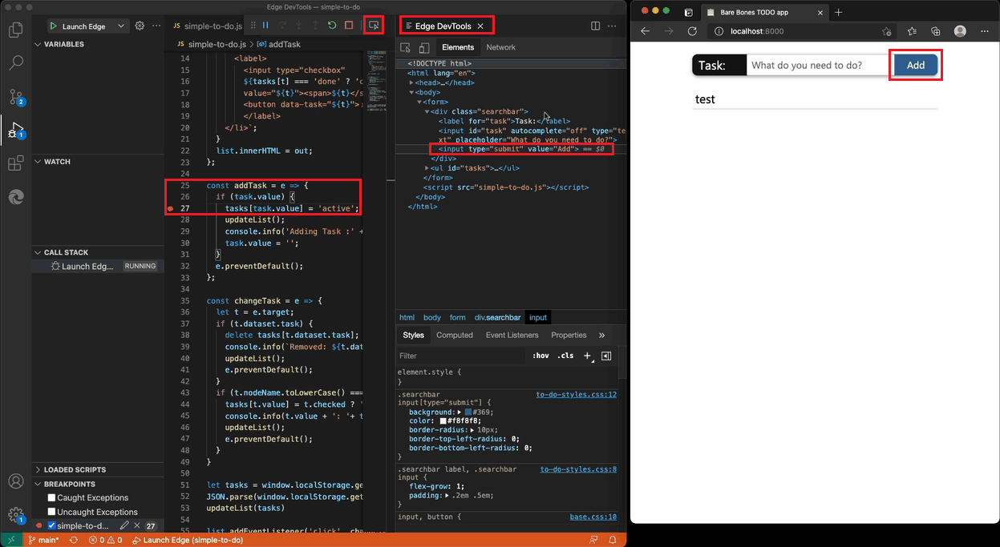

See also:
* [Integration with Visual Studio Code debugging](../../../../visual-studio-code/microsoft-edge-devtools-extension/debugging-a-webpage.md).

Get the [Microsoft Edge Developer Tools for Visual Studio Code extension](https://marketplace.visualstudio.com/items?itemName=ms-edgedevtools.vscode-edge-devtools).  Microsoft Visual Studio Code updates extensions automatically; to update this extension manually instead, see [Update an extension manually](https://code.visualstudio.com/docs/editor/extension-gallery#_update-an-extension-manually).

You can file issues and contribute to the extension on the [vscode-edge-devtools GitHub repo](https://github.com/microsoft/vscode-edge-devtools).

<!-- ====================================================================== -->
## New Fluent UI icons for DevTools

<!-- Title: New look for buttons and menus in Microsoft Edge DevTools -->
<!-- Subtitle: DevTools has adopted Fluent UI, giving it a more modern look that better aligns with the rest of the Microsoft Edge browser. -->

Microsoft Edge DevTools has adopted [Fluent UI](https://developer.microsoft.com/fluentui), giving buttons and menus a more modern look that better aligns with the rest of the Microsoft Edge browser.

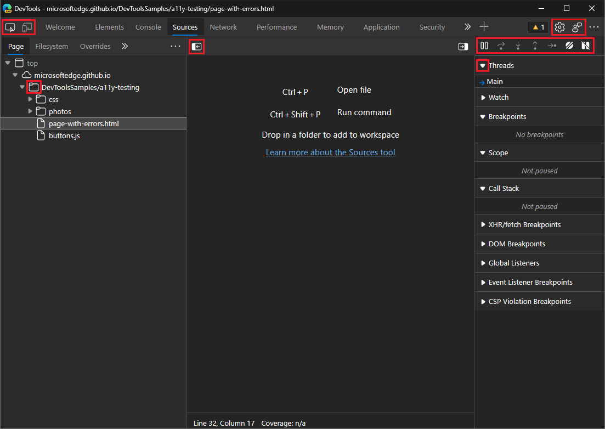

<!-- ====================================================================== -->
## Change the DevTools display language directly from Settings

<!-- Title: DevTools Settings now includes display language -->
<!-- Subtitle: You can now skip the browser settings and change the DevTools display language directly within DevTools Settings. -->

Previously, to change the display language in DevTools, you had to change the browser language.  Now you can easily switch the display language in DevTools **Settings**, without having to change your browser settings.  To do this, open **Settings**, and then in **Preferences**, select a language from the **Language** dropdown list.

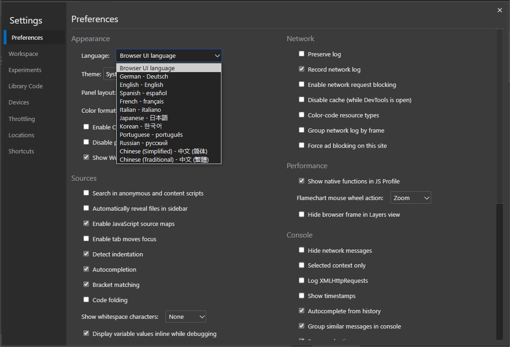

By default, DevTools matches your browser's display language.  See [Change DevTools language settings](../../../customize/localization.md).

For the history of this feature in the Chromium open-source project, see Issue [2882756](https://chromium-review.googlesource.com/c/devtools/devtools-frontend/+/2882756).

<!-- ====================================================================== -->
## Copy a declaration in the Styles pane for CSS-in-JS libraries

<!-- Title: Better support for CSS-in-JS libraries -->
<!-- Subtitle: Copy a single declaration or all declarations for a style rule from the Styles pane, formatted for JavaScript. -->

Previously, when using CSS-in-JS libraries, you were not able to copy CSS declarations (a CSS property and value) formatted for JavaScript. You would have to edit the copied CSS to match JavaScript's syntax.

Now in Microsoft Edge version 93, you can copy a single CSS declaration or all the declarations in a style rule and paste them directly into a JavaScript file without having syntax issues. To try this feature:

1. In the **Styles** pane of the **Elements** tool, right-click a declaration in a style rule.

1. Select **Copy declaration as JS** or **Copy all declarations as JS**.

1. Paste the copied CSS into a JavaScript file in your text editor, such as Visual Studio Code.  For example: `'--more-link': 'lime'`.

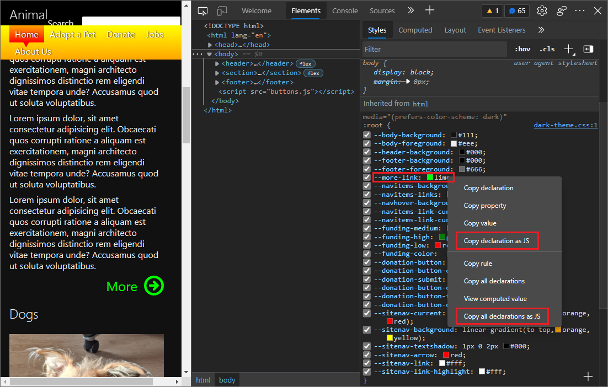

To learn more about viewing and changing CSS, see [CSS features reference](../../../css/reference.md).

<!-- ====================================================================== -->
## Easier customization of User-Agent Client Hints

<!-- Title: Send as many (or as few) Client Hints as you want -->
<!-- Subtitle: Updated UI for User-Agent Client Hints in Emulated Devices settings and in the Network conditions tool. -->

User-Agent Client Hints makes browser information more accessible than a semicolon-delimited User-Agent string, and improves site compatibility.  Initially, User-Agent Client Hints were time-consuming to test and debug.  There was less control over the client hints, and client hints had to be filled in properly for the form to work.

In this release, we redesigned the debugging experience so you can easily modify User-Agent Client Hints through a UI with multiple separate fields and controls.  Also, you can now test your custom User-Agent Client Hints and a User-Agent string simultaneously.  You can now define User-Agent Client Hints for a custom device in **Settings** or in the **Network conditions** tool.

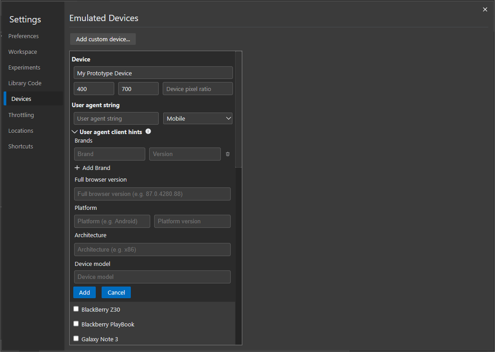

For more information about defining hints in **Settings**, see [Set user agent client hints](../../../device-mode/index.md#set-user-agent-client-hints).

You can also override User-Agent Client Hints for the current page by using the **Network conditions** tool.

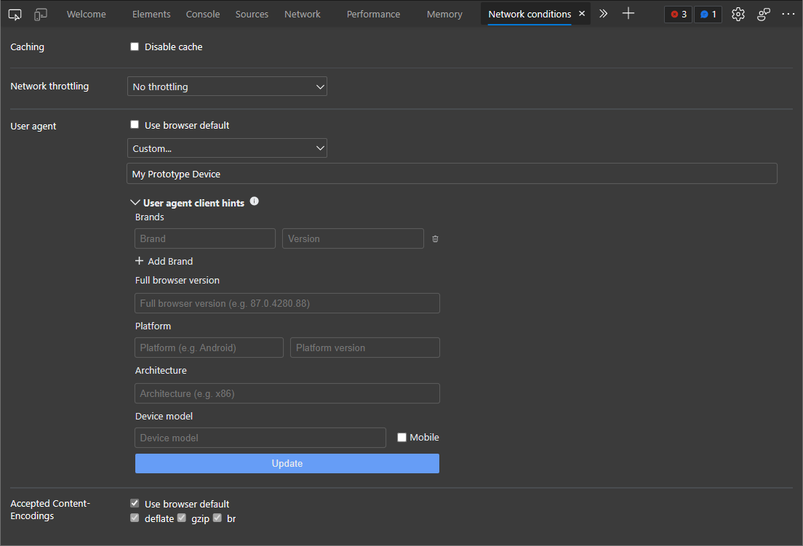

For more information about defining hints in the **Network conditions** tool, see [Set user agent client hints](../../../network/reference.md#set-user-agent-client-hints).

For the history of this feature in the Chromium open-source project, see Issue [1174299](https://bugs.chromium.org/p/chromium/issues/detail?id=1174299).

<!-- ====================================================================== -->
## Screen readers now announce errors, warnings, and issues in toolbar and Console

<!-- Title: Better support for errors, warnings, and issues with assistive technology -->
<!-- Subtitle: Screen readers now correctly announce the number and the type of notification for errors, warnings, and issues in the DevTools toolbar. -->

Previously, users of screen readers would only hear the number of errors, warnings, or issues announced in the DevTools toolbar.  The additional information of what type of notification was being announced wasn't included, such as "Error", "Warning", or "Issue". For example, if the DevTools reported 3 errors, screen readers would just announce "3".

Now in Microsoft Edge version 93, screen readers correctly announce the type and number of notifications; errors, warnings, or issues.  For example, if DevTools reports 3 errors and 5 warnings, screen readers now announce "3 errors, 5 warnings".  This fix has been applied to both the notifications in the DevTools toolbar and in the Console.

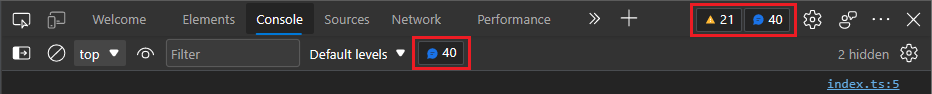

<!-- It'd be good to have a video of this a11y fix where the text that the screen reader announces is displayed -->

For information about debugging Console errors, see [Fixing JavaScript errors that are reported in the Console](../../../console/console-debug-javascript.md).  For information about issues found by DevTools and improvements you can make to a webpage, see [Find and fix problems using the Issues tool](../../../issues/index.md).

For the history of this feature in the Chromium open-source project, see Issue [1223208](https://bugs.chromium.org/p/chromium/issues/detail?id=1223208).

<!-- ====================================================================== -->
## Copy as PowerShell in the Network tool now includes cookies

<!-- Title: Generate PowerShell commands for network requests in the Network tool -->
<!-- Subtitle: The Copy as PowerShell context menu option now correctly sets the user-agent string and cookies when generating PowerShell network requests. -->

Previously, in the **Network** tool, the **Copy** > **Copy as PowerShell** context menu option didn't include cookies when generating a PowerShell command for a given network request in the Network Activity Log. This meant that the generated PowerShell command couldn't successfully make the same network request if cookies were required.

Now in Microsoft Edge version 93, the **Copy as PowerShell** context menu option correctly sets the User-Agent string and cookies that were observed by DevTools.  The generated PowerShell command can now successfully make the same network request that was observed by DevTools, even to servers that depend on cookies.

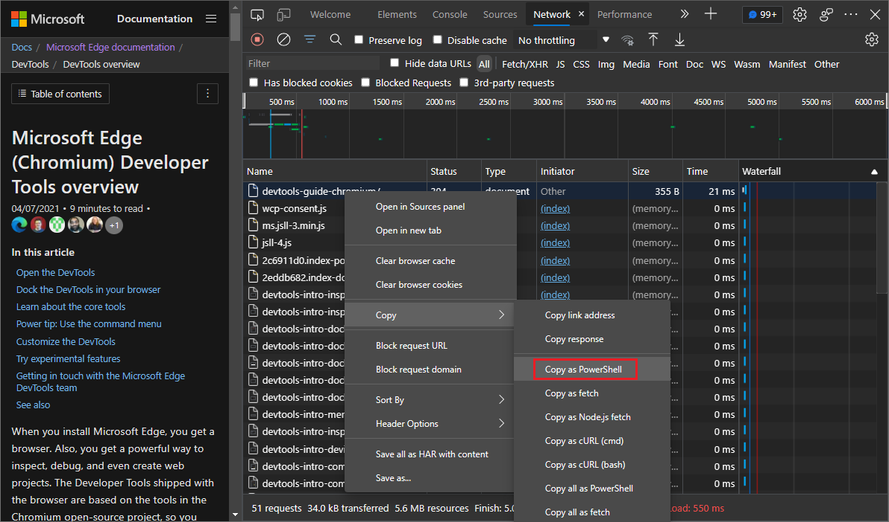

For more information about the Network Activity Log, see [Network features reference](../../../network/reference.md).

For the history of this feature, see Issue [932971](https://bugs.chromium.org/p/chromium/issues/detail?id=932971).

<!-- ====================================================================== -->
> [!NOTE]
> Portions of this page are modifications based on work created and [shared by Google](https://developers.google.com/terms/site-policies) and used according to terms described in the [Creative Commons Attribution 4.0 International License](https://creativecommons.org/licenses/by/4.0).
> The original page is found [here](https://developer.chrome.com/blog/new-in-devtools-93) and is authored by [Jecelyn Yeen](https://developers.google.com/web/resources/contributors#jecelynyeen) (Developer advocate, Chrome DevTools).

This work is licensed under a [Creative Commons Attribution 4.0 International License](https://creativecommons.org/licenses/by/4.0).
