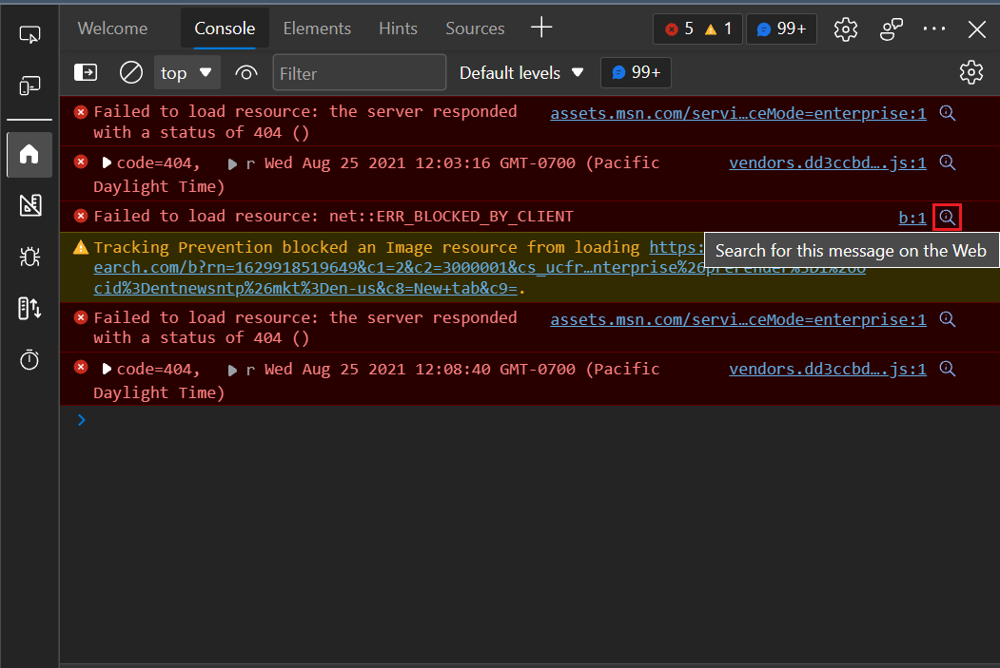
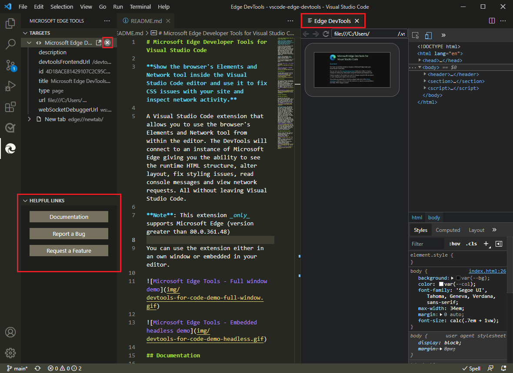
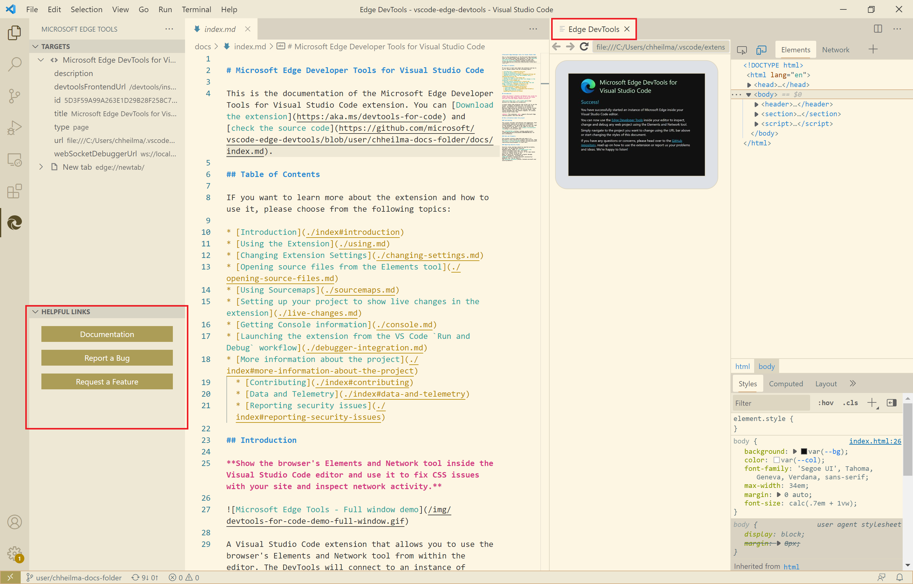
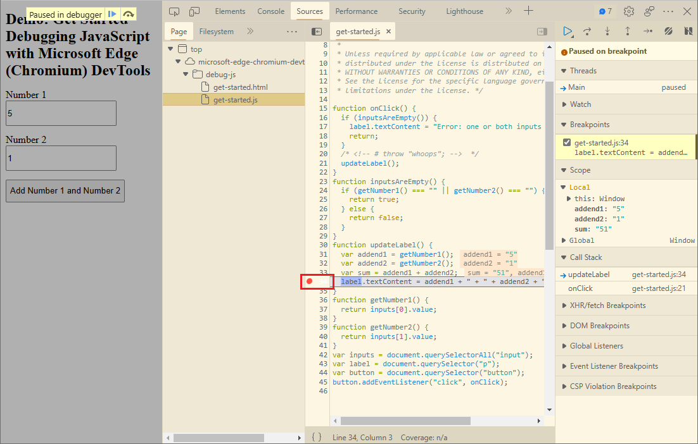
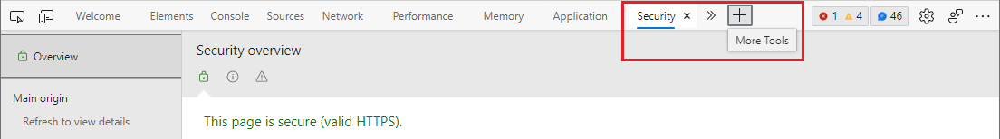

# What's New in DevTools (Microsoft Edge 94)

[!INCLUDE [Microsoft Edge team note for top of What's New](../../includes/edge-whats-new-note.md)]

<!-- ====================================================================== -->
## Search for Console errors on the web

<!-- Title: Quickly debug console errors with our new integrated search feature -->
<!-- Subtitle: Now you can quickly search for console errors directly from the Console. -->

Search the web for your **Console** errors, from within DevTools.  In the **Console**, many errors now have a **Search for this message on the Web** button, shown as a magnifying glass.  When you select the **Search for this message on the Web** button, a new tab opens in the browser and shows search results for the error:

See [Search the web for a Console error message string](../../../console/index.md#search-the-web-for-a-console-error-message-string).

<!-- ====================================================================== -->
## DevTools extension for Visual Studio Code includes the latest tools, theme support, and helpful links

<!-- Title: Microsoft Edge DevTools for Visual Studio Code now supports themes and uses the most recent codebase -->
<!-- Subtitle: The Microsoft Edge DevTools extension for Visual Studio Code now uses the same version of the Developer Tools as your Microsoft Edge browser. We also added ways to learn more and for you to tell us what we could do better from within Visual Studio Code. -->

In the latest version of the Microsoft Edge DevTools extension for Visual Studio Code, we released the following updates or new features:
*  Shares the same codebase that's used for the browser-based DevTools.
*  Supports themes that ship with Visual Studio Code.
*  Adds a **Helpful Links** section in the **Microsoft Edge Tools** sidebar, with buttons for **Documentation**, **Report a Bug**, and **Request a Feature**.
*  Adds a **Close instance** (`X`) button in the **Microsoft Edge Tools** > **Targets** pane, to close the browser that was opened by the extension.
*  Adds support for JavaScript Debugger connections to remote workspaces.

The extension running inside Visual Studio Code, matching the dark theme of Visual Studio Code, and a new Helpful Links sidebar:

Light themes from Visual Studio Code are also supported:

See also:
* [Microsoft Edge DevTools extension for Visual Studio Code](../../../../visual-studio-code/microsoft-edge-devtools-extension.md)

<!-- ====================================================================== -->
## Breakpoint icons are now displayed when using Visual Studio Code themes

<!-- Title: Breakpoint icons are now displayed when using themes from Visual Studio Code -->
<!-- Subtitle: Setting, removing, and viewing breakpoints is now easier in Microsoft Edge. -->

In Microsoft Edge version 93, you can apply themes used in Visual Studio Code to the DevTools extension.  For more information on this feature, see [Apply color themes to DevTools](../../../customize/theme.md).

Previously, when using a theme from Visual Studio Code in DevTools, breakpoint icons on the left margin of the code in the **Sources** tool weren't displayed.  Starting in Microsoft Edge 94, breakpoint icons are now displayed as expected:

See also:
* [Pause your code with breakpoints](../../../javascript/breakpoints.md)

<!-- ====================================================================== -->
## Navigate to the More Tools button with the keyboard

<!-- Title: Use the arrow keys to navigate to the + button to open more tools -->
<!-- Subtitle: To open more tools, we have improved keyboard accessibility using the arrow keys on the main DevTools toolbar. -->

Previously, you couldn't navigate to the **More Tools** (`+`) button in DevTools using the arrow keys on the keyboard when the toolbar had focus.  When using the arrow keys, after reaching the last tool in the toolbar, the focus looped back to the first tool, or the **More tabs** menu was displayed.

Starting with Microsoft Edge version 93, the **More tabs** (`>>`) button and the **More Tools** button can be selected by using the arrow keys, when focus is on the toolbar:

See also:
* [Keyboard shortcuts](../../../shortcuts/index.md)

<!-- ====================================================================== -->
> [!NOTE]
> Portions of this page are modifications based on work created and [shared by Google](https://developers.google.com/terms/site-policies) and used according to terms described in the [Creative Commons Attribution 4.0 International License](https://creativecommons.org/licenses/by/4.0).
> The original page is found [here](https://developer.chrome.com/blog/new-in-devtools-94) and is authored by [Jecelyn Yeen](https://developers.google.com/web/resources/contributors#jecelynyeen) (Developer advocate, Chrome DevTools).

This work is licensed under a [Creative Commons Attribution 4.0 International License](https://creativecommons.org/licenses/by/4.0).
