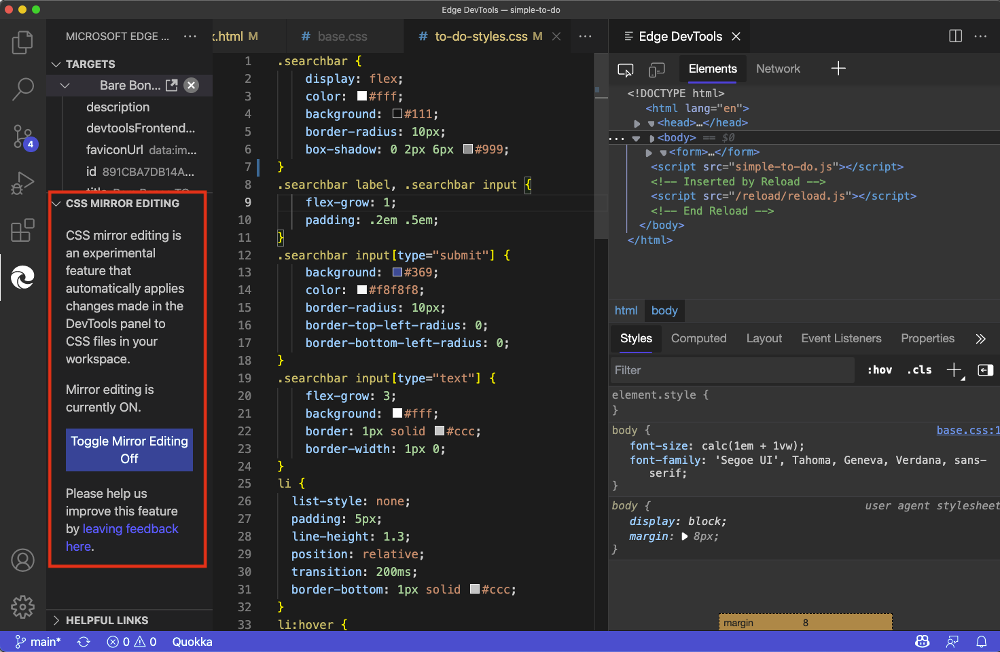
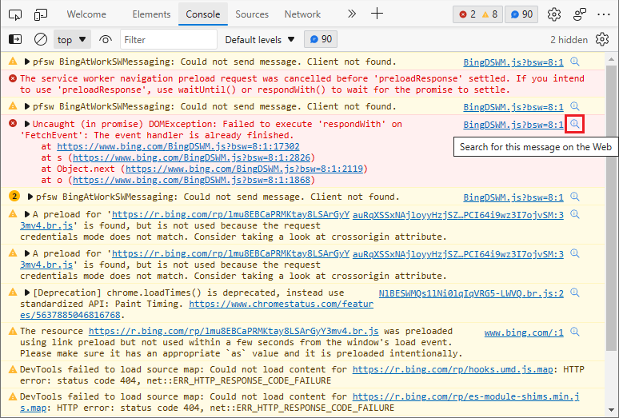
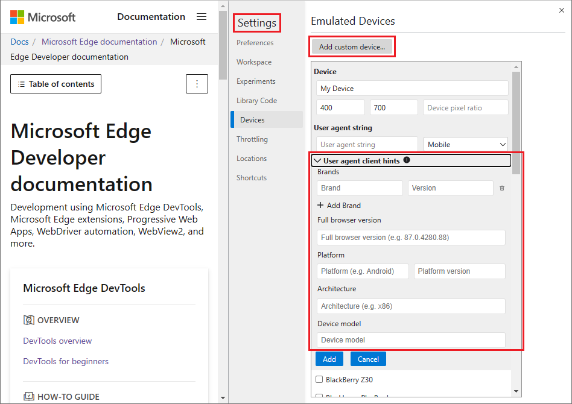
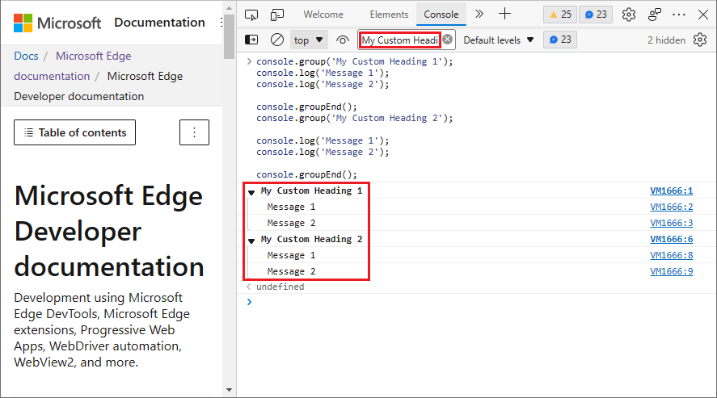
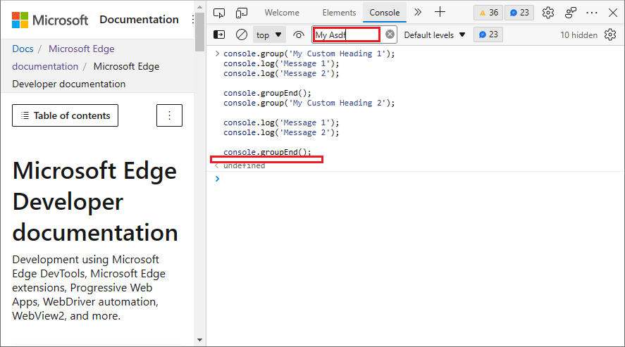
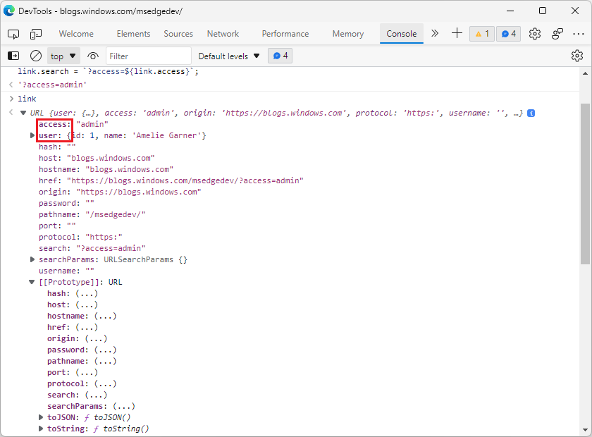
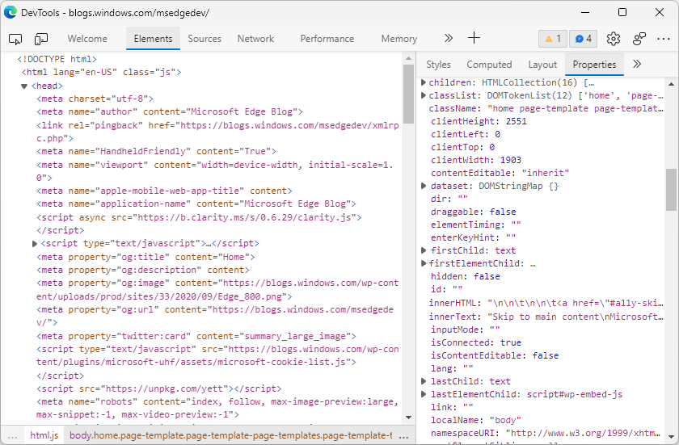
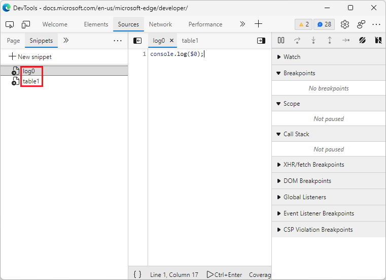
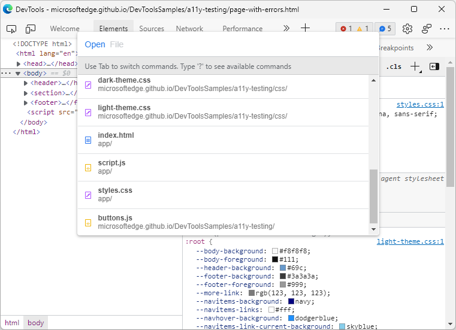

# What's New in DevTools (Microsoft Edge 95)

[!INCLUDE [Microsoft Edge team note for top of What's New](../../includes/edge-whats-new-note.md)]


<!-- ====================================================================== -->
## Sync live changes from the Styles tool in the Visual Studio Code extension

<!-- Title: CSS Mirror Editing in Visual Studio Code -->
<!-- Subtitle: Changes in the CSS Styles editor now show up in your CSS files inside Visual Studio Code. -->

The [Microsoft Edge DevTools extension for Visual Studio Code](https://marketplace.visualstudio.com/items?itemName=ms-edgedevtools.vscode-edge-devtools) now features an experiment called **CSS Mirror Editing**.  Using this feature, you can use the **Styles** tool to adjust your CSS, and the changes you apply are automatically added to the CSS source files in the Visual Studio Code editor.  You can toggle this functionality on and off.

For more information, see [Update .css files from within the Styles tab (CSS mirror editing)](../../../../visual-studio-code/microsoft-edge-devtools-extension/css-mirror-editing-styles-tab.md).

To provide feedback, in Visual Studio Code, in the **Activity Bar**, click **Microsoft Edge Tools**, and then in the **CSS Mirror Editing** section, click the **leaving feedback here** link.




<!-- ====================================================================== -->
## All error and warning messages in the Console now have a Search Web icon

<!-- Title: All console errors and warnings now have a Search Web icon -->
<!-- Subtitle: You can now search for any of your console errors and warnings right from DevTools. -->

The **Search for this message on the Web** icon is now available for all errors and warnings in the **Console**.  Previously, this icon only appeared for some of the common errors and warnings.  Now the icon has been added on the remaining errors and warnings.  Click the **Search for this message on the Web** icon to search the web using the relevant error or warning string.

For more information, see [Search for Console errors on the web](../09/devtools.md#search-for-console-errors-on-the-web).
<!-- todo: cover in regular doc -->



See also:
* [Search the web for a Console error message string](../../../console/index.md#search-the-web-for-a-console-error-message-string) in _Console overview_.


<!-- ====================================================================== -->
## Improved keyboard access for defining User-Agent Client Hints

<!-- Title: Improved keyboard access when navigating to User agent client hints in Settings -->
<!-- Subtitle: When adding a custom device to emulate in DevTools, you can now expand the User agent client hints section more easily. -->

Starting with [Microsoft Edge version 92](../05/devtools.md#user-agent-client-hints-for-devices-in-the-network-conditions-tab), you can specify User-Agent Client Hints.  You can specify User-Agent Client Hints in either of two places:

*  [When defining the user agent string in the Network conditions tool](../../../device-mode/override-user-agent.md).
*  [When adding a custom device to emulate in Settings](../../../device-mode/index.md#add-a-custom-mobile-device).

In Microsoft Edge prior to version 95, when adding a custom device to emulate from the **Devices** section of **Settings**, selecting the **User agent client hints** button with the keyboard caused the incorrect UI item to be activated.  Instead of expanding the **User agent client hints** section for you to fill it in, it selected the **Add** button.  The device you were starting to define was immediately added, using empty fields in the **User agent client hints** section.

In Microsoft Edge version 95, this issue has been fixed.  Selecting the **User agent client hints** button by using the keyboard now expands a form, in which you can specify client hints for the custom device.

To learn more about User-Agent Client Hints, see [Detecting Microsoft Edge from your website](../../../../web-platform/user-agent-guidance.md#user-agent-client-hints).



To view the history of this feature in the Chromium open-source project, see [Issue 1243827: User agent client hints form accessibility](https://bugs.chromium.org/p/chromium/issues/detail?id=1243827).


<!-- ====================================================================== -->
## Console filters now display grouped messages if the filter matches the group title

<!-- Title: Improved filtering for grouped messages in the Console -->
<!-- Subtitle: Filters in the Console is now more intuitive, displaying grouped messages only when the filter matches the group label. -->

You can use `console.group()` to label a group of messages and provide some organization for Console messages.  In earlier versions of Microsoft Edge, there were several problems when trying to filter grouped messages in the Console.  When filtering to a group label, the Console wouldn't display individual messages inside the group.  Also, filtering wouldn't hide group labels, even if the label didn't match the filter.

In Microsoft Edge version 95, these problems have been fixed.  Filtering to a label now displays the group label and the individual messages inside of the group.  When the filter doesn't match the group label, the entire group is hidden.

When the filter string matches a group label, the group and its members are displayed:



When the filter string doesn't match a group label, neither the group nor its members are displayed:



See also:
* [group](../../../../devtools-guide-chromium/console/api.md#group) in _Console object API Reference_.

To view the history of this feature in the Chromium open-source project, see [Issue 363796: ☂ Console filter inappropriately hides grouped content and doesn't hide group titles](https://bugs.chromium.org/p/chromium/issues/detail?id=363796).


<!-- ====================================================================== -->
## Announcements from the Chromium project

The following are some of the additional features that are available in Microsoft Edge version 95 that were contributed to the open-source Chromium project.


<!-- ====================================================================== -->
## Improved the display of properties

<!-- Chromium What's New entry: [Improved the display of properties](https://developer.chrome.com/blog/new-in-devtools-95/#properties) at _What's New in DevTools (Chrome 95)_. -->

DevTools improves the display of properties by:
*  Always bolding and sorting own properties first, in the **Console**, in the **Sources** tool, and in the **Properties** tab in the **Elements** tool.  (An _own property_ is a property that's defined directly on the object.)
*  Flattening the properties display in the **Properties** pane.

For example, the snippet below creates an [URL](https://developer.mozilla.org/docs/Web/API/URL) object `link` with two own properties: `user` and `access`, and then updates the value of an inherited property, `search`:

```javascript
const link = new URL('https://blogs.windows.com/msedgedev/');
link.user = { id: 1, name: 'Amelie Garner' };
link.access = 'admin';
link.search = `?access=${link.access}`;
```

After entering the above code in the **Console**, try logging `link`.  Own properties are now bold and are first in the sort order.  These changes make it easier to spot custom properties, especially for [Web APIs](https://developer.mozilla.org/docs/Web/API) (such as `URL`) that have many inherited properties:



In the **Properties** pane of the **Elements** tool, the list of properties is now flattened for a better experience when debugging DOM properties, especially for [Web components](https://www.webcomponents.org/introduction):



See also:
* [Inspect, edit, and debug HTML and CSS with the Elements tool](../../../elements-tool/elements-tool.md)
<!-- todo: link to an Elements > Properties ui doc'n?  try FTS repo **Properties** - not really found -->

For the history of this feature, see Chromium issues [1076820](https://crbug.com/1076820) and [1119900](https://crbug.com/1119900).


<!-- ====================================================================== -->
## Snippets are now sorted in the Sources panel

<!-- Chromium What's New entry: [Sort snippets in the Sources panel](https://developer.chrome.com/blog/new-in-devtools-95/#snippets) at _What's New in DevTools (Chrome 95)_. -->

In the **Snippets** tab of the **Sources** tool, previously, the snippets weren't sorted.  Snippets are now sorted alphabetically:



See also:
* [Run snippets of JavaScript on any webpage](../../../javascript/snippets.md)
* [Chrome 85 - What's New in DevTools](https://youtu.be/NOal2gTzftI?t=176) - video.

For the history of this feature, see Chromium issue: [1243976](https://crbug.com/1243976).


<!-- ====================================================================== -->
## Improved UI for DevTools command menu

<!-- Chromium What's New entry: [Improved UI for DevTools command menu](https://developer.chrome.com/blog/new-in-devtools-95/#command-menu) at _What's New in DevTools (Chrome 95)_. -->

The **Command Menu** has been enhanced to make it easier to search for a file.  When you press **Ctrl+P** in Windows and Linux or **Command+P** in macOS, the **Command Menu** now displays file names in bold, along with an icon indicating the file type:



See also:
* [Command Menu](../../../command-menu/index.md)

For the history of this feature, see Chromium issue [1201997](https://crbug.com/1201997). 


<!-- ====================================================================== -->
> [!NOTE]
> The "Announcements from the Chromium project" section of this page is a modification based on work that is created and shared by Google per [Site Policies](https://developers.google.com/terms/site-policies), and is used according to terms described in the [Creative Commons Attribution 4.0 International License](https://creativecommons.org/licenses/by/4.0).  The original page for the Announcements from the Chromium project is [What's New in DevTools (Chrome 95)](https://developer.chrome.com/blog/new-in-devtools-95), authored by [Jecelyn Yeen](https://developers.google.com/web/resources/contributors#jecelynyeen), a Developer advocate working on Chrome DevTools at Google.

[](https://creativecommons.org/licenses/by/4.0)
This work is licensed under a [Creative Commons Attribution 4.0 International License](https://creativecommons.org/licenses/by/4.0).
