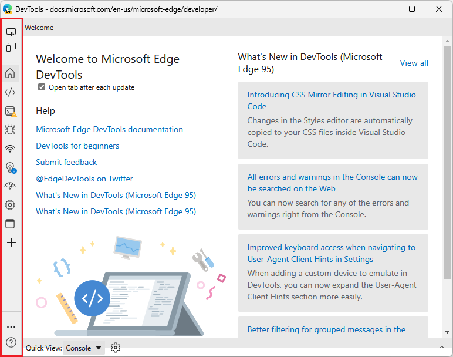
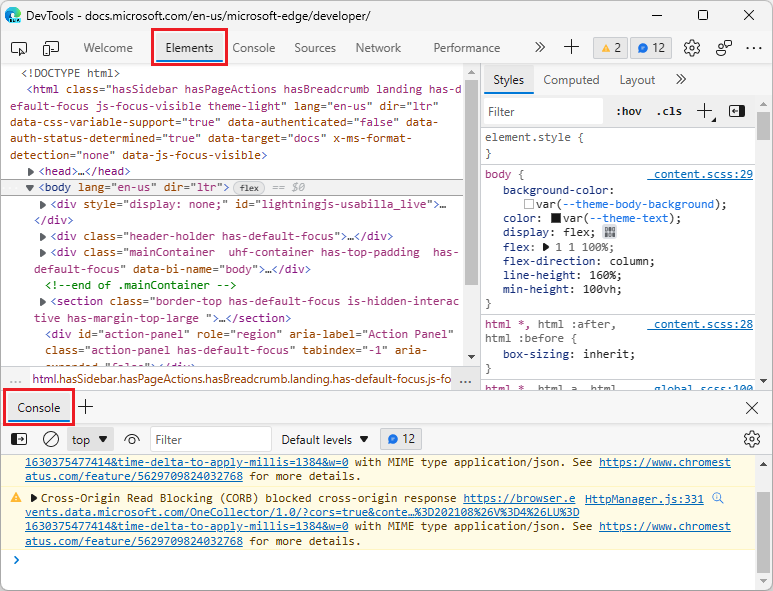
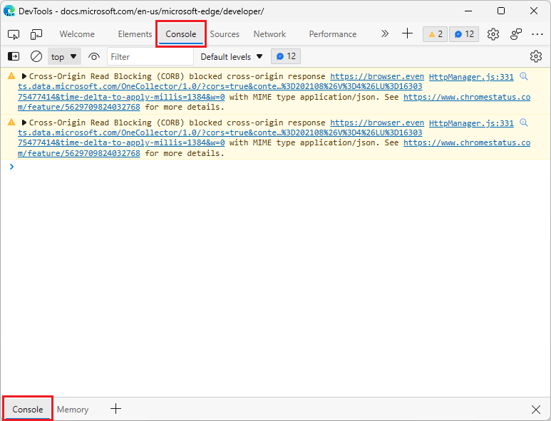
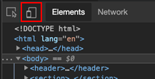
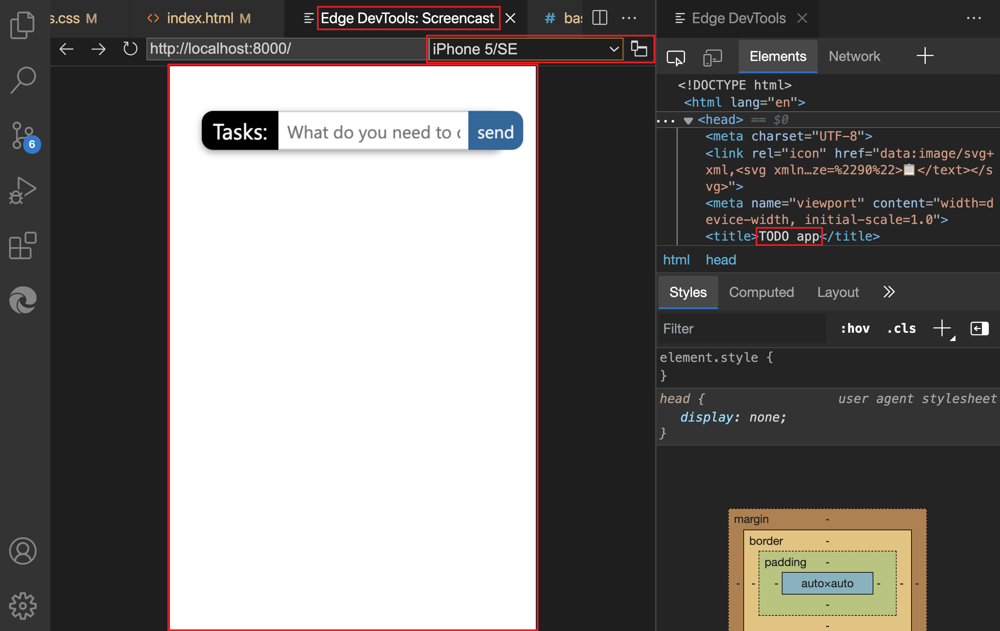
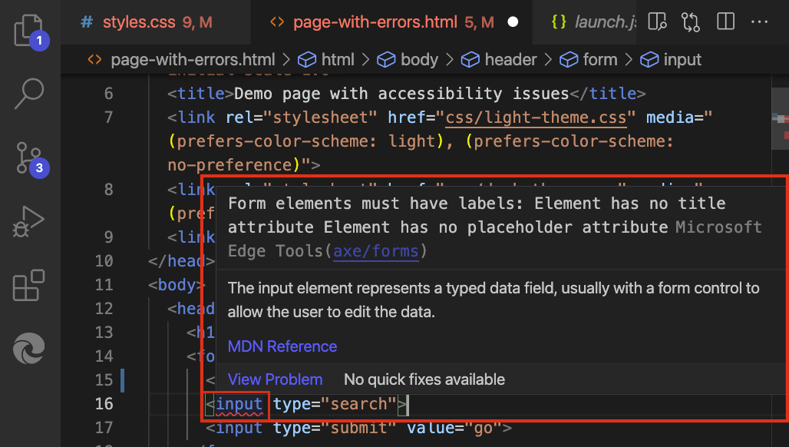
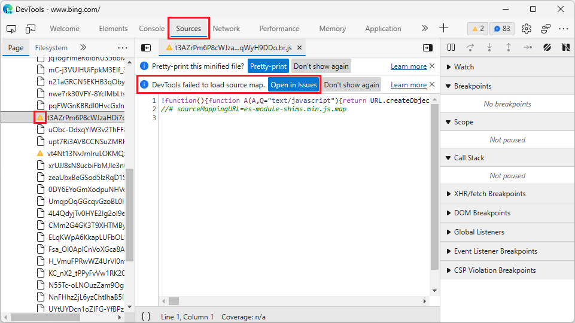
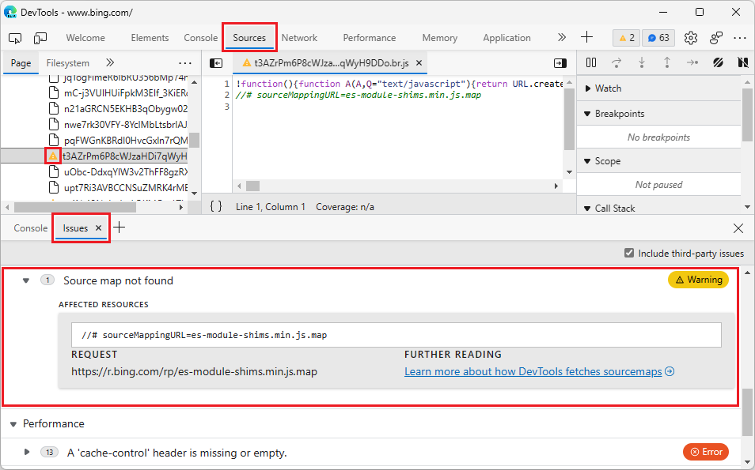
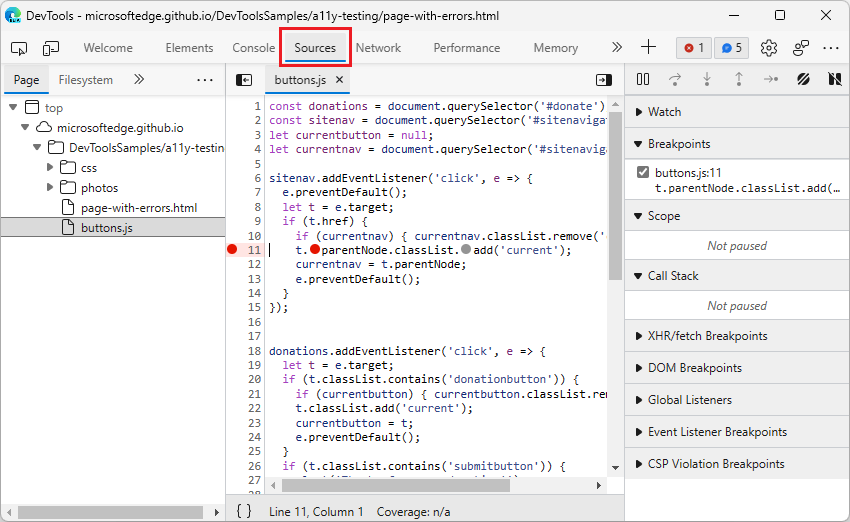
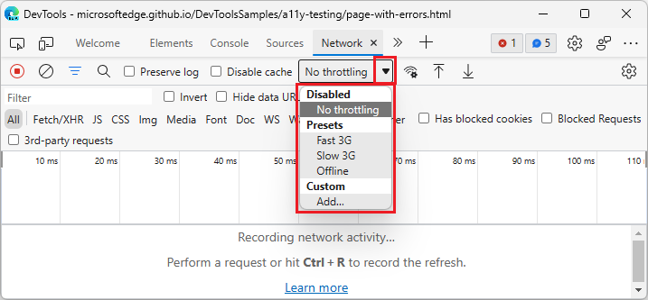

# What's New in DevTools (Microsoft Edge 96)

[!INCLUDE [Microsoft Edge team note for top of What's New](../../includes/edge-whats-new-note.md)]

<!-- ====================================================================== -->
## New DevTools UI available (in preview)

<!-- Title: New DevTools UI available (in preview) -->
<!-- Subtitle: A more minimal, modern UI is coming to Microsoft Edge DevTools. Enable the "Focus Mode" experiment to preview new UI features such a more compact toolbar that keeps DevTools uncluttered and better adapts to small window sizes. -->

The Microsoft Edge DevTools team is experimenting with a new DevTools UI: **Focus Mode**.  Focus Mode reduces distractions and clutter with a more modern and simplified layout.  The new **Activity Bar** allows you to pin your favorite tools in a horizontal or vertical toolbar to use screen space more efficiently.

To give this new UI a try in Microsoft Edge version 96, select **Settings** () > **Experiments** > **Focus Mode**.

Starting with Microsoft Edge version 96, the experiment's checkbox is labeled **Focus Mode** rather than **Focus Mode and DevTools Tooltips**.

This UI is still in development and may change in future versions of Microsoft Edge.  We're eager to hear your feedback about this new DevTools UI.  Send us your feedback by tweeting [@EdgeDevTools](https://twitter.com/edgedevtools).  Or, with the **Focus Mode** experiment turned on, at the bottom of the **Activity Bar**, select **Help** () > **Feedback**, to show the **Send feedback** window.

See also:
*  [DevTools: Focus Mode UI](https://github.com/MicrosoftEdge/DevTools/blob/main/explainers/FocusMode/explainer.md) in the `MSEdgeExplainers` repo.

<!-- ====================================================================== -->
## Console can once again appear in the top and bottom panels

<!-- Title: Fix: Console can be quickly toggled in top or bottom panel -->
<!-- Subtitle: By popular demand, you can now easily show or collapse Console in the bottom panel without having to move the tool. -->

Since Microsoft Edge version 87, you've been able to move any tool between the top and bottom panels, including the Console tool.  However, we heard from developers that moving the Console tool repeatedly was cumbersome.  As of Microsoft Edge version 96, the default experience for the Console tool has been restored, allowing you to quickly switch between a full-screen view of the Console (in the top panel) and a split-screen view (with the Console displayed in the bottom panel), without moving the Console tool.

The **Console** can be opened in the bottom panel (the **Drawer**) while another tool is open:

When **Console** is selected in the top panel, the bottom panel is automatically minimized, if the bottom panel was displaying the **Console**:

If you want to only allow the Console tool to open in a single place, you can configure the behavior of the Console:

1. In the main toolbar or the **Drawer** toolbar, right-click the **Console** tab, and then select **Configure console**.  The **Settings** > **Preferences** page is displayed.

1. In the **Console** section, clear the checkbox **Show Console tab in main panel and drawer**, then click **Close** (**x**).

See also:
* [Activity Bar tools vs. Quick View tools](../../../about-tools.md#activity-bar-tools-vs-quick-view-tools) in _About the list of tools_
* [Move tools between top and bottom panels](../../2020/10/devtools.md#move-tools-between-top-and-bottom-panels) in _What's New in DevTools (Microsoft Edge 87)_.

<!-- ====================================================================== -->
## Microsoft Edge DevTools Visual Studio Code extension

For general information about this extension, see [Microsoft Edge DevTools extension for Visual Studio Code](../../../../visual-studio-code/microsoft-edge-devtools-extension.md).

<!-- Title: Dockable browser screencast, device emulation, and live issue reporting, and in Microsoft Edge DevTools for Visual Studio Code -->
<!-- Subtitle: Display your web project inside the editor, simulate different devices, and get notified about issues with your code while you develop it. --> 

### Display your web project inside the editor, and simulate different devices

The Microsoft Edge DevTools for Visual Studio Code extension now features a dockable screencast and device emulation:

You can see your web project in a dedicated tab inside of Visual Studio Code, and also simulate various devices:

For details about device emulation, see [Device and state emulation](../../../../visual-studio-code/microsoft-edge-devtools-extension/device-state-emulation.md).

### Live, inline issue reporting

The extension also now features live, inline issue reporting.  Instead of finding out about issues in a separate tool, Visual Studio Code highlights the issues in your source code and reports them live while you enter your code:

For details, see [Inline and live issue analysis](../../../../visual-studio-code/microsoft-edge-devtools-extension/inline-live-issue-analysis.md).

<!-- ====================================================================== -->
## Sources tool now notifies you when sourcemaps can't be loaded

<!-- Title: Get notified when DevTools cannot load your sourcemaps correctly -->
<!-- Subtitle: The Sources tool now provides several places in the UI when DevTools can't fetch or parse your sourcemaps. -->

In Microsoft Edge version 96, the **Sources** tool now provides several indications in the UI when DevTools cannot load your sourcemaps.  In the **Page** tab in the **Navigator** pane in the **Sources** tool, files that DevTools can't load sourcemaps for have a warning icon in place of the file icon.  

Selecting a file with the warning icon opens the file in the Sources tool with an infobar indicating that DevTools either couldn't fetch the sourcemap correctly from the server or couldn't parse the sourcemap correctly:

From the infobar, you can learn more about the issue by selecting the **Open in Issues** button.  The **Issues** tool then opens in the **Drawer** and provides information about how to resolve the issue and get your sourcemap loaded correctly in DevTools:

To prevent the infobar about sourcemaps from cluttering the **Sources** tool, select the **Don't show again** button.  To prevent issues related to sourcemaps from cluttering the **Issues** tool, clear the **Include third-party issues** checkbox in the **Issues** tool.

See also:
* [Map the processed code to your original source code, for debugging](../../../javascript/source-maps.md)

<!-- ====================================================================== -->
## Opening source files in Visual Studio Code now integrates better with the Sources tool

<!-- Title: Open source files directly in Visual Studio Code from DevTools -->
<!-- Subtitle: The "Open source files in Visual Studio Code" experiment now works more intuitively with the Sources tool. -->

In previous versions of Microsoft Edge, turning on the **Open source files in Visual Studio Code** experiment had unexpected behavior when you had already been using the **Sources** tool in DevTools.  Setting breakpoints would direct you to Visual Studio Code or to documentation to configure the experiment correctly.

In Microsoft Edge version 96, the **Open source files in Visual Studio Code** experiment now integrates better with the **Sources** tool.

*  If the **Sources** tool is open and you then turn on the **Open source files in Visual Studio Code** experiment, setting breakpoints or opening files now opens the **Sources** tool, rather than directing you to Visual Studio Code or to documentation to configure the experiment correctly.

   

*  As with earlier versions of Microsoft Edge, if the **Sources** tool isn't open in DevTools and you then turn on the **Open source files in Visual Studio Code** experiment, setting breakpoints or opening files from tools other than the **Sources** tool opens the file in Visual Studio Code.

See also:
* [Opening source files in Visual Studio Code](../../../sources/opening-sources-in-vscode.md) - how DevTools integrates with Visual Studio Code.

<!-- ====================================================================== -->
## Selecting the dropdown triangle icon in the DevTools UI now opens the menu

<!-- Title: Dropdown menus in the DevTools UI are now more intuitive -->
<!-- Subtitle: Select the triangle icon to expand any dropdown menu in the DevTools UI. -->

In earlier versions of Microsoft Edge DevTools, selecting the triangle icon next to a dropdown menu didn't display the dropdown menu.  To open the dropdown menu, you had to click the currently selected menu item to the left of the triangle icon, such as **No throttling**:

In Microsoft Edge version 96, this issue has been fixed.  Selecting the triangle icon for any dropdown menu in DevTools now opens the dropdown menu:

<!-- This fix applies to various tools, including:
* Performance
* Memory
* Network
* Console
* Device Emulation. -->
<!-- no See Also links needed -->

<!-- ====================================================================== -->
> [!NOTE]
> Portions of this page are modifications based on work created and [shared by Google](https://developers.google.com/terms/site-policies) and used according to terms described in the [Creative Commons Attribution 4.0 International License](https://creativecommons.org/licenses/by/4.0).
> The original page for announcements from the Chromium project is [What's New in DevTools (Chrome 96)](https://developer.chrome.com/blog/new-in-devtools-96) and is authored by [Jecelyn Yeen](https://developers.google.com/web/resources/contributors#jecelynyeen) (Developer advocate working on Chrome DevTools at Google).

This work is licensed under a [Creative Commons Attribution 4.0 International License](https://creativecommons.org/licenses/by/4.0).
