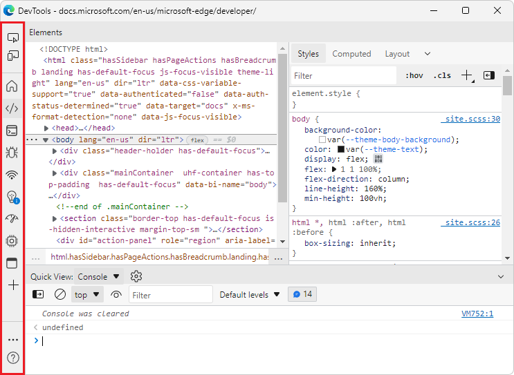

# What's New in DevTools (Microsoft Edge 97)

The following sections list the announcements from the Microsoft Edge DevTools team.  To try the latest features of DevTools and the Microsoft Edge DevTools extension for Visual Studio Code, read these announcements.  To stay up to date with the latest and greatest features in your developer tools, download the [Microsoft Edge preview channels](https://www.microsoftedgeinsider.com/download) and [follow the Microsoft Edge DevTools team on Twitter](https://twitter.com/EdgeDevTools).

If you are on Windows, Linux, or macOS, consider using the Canary preview channel of Microsoft Edge as your default development browser.  The preview channels give you access to the latest features of Microsoft Edge DevTools.

<!-- ====================================================================== -->
## Introducing the Detached Elements tool

<!-- Title: Check out the new Detached Elements tool -->
<!-- Subtitle: The new Detached Elements tool is now available by default in Microsoft Edge 97. -->

A DOM node is considered _detached_ when it's no longer attached to any element of the DOM, but is still being retained in memory by Microsoft Edge.  The browser cannot garbage-collect the detached element, because some JavaScript object is still referencing the element, even though the element is no longer on the page or is no longer a part of the DOM.

The new **Detached Elements** tool finds all of the detached elements on your page and displays them.  You can expand and collapse a detached element to see the parent and child nodes that are also being retained.  You can trigger the browser's garbage collection by clicking the **Collect garbage** icon, and then confirm that you have a memory leak when a detached element cannot be garbage-collected.  To jump into the JavaScript code that's referencing the detached element, click the **Analyze** button to take a heap snapshot.

The **Detached Elements** tool was initially available as an experiment in [Microsoft Edge version 93](../../2021/07/devtools.md#debug-dom-node-memory-leaks-with-the-new-detached-elements-tool).  The tool is now available by default in Microsoft Edge version 97.

See also:
* [Debug DOM memory leaks with the Detached Elements tool](../../../memory-problems/dom-leaks.md)
* [Debug memory leaks with the Microsoft Edge Detached Elements tool - YouTube](https://www.youtube.com/watch?v=v2iy17ptmBk&ab_channel=MicrosoftEdge)

<!-- ====================================================================== -->
<!-- ## Item 2 -->

<!-- Title: xyz -->
<!-- Subtitle: xyz. -->

<!-- ====================================================================== -->
## Improvements and bug fixes for Focus Mode

<!-- Title: Have you tried Focus Mode? -->
<!-- Subtitle: To de-clutter and simplify the DevTools interface to focus on debugging web apps, enable Focus Mode in DevTools settings. -->

Thanks to your early feedback, we've continued to make improvements and bug fixes on the new Focus Mode interface for Microsoft Edge DevTools.  Focus Mode is a new UI option that allows you to dock tools at the top or side of the DevTools window, and removes clutter from the toolbar.  When using Focus Mode, all the same tools and [custom themes](../../../customize/theme.md) are available as in the existing DevTools UI.  Learn more about the [Focus Mode UI](../../../experimental-features/index.md#focus-mode), or try it for yourself by enabling the **Focus Mode** experiment in DevTools **Settings** > **Experiments**.

<!-- ====================================================================== -->
## 3D View tool now supports changing color themes in DevTools

<!-- Title: 3D View better integrates with different themes in DevTools -->
<!-- Subtitle: The 3D View tool now works when you select a different color theme in DevTools. -->

In previous versions of Microsoft Edge, changing the theme in DevTools and then opening the 3D View tool resulted in a blank panel.  This issue has now been fixed, in Microsoft Edge 97.  To learn more, see [Apply color themes to DevTools](../../../customize/theme.md) and [3D View](../../../3d-view/index.md).

For more information about the issue that was fixed, see [Bug 36842109: 3D View panel blank after DevTools reload](https://dev.azure.com/microsoft/Edge/_workitems/edit/36842109/) and [Pull request 6615892: Fix for blank screen in 3D View after tools reloaded](https://dev.azure.com/microsoft/Edge/_git/chromium.devtools-frontend/pullrequest/6615892).

<!-- ====================================================================== -->
<!-- ## Microsoft Edge DevTools Visual Studio Code extension -->

<!-- For general information about this extension, see [Microsoft Edge DevTools extension for Visual Studio Code](../../../../visual-studio-code/microsoft-edge-devtools-extension.md). -->

<!-- Title: xyz -->
<!-- Subtitle: xyz. --> 

<!-- ### xyz -->

<!-- ====================================================================== -->
> [!NOTE]
> Portions of this page are modifications based on work created and [shared by Google](https://developers.google.com/terms/site-policies) and used according to terms described in the [Creative Commons Attribution 4.0 International License](https://creativecommons.org/licenses/by/4.0).
> The original page for announcements from the Chromium project is [What's New In DevTools (Chrome 97)](https://developer.chrome.com/blog/new-in-devtools-97) and is authored by [Jecelyn Yeen](https://developers.google.com/web/resources/contributors#jecelynyeen) (Developer advocate working on Chrome DevTools at Google).

This work is licensed under a [Creative Commons Attribution 4.0 International License](https://creativecommons.org/licenses/by/4.0).
