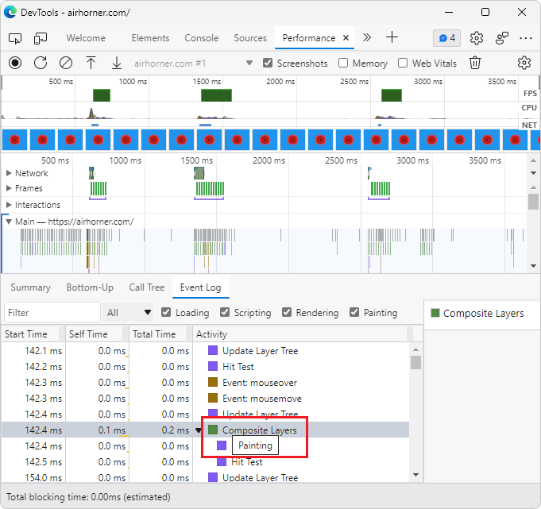
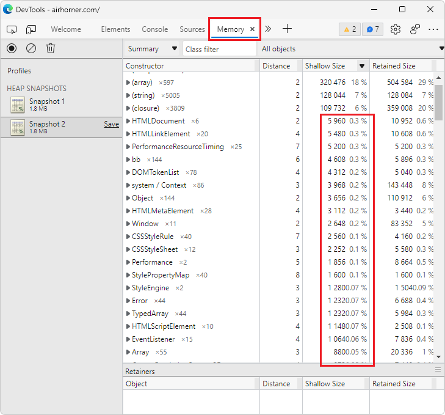

# What's New in DevTools (Microsoft Edge 98)

<!--
todo:
captures
compare result against work items
find "todo"
-->

The following sections list the announcements from the Microsoft Edge DevTools team.  To try the latest features of DevTools and the Microsoft Edge DevTools extension for Visual Studio Code, read these announcements.  To stay up to date with the latest and greatest features in your developer tools, download the [Microsoft Edge preview channels](https://www.microsoftedgeinsider.com/download) and [follow the Microsoft Edge DevTools team on Twitter](https://twitter.com/EdgeDevTools).

If you are on Windows, Linux, or macOS, consider using the Canary preview channel of Microsoft Edge as your default development browser.  The preview channels give you access to the latest features of Microsoft Edge DevTools.

<!-- ====================================================================== -->
<!-- 1 -->
## Catch up on the latest and greatest features in Microsoft Edge

<!-- Title: Year-in-review: Microsoft Edge for developers -->
<!-- Subtitle: Catch up on the latest in developer tooling from Microsoft Edge. -->

In 2021, developer tooling for Microsoft Edge has taken a massive leap forward.  Visual Studio Code, DevTools, and the browser now provide several integrated workflows for JavaScript debugging, mirroring CSS changes, and screencasting from the browser.  Between Focus Mode, support for Visual Studio Code themes, and further customization options, the Microsoft Edge team is working to make the DevTools easier and simpler to use.

Catch up on all of this news and more in our year-in-review blog post, [Looking back at Microsoft Edge for developers in 2021](https://blogs.windows.com/msedgedev/2022/01/19/looking-back-at-microsoft-edge-for-developers-in-2021/).

<!-- ====================================================================== -->
<!-- 2 -->
## Automate IE mode with Internet Explorer Driver

<!-- Title: New support for automating IE mode -->
<!-- Subtitle: Test your legacy websites and apps by automating IE mode with Internet Explorer Driver. -->

Starting June 15, 2022, Internet Explorer 11 will no longer be supported on certain versions of Windows 10. IE mode is a feature in Microsoft Edge for organizations that still need Internet Explorer 11 for business-ritical legacy websites or apps. You can now automate IE mode with Selenium 4 and Internet Explorer Driver. To get started, see [Use Internet Explorer Driver to automate IE mode in Microsoft Edge](../../../../webdriver-chromium/ie-mode.md).

<!-- ====================================================================== -->
<!-- 3 -->
## Emulate forced colors mode

<!-- Title: Emulation of forced colors in the Rendering tool -->
<!-- Subtitle: You can now do a spot check what your product will look like on a device running in forced colors mode without having to change your operating system settings. -->

In addition to emulating dark, light and print mode of the current document, you can now also see what the currently open web product appears like to users who have "forced colors" enabled.  This is an accessibility feature of the operating system.  This emulation allows you to do a spot check without having to change your own system's settings.

To turn on this "forced colors" emulation, in DevTools, open the **Rendering** tool, and then in the **Emulate CSS media feature forced-colors** dropdown list, select **forced-colors: active**.

<!-- ====================================================================== -->
<!-- 4 -->
## Activity icons in the Event Log of the Performance tool now have tooltips

<!-- Title: Analyze runtime performance better with the Event Log in the Performance tool -->
<!-- Subtitle: Activity icons in the Event Log now have tooltips indicating the type of activity for each event: Scripting, Rendering, or Painting. -->

<!-- todo: check rewording of subtitle after capture -->

In previous versions of Microsoft Edge, the **Event Log** tab in the **Performance** tool displays color-coded icons representing the type of activity for each event.  However, the Event Log doesn't display information about what type of activity is represented by each color.  In Microsoft Edge 97, tooltips have been added to the activity events in the **Event Log** tab, indicating **Scripting**, **Rendering**, **Painting**, **System**, and **Idle time**, for each event.

For more info on recording a performance profile, see [Record runtime performance](../../../evaluate-performance/reference.md#record-runtime-performance).

<!-- ====================================================================== -->
<!-- 5 -->
## Shallow sizes in the Memory tool are now represented as decimal values

<!-- Title: Better understand shallow sizes in the Memory tool -->
<!-- Subtitle: The Memory tool has been updated to report shallow size in decimal values as a percentage of the heap. -->

In previous versions of Microsoft Edge, the shallow size in a heap snapshot in the Memory tool is commonly reported as 0%, because the shallow size is so small, relative to the total size of the heap.  In Microsoft Edge 97, shallow size is now reported as a decimal value, if the size is between 0% and 1% of the heap.

To learn more about heap snapshots in the Memory tool, see [Record heap snapshots](../../../memory-problems/heap-snapshots.md).

<!-- ====================================================================== -->
<!-- 6 -->
## Fix: The Search textbox in the Network tool can now be resized

<!-- Title: Fix: the Resize the Search textbox in the Network tool -->
<!-- Subtitle: Now, resizing the Search pane in the Network tool also resizes the Search textbox. -->

In previous versions of Microsoft Edge, the Search text box in the Network tool would not resize when changing the size of the pane.  In Microsoft Edge 97, this issue has been fixed.

<!--

<!--
In Microsoft Edge 97, in Stable before 98 is promoted to Stable on 2/3:
Navigate to: Microsoft Edge documentation - Microsoft Edge Development | Microsoft DocsE
Open DevTools > Network
Select the Search icon (the magnifying glass) in the Network tool
Resize the Search sidebar
Note that the size of the textbox doesn't change as you resize the sidebar/pane
Repeat steps 1-5 in Microsoft Edge Canary, or Beta, anything v98+ and you'll see that now the Search textbox resizes as the pane is resized. Refer to the PR and bug in the comments for more info. -->

To learn more about how to use the **Search** pane in the **Network** tool, see [Search network headers and responses](../../../network/index.md#search-network-headers-and-responses) in _Inspect network activity_.

<!-- ====================================================================== -->
<!-- 7 -->
## Fix: Icons for service workers and script tags in the Elements tool are now aligned

<!-- Title: Fix: Icons and tags in the DevTools are now aligned -->
<!-- Subtitle: Icons for service workers and script tags in the Elements tool now appear as expected. -->

<!-- part 1 -->

In previous versions of Microsoft Edge, the icons in the Service Workers section of the Application tool were not aligned.  The version number in the **Update Cycle** table was cutting off the **Expand** icon.  In Microsoft Edge 97, this issue has been fixed.

<!--
before:

after:

The following instructions work for getting the NEW behavior.
To get screenshots of the old behavior, recommend using Stable (before it updates to 88) [Stable has been updated to 98].  Or, get images from the PRs and bugs.

1. Navigate to The Air Horner.
2. Open DevTools.
3. Go to the Application tool > Service Worker.
   Note that you can expand/collapse each row of the Update Cycle table under the Version column.
-->

<!-- part 2 -->

Also, in the **Elements** tool, the **Expand**<!--icon png--> icon for `<script>` tags was misaligned.  In Microsoft Edge 97, this issue has been fixed.

<!--
before:

after:

-->
<!--
The following instructions work for getting the new behavior.
To get screenshots of the old behavior, recommend using Stable (before it updates to 88) [Stable has been updated to 98].  Or, get images from the PRs and bugs.

1. Navigate to The Air Horner.
2. Open DevTools > Elements.
   Note that you can expand/collapse the last <script> tag before the closing </body> tag and that the <script> tag is aligned with all the other ones.
-->

To learn more about debugging service workers in DevTools, see [Service workers](../../../progressive-web-apps/index.md#service-workers).  To learn more about `<script>` tags in the **Elements** tool, see [Get started with HTML and the DOM](../../../beginners/html.md).

<!-- ====================================================================== -->
## Announcements from the Chromium project

Microsoft Edge version 98 also includes the following updates from the Chromium project:

* [Preview feature: Full-page accessibility tree](https://developer.chrome.com/blog/new-in-devtools-98/#a11y-tree)

* [More precise changes in the Changes tab](https://developer.chrome.com/blog/new-in-devtools-98/#changes)

* [Ensure your pages are cacheable with the Back/forward cache tab](https://developer.chrome.com/blog/new-in-devtools-98/#bfcache)

* [New Properties pane filter](https://developer.chrome.com/blog/new-in-devtools-98/#properties)

* [Emulate the CSS forced-colors media feature](https://developer.chrome.com/blog/new-in-devtools-98/#forced-colors)

* [Show rulers on hover command](https://developer.chrome.com/blog/new-in-devtools-98/#show-rulers)

* [Support row-reverse and column-reverse in the Flexbox editor](https://developer.chrome.com/blog/new-in-devtools-98/#flexbox-editor)

* [New keyboard shortcuts to replay XHR and expand all search results](https://developer.chrome.com/blog/new-in-devtools-98/#shortcuts)

   * [Keyboard shortcuts to replay XHR in the Network panel](https://developer.chrome.com/blog/new-in-devtools-98/#replay-xhr)

   * [Keyboard shortcut to expand all search results](https://developer.chrome.com/blog/new-in-devtools-98/#toggle-search-result)

<!-- ====================================================================== -->
<!-- uncomment if content is copied from developer.chrome.com to this page -->
<!--
> [!NOTE]
> Portions of this page are modifications based on work created and [shared by Google](https://developers.google.com/terms/site-policies) and used according to terms described in the [Creative Commons Attribution 4.0 International License](https://creativecommons.org/licenses/by/4.0).
> The original page for announcements from the Chromium project is [What's New In DevTools (Chrome 98)](https://developer.chrome.com/blog/new-in-devtools-98) and is authored by [Jecelyn Yeen](https://developers.google.com/web/resources/contributors#jecelynyeen) (Developer advocate working on Chrome DevTools at Google).
-->

<!-- ====================================================================== -->
<!-- uncomment if content is copied from developer.chrome.com to this page -->
<!--

This work is licensed under a [Creative Commons Attribution 4.0 International License](https://creativecommons.org/licenses/by/4.0).
-->
