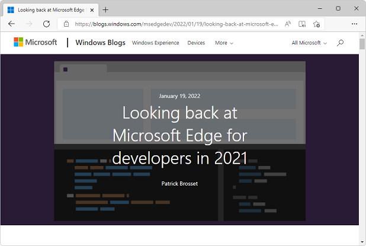
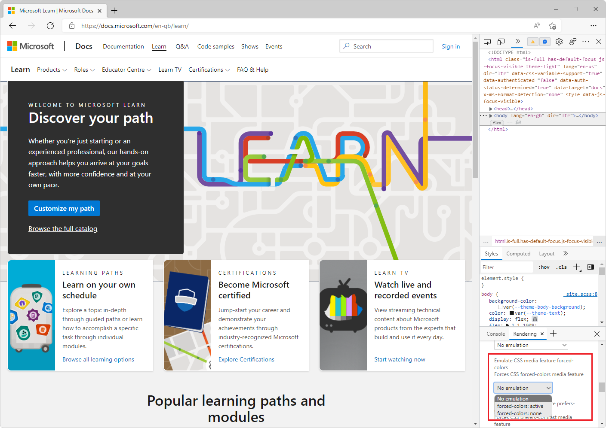
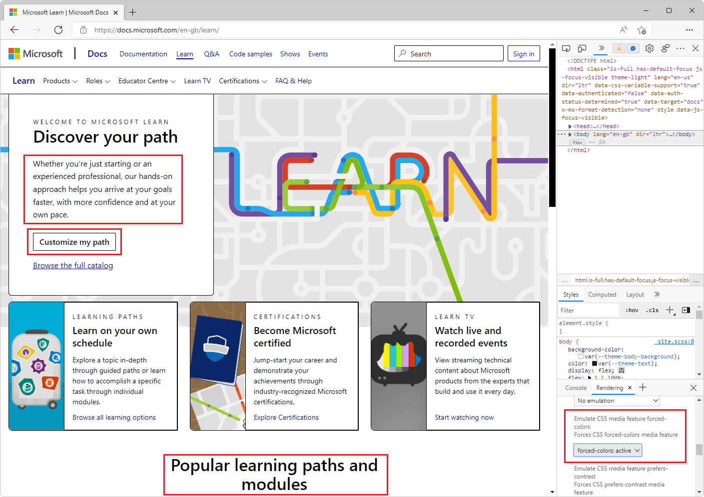
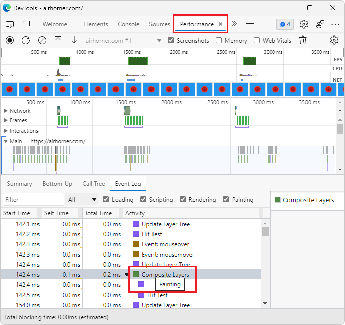
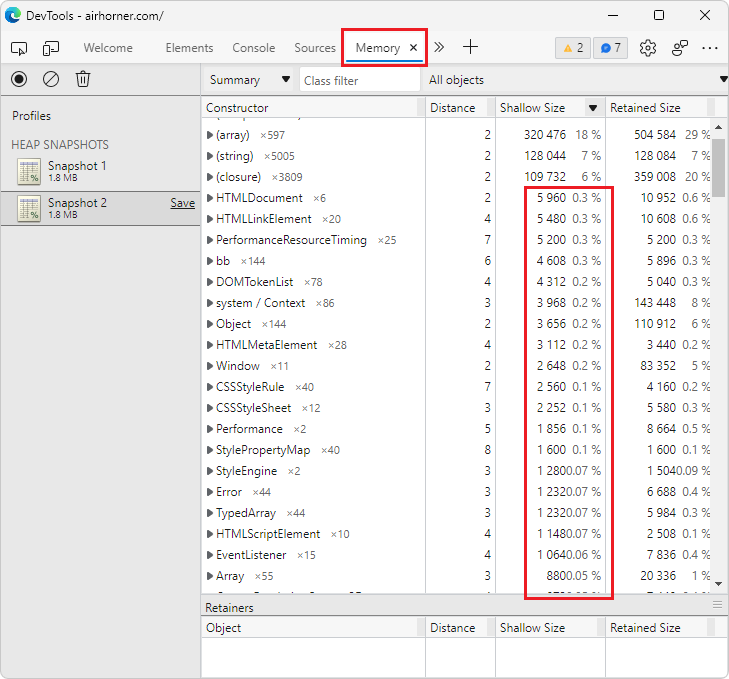
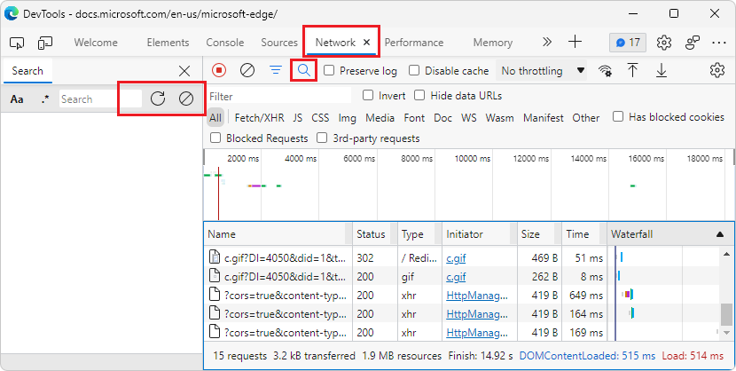
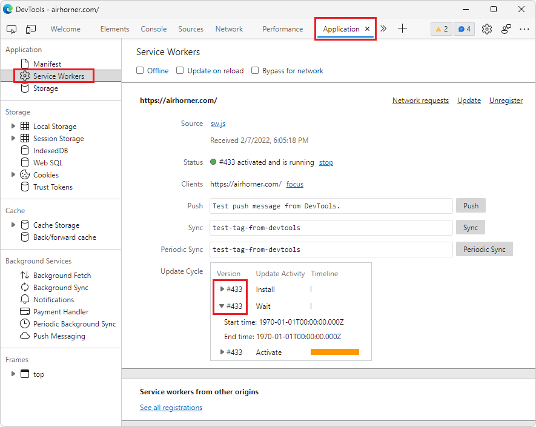
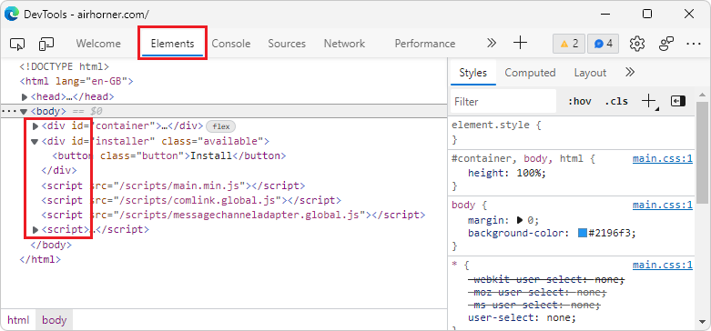

# What's New in DevTools (Microsoft Edge 98)

[!INCLUDE [Microsoft Edge team note for top of What's New](../../includes/edge-whats-new-note.md)]

<!-- ====================================================================== -->
## Catch up on the latest and greatest features in Microsoft Edge

<!-- Title: Year-in-review: Microsoft Edge for developers -->
<!-- Subtitle: Catch up on the latest in developer tooling from Microsoft Edge. -->

In 2021, developer tooling for Microsoft Edge has taken a massive leap forward.  Visual Studio Code, DevTools, and the browser now provide several integrated workflows for JavaScript debugging, mirroring CSS changes, and screencasting from the browser.  Between Focus Mode, support for Visual Studio Code themes, and further customization options, the Microsoft Edge team is working to make the DevTools easier and simpler to use.

Catch up on all of this news and more in our year-in-review blog post, [Looking back at Microsoft Edge for developers in 2021](https://blogs.windows.com/msedgedev/2022/01/19/looking-back-at-microsoft-edge-for-developers-in-2021/).

<!-- ====================================================================== -->
## Automate IE mode with Internet Explorer Driver

<!-- Title: New support for automating IE mode -->
<!-- Subtitle: Test your legacy websites and apps by automating IE mode with Internet Explorer Driver. -->

Starting June 15, 2022, Internet Explorer 11 will no longer be supported on certain versions of Windows 10.  IE mode is a feature of Microsoft Edge for organizations that still need Internet Explorer 11 for compatibility with legacy websites or apps.  To support testing of those legacy websites and apps, you can now automate IE mode with Selenium 4 and Internet Explorer Driver.

See also:
* [Use Internet Explorer Driver to automate IE mode in Microsoft Edge](../../../../webdriver-chromium/ie-mode.md)

<!-- ====================================================================== -->
## Emulate forced-colors mode

<!-- Title: Emulation of forced colors in the Rendering tool -->
<!-- Subtitle: You can now do a spot check of what your product will look like on a device running in forced-colors mode, without having to change your operating system settings. -->

In addition to emulating dark, light, and print mode for the current webpage, now you can also see what your webpage looks like for users who have forced-colors mode enabled.  Forced-colors mode is an accessibility feature of the operating system.  It forces colors on the webpage to be reduced to a limited color palette, such as Windows High Contrast mode.  Emulation of forced-colors mode allows you to do a spot check without having to change your own system's settings.

To turn on forced-colors emulation, in DevTools, open the **Rendering** tool, and then in the **Emulate CSS media feature forced-colors** dropdown list, select **forced-colors: active**.

Without forced-colors emulation turned on, the following webpage has several different colors of text against different background colors:

With forced-colors emulation turned on in the **Rendering** tool, the webpage changes to black text on a white background:

See also:
* [Rendering tool, to see what a webpage looks like with different display options or vision deficiencies](../../../rendering-tools/rendering-tool.md)

<!-- ====================================================================== -->
## Activity icons in the Event Log of the Performance tool now have tooltips

<!-- Title: Analyze runtime performance better with the Event Log in the Performance tool -->
<!-- Subtitle: Activity icons in the Event Log now have tooltips indicating the type of activity for each event, such as Scripting, Rendering, or Painting. -->

In previous versions of Microsoft Edge, the **Event Log** tab in the **Performance** tool displays color-coded icons representing the type of activity for each event.  However, the Event Log doesn't display information about what type of activity is represented by each color.  In Microsoft Edge 98, tooltips have been added to the activity events in the **Event Log** tab, indicating **Scripting**, **Rendering**, **Painting**, **System**, and **Idle time**, for each event.

See also:
* [Record runtime performance](../../../evaluate-performance/reference.md#record-runtime-performance)

<!-- ====================================================================== -->
## Shallow sizes in the Memory tool are now represented as decimal values

<!-- Title: Better understand shallow sizes in the Memory tool -->
<!-- Subtitle: The Memory tool has been updated to report shallow size in decimal values as a percentage of the heap. -->

In previous versions of Microsoft Edge, the shallow size in a heap snapshot in the Memory tool is commonly reported as 0%, because the shallow size is so small, relative to the total size of the heap.  In Microsoft Edge 98, shallow size is now reported as a decimal value, if the size is between 0% and 1% of the heap.

See also:
* [Record heap snapshots](../../../memory-problems/heap-snapshots.md)

<!-- ====================================================================== -->
## Fix: The Search text box in the Network tool can now be resized

<!-- Title: Fix: Resize the Search text box in the Network tool -->
<!-- Subtitle: Now, resizing the Search pane in the Network tool also resizes the Search text box, so that the Refresh and Clear buttons remain visible. -->

In previous versions of Microsoft Edge, in the **Network** tool, the **Search** text box doesn't resize when you change the width of the pane.  When the pane is narrow, the **Refresh** and **Clear** buttons aren't displayed.  In Microsoft Edge 98, this issue has been fixed.

See also:
* [Search network headers and responses](../../../network/index.md#search-network-headers-and-responses) in _Inspect network activity_.

<!-- ====================================================================== -->
## Fix: Icons for service workers and script tags in the Elements tool are now aligned

<!-- Title: Fix: Icons and tags in the DevTools are now aligned -->
<!-- Subtitle: Icons for service workers and script tags in the Elements tool now appear as expected. -->

In previous versions of Microsoft Edge, the **Expand** () icons in the **Service Workers** section of the **Application** tool were not aligned.  The version number in the **Update Cycle** table was cutting off the **Expand** icons.  In Microsoft Edge 98, this issue has been fixed:

Also, in the **Elements** tool, the **Expand** () icon for `<script>` tags was misaligned.  In Microsoft Edge 98, this issue has been fixed:

See also:
* [Service workers](../../../progressive-web-apps/index.md#service-workers) in _Debug Progressive Web Apps (PWAs)_ - debugging service workers in DevTools.

<!-- ====================================================================== -->
## Announcements from the Chromium project

Microsoft Edge version 98 also includes the following updates from the Chromium project:

* [Preview feature: Full-page accessibility tree](https://developer.chrome.com/blog/new-in-devtools-98/#a11y-tree)

* [More precise changes in the Changes tab](https://developer.chrome.com/blog/new-in-devtools-98/#changes)

* [Ensure your pages are cacheable with the Back/forward cache tab](https://developer.chrome.com/blog/new-in-devtools-98/#bfcache)

* [New Properties pane filter](https://developer.chrome.com/blog/new-in-devtools-98/#properties)

* [Show rulers on hover command](https://developer.chrome.com/blog/new-in-devtools-98/#show-rulers)

* [Support row-reverse and column-reverse in the Flexbox editor](https://developer.chrome.com/blog/new-in-devtools-98/#flexbox-editor)

* [New keyboard shortcuts to replay XHR and expand all search results](https://developer.chrome.com/blog/new-in-devtools-98/#shortcuts)

   * [Keyboard shortcuts to replay XHR in the Network panel](https://developer.chrome.com/blog/new-in-devtools-98/#replay-xhr)

   * [Keyboard shortcut to expand all search results](https://developer.chrome.com/blog/new-in-devtools-98/#toggle-search-result)

<!-- ====================================================================== -->
<!-- uncomment if content is copied from developer.chrome.com to this page -->
<!--
> [!NOTE]
> Portions of this page are modifications based on work created and [shared by Google](https://developers.google.com/terms/site-policies) and used according to terms described in the [Creative Commons Attribution 4.0 International License](https://creativecommons.org/licenses/by/4.0).
> The original page for announcements from the Chromium project is [What's New in DevTools (Chrome 98)](https://developer.chrome.com/blog/new-in-devtools-98) and is authored by [Jecelyn Yeen](https://developers.google.com/web/resources/contributors#jecelynyeen) (Developer advocate working on Chrome DevTools at Google).
-->

<!-- ====================================================================== -->
<!-- uncomment if content is copied from developer.chrome.com to this page -->
<!--

This work is licensed under a [Creative Commons Attribution 4.0 International License](https://creativecommons.org/licenses/by/4.0).
-->
