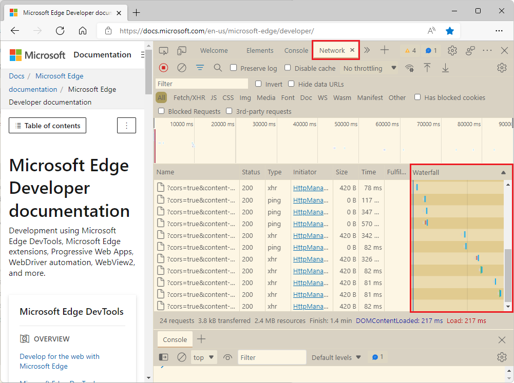

# What's New in DevTools (Microsoft Edge 100)

The following sections list the announcements from the Microsoft Edge DevTools team.  To try the latest features of Microsoft Edge DevTools and of the Edge DevTools extension for Microsoft Visual Studio and Visual Studio Code, see these announcements.  To stay up to date with the latest and greatest features in your developer tools, download the [Microsoft Edge preview channels](https://www.microsoftedgeinsider.com/download) and [follow the Microsoft Edge DevTools team on Twitter](https://twitter.com/EdgeDevTools).

If you are on Windows, Linux, or macOS, consider using the Canary preview channel of Microsoft Edge as your default development browser.  The preview channels give you access to the latest features of Microsoft Edge DevTools.

To report a problem with DevTools or ask for a new feature, file an issue at the new [Microsoft Edge DevTools feedback repo](https://github.com/MicrosoftEdge/DevTools).

<!-- ====================================================================== -->
## Join the Microsoft Edge DevTools community on GitHub

<!-- Title: Head to the new DevTools repo on GitHub to send ideas, feedback, suggestions, and bugs -->
<!-- Subtitle: You can file feedback, ask questions, and have discussions about DevTools in our GitHub repo. -->

We're excited to announce the new [MicrosoftEdge/DevTools: Feedback and discussions about Microsoft Edge Developer Tools (github.com)](https://github.com/MicrosoftEdge/DevTools) repo on GitHub!  This new repo is a place for our community of developers to send us ideas, feedback, suggestions, and tips to improve DevTools. We're eager to discuss with you how DevTools can better serve your needs and meet the challenges you face every day in building great web experiences.

<!-- Instructions for screenshot
1. Go to MicrosoftEdge/DevTools: Feedback and discussions about Microsoft Edge Developer Tools (github.com)
2. Take a screenshot.
-->

Head to [our repo on GitHub](https://github.com/MicrosoftEdge/DevTools) to become a part of the Edge DevTools community.

<!-- ====================================================================== -->
## Filter heap snapshots summary by node type

<!-- Title: Use new filters to focus on specific parts of a heap snapshot -->
<!-- Subtitle: You can now filter by node type if, for example, you're only interested in the strings or arrays from the heap. -->

<!-- Announcement Text -->
When looking at all the objects in a heap snapshot in the **Memory** tool, it can be difficult to focus on specific objects or retaining paths.  Now in Microsoft Edge 100, you can use the new **Node Types** filter when looking at a heap snapshot to focus on only specific types of nodes.  For example, if you only wanted to see only the string objects and Arrays that are in the heap, select the **String** and **Array** entries in the **Node Types** filter.

<!-- 
1. Go to edge://version and ensure you're on version 100+.
2. Go to https://docs.microsoft.com/en-us/microsoft-edge/devtools-guide-chromium/landing/
3. Open DevTools > Memory.
4. Take a heap snapshot.
5. In the Node Types filter, clear all entries except for String and Array.
6. Expand the (string) dropdown.
7. Open the Node Types dropdown.
8. Take a screenshot.
9. Draw red highlights around the checked String and Array entries in the Node Types filter.
10. Draw red highlights around the (array) and (string) groupings in the heap snapshot.
-->

<!-- 
Video recording of feature in action:
*  See wiki.
*  See attachment.
-->

To learn more about taking a heap snapshot and analyzing the heap in DevTools, see [Look up color coding](../../../memory-problems/heap-snapshots.md#look-up-color-coding) in _Record heap snapshots using the Memory tool_.

<!-- ====================================================================== -->
## Use DevTools in Czech and Vietnamese

<!-- Title: DevTools: Now available in Czech and Vietnamese -->
<!-- Subtitle: Try out DevTools in your preferred language!  If we haven't supported it, yet, let us know. -->

Customizing and simplifying the developer experience includes making our tools available to everyone, regardless of their preferred language.  We've added two new languages, Czech and Vietnamese, to our list of supported languages, and will keep adding more.  If your preferred language isn't supported in DevTools, let us know!

<!-- 
1. F12 > Settings > Preferences > Appearance
2. Select the Language drop-down menu (Czech and Vietnamese have been added to this drop-down)
-->

For more information, see [Change DevTools language settings](../../../customize/localization.md).

<!-- ====================================================================== -->
## The Network tool now displays how a request was fulfilled

<!-- Title: You no longer have to wonder if a request was fulfilled by your service worker or cache -->
<!-- Subtitle: The "Fulfilled by" column in the Network tool tells you how a request was fulfilled. -->

In Microsoft Edge 100, the **Network** tool supports a new, **Fulfilled by** column in the request log.  The **Fulfilled by** column shows how a request was fulfilled.  If the request was fulfilled by your service worker or from the cache, that information is now tracked in the **Fulfilled by** column.  When exporting or importing the request log as a HAR file, the information in the **Fulfilled by** column is also included.

<!--
1. Go to edge://version and make sure you're on version 100+.
2. Go to PWABuilder.
3. Open DevTools > Network tool.
4. Some of the requests should be fulfilled by the service worker and you should see that in the **Fulfilled by** column.
5. If you don't have the **Fulfilled by** column, right-click the table headers in the request log and make sure **Fulfilled by** is checked.
-->

<!-- Video recording of feature in action
(we want to incorporate more multimedia assets into our What's New docs which drives engagement. Check out the wiki for instructions)
See attachment -->

To learn more about the request log in the Network tool, see [Filter requests by properties](../../../network/reference.md#display-a-log-of-requests) in _Network features reference_.  For more information about service workers, see [Service Worker improvements](../../../service-workers/index.md).

For the history of this feature, see [Outlook: Add column in the Network activity log to track why resources are not loaded from DiskCache when ServiceWorker is present · Issue #16](https://github.com/MicrosoftEdge/DevTools/issues/16).

<!-- ====================================================================== -->
## When importing a performance profile, links now map to your original code

<!-- Title: Use sourcemaps from Azure Artifacts symbol server to better debug performance issues -->
<!-- Subtitle: Links from an imported performance profile now map to your original code because of source maps. -->

When recording a performance profile, the flame chart in the Performance tool displays links from each event on the main thread to the corresponding JavaScript function in the Sources tool.  However, these links are broken when you export and import a performance profile.

In Microsoft Edge 100, the links from an imported performance profile now use source maps from Azure Artifacts symbol server to map back to your familiar, original source code.

<!-- 
1. In Edge Beta, go to edge://version and ensure you're on version 100 (we encountered an issue with Canary so fair warning that these steps might not work in Canary)
go to edge://surf
Open DevTools > Settings > Symbol Server
For Azure DevOps organization, enter "microsoft"
For Azure DevOps personal access token, ping Zoher for his or use your own from: Securely debug original code by using Azure Artifacts symbol server source maps - Microsoft Edge Development | Microsoft Docs
Now reload DevTools
Load the attached performance profile
Zoom in on the 1761-1766ms portion of the profile
Select the changeGameState function
In the Summary pane, draw red highlight box around game.ts:53:3
You can repeat the steps in Edge Stable (ensure you're on version 99) to see that the link instead can't be clicked and points to edge://surf/surf.bundle.js which is a lot less helpful. -->

<!--
Video recording of feature in action
Refer to the attachments
-->

To learn more about using source maps in DevTools, see [Map the processed code to your original source code, for debugging](../../../javascript/source-maps.md).

To get started with storing your source maps in Azure Artifacts symbol server and connecting to them from DevTools, see:
*  [Securely debug original code by publishing source maps to the Azure Artifacts symbol server](../../../javascript/publish-source-maps-to-azure.md).
*  [Securely debug original code by using Azure Artifacts symbol server source maps](../../../javascript/consume-source-maps-from-azure.md).

<!-- ====================================================================== -->
## Fix: The Waterfall view in the Network tool now matches Visual Studio Code themes

<!-- Title: Themes from Visual Studio Code now apply to the Waterfall view -->
<!-- Subtitle: The Waterfall view of requests in the Network tool now match the VS Code themes. -->

In previous versions of Microsoft Edge, the **Waterfall** view of requests in the **Network** tool didn't match the themes from Visual Studio Code that apply to the rest of DevTools.  In Microsoft Edge 100, this issue has been fixed.

<!--
1. In Microsoft Edge Stable, go to edge://version and ensure you are on version 99.
2. Go to Microsoft Edge DevTools documentation.
3. Open DevTools > Settings > Theme, and then select either Solarized Light or Quiet Light themes.
4. Note, if DevTools disappears and you get a blank box where DevTools would normally be, use the keyboard to close DevTools and then re-open them and they should be in the theme you set in Step 3.
5. Open the Network tool.
6. Refresh the page.
7. Take a screenshot and draw a red highlight box specifically around the Waterfall view.
Repeat the above steps in Microsoft Edge Dev (ensure you are on version 100+). There are also screenshots in the PR that you can use for reference: Pull request 6942401: Fix VS Code themes on Network Waterfall View.
-->

<!-- Video recording of feature in action
See attachments -->

For more information about using themes from Visual Studio Code in DevTools, see [Apply a color theme to DevTools](../../../customize/theme.md).  For more information about the Waterfall view for requests in the Network tool, see [Network features reference](../../../network/reference.md#display-the-timing-relationship-of-requests).

<!-- ====================================================================== -->
## Announcements from the Chromium project

Microsoft Edge version 100 also includes the following updates from the Chromium project:

* [View and edit @supports at rules in the Styles pane](https://developer.chrome.com/blog/new-in-devtools-100/#supports)
* [Preview class/function properties on hover](https://developer.chrome.com/blog/new-in-devtools-100/#properties)
* [Partially presented frames in the Performance panel](https://developer.chrome.com/blog/new-in-devtools-100/#perf)

<!-- ====================================================================== -->
<!-- uncomment if content is copied from developer.chrome.com to this page -->

<!-- > [!NOTE]
> Portions of this page are modifications based on work created and [shared by Google](https://developers.google.com/terms/site-policies) and used according to terms described in the [Creative Commons Attribution 4.0 International License](https://creativecommons.org/licenses/by/4.0).
> The original page for announcements from the Chromium project is [What's New in DevTools (Chrome 100)](https://developer.chrome.com/blog/new-in-devtools-100) and is authored by [Jecelyn Yeen](https://developers.google.com/web/resources/contributors#jecelynyeen) (Developer advocate working on Chrome DevTools at Google). -->

<!-- ====================================================================== -->
<!-- uncomment if content is copied from developer.chrome.com to this page -->

<!-- 
This work is licensed under a [Creative Commons Attribution 4.0 International License](https://creativecommons.org/licenses/by/4.0). -->
