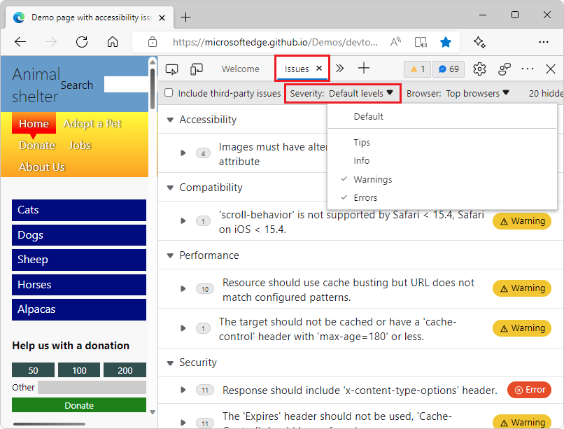
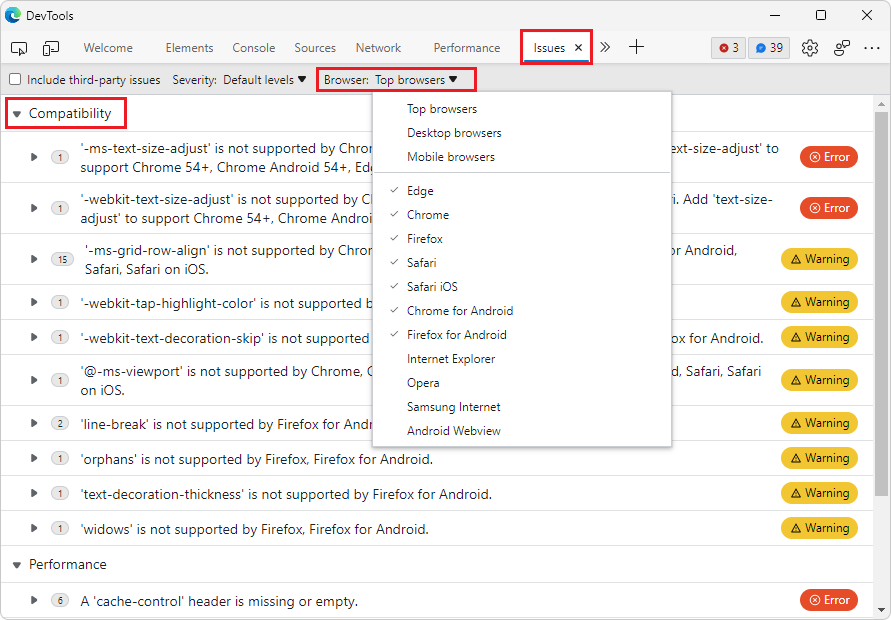
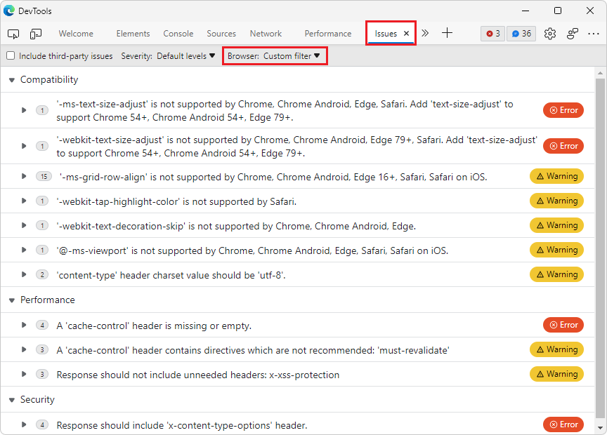

# What's New in DevTools (Microsoft Edge 100)

[!INCLUDE [Microsoft Edge team note for top of What's New](../../includes/edge-whats-new-note.md)]

<!-- ====================================================================== -->
## Join the Microsoft Edge DevTools community at GitHub

<!-- Title: Head to the new DevTools repo at GitHub to send ideas, feedback, suggestions, and bugs -->
<!-- Subtitle: You can file feedback, ask questions, and have discussions about DevTools at our GitHub repo. -->

We're excited to announce the new [MicrosoftEdge > DevTools](https://github.com/MicrosoftEdge/DevTools) repo at GitHub!  This new repo is a place for our community of developers to send us ideas, feedback, suggestions, and tips to improve DevTools.  We're eager to discuss with you how DevTools can better serve your needs and meet the challenges you face every day in building great web experiences.

Head to our DevTools repo at GitHub to become a part of the Edge DevTools community.

<!-- ====================================================================== -->
## Filter heap snapshots summary by node type

<!-- Title: Use new filters to focus on specific parts of a heap snapshot -->
<!-- Subtitle: You can now filter by node type if, for example, you're only interested in the arrays or strings from the heap. -->

When looking at all the objects in a heap snapshot in the **Memory** tool, it can be difficult to focus on specific objects or retaining paths.  Now in Microsoft Edge 100, you can use the new **Node Types** filter when looking at a heap snapshot, to focus on only specific types of nodes.  For example, to see only the arrays and string objects that are in the heap, select the **Array** and **String** entries in the **Node Types** filter:

See also:
* [Record heap snapshots using the Memory tool](../../../memory-problems/heap-snapshots.md) - taking a heap snapshot and analyzing the heap.

<!-- ====================================================================== -->
## Use DevTools in Czech and Vietnamese

<!-- Title: DevTools: Now available in Czech and Vietnamese -->
<!-- Subtitle: Try out DevTools in your preferred language!  If we haven't supported it, yet, let us know. -->

Customizing and simplifying the developer experience includes making our tools available to everyone, regardless of their preferred language.  We've added two new languages, Czech and Vietnamese, to our list of supported languages, and will keep adding more.  If your preferred language isn't supported in DevTools, let us know!

See also:
* [Change DevTools language settings](../../../customize/localization.md)

<!-- ====================================================================== -->
## The Network tool now displays how a request was fulfilled

<!-- Title: You no longer have to wonder if a request was fulfilled by your service worker or cache -->
<!-- Subtitle: The "Fulfilled by" column in the Network tool tells you how a request was fulfilled. -->

In Microsoft Edge 100, the **Network** tool supports a new **Fulfilled by** column in the request log.  If the request was fulfilled by your service worker or from the cache, that information is now tracked in the **Fulfilled by** column.  When exporting or importing the request log as a `HAR` file, the information in the **Fulfilled by** column is also included.

<!--
If you don't have the **Fulfilled by** column, right-click the table headers in the request log and make sure **Fulfilled by** is checked.
-->

See also:
* [Filter requests by properties](../../../network/reference.md#display-a-log-of-requests) in _Network features reference_.
* [Service Worker improvements](../../../service-workers/index.md).

For the history of this feature, see [Issue #16](https://github.com/MicrosoftEdge/DevTools/issues/16).

<!-- ====================================================================== -->
## Filter messages in the Issues tool by severity and browser target

<!-- Title: Filter issues in the Issues tool -->
<!-- Subtitle: New controls in the Issues tool allow you to filter messages by severity and browser target to help you focus on the most relevant feedback. -->

In the **Issues** tool, the new **Severity** and **Browser** dropdown lists allow you to filter messages by severity and browser target, to help you focus on the most relevant feedback.  You can select or clear the options in each dropdown list.

To see all relevant messages, you might need to refresh the page.  If prompted, in the **Issues** tool, click the **Regenerate issues** button.
<!--
The top-of-panel message after you change checkmarks on the drop down lists:
"One or more settings have changed which require a panel reload to take effect.  [Regenerate issues]"
-->

By default, the **Severity** filter is set to show only warnings and errors:

The **Browser** filter only applies to browser compatibility feedback, which is shown in the **Compatibility** section of the **Issues** list.  By default, the **Browser** filter shows messages for the top browsers, as defined by [Browserslist](https://github.com/browserslist/browserslist#queries):

In the following example, messages about Firefox and Firefox for Android are filtered out:

See also:
* [Filter issues](../../../issues/index.md#filter-issues) in _Find and fix problems using the Issues tool_.

<!-- ====================================================================== -->
## When importing a performance profile, links now map to your original code

<!-- Title: Use sourcemaps from Azure Artifacts symbol server to better debug performance issues -->
<!-- Subtitle: Links from an imported performance profile now map to your original code because of source maps. -->

When recording a performance profile, the flame chart in the **Performance** tool displays links from each event on the main thread to the corresponding JavaScript function in the **Sources** tool.  However, these links are broken when you export and import a performance profile.

In Microsoft Edge 100, the links from an imported performance profile now use source maps from Azure Artifacts symbol server to map back to your familiar, original source code.  The performance profile must have been exported in Microsoft Edge 100 (or greater), so that the profile includes the information that's needed to resolve source maps in the exported performance trace.

See also:
* [Map the processed code to your original source code, for debugging](../../../javascript/source-maps.md)
* [Securely debug original code by publishing source maps to the Azure Artifacts symbol server](../../../javascript/publish-source-maps-to-azure.md)
* [Securely debug original code by using Azure Artifacts symbol server source maps](../../../javascript/consume-source-maps-from-azure.md)

<!-- ====================================================================== -->
## Fix: The Waterfall view in the Network tool now matches Visual Studio Code themes

<!-- Title: Themes from Visual Studio Code now apply to the Waterfall view -->
<!-- Subtitle: The Waterfall view of requests in the Network tool now match the VS Code themes. -->

In previous versions of Microsoft Edge, the **Waterfall** view of requests in the **Network** tool didn't match the themes from Visual Studio Code that apply to the rest of DevTools.  In Microsoft Edge 100, this issue has been fixed.

Before Microsoft Edge 100, the selected theme wasn't applied in the Waterfall view:

Now in Microsoft Edge 100, the selected theme is applied to the Waterfall view of requests in the Network tool:

See also:
* [Apply a color theme to DevTools](../../../customize/theme.md) - using themes from Visual Studio Code in DevTools.
* [Display the timing relationship of requests](../../../network/reference.md#display-the-timing-relationship-of-requests) in _Network features reference_ - the Waterfall view for requests in the Network tool.

<!-- ====================================================================== -->
## Announcements from the Chromium project

Microsoft Edge version 100 also includes the following updates from the Chromium project:

* [View and edit @supports at rules in the Styles pane](https://developer.chrome.com/blog/new-in-devtools-100/#supports)
* [Preview class/function properties on hover](https://developer.chrome.com/blog/new-in-devtools-100/#properties)
* [Partially presented frames in the Performance panel](https://developer.chrome.com/blog/new-in-devtools-100/#perf)

<!-- ====================================================================== -->
<!-- uncomment if content is copied from developer.chrome.com to this page -->

<!-- > [!NOTE]
> Portions of this page are modifications based on work created and [shared by Google](https://developers.google.com/terms/site-policies) and used according to terms described in the [Creative Commons Attribution 4.0 International License](https://creativecommons.org/licenses/by/4.0).
> The original page for announcements from the Chromium project is [What's New in DevTools (Chrome 100)](https://developer.chrome.com/blog/new-in-devtools-100) and is authored by [Jecelyn Yeen](https://developers.google.com/web/resources/contributors#jecelynyeen) (Developer advocate working on Chrome DevTools at Google). -->

<!-- ====================================================================== -->
<!-- uncomment if content is copied from developer.chrome.com to this page -->

<!-- 
This work is licensed under a [Creative Commons Attribution 4.0 International License](https://creativecommons.org/licenses/by/4.0). -->
