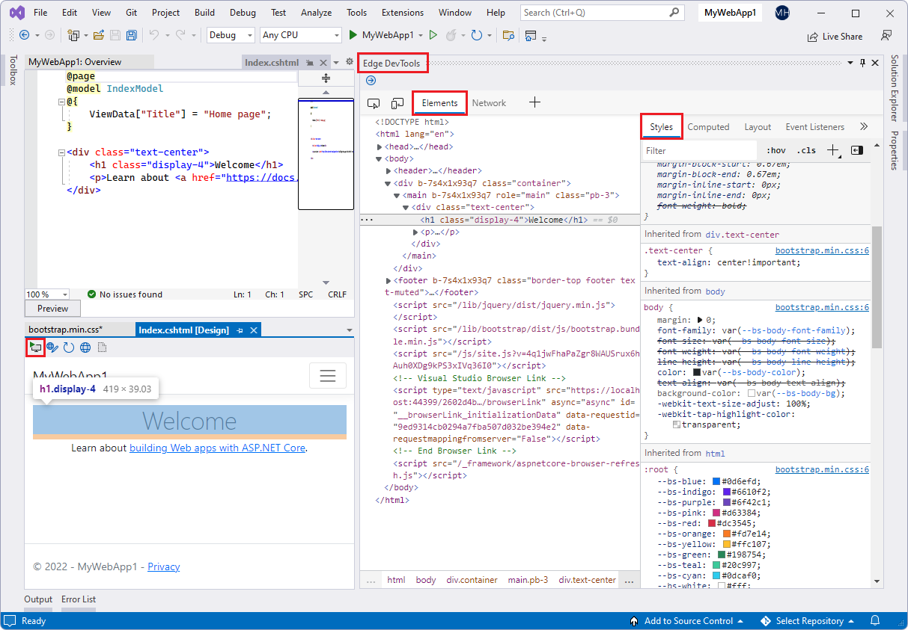
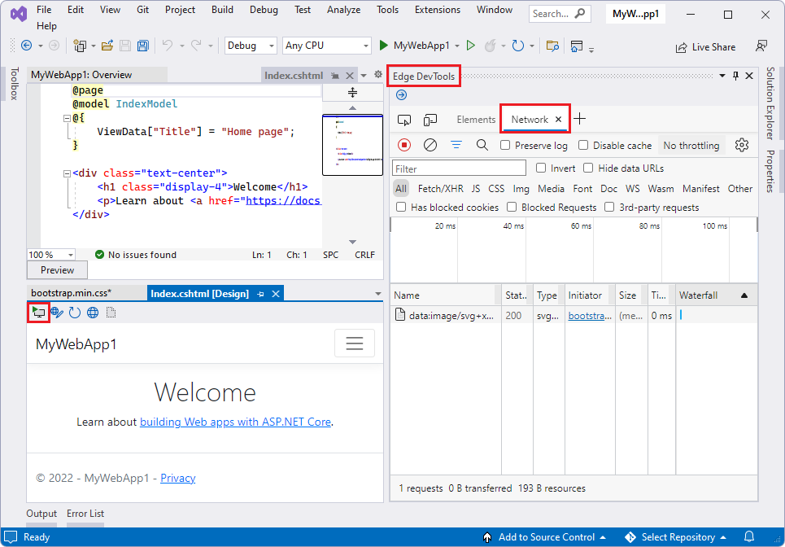

# What's New in DevTools (Microsoft Edge 99)

The following sections list the announcements from the Microsoft Edge DevTools team.  To try the latest features of Microsoft Edge DevTools and of the Edge DevTools extension for Microsoft Visual Studio and Visual Studio Code, read these announcements.  To stay up to date with the latest and greatest features in your developer tools, download the [Microsoft Edge preview channels](https://www.microsoftedgeinsider.com/download) and [follow the Microsoft Edge DevTools team on Twitter](https://twitter.com/EdgeDevTools).

If you are on Windows, Linux, or macOS, consider using the Canary preview channel of Microsoft Edge as your default development browser.  The preview channels give you access to the latest features of Microsoft Edge DevTools.

To report a problem with DevTools or ask for a new feature, file an issue at the new [Microsoft Edge DevTools feedback repo](https://github.com/MicrosoftEdge/DevTools).

<!-- ====================================================================== -->
## Securely debug your production code with source maps from Azure Artifacts Symbol Server

<!-- Title: Debug JavaScript with source maps more easily -->
<!-- Subtitle: Publish your source maps to Azure Artifacts Symbol Server and connect DevTools to it for an easier debugging experience. -->

Azure Artifacts Symbol Server now supports storing the source maps that your build process produces when compiling, minifying, and bundling your code.  Instead of hosting source maps on your public server, you can now publish your source maps to the secure Azure Artifacts Symbol Server.  Then, connect DevTools to Symbol Server to have DevTools automatically fetch your source maps. 

By using source maps, you can see and debug your original source code in DevTools, rather than having to work with the compiled, minified, and bundled production code that's returned by your server.  Hosting your source maps on the Azure Artifacts Symbol Server allows you to see and work with your source code securely and privately, instead of placing your source maps on your server and revealing your original code publicly.

To try this feature:
1. [Publish your source maps to the Azure Artifacts symbol server](../../../javascript/publish-source-maps-to-azure.md).
1. Open DevTools > **Settings** > **Symbol Server** and connect DevTools to Azure Artifacts Symbol Server, by entering your Azure DevOps organization and personal access token.

See also:
*  [Map the processed code to your original source code, for debugging](../../../javascript/source-maps.md)
*  [Securely debug original code by publishing source maps to the Azure Artifacts symbol server](../../../javascript/publish-source-maps-to-azure.md)
*  [Securely debug original code by using Azure Artifacts symbol server source maps](../../../javascript/consume-source-maps-from-azure.md)

<!--
See also:
* 
* 
-->

<!-- ====================================================================== -->
## Microsoft Edge DevTools extension for Visual Studio

<!-- Title: Debug your ASP.NET projects in Visual Studio with the Edge Developer Tools -->
<!-- Subtitle: Get the Edge Developer Tools extension for VS today! -->

Following up on the success of the Visual Studio Code integration, you can now also embed the Microsoft Edge Developer Tools in Microsoft Visual Studio to debug your ASP.NET projects live.  Download the [Microsoft Edge Developer Tools for Visual Studio](https://aka.ms/edgetools-for-vs) and try it out. 

To try this feature:
1. Make sure Visual Studio 2022 and the ASP.NET workload are installed.
1. Set up Web Live Preview as the default Web Forms Designer, as described at [Microsoft Edge Developer Tools for Visual Studio](https://aka.ms/edgetools-for-vs).
1. In an ASP.NET project, open a webpage of the project in the **Design** window.
1. In the upper left of the **Design** window, click the **Open Edge DevTools** () button:

Edge DevTools for Visual Studio opens, with the **Elements** tool selected:

The **Network** tool is also available by default:

The **Inspect tool** () and **Toggle screencast** () are available, and the **More Tools** () menu offers the [Issues](../../../issues/index.md), [Network conditions](../../../network-conditions/network-conditions-tool.md), and [Network request blocking](../../../network-request-blocking/network-request-blocking-tool.md) tools.

See also:

* [Edge Developer Tools for Visual Studio (Preview)](https://devblogs.microsoft.com/visualstudio/?p=237066&preview=1&_ppp=7aa7aef54f), at Visual Studio DevBlogs.
* [Edge DevTools extension for Visual Studio](../../../../visual-studio/index.md#edge-devtools-extension-for-visual-studio).

<!--
See also:
* 
* 
-->

<!-- ====================================================================== -->
## Layers in 3D View

<!-- Title: Layers in 3D View -->
<!-- Subtitle: The Layers tool isn't going away - find it in the 3D View tool today. -->

Since [Microsoft Edge 88](../../2020/11/devtools.md#composited-layers-are-now-in-3d-view), the **3D View** tool has provided an improved version of the **Layers** tool.  Now, in Microsoft Edge 99, the functionality in the **Layers** tool has been removed, and the **Layers** tool instead contains a link that redirects you to the Composited Layers view within the **3D View** tool.  You can find all the features that were previously in the **Layers** tool, and more, in the **3D View** tool.

<!-- work item > layersmove.gif -->

See [Navigate z-index, DOM, and layers using the 3D View tool](../../../3d-view/index.md).

<!--
See also:
* 
* 
-->

<!-- ====================================================================== -->
## Use your source maps to display original function names in performance profiles

<!-- Title: The Performance tool can now display unminified function names in the flame chart -->
<!-- Subtitle: Use the new Unminify button in the Performance tool to download an unminified version of the performance profile you recorded. -->

Recording a performance profile in the Performance tool produces a minified flame chart.  In previous versions of Microsoft Edge, the flame chart didn't use source maps to display your original function names, even if you hosted the source maps on your server.

Starting in Microsoft Edge version 99, you can display your original function names in a performance profile, as follows:
1. Record a profile, in the **Performance** tool.
1. Click the new **Unminify** () button to create and download the unminified performance profile.
1. Load (import) () the unminified performance profile into the **Performance** tool.

The **Unminify** button will use source maps, provided that they are hosted side-by-side with your production code, to unminify function names in the flame chart in the **Performance** tool.

The flame chart in the **Performance** tool initially shows function names as **b**, **O**, **Xt**, and **bn**, taken from the minified production code returned by the web server:

After clicking **Unminify** () and then **Load profile** (), the flame chart in the **Performance** tool now shows those functions labeled with meaningful names: **invokeFunc (b)**, **executeAction (O)**, **endBatch (Xt)**, and **runReactions (bn)**, retrieved from your source maps:

See also:

* [Unminifying function names in DevTools performance profiles](https://blogs.windows.com/msedgedev/2022/02/03/unminifying-function-names-in-devtools-performance-profiles/) at the Microsoft Edge Blog.
* [Display original function names in performance profiles](../../../evaluate-performance/unminify.md).

<!--
See also:
* 
* 
-->

<!-- ====================================================================== -->
## Improved accessibility for Network Console and 3D View

<!-- Title: Improvements for using assistive technology with DevTools -->
<!-- Subtitle: Screen readers now announce better information in the Network Console and 3D View tools. -->

In previous versions of Microsoft Edge, assistive technology announced incorrect information when providing a custom bearer token in the Network Console tool.  In Microsoft Edge version 99, this issue has been fixed.  When selecting the text box for providing a custom bearer token, assistive technology now announces "Token edit text Request View group".

In previous versions of Microsoft Edge, assistive technology would only announce the radio button text in the 3D View tool, without announcing the group name that the button belongs to.  In Microsoft Edge version 99, this has been fixed.  For example, when focus is on the **Use screen texture** radio button, assistive technology will now announce: "Color type radio group, Use screen texture, radio button, selected".

To learn more about how using assistive technology with DevTools, read [Navigate DevTools with assistive technology](../../../accessibility/navigation.md).

<!--
See also:
* 
* 
-->

<!-- ====================================================================== -->
## Improved source folder tree in the Sources panel

In the **Page** tab of the **Sources** tool, the tree of source folders is now improved, with less clutter in the naming and outline of folders.  Unneeded path prefixes such as `../` and `./` have been removed.  The tree structure has been simplified by merging equivalent duplicate folders.

For the history of this feature in the Chromium open-source project, see Issue [1284737](https://crbug.com/1284737).

<!-- https://developer.chrome.com/blog/new-in-devtools-99/#source-tree -->

<!--
See also:
* 
* 
-->

<!-- ====================================================================== -->
## Announcements from the Chromium project

Microsoft Edge version 99 also includes the following updates from the Chromium project:

* [Throttling WebSocket requests](https://developer.chrome.com/blog/new-in-devtools-99/#websocket)
* [New Reporting API pane in the Application panel](https://developer.chrome.com/blog/new-in-devtools-99/#reporting-api)
* [Better console styling, formatting and filtering](https://developer.chrome.com/blog/new-in-devtools-99/#console)
   * [Properly style log messages with ANSI escape code](https://developer.chrome.com/blog/new-in-devtools-99/#console-styling)
   * [Properly support %s, %d, %i and %f format specifiers](https://developer.chrome.com/blog/new-in-devtools-99/#console-format)
* [Sourcemaps improvements](https://developer.chrome.com/blog/new-in-devtools-99/#sourcemap) <!-- redundant w/ above?-->
   * [Debug extensions with sourcemap files](https://developer.chrome.com/blog/new-in-devtools-99/#extension)
   * [Display worker source files in the Sources panel](https://developer.chrome.com/blog/new-in-devtools-99/#worker-sourcemap)
* [Touch-friendly color-picker and split pane](https://developer.chrome.com/blog/new-in-devtools-99/#touch-friendly)

<!-- ====================================================================== -->
<!-- uncomment if content is copied from developer.chrome.com to this page -->

> [!NOTE]
> Portions of this page are modifications based on work created and [shared by Google](https://developers.google.com/terms/site-policies) and used according to terms described in the [Creative Commons Attribution 4.0 International License](https://creativecommons.org/licenses/by/4.0).
> The original page for announcements from the Chromium project is [What's New in DevTools (Chrome 99)](https://developer.chrome.com/blog/new-in-devtools-99) and is authored by [Jecelyn Yeen](https://developers.google.com/web/resources/contributors#jecelynyeen) (Developer advocate working on Chrome DevTools at Google).

<!-- ====================================================================== -->
<!-- uncomment if content is copied from developer.chrome.com to this page -->

This work is licensed under a [Creative Commons Attribution 4.0 International License](https://creativecommons.org/licenses/by/4.0).
