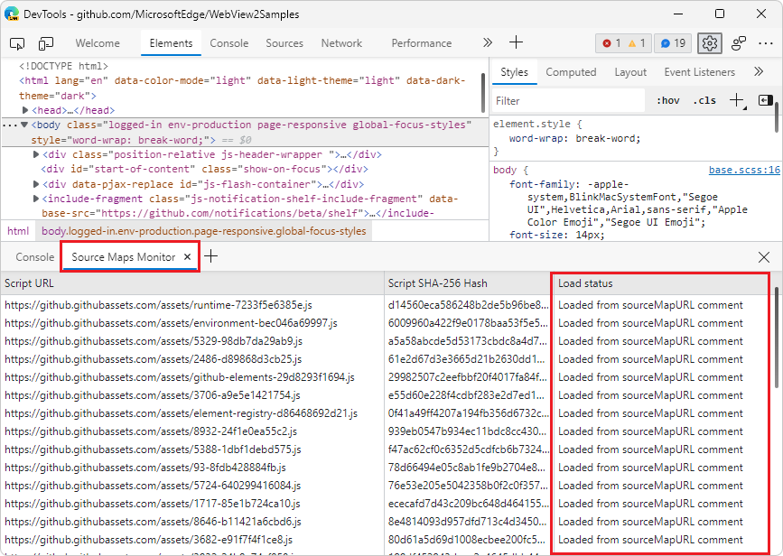
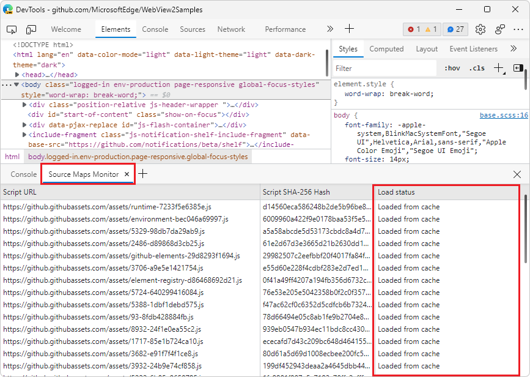
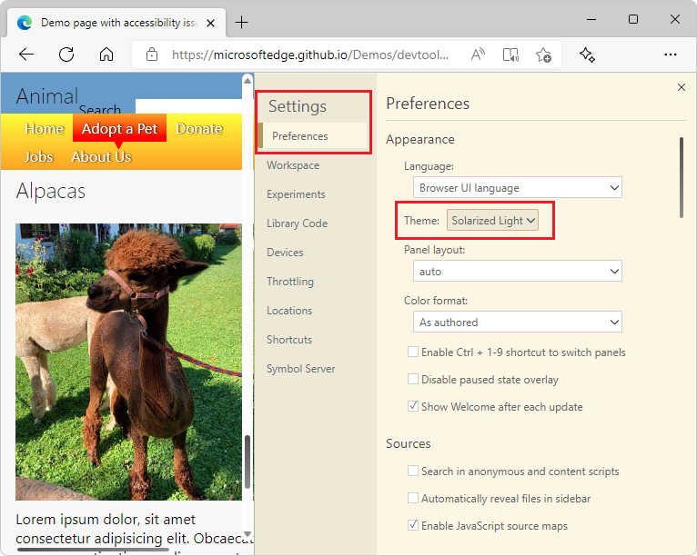

# What's New in DevTools (Microsoft Edge 101)

[!INCLUDE [Microsoft Edge team note for top of What's New](../../includes/edge-whats-new-note.md)]

<!-- ====================================================================== -->
## The Console tool is now available in Visual Studio Code

<!-- Title: Visual Studio Code extension now with Console tool -->
<!-- Subtitle: See log messages, run JavaScript, and use Console APIs right next to your code in Visual Studio Code. -->

The Console is one of the most popular tools in DevTools.  You can now access the Console tool in the Microsoft Edge Developer Tools extension for Visual Studio Code.  This integrated DevTools Console allows you to see your log messages right next to your code.  Using the Console, you can also:
*  Try out some JavaScript statements.
*  Access the window object.
*  Call the methods of the `Console` object, as described in [Console object API Reference](../../../console/api.md).
*  Use the Console utilities to access the DOM, as described in [Console tool utility functions and selectors](../../../console/utilities.md).

You can use the Console as the main tool, or use it together with the **Elements** and **Network** tools.

The Console tool in the main toolbar of the Microsoft Edge DevTools extension for Visual Studio Code:

The Console tool in the Drawer of the Microsoft Edge DevTools extension for Visual Studio Code:

For more information, see [Console integration](../../../../visual-studio-code/microsoft-edge-devtools-extension/console-integration.md).

<!-- ====================================================================== -->
## Source maps are now cached with IndexedDB

<!-- Title: Speed up debugging with cached source maps -->
<!-- Subtitle: DevTools now caches source maps with IndexedDB, reducing the need to fetch source maps on refresh. -->

In previous versions of Microsoft Edge, if you were hosting large source map files on your server or in [Azure Artifacts symbol server](../../../javascript/publish-source-maps-to-azure.md), DevTools would fetch these source maps every time the page refreshed.  Fetching these source maps repeatedly created more network requests for DevTools, and slowed down debugging.

In Microsoft Edge 101, DevTools caches source maps by using IndexedDB.  When you refresh the page, source maps are now served from the [IndexedDB](https://developer.mozilla.org/docs/Web/API/IndexedDB_API) cache, instead of being requested again from your server or the Azure Artifacts symbol server.  Use the **Load status** column in the [Source Maps Monitor tool](../../../source-maps-monitor/source-maps-monitor-tool.md) to verify that source maps are being loaded from the cache.  To clear the IndexedDB cache and force DevTools to reload source maps, run the **Clear source maps cache** command in the [Command Menu](../../../command-menu/index.md).

When you first load the webpage, the **Source Maps Monitor** tool shows that the source maps aren't cached yet:

When you reload the webpage, the **Source Maps Monitor** tool shows that the cached source maps are used:

<!-- ====================================================================== -->
## Tracking pending network requests when exporting HAR files

<!-- Title: Exporting HAR files from the Network tool now includes pending requests -->
<!-- Subtitle: Use the new "Status text" column and "Include pending requests in HAR files" option in the Network tool. -->

In Microsoft Edge 101, the new **Status text** column has been added to the **Network** tool.  The **Status text** column provides human-readable equivalent messages for the [HTTP status codes](https://developer.mozilla.org/docs/Web/HTTP/Status) that are reported in the **Status** column.

In addition, a new setting has been added to the Network tool: **Include pending requests in HAR file**.  If you need to record **Pending** network requests when exporting a HAR file in the Network tool, turn on the **Include pending requests in HAR file** setting.  The **Status text** column will now include the **(pending)** state for any pending network requests.

To learn more about the available columns in the request log, see [Network features reference > Add or remove columns](../../../network/reference.md#add-or-remove-columns).

<!-- ====================================================================== -->
## Updated UI and camera controls in 3D View

<!-- Title: Improvements to the 3D View tool -->
<!-- Subtitle: Check out 3D View for updates to the UI and smoother camera controls. -->

In Microsoft Edge 101, the **3D View** tool has two new buttons: **Pan view** () and **Rotate view** ().  Use these buttons to switch between panning around the canvas or rotating the canvas.  Click the **Pan view** or **Rotate view** button, and then drag in the desired direction with your mouse, or use the arrow keys.

The UI now provides a more uniform and intuitive experience.  The panes are organized more clearly, and accessibility issues have been fixed.

See [Navigate webpage layers, z-index, and DOM using the 3D View tool](../../../3d-view/index.md).

<!-- ====================================================================== -->
## Switching themes no longer requires reloading DevTools

<!-- Title: Switching themes in DevTools no longer requires reloading -->
<!-- Subtitle: Quickly try out themes from Visual Studio Code in DevTools. -->

In previous versions of Microsoft Edge, switching themes in DevTools required reloading DevTools to apply the new theme.  In Microsoft Edge 101, you can quickly try different themes without having to reload DevTools.

For more information about using themes from Visual Studio Code in DevTools, see [Apply a color theme to DevTools](../../../customize/theme.md).

<!-- ====================================================================== -->
## Announcements from the Chromium project

Microsoft Edge 101 also includes the following updates from the Chromium project:

* [View cascade layers in the Styles pane](https://developer.chrome.com/blog/new-in-devtools-101/#layer)<!-- checking -->
* [Support for the hwb() color function](https://developer.chrome.com/blog/new-in-devtools-101/#hwb)
* [Improved the display of private properties](https://developer.chrome.com/blog/new-in-devtools-101/#private-props)

<!-- ====================================================================== -->
<!-- uncomment if content is copied from developer.chrome.com to this page -->

<!-- > [!NOTE]
> Portions of this page are modifications based on work created and [shared by Google](https://developers.google.com/terms/site-policies) and used according to terms described in the [Creative Commons Attribution 4.0 International License](https://creativecommons.org/licenses/by/4.0).
> The original page for announcements from the Chromium project is [What's New in DevTools (Chrome 101)](https://developer.chrome.com/blog/new-in-devtools-101) and is authored by [Jecelyn Yeen](https://developers.google.com/web/resources/contributors#jecelynyeen) (Developer advocate working on Chrome DevTools at Google). -->

<!-- ====================================================================== -->
<!-- uncomment if content is copied from developer.chrome.com to this page -->

<!-- 
This work is licensed under a [Creative Commons Attribution 4.0 International License](https://creativecommons.org/licenses/by/4.0). -->
