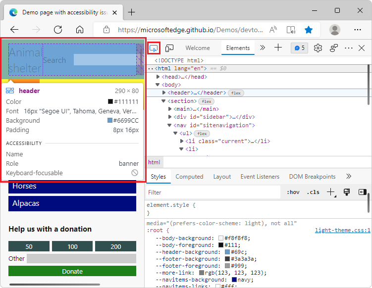

# What's New in DevTools (Microsoft Edge 102)

[!INCLUDE [Microsoft Edge team note for top of What's New](../../includes/edge-whats-new-note.md)]

> [!TIP]
> The **Microsoft Build 2022** conference was on May 24-26.  Learn more about new features for memory, performance, and production debugging in DevTools and new capabilities in the web platform for PWAs in the following videos:
> * [Tips for debugging memory, performance, & production issues](https://www.youtube.com/watch?v=hdrR0QwXpuc)
> * [Microsoft Edge | Build 2022: Enriching desktop experiences with the power and reach of the web](https://www.youtube.com/watch?v=ahO5nePl4BQ)

<!-- ====================================================================== -->
## DevTools extension: New browser with device and mode emulation and sourcemap support

<!-- Title: New browser preview and sourcemap support in Visual Studio Code -->
<!-- Subtitle: Emulate devices and different rendering modes and debug Sass/React. -->

The Microsoft Edge DevTools extension for Visual Studio Code now has a browser preview that allows you to emulate different devices.  Click the new **Emulate CSS media features** () button, to preview the current project in different modes, such as Dark, Light, Print, and High Contrast:

Click the new **Emulate vision deficiencies** () button to easily test accessibility, such as showing what the webpage looks like with blurred vision or color vision deficiencies.

Other new features include a simpler way to toggle CSS mirroring, which now also supports sourcemaps.  This means that you can debug and modify CSS created by Sass, React, and other abstractions live in the browser and see the changes in the source files.

See also:
* [Device and state emulation](../../../../visual-studio-code/microsoft-edge-devtools-extension/device-state-emulation.md)
* [Map the processed code to your original source code, for debugging](../../../javascript/source-maps.md)
* [CSS Mirror Editing with Sourcemaps: Known Issues and Feedback](https://github.com/microsoft/vscode-edge-devtools/issues/965)

<!-- ====================================================================== -->
## Save all strings from a heap snapshot to JSON

<!-- Title: Export string objects from a heap snapshot -->
<!-- Subtitle: Use the new "Save all to file" button to save string objects to a JSON file. -->

In Microsoft Edge 102, when taking a heap snapshot in the **Memory** tool, you can now export all string objects from the snapshot to a JSON file.  In the **Memory** tool, in the **Constructor** section, click the new **Save all to file** button next to the `(string)` entry.

The **Memory** tool exports a JSON file that contains all of the string objects from the heap snapshot:

See also:
* [Save and export strings from a heap snapshot to JSON](../../../memory-problems/heap-snapshots.md#save-and-export-strings-from-a-heap-snapshot-to-json) in _Record heap snapshots using the Memory tool_.

<!-- ====================================================================== -->
## New filters for retainers in the Memory tool

<!-- Title: Debug retainers more easily in the Memory tool -->
<!-- Subtitle: Use new filters in the Retainers section of a heap snapshot to simplify retainer paths. -->

In previous versions of Microsoft Edge, cycles and internal nodes were displayed in the **Retainers** section of a heap snapshot.
To help simplify the retainer path, in Microsoft Edge 102, the **Retainers** section in the **Memory** tool now has new filters to hide cycles and to hide internal nodes in the retainer path.

In the **Retainers** section, a cycled node is indicated by being grayed out.

In the following image, in the **Filter edges** dropdown menu, **Hide cycled** is not selected, so a cycled node (grayed out) is displayed:

In the following image, in the **Filter edges** dropdown menu, **Hide cycled** is selected, so the cycled node is not displayed:

_Cycles_ are nodes that appear at least twice in a retainer path.
One appearance of a node is earlier in the retainer path, and other appearances of that node are later in the retainer path.
To free up memory, it's most important to remove the occurrence of the node which appears first in the retainer path.
The second and potentially subsequent appearances of the node are still displayed in the **Retainers** section.

_Internal nodes_ are objects that are specific to V8 (the JavaScript engine in Microsoft Edge).  Internal nodes are also displayed in the **Retainers** section.

See also:
* [Hide cycles](../../../memory-problems/heap-snapshots.md#hide-cycles) in _Record heap snapshots using the Memory tool_.

<!-- ====================================================================== -->
## The Inspect element tooltip can now be persisted until you dismiss it

<!-- Title: Improving the Inspect element tooltip -->
<!-- Subtitle: The Inspect element tooltip now persists until you dismiss it, improving accessibility and ease of use. -->

Previously, in the **Elements** tool, the overlay for the node that you selected only displayed on hover when you used the **Inspect tool** ().  The previous design was difficult to use with a screen magnifier or other assistive technologies.

In Microsoft Edge 102, when using the **Inspect** tool and moving around the rendered webpage, you can keep the current **Inspect** overlay displayed.  Press and hold **Ctrl+Alt** (Windows, Linux) or **Ctrl+Option** (macOS) while you move around in the rendered webpage.  The existing tooltip and grid color overlay for the **Inspect** tool remains displayed while you hover over different parts of the rendered webpage:

Also, you can now press **Ctrl** to hide the Inspect tool's overlay while you move the mouse pointer over the rendered webpage.

For the history of this feature in the Chromium open-source project, see Issue [1316208](https://crbug.com/1316208).

See also:
*  [Persisting the Inspect tool's tooltip and grid color overlay](../../../css/inspect.md#persisting-the-inspect-tools-tooltip-and-grid-color-overlay) in _Analyze pages using the Inspect tool_.
*  [Persisting the Inspect tool's tooltip and grid color overlay](../../../accessibility/navigation.md#persisting-the-inspect-tools-tooltip-and-grid-color-overlay) in _Navigate DevTools with assistive technology_.

<!-- ====================================================================== -->
## Improved rendering of dropdown menus, buttons, and icons in high-contrast mode

<!-- Title: Accessibility improvements for high contrast mode -->
<!-- Subtitle: Dropdown menu in the Issues tool, buttons in the Detached Elements tool, and the Activity Bar in Focus Mode now display better in high contrast. -->

In previous versions of Microsoft Edge, the following items didn't render correctly in high-contrast mode:
*  Dropdown menus in the **Issues** tool.
*  Buttons in the **Detached Elements** tool.
*  The **Activity Bar** in Focus Mode.

In Microsoft Edge 102, these issues have been fixed.

The **Issues** tool's menus are displayed correctly in high-contrast mode:

The **Detached Elements** tool's UI is displayed correctly in high-contrast mode:

The **Activity Bar** and **Quick View** panel (when using Focus Mode) are displayed correctly in high-contrast mode:

See also:
* [Navigate DevTools with assistive technology](../../../accessibility/navigation.md)
* [Windows high contrast mode](/fluent-ui/web-components/design-system/high-contrast)

<!-- ====================================================================== -->
## Learn about experiments in DevTools from Settings

<!-- Title: Help icons for Experiments checkboxes -->
<!-- Subtitle: In Settings > Experiments page, each experimental feature's checkbox has a Help (?) icon next to it for more information.. -->

In the **Settings** > **Experiments** page, each experiment now has a **Help** () button:

To get more information about an experimental feature, click the corresponding **Help** () button.  The **Help** button displays the relevant section of the [Experimental features in Microsoft Edge DevTools](../../../experimental-features/index.md) article.

<!-- ====================================================================== -->
## Better layout of Network settings when narrow

<!-- Title: Better support for the Network tool in narrow layouts -->
<!-- Subtitle: The settings in the Network tool no longer overlap when the DevTools are narrow. -->

In previous versions of Microsoft Edge, opening **Network settings** with the gear icon in the **Network** tool would overlap when the DevTools were very narrow:

In Microsoft Edge 102, this issue has been fixed.  The individual settings now display better in narrow layouts:

See also:
* [Capture screenshots during page load](../../../network/reference.md#capture-screenshots-during-page-load) in _Network features reference_, about configurable settings of the Network tool.

<!-- ====================================================================== -->
## Announcements from the Chromium project

Microsoft Edge 102 also includes the following updates from the Chromium project:

* [New shortcuts to emulate light and dark themes](https://developer.chrome.com/blog/new-in-devtools-102/#emulation)
* [Improved security on the Network Preview tab](https://developer.chrome.com/blog/new-in-devtools-102/#network-preview)
* [Improved reloading at breakpoint](https://developer.chrome.com/blog/new-in-devtools-102/#debugger)
* [Console updates](https://developer.chrome.com/blog/new-in-devtools-102/#console)
   * [Handle script execution errors in the Console](https://developer.chrome.com/blog/new-in-devtools-102/#errors)
   * [Commit live expression with Enter](https://developer.chrome.com/blog/new-in-devtools-102/#live-expression)
* [Display inherited highlight pseudo-elements in the Styles pane](https://developer.chrome.com/blog/new-in-devtools-102/#pseudo)
* [[Experimental] Copy CSS changes](https://developer.chrome.com/blog/new-in-devtools-102/#copy)
* [[Experimental] Picking color outside of browser](https://developer.chrome.com/blog/new-in-devtools-102/#color-picker)

<!-- ====================================================================== -->
<!-- uncomment if content is copied from developer.chrome.com to this page -->

<!-- > [!NOTE]
> Portions of this page are modifications based on work created and [shared by Google](https://developers.google.com/terms/site-policies) and used according to terms described in the [Creative Commons Attribution 4.0 International License](https://creativecommons.org/licenses/by/4.0).
> The original page for announcements from the Chromium project is [What's New in DevTools (Chrome 102)](https://developer.chrome.com/blog/new-in-devtools-102) and is authored by [Jecelyn Yeen](https://developers.google.com/web/resources/contributors#jecelynyeen) (Developer advocate working on Chrome DevTools at Google). -->

<!-- ====================================================================== -->
<!-- uncomment if content is copied from developer.chrome.com to this page -->

<!-- 
This work is licensed under a [Creative Commons Attribution 4.0 International License](https://creativecommons.org/licenses/by/4.0). -->
