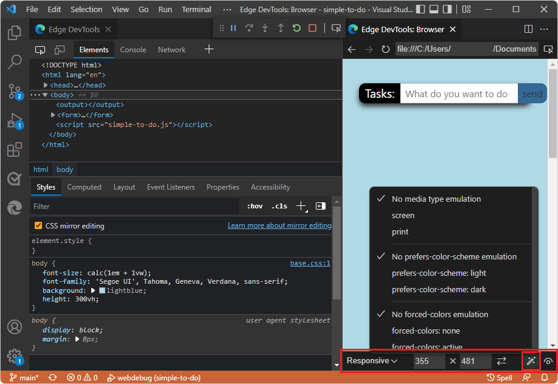

# What's New in DevTools (Microsoft Edge 102)

[!INCLUDE [Microsoft Edge team note for top of What's New](../../includes/edge-whats-new-note.md)]

<!-- ====================================================================== -->
## DevTools extension: New browser with device and mode emulation and sourcemap support

<!-- Title: New browser preview and sourcemap support in Visual Studio Code -->
<!-- Subtitle: Emulate devices and different rendering modes and debug Sass/React. -->

The Microsoft Edge DevTools extension for Visual Studio Code now has a new browser preview that allows you to enable<!--select?--> different devices.  You can also preview the current project in different modes like Dark, Light, Print, and High Contrast.  To make accessibility testing easier, you can also show a blurred version or simulate different color deficiencies.  

Other new features include a simpler way to toggle CSS mirroring, which now also supports sourcemaps.  This means that you can debug and modify CSS created by Sass, React, and other abstractions live in the browser and see the changes in the source files.

<!-- Instructions for screenshot
For the new screencast/browser we have this in docs:
https://docs.microsoft.com/en-us/microsoft-edge/visual-studio-code/microsoft-edge-devtools-extension#device-and-state-emulation -->

<!-- Video recording of feature in action
See work item -->

See also:
* [Device and state emulation](https://docs.microsoft.com/en-us/microsoft-edge/visual-studio-code/microsoft-edge-devtools-extension#device-and-state-emulation) in _Microsoft Edge DevTools extension for Visual Studio Code_.
* [CSS Mirror Editing with Sourcemaps: Known Issues and Feedback](https://github.com/microsoft/vscode-edge-devtools/issues/965).

<!-- ====================================================================== -->
## Save all strings from a heap snapshot to JSON

<!-- Title: Export string objects from a heap snapshot -->
<!-- Subtitle: Use the new "Save all to file" button to save string objects to a JSON file. -->

In Microsoft Edge 102, when taking a heap snapshot in the Memory tool, you can now export all string objects from the snapshot to a JSON file. From the Memory tool, select the new **Save all to file** button next to the `(string)` entry in the Constructor section. The Memory tool will export a JSON file containing all of the string objects from the heap snapshot. 

<!-- Instructions for screenshot
1. In Microsoft Edge Canary/Dev, navigate to edge://version and ensure you're on 102+.
2. Navigate to a Word doc in Word online: Word (office.com) (doesn't have to be this website but you want something that'll produce (string) objects.
3. Open DevTools > Memory.
4. Take a heap snapshot.
5. In the Constructor section, scroll to the (string) entry.
6. Take a screenshot and highlight the "Save all to file" button.
7. Optionally, you can save the downloaded JSON file and open it in VS Code and take a screenshot of that as well.
-->

<!-- Video recording of feature in action
Refer to attachment -->

See also:
* [Record heap snapshots using the Memory tool](../../../memory-problems/heap-snapshots.md)
<!-- todo: update regular docs:
*  break out (string) specifically 
*  talk about the new "Save all to file" button
-->

<!-- ====================================================================== -->
## New filters for retainers in the Memory tool

<!-- Title: Debug retainers more easily in the Memory tool -->
<!-- Subtitle: Use new filters in the Retainers section of a heap snapshot to simplify retainer paths. -->

In previous versions of Microsoft Edge, cycles and internal nodes were displayed in the **Retainers** section of a heap snapshot.
To help simplify the retainer path, in Microsoft Edge 102, the **Retainers** section in the **Memory** tool now has new filters to hide cycles and to hide internal nodes in the retainer path.

<!-- Instructions for screenshot
(how to configure the DevTools correctly, a website or CodePen that the writer can use, where to navigate in the DevTools UI for the screenshot, etc.)
In Edge Canary/Dev, navigate to edge://verson and ensure you're on version 102+
Open DevTools > Memory and take a heap snapshot
In the Retainers section, set the "Filter edges" dropdown to not select "Hide internal" or "Hide cycled"
Now expand the Retainers section until you find a grayed out entry (this indicates a cycle)
Image
5. Now in the "Filter edges" dropdown, select "Hide cycled". Those grayed out entries will no longer appear.
Image
Take a screenshot before and after with the filter
draw red boxes around what was there before (grayed out)
-->

_Cycles_ are nodes that appear at least twice in a retainer path.
One appearance of a node is earlier in the retainer path, and other appearances of that node are later in the retainer path.
To free up memory, it's most important to remove the occurrence of the node which appears first in the retainer path.
The second and potentially subsequent appearances of the node are still displayed in the **Retainers** section.

_Internal nodes_ are objects that are specific to V8 (the JavaScript engine in Microsoft Edge).  Internal nodes are also displayed in the **Retainers** section.

<!--
Video recording of feature in action
Refer to attachment
-->

See also:
* [Cycles](../../../memory-problems/memory-101.md#cycles) in _Memory terminology_.
<!-- todo: update regular docs:
*  Add how to use the filters to hide cycles.
-->

<!-- ====================================================================== -->
## Improved Inspect tool accessibility: The Inspect element tooltip now persists until you dismiss it

<!-- Title: Improving the Inspect element tooltip -->
<!-- Subtitle: The Inspect element tooltip now persists until you dismiss it, improving accessibility and ease of use. -->

Previously, in the **Elements** tool, the hover overlay for the node that you selected constantly changed when you used the **Select Element** feature.
The previous design was difficult to use with a screen magnifier.

When using the **Inspect** tool, to keep the node (and overlay) selected,<!--?--> there's now a `Ctrl`+`Alt` key modifier.
Now, if you hold down `Ctrl`+`Alt`, when you move the mouse pointer over the rendered webpage, the existing tooltip and grid color overlay for the Inspect tool remains, as if locked.

Also, you can now press `Ctrl`<!--?--> to hide the Inspect tool's tooltip overlay while you move the mouse pointer over the rendered webpage.

<!-- screenshot instructions:
1. Set magnifier in windows settings to > 200%.
2. Inspect the web page (microsoft.com is fine).
3. Make sure the Elements tool tab is open.
4. Click the Inspect element tool.
5. Move to the content of the rendered webpage (not inside devtools).
6. Try navigating without key modifiers.  You will start going through nodes/elements as soon as mouse starts moving.
After the fix:
Element keeps selected and you can move the mouse around (allowing you to navigate the screen and keep context)
-->

<!-- work item has GIF -->

For the history of this feature in the Chromium open-source project, see Issue [1316208](https://crbug.com/1316208).

See also:
*  [Analyze pages using the Inspect tool](https://docs.microsoft.com/en-us/microsoft-edge/devtools-guide-chromium/css/inspect)
*  [Navigate DevTools with assistive technology](https://docs.microsoft.com/en-us/microsoft-edge/devtools-guide-chromium/accessibility/navigation)

<!-- ====================================================================== -->
## Improving accessibility in high contrast mode

<!-- Title: Accessibility improvements for high contrast mode -->
<!-- Subtitle: Dropdown menu in the Issues tool, buttons in the Detached Elements tool, and the activity bar in Focus Mode now display better in high contrast. -->

In previous versions of Microsoft Edge, the following items didn't render correctly in high-contrast mode:
*  Dropdown menus in the **Issues** tool.
*  Buttons in the **Detached Elements** tool.
*  The **Activity Bar** in Focus Mode.

In Microsoft Edge 102, these issues have been fixed.

<!-- Instructions for screenshot
Refer to the GIFs in: PR: Fix high contrast colors in Issues dropdown menus
And the screenshots in: PR: [A11y] Various high contrast fixes

To show the current behavior, put Windows in a contrast theme by opening **Windows settings** > **Accessibility** > **Contrast themes**.
Open DevTools. Not in Focus Mode, take screenshots of the Detached Elements tool and the dropdown menus in the Issues tool. In Focus Mode, take screenshots of the Activity Bar.
-->
 
<!-- Video recording of feature in action
Refer to the attachments -->

See also:
* [Navigate DevTools with assistive technology](../../../accessibility/navigation.md)

<!-- ====================================================================== -->
## Learn about experiments in DevTools from Settings

<!-- Title: Help icons for Experiments checkboxes -->
<!-- Subtitle: In Settings > Experiments page, each experimental feature's checkbox has a Help (?) icon next to it for more information.. -->

In the **Settings** > **Experiments** page, checkboxes now have a Help  icon:

Click a Help icon to get more information about an experimental feature.  The Help icon opens the relevant section in [Experimental features](../../../experimental-features/index.md).

<!--
Video recording of feature in action
See attachment
-->

<!-- ====================================================================== -->
## Better layout of Network settings when narrow

<!-- Title: Better support for the Network tool in narrow layouts -->
<!-- Subtitle: The settings in the Network tool no longer overlap when the DevTools are narrow. -->

In previous versions of Microsoft Edge, opening **Network settings** with the gear icon in the **Network** tool would overlap when the DevTools were very narrow.  In Microsoft Edge 102, this issue has been fixed.  The individual settings now display better in narrow layouts.

<!-- Instructions for screenshot
(how to configure the DevTools correctly, a website or CodePen that the writer can use, where to navigate in the DevTools UI for the screenshot, etc.)
In Microsoft Edge Canary/Dev, navigate to edge://version and ensure you're on 102+
Open DevTools and undock them
Switch to Network tool
Open Network settings by selecting the gear icon in the Network tool
Make the DevTools very narrow
Repeat Steps 2-3 in Microsoft Edge Stable (ensure you're on version 101) and you should see that the settings overlap with each other. -->

<!-- Video recording of feature in action
Refer to attachments -->

See also:
* [Capture screenshots during page load](https://docs.microsoft.com/microsoft-edge/devtools-guide-chromium/network/reference#capture-screenshots-during-page-load) in _Network features reference_, about configurable settings of the Network tool.

<!-- ====================================================================== -->
## Announcements from the Chromium project

Microsoft Edge 102 also includes the following updates from the Chromium project:

* [Preview feature: New Performance insights panel](https://developer.chrome.com/blog/new-in-devtools-102/#perf)
* [New shortcuts to emulate light and dark themes](https://developer.chrome.com/blog/new-in-devtools-102/#emulation)
* [Improved security on the Network Preview tab](https://developer.chrome.com/blog/new-in-devtools-102/#network-preview)
* [Improved reloading at breakpoint](https://developer.chrome.com/blog/new-in-devtools-102/#debugger)
* [Console updates](https://developer.chrome.com/blog/new-in-devtools-102/#console)
   * [Handle script execution errors in the Console](https://developer.chrome.com/blog/new-in-devtools-102/#errors)
   * [Commit live expression with Enter](https://developer.chrome.com/blog/new-in-devtools-102/#live-expression)
* [Cancel user flow recording at the start](https://developer.chrome.com/blog/new-in-devtools-102/#recorder)
* [Display inherited highlight pseudo-elements in the Styles pane](https://developer.chrome.com/blog/new-in-devtools-102/#pseudo)
* [Miscellaneous highlights](https://developer.chrome.com/blog/new-in-devtools-102/#misc)
* [[Experimental] Copy CSS changes](https://developer.chrome.com/blog/new-in-devtools-102/#copy)
* [[Experimental] Picking color outside of browser](https://developer.chrome.com/blog/new-in-devtools-102/#color-picker)

<!-- ====================================================================== -->
<!-- uncomment if content is copied from developer.chrome.com to this page -->

<!-- > [!NOTE]
> Portions of this page are modifications based on work created and [shared by Google](https://developers.google.com/terms/site-policies) and used according to terms described in the [Creative Commons Attribution 4.0 International License](https://creativecommons.org/licenses/by/4.0).
> The original page for announcements from the Chromium project is [What's New in DevTools (Chrome 102)](https://developer.chrome.com/blog/new-in-devtools-102) and is authored by [Jecelyn Yeen](https://developers.google.com/web/resources/contributors#jecelynyeen) (Developer advocate working on Chrome DevTools at Google). -->

<!-- ====================================================================== -->
<!-- uncomment if content is copied from developer.chrome.com to this page -->

<!-- 
This work is licensed under a [Creative Commons Attribution 4.0 International License](https://creativecommons.org/licenses/by/4.0). -->
