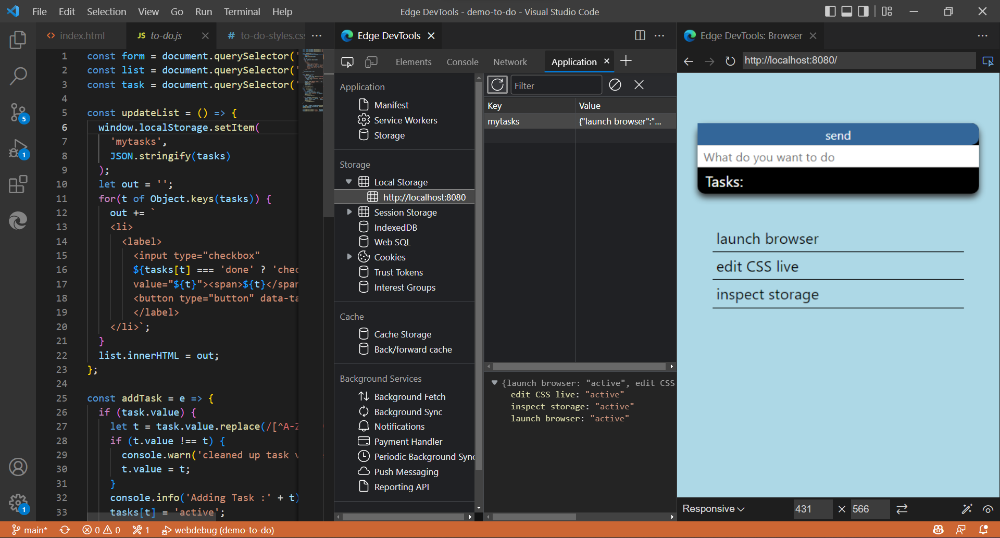
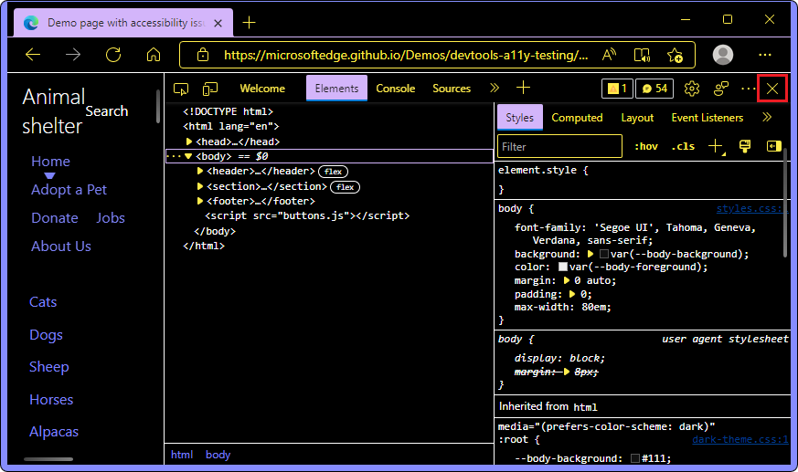
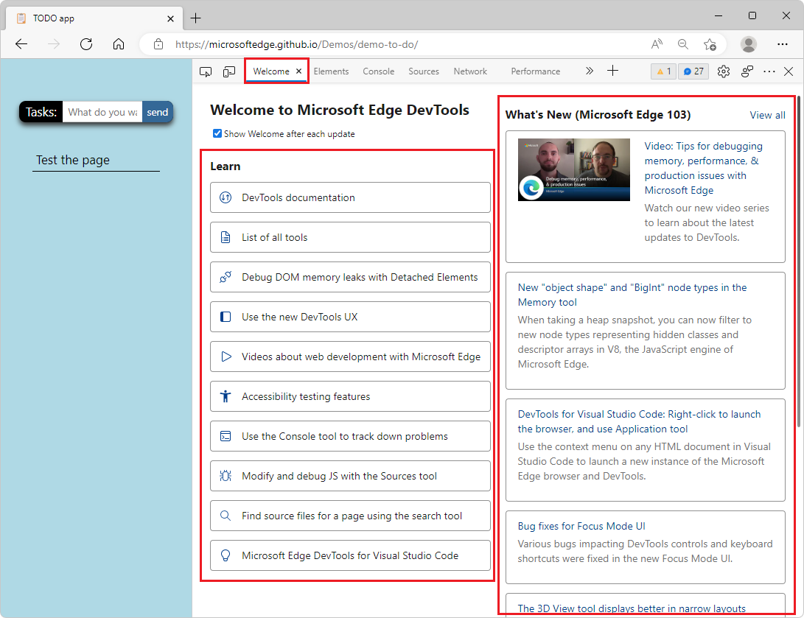

# What's New in DevTools (Microsoft Edge 103)

[!INCLUDE [Microsoft Edge team note for top of What's New](../../includes/edge-whats-new-note.md)]

<!-- ====================================================================== -->
## New node types in the Memory tool

<!-- Title: New "object shape" and "BigInt" node types in the Memory tool -->
<!-- Subtitle: When taking a heap snapshot, you can now filter to new node types representing hidden classes and descriptor arrays in V8, the JavaScript engine of Microsoft Edge. -->

In Microsoft Edge 103, when taking a heap snapshot in the **Memory** tool, there are two new node types:
*  **BigInt** - Used to represent and manipulate values that are too large to be represented by the **Number** node type.  See [BigInt](https://developer.mozilla.org/docs/Web/JavaScript/Reference/Global_Objects/BigInt).
*  **Object shape** - Refers to the hidden classes and descriptor arrays that V8 (the JavaScript engine of Microsoft Edge) uses to understand and index the properties on objects.  See [HiddenClasses and DescriptorArrays](https://v8.dev/blog/fast-properties#hiddenclasses-and-descriptorarrays) in _Fast properties in V8_.

For history, see [Issue 12769: Improve categorization of objects in heap snapshots](https://bugs.chromium.org/p/v8/issues/detail?id=12769).

See also:
* [Constructor entries in the Summary view](../../../memory-problems/heap-snapshots.md#constructor-entries-in-the-summary-view) in _Record heap snapshots using the Memory tool_.

<!-- ====================================================================== -->
## Launch the browser from an HTML file and use the Application tool within Visual Studio Code

<!-- Title: DevTools for Visual Studio Code: Right-click to launch, and Application tool -->
<!-- Subtitle: Use the context menu on any HTML document in Visual Studio Code to launch a new instance of the Microsoft Edge browser and DevTools. -->

To make it easier to start a new embedded instance of Microsoft Edge from within Visual Studio Code, when you right-click an HTML file in the **Explorer**, there's now an **Open with Edge** submenu that has the commands **Open Browser** and **Open Browser with DevTools**:

You can now also use the **Application** tool to gain insights into the storage and service worker information of your project, without leaving Visual Studio Code:

See also:
* [Microsoft Edge DevTools extension for Visual Studio Code](../../../../visual-studio-code/microsoft-edge-devtools-extension.md)
<!-- * [Microsoft Edge DevTools for Visual Studio Code](https://aka.ms/devtools-for-code) at Marketplace -->

<!-- ====================================================================== -->
## Bug fixes for Focus Mode UI

<!-- Title: Bug fixes for Focus Mode UI -->
<!-- Subtitle: Various bugs impacting DevTools controls and keyboard shortcuts were fixed in the new Focus Mode UI. -->

In the new **Focus Mode** DevTools UI, various bugs affecting controls and keyboard shortcuts for DevTools have been resolved:
*  Improved behavior of collapsible panes such as **Styles** in the **Elements** tool.
*  Fixed some instances in which the name of an open tool wasn't visible.
*  Improved reliability of **Quick View** controls.
*  Improved behavior of opening DevTools by using keyboard shortcuts.
*  Fixed an issue with navigating to a specific line of code in the **Sources** tool by using keyboard shortcuts.
*  Restored the keyboard shortcut to open **Search** in the **Quick View** panel, which is **Ctrl+Shift+F** (Windows, Linux) or **Command+Option+F** (macOS):

<!-- ====================================================================== -->
## The 3D View tool responds better in narrow layouts

<!-- Title: 3D View: Now with more responsive design -->
<!-- Subtitle: The 3D View toolbar now wraps around in a narrower window. -->

In previous versions of Microsoft Edge, the **3D View** tool didn't display correctly in narrow layouts.  The toolbar options were cut off when DevTools was narrow.  In Microsoft Edge 103, this issue has been fixed.  The toolbar options in **3D View** now stack when the width of the DevTools window is decreased:

See also:
* [Navigate webpage layers, z-index, and DOM using the 3D View tool](../../../3d-view/index.md)

<!-- ====================================================================== -->
## Fix: The Close button for DevTools is now accessible in high contrast mode

<!-- Title: Fix: In high contrast mode, the Close button for DevTools is now accessible -->
<!-- Subtitle: In previous versions of Microsoft Edge, the Close button wasn't visible in high contrast mode, but this issue has been fixed in Microsoft Edge 103. -->

In previous versions of Microsoft Edge, the **Close** button for DevTools didn't render correctly in high contrast mode.  In Microsoft Edge 103, this issue has been fixed.  The **Close** () button for DevTools is displayed correctly in high contrast mode:

See also:
* [Navigate DevTools with assistive technology](../../../accessibility/navigation.md)
* [Windows high contrast mode](/fluent-ui/web-components/design-system/high-contrast)

<!-- ====================================================================== -->
## Redesigned Welcome tool

<!-- Title: Welcome tool has expanded content and videos -->
<!-- Subtitle: The redesigned Welcome tool has expanded Learn and What's New sections, including a new video series. -->

In Microsoft Edge 103, the **Welcome** tool has a new, modern design with improved and expanded content.  It's easier than ever to find documentation, videos, and information about new features and bug fixes.

*  In the **Learn** section, use the links to quickly jump to documentation for common tasks in DevTools.

*  In the **What's New** section, find out about the latest changes, new features, and bug fixes.

*  In both sections, learn about existing and new web development features through our new video series, [Videos about web development with Microsoft Edge](../../../../dev-videos/index.md).

See also:
* [Welcome tool](../../../welcome/welcome-tool.md)

<!-- ====================================================================== -->
## Announcements from the Chromium project

Microsoft Edge 103 also includes the following updates from the Chromium project:

* [Reorder panes in the Elements panel](https://developer.chrome.com/blog/new-in-devtools-103/#reorder-pane)
* [Picking a color outside of the browser](https://developer.chrome.com/blog/new-in-devtools-103/#color)
* [Improved inline value preview during debugging](https://developer.chrome.com/blog/new-in-devtools-103/#inline-preview)
* [Support large blobs for virtual authenticators](https://developer.chrome.com/blog/new-in-devtools-103/#webauthn)
* [New keyboard shortcuts in the Sources panel](https://developer.chrome.com/blog/new-in-devtools-103/#shortcuts)
* [Sourcemaps improvements](https://developer.chrome.com/blog/new-in-devtools-103/#sourcemaps)

<!-- ====================================================================== -->
<!-- uncomment if content is copied from developer.chrome.com to this page -->

<!-- > [!NOTE]
> Portions of this page are modifications based on work created and [shared by Google](https://developers.google.com/terms/site-policies) and used according to terms described in the [Creative Commons Attribution 4.0 International License](https://creativecommons.org/licenses/by/4.0).
> The original page for announcements from the Chromium project is [What's New in DevTools (Chrome 103)](https://developer.chrome.com/blog/new-in-devtools-103) and is authored by [Jecelyn Yeen](https://developers.google.com/web/resources/contributors#jecelynyeen) (Developer advocate working on Chrome DevTools at Google). -->

<!-- ====================================================================== -->
<!-- uncomment if content is copied from developer.chrome.com to this page -->

<!-- 
This work is licensed under a [Creative Commons Attribution 4.0 International License](https://creativecommons.org/licenses/by/4.0). -->
