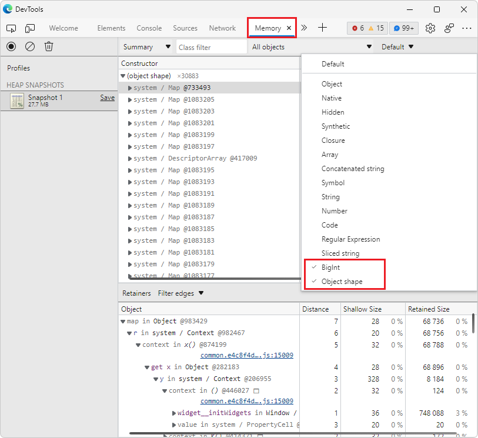

# What's New in DevTools (Microsoft Edge 103)

[!INCLUDE [Microsoft Edge team note for top of What's New](../../includes/edge-whats-new-note.md)]

> [!TIP]
> The **Microsoft Build 2022** conference was on May 24-26.  Learn more about new features for memory, performance, and production debugging in DevTools and new capabilities in the web platform for PWAs in the following videos:
> * [Tips for debugging memory, performance, & production issues](https://www.youtube.com/watch?v=hdrR0QwXpuc)
> * [Microsoft Edge | Build 2022: Enriching desktop experiences with the power and reach of the web](https://www.youtube.com/watch?v=ahO5nePl4BQ)

<!-- ====================================================================== -->
## New node types in the Memory tool

<!-- Title: New "object shape" and "BigInt" node types in the Memory tool -->
<!-- Subtitle: When taking a heap snapshot, you can now filter to new node types representing hidden classes and descriptor arrays in V8, the JavaScript engine of Microsoft Edge. -->

In Microsoft Edge 103, when taking a heap snapshot in the **Memory** tool, there are two new node types:
*  **BigInt** - Used to represent and manipulate values that are too large to be represented by the **Number** node type.
*  **Object shape** - Refers to the hidden classes and descriptor arrays that V8 (the JavaScript engine of Microsoft Edge) uses to understand and index the properties on objects. 

<!-- Instructions for screenshot
1. In Edge Canary, navigate to edge://version and ensure you're on version 103+.
2. Navigate to bing.com.
3. Open DevTools > Memory.
4. Take a heap snapshot.
5. In the "Default" dropdown for node types, filter out everything except the "object shape" and "BigInt" entries.
6. Expand the "object shape" entry in the heap snapshot.
7. Select the first entry to see the retainers.
see attachment  103-heap-snapshot-object-shape-node-type.png for a reference. -->

<!-- Video recording of feature in action
linked .mp4 attachment -->

<!-- PR 2019 to update Memory tool docs with info on these 2 new node types: Updated list of node types in heap snapshot for What's New 103 -->

For history, see [12769 - Improve categorization of objects in heap snapshots - v8 (chromium.org)](https://bugs.chromium.org/p/v8/issues/detail?id=12769).

See also:
* [Fast properties in V8](https://v8.dev/blog/fast-properties#hiddenclasses-and-descriptorarrays)
* [BigInt - JavaScript](https://developer.mozilla.org/docs/Web/JavaScript/Reference/Global_Objects/BigInt)

<!-- ====================================================================== -->
## DevTools extension for Visual Studio Code: Right-click an HTML file to launch, and Application tool

<!-- Title: DevTools for Visual Studio Code: Right-click to launch, and Application tool -->
<!-- Subtitle: Use the context menu on any HTML document in Visual Studio Code to launch a new instance of the Microsoft Edge browser and DevTools. -->

To make it easier to start a new embedded instance of Microsoft Edge from Visual Studio Code, when you right-click an HTML file in the **Explorer**, there's now an **Open with Edge** submenu that has the commands **Open Browser** and **Open with DevTools**:

Also, you can now also use the **Application** tool to gain insights into the storage and service worker information of your project, without leaving Visual Studio Code:

<!-- Video recording of feature in action
linked -->

See also:
* [Microsoft Edge DevTools extension for Visual Studio Code](../../../../visual-studio-code/microsoft-edge-devtools-extension.md)
<!-- * [Microsoft Edge DevTools for Visual Studio Code](https://aka.ms/devtools-for-code) at Marketplace -->

<!-- ====================================================================== -->
## Bug fixes for Focus Mode UI

<!-- Title: Bug fixes for Focus Mode UI -->
<!-- Subtitle: Various bugs impacting DevTools controls and keyboard shortcuts were fixed in the new Focus Mode UI. -->

In the new **Focus Mode** DevTools UI, various bugs affecting controls and keyboard shortcuts for DevTools have been resolved:
*  Improved behavior of collapsible tabs in the **Elements** tool.
*  Fixed some instances in which the name of an open tool was not visible.
*  Improved reliability of **Quick View** controls.
*  Improved behavior of opening DevTools by using keyboard shortcuts.
*  Fixed an issue with navigating to a specific line of code in the **Sources** tool by using keyboard shortcuts.
*  Restored the `Ctrl`+`Shift`+`F` shortcut to open **Search** in **Quick View**:<!-- todo: macOS keys? -->

See also:
* [Simplify DevTools using Focus Mode](../../../experimental-features/focus-mode.md)

<!-- ====================================================================== -->
## The 3D View tool responds better in narrow layouts

<!-- Title: 3D View: Now with more responsive design -->
<!-- Subtitle: The 3D View toolbar now wraps around in a narrower window. -->

As folks use the **3D View** tool more, especially with the addition of Composited Layers (formerly known as **Layers**), we have found opportunities to improve the UI based on your feedback.  We've made the layout of the 3D View toolbar more responsive so that your development isn't hindered even when DevTools is narrow.  Keep the feedback coming as you check out 3D View!

See also:
* [Navigate webpage layers, z-index, and DOM using the 3D View tool](../../../3d-view/index.md)

<!-- ====================================================================== -->
## Fix: The Close button for DevTools is now accessible in high-contrast mode

<!-- Title: Fix: In high contrast mode, the Close button for DevTools is now accessible -->
<!-- Subtitle: In previous versions of Microsoft Edge, the Close button was not visible in high contrast mode but this issue has been fixed in Microsoft Edge 103. -->

In previous versions of Microsoft Edge, the **Close** button for DevTools didn't render correctly in high-contrast mode.  In Microsoft Edge 103, this issue has been fixed.  The **Close** (`X`) button for DevTools is displayed correctly in high-contrast mode:

<!-- Instructions for screenshot
(how to configure the DevTools correctly, a website or CodePen that the writer can use, where to navigate in the DevTools UI for the screenshot, etc.)
Open Edge Stable and navigate to edge://version and ensure you're on version 102 or at least <103
From Windows Settings, navigate to Accessibility > Contrast themes and select the Night sky theme to apply
Open DevTools in Edge Stable. Note that the Close button won't be visible (you can still select it though).
Refer to the attachment for reference
Repeat the same steps in Edge Canary or Dev, just ensure the version is 103+. Refer to the attachment for reference. -->

<!-- Video recording of feature in action
.mp4 attachments -->

See also:
* [Navigate DevTools with assistive technology](../../../accessibility/navigation.md)
* [Windows High contrast mode](/fluent-ui/web-components/design-system/high-contrast)

<!-- ====================================================================== -->
## Redesigned Welcome tool

In Microsoft Edge 103, the **Welcome** tool has a new design with improved, expanded content.  It's easier than ever to find content and to contact the DevTools team.

*  In the **Learn** section, use the links to quickly jump to documentation for some common tasks in DevTools.

*  In the **What's New** section, find out about the latest changes, new features, and bug fixes in the DevTools with our _new video series_, or by using the links.

See also:
* [Welcome tool](../../../welcome/welcome-tool.md)
* [Videos about web development with Microsoft Edge](../../../../dev-videos/index.md)

<!-- ====================================================================== -->
## Announcements from the Chromium project

Microsoft Edge 103 also includes the following updates from the Chromium project:

* [Capture double-click and right-click events in the Recorder panel](https://developer.chrome.com/blog/new-in-devtools-103/#recorder)
* [New timespan and snapshot mode in the Lighthouse panel](https://developer.chrome.com/blog/new-in-devtools-103/#lighthouse)
* [Performance Insights updates](https://developer.chrome.com/blog/new-in-devtools-103/#performance)
   * [Improved zoom control in the Performance Insights panel](https://developer.chrome.com/blog/new-in-devtools-103/#zoom)
   * [Confirm to delete a performance recording](https://developer.chrome.com/blog/new-in-devtools-103/#delete)
* [Reorder panes in the Elements panel](https://developer.chrome.com/blog/new-in-devtools-103/#reorder-pane)
* [Picking a color outside of the browser](https://developer.chrome.com/blog/new-in-devtools-103/#color)
* [Improved inline value preview during debugging](https://developer.chrome.com/blog/new-in-devtools-103/#inline-preview)
* [Support large blobs for virtual authenticators](https://developer.chrome.com/blog/new-in-devtools-103/#webauthn)
* [New keyboard shortcuts in the Sources panel](https://developer.chrome.com/blog/new-in-devtools-103/#shortcuts)
* [Sourcemaps improvements](https://developer.chrome.com/blog/new-in-devtools-103/#sourcemaps)

<!-- ====================================================================== -->
<!-- uncomment if content is copied from developer.chrome.com to this page -->

<!-- > [!NOTE]
> Portions of this page are modifications based on work created and [shared by Google](https://developers.google.com/terms/site-policies) and used according to terms described in the [Creative Commons Attribution 4.0 International License](https://creativecommons.org/licenses/by/4.0).
> The original page for announcements from the Chromium project is [What's New in DevTools (Chrome 103)](https://developer.chrome.com/blog/new-in-devtools-103) and is authored by [Jecelyn Yeen](https://developers.google.com/web/resources/contributors#jecelynyeen) (Developer advocate working on Chrome DevTools at Google). -->

<!-- ====================================================================== -->
<!-- uncomment if content is copied from developer.chrome.com to this page -->

<!-- 
This work is licensed under a [Creative Commons Attribution 4.0 International License](https://creativecommons.org/licenses/by/4.0). -->
