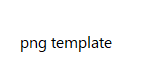

# What's New in DevTools (Microsoft Edge 105)

[!INCLUDE [Microsoft Edge team note for top of What's New](../../includes/edge-whats-new-note.md)]

<!-- ====================================================================== -->
## Focus Mode: Improved location controls for DevTools, Activity Bar, and Quick View

<!-- Title: Focus Mode: Improved location controls for DevTools, Activity Bar, and Quick View -->
<!-- Subtitle: Focus Mode: Improved location controls for DevTools, Activity Bar, and Quick View. -->

For users of Focus Mode, several improvements have been made to existing location controls for DevTools, including a new control for changing the orientation of Quick View.

The Settings menu provides options for changing DevTools between docked locations and a separate window. This menu also contains settings for how the Activity Bar is displayed. Starting in Edge 105, these options can be navigated and changed more quickly. The previous submenus have been replaced with toggle buttons. Additionally, improved contrast means the option you have selected is more easily visible at a glance.

Before:

After:

<!-- 
Screenshot 1, "before" in Edge 105: Ensure Focus Mode is enabled. Open Settings menu, then navigate to the docking submenu to show options.
Screenshot 1, "after" in Edge 104: Ensure Focus Mode is enabled. Open Settings menu to show DevTools docking location and Activity Bar location settings. -->

You can now change the orientation of the Quick View panel as well. To change Quick View to a vertical split, select the location toggle (**Dock Quick View to the right**). Selecting this toggle a second time will return Quick View to a horizontal split.

Before:

After:

<!-- 
Screenshot 2: Ensure Focus Mode is enabled. With Elements open in main panel and Console in Quick View, press the location toggle at the top right of Quick View to change its orientation to vertical. -->

To minimize Quick View, use the **Collapse** toggle or press `Escape`:

Before:

After:

<!-- Screenshot 3: Continuation of previous screenshot. Minimize Quick View in vertical orientation with with Esc keyboard shortcut. See below. -->

See also:
* [Simplify DevTools using Focus Mode](../../../experimental-features/focus-mode.md)

<!-- ====================================================================== -->
## Improved reliability in Issues tool

<!-- Title: Improved reliability in Issues tool -->
<!-- Subtitle: Improved reliability in Issues tool. -->

In previous versions of Microsoft Edge, there was a bug that sometimes resulted in issues not appearing in the **Issues** tool.  This bug has been fixed, resulting in improved reliability of the **Issues** tool.

<!-- See also:
* 
*  -->

<!-- ====================================================================== -->
## 3

<!-- Title:  -->
<!-- Subtitle: . -->

<!-- See also:
* 
*  -->

<!-- ====================================================================== -->
## 4

<!-- Title:  -->
<!-- Subtitle: . -->

<!-- See also:
* 
*  -->

<!-- ====================================================================== -->
## Announcements from the Chromium project

Microsoft Edge 105 also includes the following updates from the Chromium project:

* [Step-by-step replay in the Recorder](https://developer.chrome.com/blog/new-in-devtools-105/#recorder)
* [Support mouse over event in the Recorder panel](https://developer.chrome.com/blog/new-in-devtools-105/#recorder-hover)
* [Largest Contentful Paint (LCP) in the Performance insights panel](https://developer.chrome.com/blog/new-in-devtools-105/#lcp)
* [Identify flashes of text (FOIT, FOUT) as potential root causes for layout shifts](https://developer.chrome.com/blog/new-in-devtools-105/#foit-fout)
* [Protocol handlers in the Manifest pane](https://developer.chrome.com/blog/new-in-devtools-105/#manifest)
* [Top layer badge in the Elements panel](https://developer.chrome.com/blog/new-in-devtools-105/#top-layer)
* [Attach Wasm debugging information at runtime](https://developer.chrome.com/blog/new-in-devtools-105/#wasm)
* [Support live edit during debugging](https://developer.chrome.com/blog/new-in-devtools-105/#live-edit)
* [View and edit @scope at rules in the Styles pane](https://developer.chrome.com/blog/new-in-devtools-105/#scope)
* [Sourcemap improvements](https://developer.chrome.com/blog/new-in-devtools-105/#sourcemaps)
* [Miscellaneous highlights](https://developer.chrome.com/blog/new-in-devtools-105/#misc)

<!-- ====================================================================== -->
<!-- uncomment if content is copied from developer.chrome.com to this page -->

<!-- > [!NOTE]
> Portions of this page are modifications based on work created and [shared by Google](https://developers.google.com/terms/site-policies) and used according to terms described in the [Creative Commons Attribution 4.0 International License](https://creativecommons.org/licenses/by/4.0).
> The original page for announcements from the Chromium project is [What's New in DevTools (Chrome 105)](https://developer.chrome.com/blog/new-in-devtools-105) and is authored by [Jecelyn Yeen](https://developers.google.com/web/resources/contributors#jecelynyeen) (Developer advocate working on Chrome DevTools at Google). -->

<!-- ====================================================================== -->
<!-- uncomment if content is copied from developer.chrome.com to this page -->

<!-- 
This work is licensed under a [Creative Commons Attribution 4.0 International License](https://creativecommons.org/licenses/by/4.0). -->
