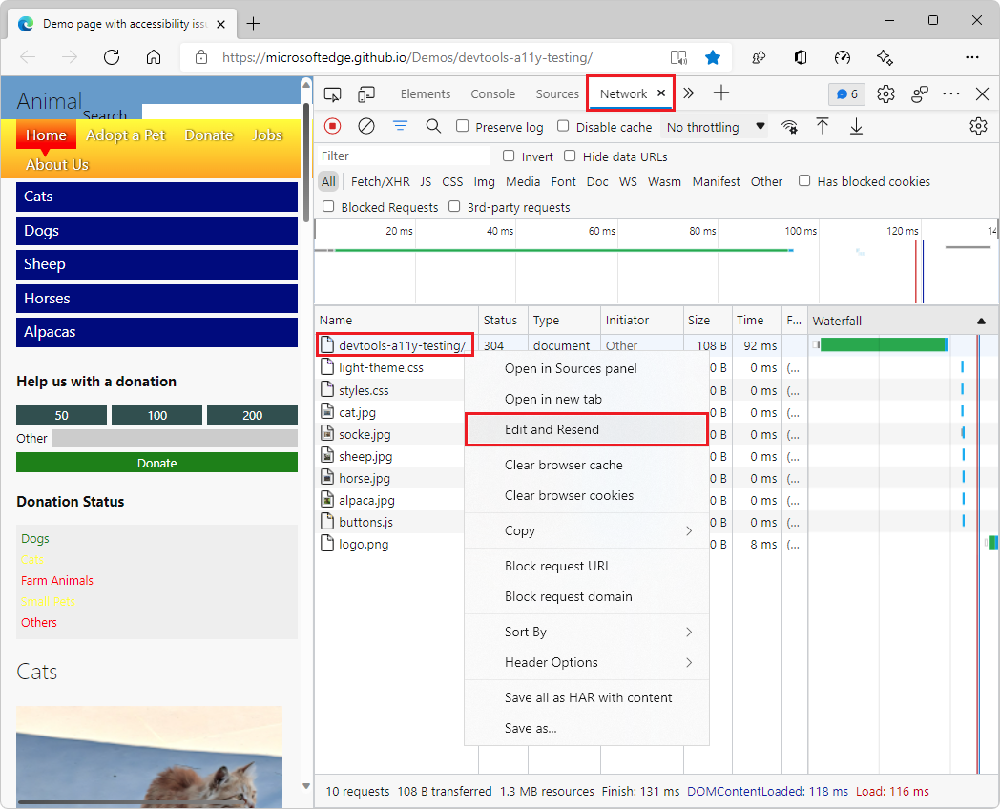
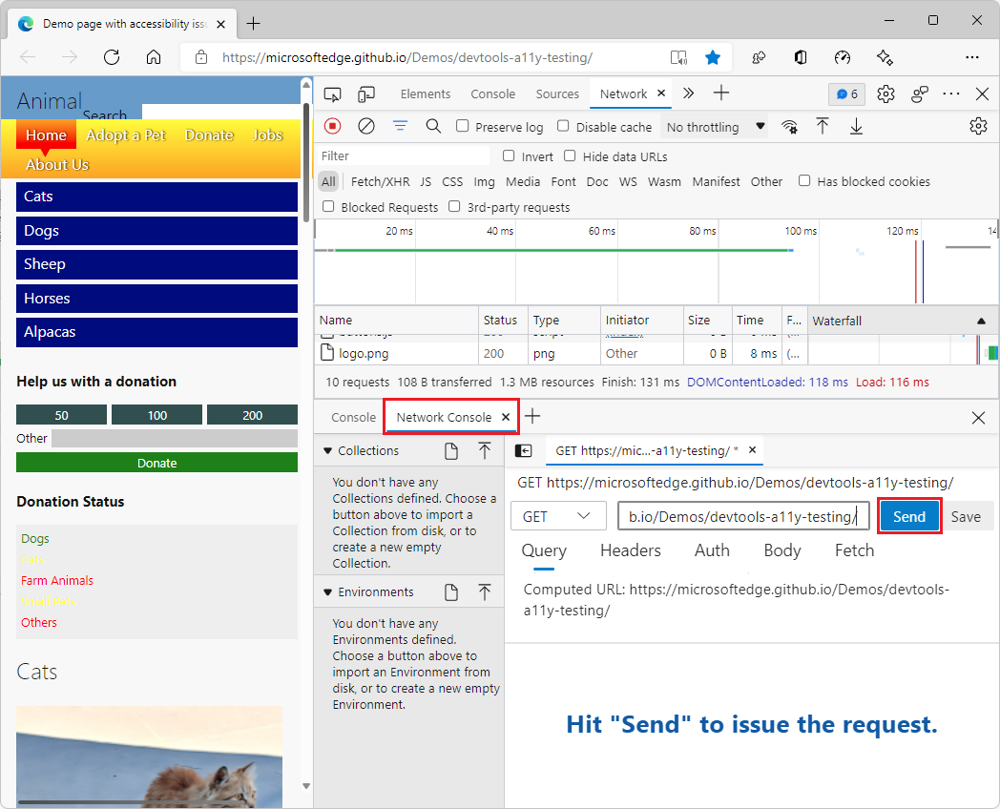
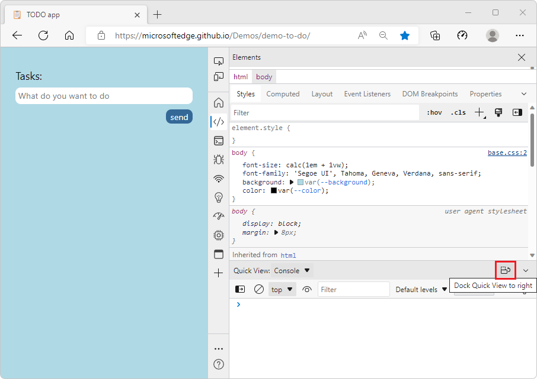
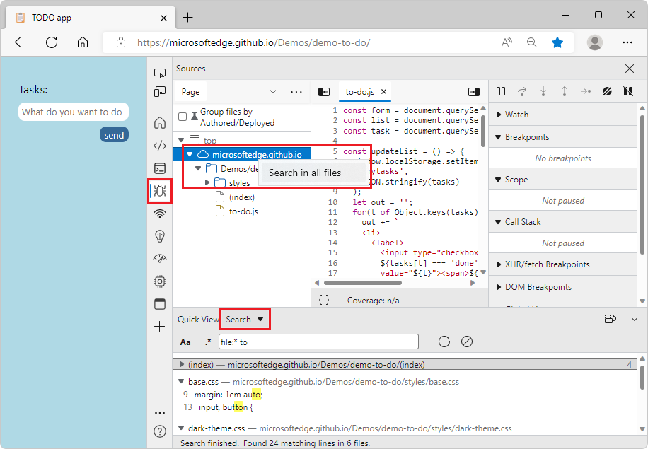

# What's New in DevTools (Microsoft Edge 105)

[!INCLUDE [Microsoft Edge team note for top of What's New](../../includes/edge-whats-new-note.md)]

<!-- ====================================================================== -->
## Test your PWA's protocol handlers from the Application tool

<!-- Title: Test your PWA's protocol handlers from the Application tool -->
<!-- Subtitle: From the Manifest section of the Application tool, you can now provide custom protocols to launch your PWA. -->

In Microsoft Edge 105, the **Application** tool now supports testing protocol handlers.  Since Microsoft Edge 96, you've been able to define protocol handlers in the application manifest of your Progressive Web App (PWA).  Now you can test those protocols from the **Application** tool itself in DevTools if you have your PWA installed.

With DevTools open for your PWA:

1. Open the **Application** tool.
1. On the left, expand and select **Application** > **Manifest** > **Protocol Handlers**.
1. In the **Protocol Handlers** page, in the **Protocol Handlers** dropdown list, select the protocol you want to test.
1. In the text box, enter the URL or endpoint to test.
1. Click the **Test protocol** button.

The **Application** tool will attempt to launch your PWA with the protocol and URL you specified.  The browser asks for permission to open the application, and then prompts you to confirm that you want to handle the protocol and the app you want to launch. If you give permission, your app opens with the specified content.

See also:

* [Test Progressive Web App (PWA) protocol handling](../../../progressive-web-apps/protocol-handlers.md)
* [Handle protocols in Progressive Web Apps](../../../../progressive-web-apps-chromium/how-to/handle-protocols.md)

<!-- ====================================================================== -->
## Edit and resend network requests more reliably in the Network Console tool

<!-- Title: Edit and resend network requests more reliably in the Network Console tool  -->
<!-- Subtitle: Modify and resend network requests that have been logged in the Network tool with the Network Console tool. -->

Previously in Microsoft Edge, selecting **Edit and resend** for a network request from the Network tool may not have reliably opened the **Network Console** tool and pre-populated it with the values from the request.

In Microsoft Edge 105, this issue has been fixed in the legacy DevTools UI.  This issue will also be fixed in the Focus Mode DevTools UI in a future release.  **Edit and resend** now pre-populates the **Network Console** tool with the values for the network request that you're looking to resend.  You can continue to modify these values before sending the request from the **Network Console** tool.  Thank you for sending us your feedback about this issue!

Right-click the network request that you want to change and resend, and then select **Edit and Resend**:

In the **Network Console**, edit the network request information, and then click the **Send** button:

See also:
* [Opening the Network Console tool from within the Network tool](../../../network-console/network-console-tool.md#opening-the-network-console-tool-from-within-the-network-tool) in _Compose and send web API requests using the Network Console tool_.

<!-- ====================================================================== -->
## Focus Mode: Improved location controls for DevTools, Activity Bar, and Quick View

<!-- Title: Focus Mode: Improved location controls for DevTools, Activity Bar, and Quick View -->
<!-- Subtitle: Focus Mode: Improved location controls for DevTools, Activity Bar, and Quick View. -->

In Microsoft Edge 105, several improvements to location controls have been made, including a new option for changing the orientation of the **Quick View** panel.

The **Customize and control DevTools** (**...**) menu now directly contains buttons to set the docking location of DevTools, instead of requiring opening a submenu.  The **Dock location** icons now have greater contrast, and the currently selected **Dock location** button is now highlighted.

This menu also now directly contains buttons to set and indicate where the **Activity Bar** is displayed, instead of using a submenu.

Selecting the docking location in Focus Mode, in previous versions of Microsoft Edge:

Selecting the docking location in Focus Mode, in Microsoft Edge 105:

You can now change the orientation of the **Quick View** toolbar and panel as well.  To display the **Quick View** panel vertically instead of horizontally, click the **Dock Quick View to right** button:

To return the **Quick View** toolbar and panel to the horizontal orientation, click the **Dock Quick View to bottom** button:

To minimize the **Quick View** panel in either orientation, click the **Collapse Quick View** button, or press **Esc**:

<!-- ====================================================================== -->
## Fix: Search in the Sources and Network tools now works as expected in Focus Mode

<!-- Title: Fix: Search in the Sources and Network tools now works as expected in Focus Mode  -->
<!-- Subtitle: Try Focus Mode, a new, more simplified, and streamlined UI for DevTools! -->

In previous versions of Microsoft Edge, the Focus Mode experiment didn't properly showcase the **Search** feature in the **Network** tool or the **Search in all files** feature in the **Sources** tool.  In Microsoft Edge 105, these issues have been fixed.

You can now search in the **Network** tool via the **Search** icon:

To search in all files in the **Sources** tool, in the **Page** section, right-click the **top** window or any domain, and then select **Search in all files**:

See also:
* [Search network headers and responses](../../../network/index.md#search-network-headers-and-responses) in _Inspect network activity_.
* [Find source files for a page using the Search tool](../../../search/search-tool.md)

<!-- ====================================================================== -->
## Improved reliability in the Issues tool

<!-- Title: Improved reliability in Issues tool -->
<!-- Subtitle: A bug that sometimes resulted in issues not appearing has been fixed. -->

In previous versions of Microsoft Edge, there was a bug that that caused issues to not appear in the **Issues** tool.  This bug has been fixed in Microsoft Edge 105.

See also:

* [Find and fix problems using the Issues tool](../../../issues/index.md)

<!-- ====================================================================== -->
## Announcements from the Chromium project

Microsoft Edge 105 also includes the following updates from the Chromium project:

* [Attach Wasm debugging information at runtime](https://developer.chrome.com/blog/new-in-devtools-105/#wasm)
* [Support live edit during debugging](https://developer.chrome.com/blog/new-in-devtools-105/#live-edit)
* [View and edit @scope at rules in the Styles pane](https://developer.chrome.com/blog/new-in-devtools-105/#scope)
* [Sourcemap improvements](https://developer.chrome.com/blog/new-in-devtools-105/#sourcemaps)

<!-- ====================================================================== -->
<!-- uncomment if content is copied from developer.chrome.com to this page -->

<!-- > [!NOTE]
> Portions of this page are modifications based on work created and [shared by Google](https://developers.google.com/terms/site-policies) and used according to terms described in the [Creative Commons Attribution 4.0 International License](https://creativecommons.org/licenses/by/4.0).
> The original page for announcements from the Chromium project is [What's New in DevTools (Chrome 105)](https://developer.chrome.com/blog/new-in-devtools-105) and is authored by [Jecelyn Yeen](https://developers.google.com/web/resources/contributors#jecelynyeen) (Developer advocate working on Chrome DevTools at Google). -->

<!-- ====================================================================== -->
<!-- uncomment if content is copied from developer.chrome.com to this page -->

<!-- 
This work is licensed under a [Creative Commons Attribution 4.0 International License](https://creativecommons.org/licenses/by/4.0). -->
