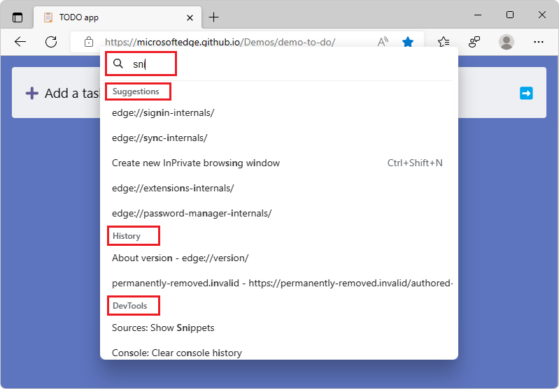
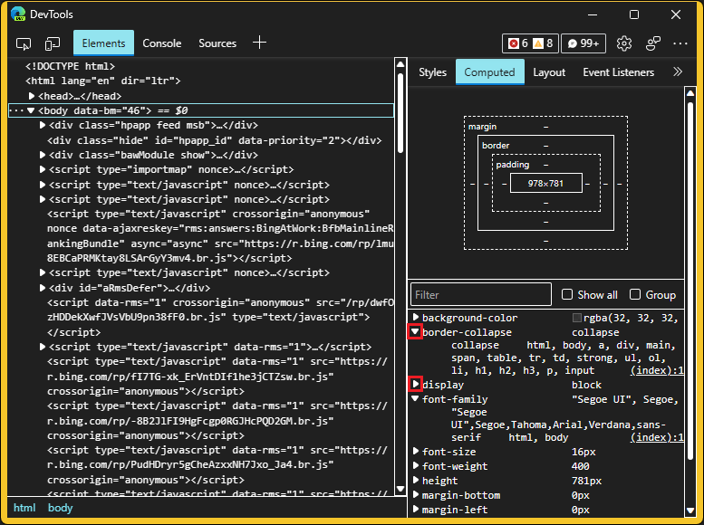

# What's New in DevTools (Microsoft Edge 106)

[!INCLUDE [Microsoft Edge team note for top of What's New](../../includes/edge-whats-new-note.md)]

<!-- ====================================================================== -->
## Introducing the Command Palette

<!-- Subtitle: Your favorite commands in one place. -->
<!--           Your favorite browser and DevTools commands in one place. -->

Command Palette makes it possible to access browser management and developer tools with just one keyboard shortcut: `Ctrl`+`Q`.  Let us know what commands we should add next!

To list the available browser management commands, press `Ctrl`+`Q`.  To filter the commands, start typing:

To list or filter the available DevTools commands, press `Ctrl`+`Q`, and then enter the greater-than (**>**) character:

In Microsoft Edge 105-107, the keyboard shortcut is `Ctrl`+`Shift`+`Spacebar`.  In Microsoft Edge 108 and later, the shortcut is `Ctrl`+`Q`.

See also:
* [Run commands via keyboard with Command Palette](../../../experimental-features/edge-command-palette.md)

<!-- ====================================================================== -->
## Filter and automatically fix code issues in DevTools for Visual Studio Code
<!-- todo: mention that the extension supports Compatibility and Security Hints? -->

<!-- Subtitle: Let Visual Studio Code fix web issues for you or tell it never to bother you about them again. -->
 
The Microsoft Edge DevTools for Visual Studio Code extension now allows you to fix issues automatically or define a `.hintrc` file to never report certain issues again.  This allows you to customize the error reporting and find out not only why something is a problem, but also how to fix it.

<!--
Screenshot:
1. Install the extension.
2. Open a file with problems.
3. Hover over the issue till the lightbulb appears.
4. Click the light bulb for options.
-->

<!-- see att. -->

See also:
* [Automated Quick Fixes and issue filtering](../../../../visual-studio-code/microsoft-edge-devtools-extension.md#automated-quick-fixes-and-issue-filtering) in _Microsoft Edge DevTools extension for Visual Studio Code_.

<!-- ====================================================================== -->
## DevTools now uses less disk space when caching sourcemaps

<!-- Subtitle: In Microsoft Edge 106, sourcemaps are now removed from IndexedDB storage if they haven't been accessed in 30 days. -->

Starting in [Microsoft Edge 101](../../../whats-new/2022/04/devtools-101.md#source-maps-are-now-cached-with-indexeddb), DevTools began caching sourcemaps in IndexedDB to reduce the amount of network requests fetching your sourcemaps.  However, this change could potentially take up a lot of disk space if these sourcemaps are never removed.  In Microsoft Edge 106, this issue has been fixed by removing any sourcemaps that haven't been accessed in 30 days from IndexedDB storage.  Additionally, sourcemaps served from `localhost` are also no longer cached.  Thank you for sending us feedback about this issue!

To understand how DevTools fetches and caches your sourcemaps, watch the **Load status** column in the [Source Maps Monitor tool](../../../source-maps-monitor/source-maps-monitor-tool.md).  When you first load the webpage, the **Source Maps Monitor** tool shows that the source maps aren't cached yet:

When you refresh the webpage, the **Source Maps Monitor** tool shows that the cached source maps are used:

To clear the IndexedDB cache and force DevTools to re-load sourcemaps, run the **Clear source maps cache** command in the Command Menu.  See [Run commands in the Command Menu](../../../command-menu/index.md).

For history, see [Issue 89](https://github.com/MicrosoftEdge/DevTools/issues/89).

See also:
* [Source maps are now cached with IndexedDB](../../2022/04/devtools-101.md#source-maps-are-now-cached-with-indexeddb) in _What's New in DevTools (Microsoft Edge 101)_.

<!-- ====================================================================== -->
## Chromium color themes have been deprecated

<!-- Subtitle: Users of Chromium themes in DevTools will be automatically migrated to the default dark or light theme for a more reliable experience. -->

To improve reliability, the Chromium Light and Chromium Dark themes have been deprecated.  Users who previously had these themes selected will be automatically migrated to the **Light+** or **Dark+** theme, respectively:

DevTools in **Light+** theme: 

DevTools in **Dark+** theme:

There are many DevTools color themes to choose from, such as **Monokai** and **Solarized**.  To change the color theme in DevTools, click the **Settings** () button, and then in the **Preferences** page, in the **Theme** dropdown menu, select a theme:

See also:
* [Apply a color theme to DevTools](../../../customize/theme.md)

<!-- ====================================================================== -->
## Accessibility improvements in Focus Mode and high contrast mode

<!-- Subtitle: The new Dock location and Activity Bar location buttons in Focus Mode now work better with screen readers, and computed styles are easier to see in high contrast mode. -->

#### Dock location and Activity Bar location buttons in Focus Mode now work better with screen readers

In Microsoft Edge 105, Focus Mode received several improvements, including new **Dock location** and **Activity Bar location** buttons.  In Microsoft Edge 106, these new buttons now work better with assistive technologies, such as screen readers.  Screen readers will now announce which **Dock location** button or which **Activity Bar location** button is currently selected, and the number of buttons, representing the available location options:

See also:
* [Simplify DevTools using Focus Mode](../../../experimental-features/focus-mode.md)
* [Navigate DevTools with assistive technology](../../../accessibility/navigation.md)
* [Focus Mode: Improved location controls for DevTools, Activity Bar, and Quick View](../../../whats-new/2022/09/devtools-105.md#focus-mode-improved-location-controls-for-devtools-activity-bar-and-quick-view) in _What's new in DevTools (Microsoft Edge 105)_.

#### Computed styles are easier to see in high contrast mode

In high contrast mode, in previous versions of Microsoft Edge, the expand and collapse buttons for computed styles didn't render correctly, in the **Computed** section of the **Styles** pane in the **Elements** tool.  In Microsoft Edge 106, this issue has been fixed.  The expand and collapse buttons are now visible in high contrast mode:
 

<!-- If you want to recreate this image:
1.	Open Windows settings > Accessibility > Contrast themes
2.	Under **Contrast themes**, select **Aquatic** and **Apply**
3.	Open Edge and navigate to some website. I used: Bing
4.	Open DevTools
5.	Navigate to the Elements tool
6.	Open the **Computed** section in the **Styles** pane
7.	Take screenshot and draw red highlight boxes around the triangle expand/collapse arrows under the **Filter** textbox. I would also recommend expanding and collapsing some of the styles. -->

<!-- Video recording of feature in action
See attachments. looking for better way to show how Voiceover reads out the Dock Location and Activity Bar Location buttons on macOS but that might make a better video -->

See also:
* [Windows High contrast mode](/fluent-ui/web-components/design-system/high-contrast)

<!-- ====================================================================== -->
## Announcements from the Chromium project

Microsoft Edge 106 also includes the following updates from the Chromium project:

* [Group files by Authored / Deployed in the Sources panel](https://developer.chrome.com/blog/new-in-devtools-106/#authored)
* [Improved stack traces](https://developer.chrome.com/blog/new-in-devtools-106/#stack-traces)
  * [Linked stack traces for asynchronous operations](https://developer.chrome.com/blog/new-in-devtools-106/#async)
  * [Automatically ignore known third-party scripts](https://developer.chrome.com/blog/new-in-devtools-106/#auto-ignore)
* [Improved call stack during debugging](https://developer.chrome.com/blog/new-in-devtools-106/#call-stack)
* [Hiding ignore-listed sources in the Sources panel](https://developer.chrome.com/blog/new-in-devtools-106/#ignore-nav)
* [Hiding ignore-listed files in the Command Menu](https://developer.chrome.com/blog/new-in-devtools-106/#ignore-search)
* [New Interactions track in the Performance panel](https://developer.chrome.com/blog/new-in-devtools-106/#performance)
* [LCP timings breakdown in the Performance Insights panel](https://developer.chrome.com/blog/new-in-devtools-106/#insights)
* [Auto-generate default name for recordings in the Recorder panel](https://developer.chrome.com/blog/new-in-devtools-106/#recorder)
* [Miscellaneous highlights](https://developer.chrome.com/blog/new-in-devtools-106/#misc)

<!-- ====================================================================== -->
<!-- uncomment if content is copied from developer.chrome.com to this page -->

<!-- > [!NOTE]
> Portions of this page are modifications based on work created and [shared by Google](https://developers.google.com/terms/site-policies) and used according to terms described in the [Creative Commons Attribution 4.0 International License](https://creativecommons.org/licenses/by/4.0).
> The original page for announcements from the Chromium project is [What's New in DevTools (Chrome 106)](https://developer.chrome.com/blog/new-in-devtools-106) and is authored by [Jecelyn Yeen](https://developers.google.com/web/resources/contributors#jecelynyeen) (Developer advocate working on Chrome DevTools at Google). -->

<!-- ====================================================================== -->
<!-- uncomment if content is copied from developer.chrome.com to this page -->

<!-- 
This work is licensed under a [Creative Commons Attribution 4.0 International License](https://creativecommons.org/licenses/by/4.0). -->
