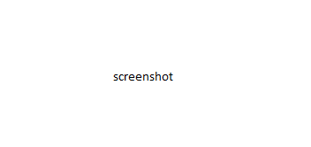

# What's New in DevTools (Microsoft Edge 106)

[!INCLUDE [Microsoft Edge team note for top of What's New](../../includes/edge-whats-new-note.md)]

<!-- ====================================================================== -->
## Entry 1

<!-- Title:  -->
<!-- Subtitle: . -->

<!--
See also:
* 
-->

<!-- ====================================================================== -->
## Entry 2

<!-- Title:  -->
<!-- Subtitle: . -->

<!--
See also:
* 
-->

<!-- ====================================================================== -->
## Entry 3

<!-- Title:  -->
<!-- Subtitle: . -->

<!--
See also:
* 
-->

<!-- ====================================================================== -->
## Entry 4

<!-- Title:  -->
<!-- Subtitle: . -->

<!--
See also:
* 
-->

<!-- ====================================================================== -->
## Entry 5

<!-- Title:  -->
<!-- Subtitle: . -->

<!--
See also:
* 
-->

<!-- ====================================================================== -->
## Announcements from the Chromium project

Microsoft Edge 106 also includes the following updates from the Chromium project:

* [Group files by Authored / Deployed in the Sources panel](https://developer.chrome.com/blog/new-in-devtools-106/#authored)
* [Improved stack traces](https://developer.chrome.com/blog/new-in-devtools-106/#stack-traces)
   * [Linked stack traces for asynchronous operations](https://developer.chrome.com/blog/new-in-devtools-106/#async)
   * [Automatically ignore known third-party scripts](https://developer.chrome.com/blog/new-in-devtools-106/#auto-ignore)
* [Improved call stack during debugging](https://developer.chrome.com/blog/new-in-devtools-106/#call-stack)
* [Hiding ignore-listed sources in the Sources panel](https://developer.chrome.com/blog/new-in-devtools-106/#ignore-nav)
* [Hiding ignore-listed files in the Command Menu](https://developer.chrome.com/blog/new-in-devtools-106/#ignore-search)
* [New Interactions track in the Performance panel](https://developer.chrome.com/blog/new-in-devtools-106/#performance)
* [LCP timings breakdown in the Performance Insights panel](https://developer.chrome.com/blog/new-in-devtools-106/#insights)
* [Auto-generate default name for recordings in the Recorder panel](https://developer.chrome.com/blog/new-in-devtools-106/#recorder)
* [Miscellaneous highlights](https://developer.chrome.com/blog/new-in-devtools-106/#misc)

<!-- ====================================================================== -->
<!-- uncomment if content is copied from developer.chrome.com to this page -->

<!-- > [!NOTE]
> Portions of this page are modifications based on work created and [shared by Google](https://developers.google.com/terms/site-policies) and used according to terms described in the [Creative Commons Attribution 4.0 International License](https://creativecommons.org/licenses/by/4.0).
> The original page for announcements from the Chromium project is [What's New in DevTools (Chrome 106)](https://developer.chrome.com/blog/new-in-devtools-106) and is authored by [Jecelyn Yeen](https://developers.google.com/web/resources/contributors#jecelynyeen) (Developer advocate working on Chrome DevTools at Google). -->

<!-- ====================================================================== -->
<!-- uncomment if content is copied from developer.chrome.com to this page -->

<!-- 
This work is licensed under a [Creative Commons Attribution 4.0 International License](https://creativecommons.org/licenses/by/4.0). -->
