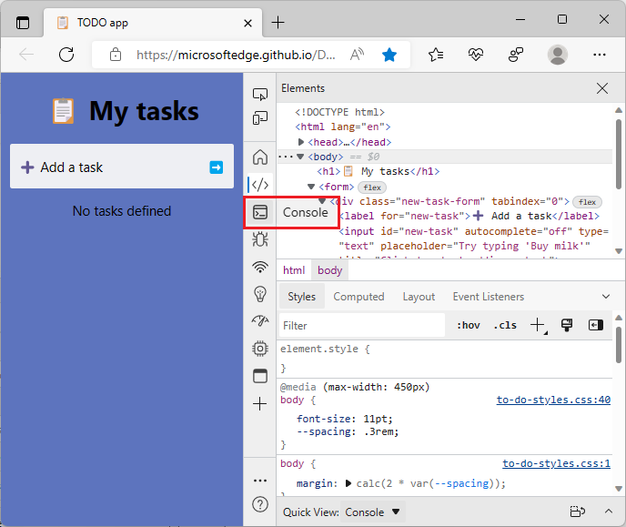
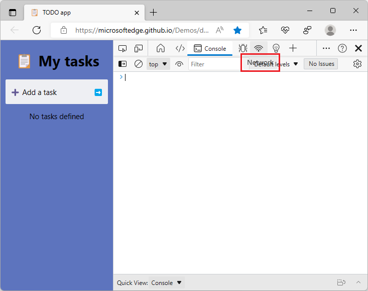
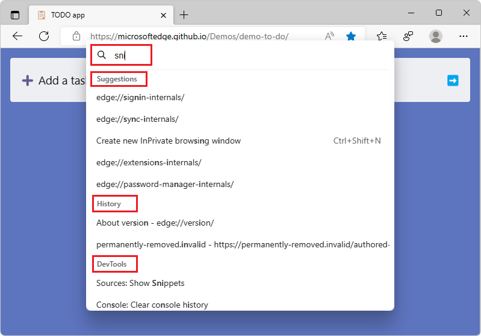
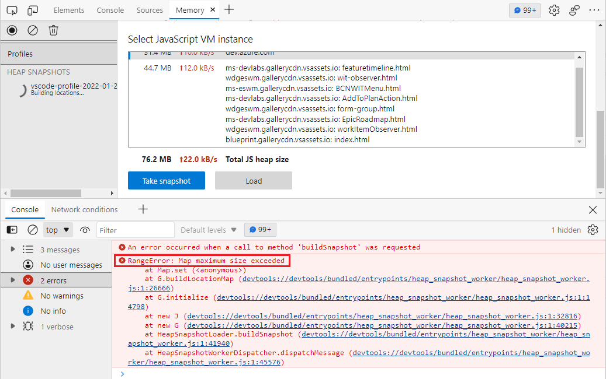
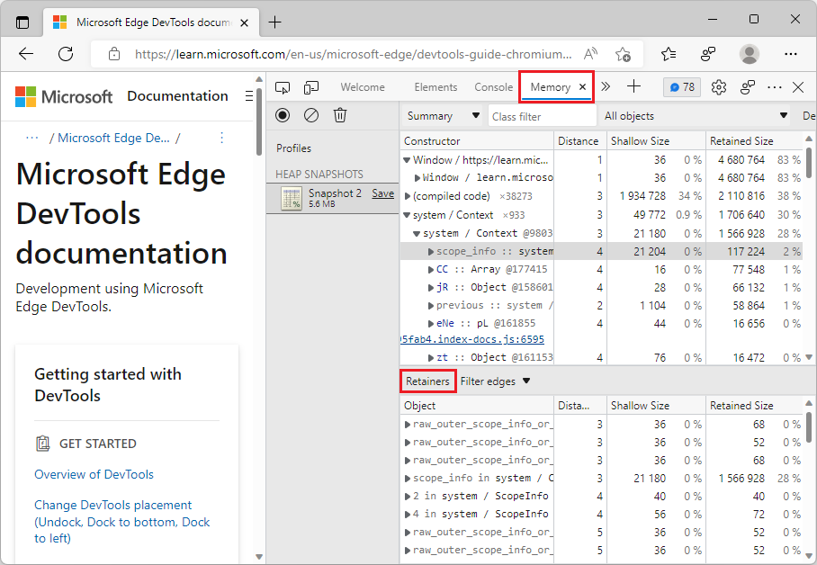
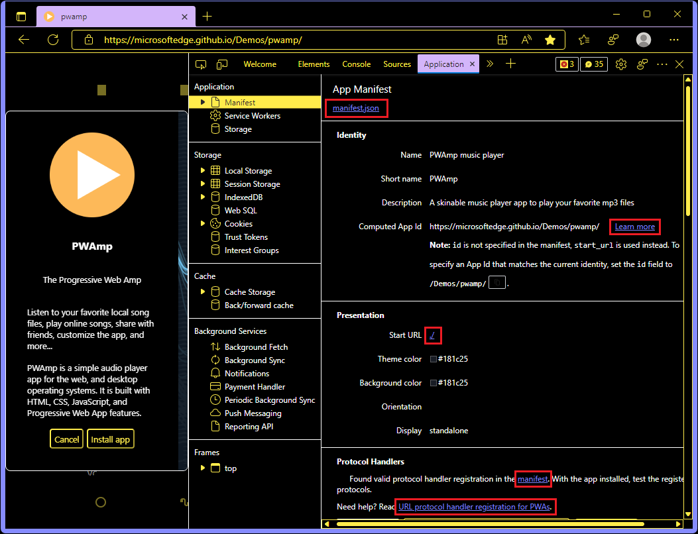

# What's New in DevTools (Microsoft Edge 107)

[!INCLUDE [Microsoft Edge team note for top of What's New](../../includes/edge-whats-new-note.md)]

<!-- ====================================================================== -->
## Automate WebView2 with Playwright

<!-- Subtitle: You can now use Playwright to automate and test web content in the Microsoft Edge WebView2 control. -->

[Playwright](https://playwright.dev) is a testing library that enables reliable end-to-end testing across different browsers and platforms.  Playwright has always supported automating and testing web content in Microsoft Edge, but now Playwright also supports testing the Microsoft Edge WebView2 control.

The Microsoft Edge WebView2 control allows you to embed web technologies (HTML, CSS, and JavaScript) in your native apps.  You can now use Playwright to test your web content running in WebView2.  To get started, see [Playwright's documentation for WebView2](https://playwright.dev/docs/webview2).

See also:
* [Introduction to Microsoft Edge WebView2](../../../../webview2/index.md)
* [Use Playwright to automate and test in Microsoft Edge](../../../../playwright/index.md)
* [Issue 17617: [Feature] Add Playwright.WebView2.launch()](https://github.com/microsoft/playwright/issues/17617)

<!-- ====================================================================== -->
## Focus Mode: Activity Bar icons show text label on mouse hover

<!-- Subtitle: When text labels are not visible in the Activity Bar, the name of the tool will appear while hovering over the icon. -->

Starting in Microsoft Edge 107, in Focus Mode, the **Activity Bar** now displays tooltips when you hover over tool icons.  These tooltips appear immediately and help you quickly identify and switch between tools:

When the **Activity Bar** is horizontal, a tooltip appears when a tool icon doesn't already have a text label next to it:

<!-- ====================================================================== -->
## New keyboard shortcut for the Command Palette experiment

<!-- Subtitle: Enable the Command Palette experiment in Microsoft Edge 107 and open it with Ctrl+Q (Command+Q on macOS). -->

In [Microsoft Edge 106](../09/devtools-106.md#introducing-the-command-palette), we introduced the Command Palette, an experimental feature for accessing browser management and developer tools commands.  In Microsoft Edge 107, the keyboard shortcut for opening the Command Palette has been updated from **Shift+Ctrl+Spacebar** to **Ctrl+Q** on Windows, macOS, and Linux.

To enable the Command Palette experiment, see [Enable Command Palette](../../../experimental-features/edge-command-palette.md#enable-command-palette) in _Run commands via keyboard with Command Palette_.  After the Command Palette experiment is enabled, press **Ctrl+Q** to open the Command Palette.

Thank you for your feedback on this issue!  Let us know what commands you'd like to see in future versions of Microsoft Edge, by posting a comment in [Issue 73: [feedback] Command Palette experiment](https://github.com/MicrosoftEdge/DevTools/issues/73) in the DevTools repo!

<!-- ====================================================================== -->
## The Memory tool can now load larger heap snapshots

<!-- Subtitle: In Microsoft Edge 107, the Memory tool no longer reports "RangeError: Map maximum size exceeded" messages when loading a large heap snapshot. -->

In previous versions of Microsoft Edge, when loading large heap snapshots in the **Memory** tool, the snapshot would fail to load and a `RangeError: Map maximum size exceeded` message would be logged to the **Console**:

In Microsoft Edge 107, this issue has been fixed.  The **Memory** tool can now successfully load large heap snapshots.  This issue was caused by a hard-coded limit in V8 (the JavaScript engine of the browser), that limits the number of map elements to 16M.  By using a linked list of maps, the **Memory** tool no longer has a hard-coded map limit.

If you still encounter issues when loading large heap snapshots, please open an issue in the [DevTools repo](https://github.com/MicrosoftEdge/DevTools/issues/new?assignees=&labels=bug&template=bug.md)!

See also:
* [Record heap snapshots using the Memory tool](../../../memory-problems/heap-snapshots.md)
* [Issue 9126: Hardcoded memory limits of Map (backed by FixedArray)](https://bugs.chromium.org/p/v8/issues/detail?id=9126)

<!-- ====================================================================== -->
## Links in the Application tool render better in high contrast mode

<!-- Subtitle: In previous versions of Microsoft Edge, links in the Application tool weren't rendering correctly. In Microsoft Edge 107, this issue has been fixed. -->

In previous versions of Microsoft Edge, links in the **Application** tool didn't render correctly in high contrast mode.  The links weren't visible, and they weren't the same color as defined in the high contrast setting.  In Microsoft Edge 107, this issue has been fixed.  Links in the **Application** tool now match the color that's defined in the high contrast setting:

 
See also:
* [Windows high contrast mode](/fluent-ui/web-components/design-system/high-contrast)
* [Debug Progressive Web Apps (PWAs)](../../../progressive-web-apps/index.md)

<!-- ====================================================================== -->
## Announcements from the Chromium project

Microsoft Edge 107 also includes the following updates from the Chromium project:

* [Toggle light and dark themes with keyboard shortcut](https://developer.chrome.com/blog/new-in-devtools-107/#toggle-themes)
* [Support full initiator information for HAR import](https://developer.chrome.com/blog/new-in-devtools-107/#har)
* [Start DOM search after pressing Enter](https://developer.chrome.com/blog/new-in-devtools-107/#search-type)
* [Display start and end icons for align-content CSS flexbox properties](https://developer.chrome.com/blog/new-in-devtools-107/#flexbox)

<!-- ====================================================================== -->
<!-- uncomment if content is copied from developer.chrome.com to this page -->

<!-- > [!NOTE]
> Portions of this page are modifications based on work created and [shared by Google](https://developers.google.com/terms/site-policies) and used according to terms described in the [Creative Commons Attribution 4.0 International License](https://creativecommons.org/licenses/by/4.0).
> The original page for announcements from the Chromium project is [What's New in DevTools (Chrome 107)](https://developer.chrome.com/blog/new-in-devtools-107) and is authored by [Jecelyn Yeen](https://developers.google.com/web/resources/contributors#jecelynyeen) (Developer advocate working on Chrome DevTools at Google). -->

<!-- ====================================================================== -->
<!-- uncomment if content is copied from developer.chrome.com to this page -->

<!-- 
This work is licensed under a [Creative Commons Attribution 4.0 International License](https://creativecommons.org/licenses/by/4.0). -->
