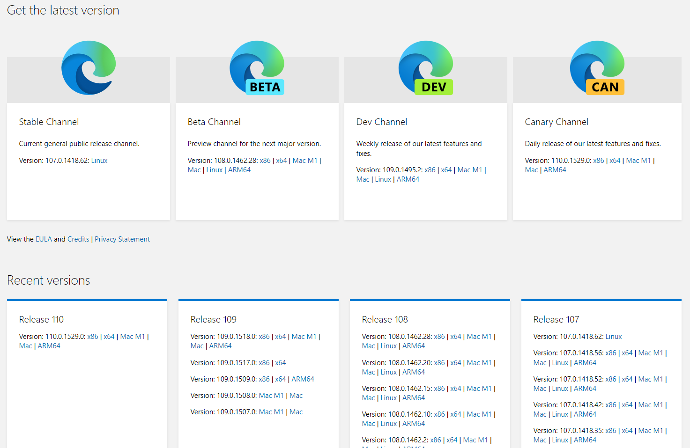
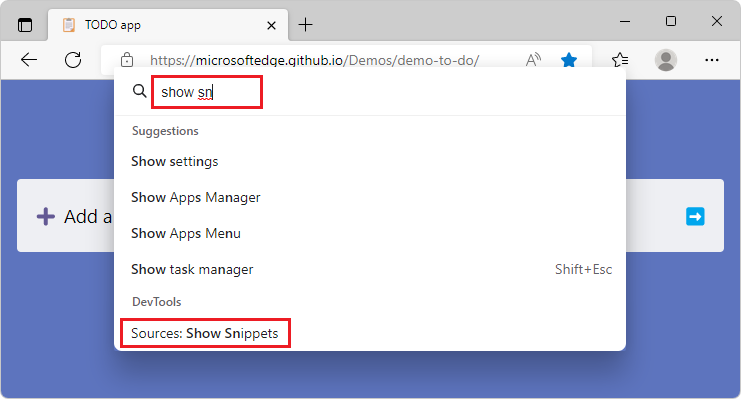
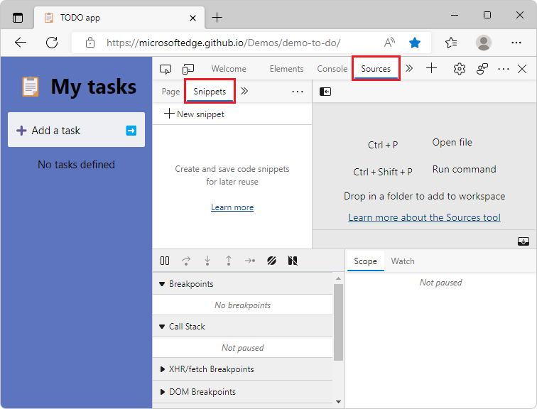
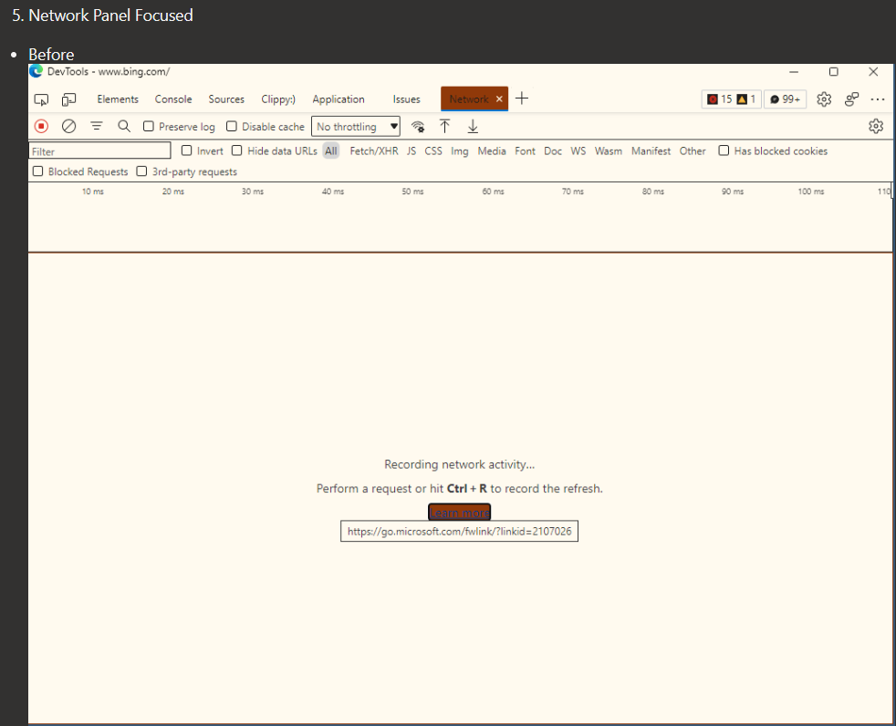
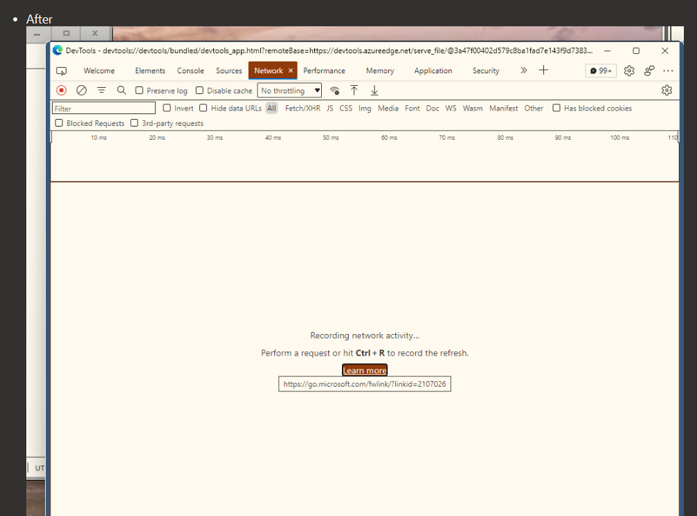
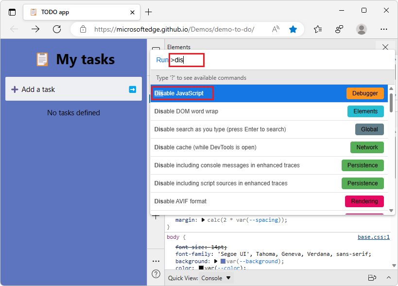
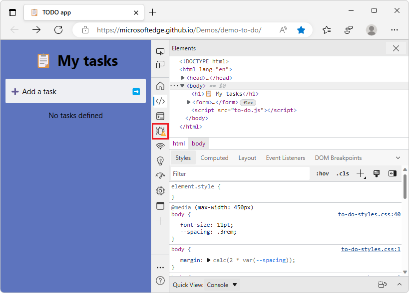

# What's New in DevTools (Microsoft Edge 108)

[!INCLUDE [Microsoft Edge team note for top of What's New](../../includes/edge-whats-new-note.md)]

<!-- find "todo" in this .md file -->

<!-- ====================================================================== -->
## Microsoft Edge WebDriver is now available for macOS running on Apple M1

<!-- Subtitle: On Apple M1 devices, Microsoft Edge WebDriver was previously running under emulation. Now, it will run faster without emulation. -->

You can now download Microsoft Edge WebDriver for macOS running on Apple M1 devices.  Previously, Microsoft Edge WebDriver on macOS was running under emulation with [Rosetta](https://support.apple.com/HT211861).  With the **Mac M1** version, Microsoft Edge WebDriver has improved performance, because it no longer runs under emulation.

To download Microsoft Edge WebDriver on Apple M1 devices:

1. In Microsoft Edge, go to `edge://version`, and note the full version number.

1. Go to [Microsoft Edge WebDriver](https://developer.microsoft.com/microsoft-edge/tools/webdriver/).

1. Find the version of Microsoft Edge WebDriver that matches your specific version of Microsoft Edge, and then click the **Mac M1** download link:

Thank you for your feedback on this issue!

See also:
* [Use WebDriver to automate Microsoft Edge](../../../../webdriver-chromium/index.md)
* [Microsoft Edge WebDriver](https://developer.microsoft.com/microsoft-edge/tools/webdriver/)
* [Issue #17: Support for Apple silicon](https://github.com/MicrosoftEdge/EdgeWebDriver/issues/17)

<!-- ====================================================================== -->
## Improved DevTools navigation via Command Palette

_The Command Palette experiment was removed in Microsoft Edge 123._

<!-- Subtitle: This update fixes a bug related to opening DevTools from the Command Palette in Microsoft Edge. -->

The Microsoft Edge Command Palette is an experimental feature that allows users to perform common tasks in Microsoft Edge.  In previous versions of Microsoft Edge, DevTools-related commands for opening specific parts of a tool didn't navigate correctly, such as the **Styles** tab in the **Elements** tool or the **Snippets** tab in the **Sources** tool.  In Microsoft Edge 108, this issue is fixed, improving the usability of commands such as **Sources: Show Snippets**:

Now, when you select **Sources: Show Snippets**, the **Sources** tool opens with the **Snippets** tab selected:

See also:
* [Run snippets of JavaScript on any webpage](../../../javascript/snippets.md)

<!-- ====================================================================== -->
## Better support for high contrast mode in DevTools

<!-- Subtitle: High Contrast Mode fixes. -->

We've fixed a few issues with Developer Tools in High Contrast mode that makes it easier for you to navigate the UI.  High Contrast mode is an accessibility feature of Windows that allows you to differentiate more easily between different sections of the UI.

In previous releases of Microsoft Edge, when using High Contrast mode, sometimes there was low contrast in the DevTools UI, such as right-click menus; icons for more information about issues; hovering over list items; error message text; or links.  For example, in the **Elements** tool, some tabs had dark text on a dark background:

<!-- Desert theme, Edge 107 -->

The UI controls now have high contrast:

<!-- Desert theme, Edge 109 -->

See also:
* [Apply a color theme to DevTools](../../../customize/theme.md)
* [Check for contrast issues with dark theme and light theme](../../../accessibility/test-dark-mode.md)
* [Change color contrast in Windows](https://support.microsoft.com/windows/change-color-contrast-in-windows-fedc744c-90ac-69df-aed5-c8a90125e696)

<!-- ====================================================================== -->
## In Focus Mode, disabling JavaScript now produces a warning icon for the Sources tool

<!-- Subtitle: The Sources tool in Focus Mode will warn you when you disable JavaScript in the DevTools. -->

In previous versions of Microsoft Edge, in Focus Mode, disabling JavaScript in the DevTools didn't produce a visual indication in the **Sources** tool.  In Microsoft Edge version 107, this issue has been fixed.  Disabling JavaScript will now produce a warning icon () next to the **Sources** tool icon on the **Activity Bar**.

1. Open the **Command Menu** by pressing **Ctrl+Shift+P** (Windows, Linux) or **Command+Shift+P** (macOS).

1. Start typing **disable**, and then select the **Disable JavaScript** command to run it:

   

   A yellow warning icon is added to the **Sources** tool icon on the **Activity Bar** to indicate that JavaScript is disabled:

   

See also:
* [Disable JavaScript](../../../javascript/disable.md)
* [Run commands in the Command Menu](../../../command-menu/index.md)

<!-- ====================================================================== -->
## Announcements from the Chromium project

Microsoft Edge 108 also includes the following updates from the Chromium project:

* [Hints for inactive CSS properties](https://developer.chrome.com/blog/new-in-devtools-108/#css-hint)
* [Step through comma-separated expressions](https://developer.chrome.com/blog/new-in-devtools-108/#debugging)
* [Improved Ignore list setting](https://developer.chrome.com/blog/new-in-devtools-108/#ignore-list)

<!-- ====================================================================== -->
<!-- uncomment if content is copied from developer.chrome.com to this page -->

<!-- > [!NOTE]
> Portions of this page are modifications based on work created and [shared by Google](https://developers.google.com/terms/site-policies) and used according to terms described in the [Creative Commons Attribution 4.0 International License](https://creativecommons.org/licenses/by/4.0).
> The original page for announcements from the Chromium project is [What's New in DevTools (Chrome 108)](https://developer.chrome.com/blog/new-in-devtools-108) and is authored by [Jecelyn Yeen](https://developers.google.com/web/resources/contributors#jecelynyeen) (Developer advocate working on Chrome DevTools at Google). -->

<!-- ====================================================================== -->
<!-- uncomment if content is copied from developer.chrome.com to this page -->

<!-- 
This work is licensed under a [Creative Commons Attribution 4.0 International License](https://creativecommons.org/licenses/by/4.0). -->
