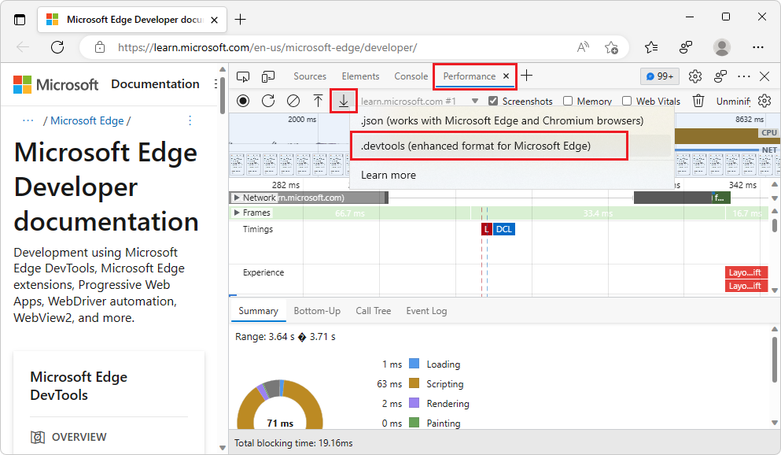
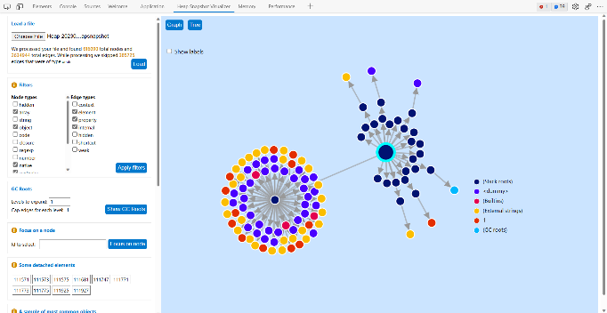
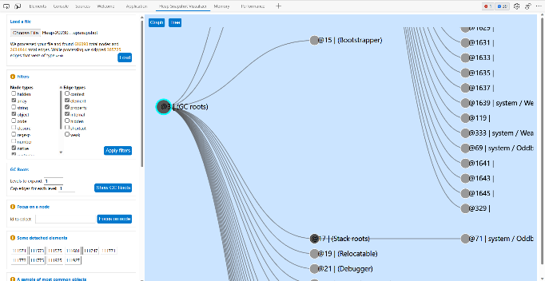

# What's New in DevTools (Microsoft Edge 109)

[!INCLUDE [Microsoft Edge team note for top of What's New](../../includes/edge-whats-new-note.md)]

<!-- ====================================================================== -->
## Import and export your DevTools instances with the new enhanced traces feature

<!-- Subtitle: Use enhanced traces to preserve Console mesages, DOM snapshots, and the JavaScript running on the page when exporting a heap snapshot or performance trace. -->

In Microsoft Edge 109, you can turn on new settings to export enhanced traces from the **Memory** and **Performance** tools.  These enhanced traces include more information, such as messages logged to the Console, snapshots of the DOM, and the JavaScript that was running on the page at the time of recording.  When saving performance profiles, heap snapshots, allocation timelines, or allocation sampling, you can now export a new `.devtools` file format.

When you then import the `.devtools` file, a new instance of DevTools will open with the state of your **Console**, **Sources**, and **Elements** tools preserved.  These enhanced traces offer a powerful new way to collaborate and share the information in your DevTools. To give this feature a try:

1. In DevTools, open **Settings**.<!-- copy tagging from Overview -->

1. Under **Persistence**, turn on the **Export enhanced performance and memory traces** setting.  If you want to preserve Console messages, JavaScript, or DOM snapshots, turn on the settings for each of those, respectively.

1. In the **Memory** tool, take a heap snapshot.

   Or, in the **Performance** tool, take a recording:

   

1. In the **Memory** tool, click the **Save** button.<!-- todo: test -->

   Or, in the **Performance** tool, right-click the **Export** button , and then select the `.devtools` file format:

   

1. Save the new `.devtools` file.

1. Import the `.devtools` file in either the **Memory** tool or the **Performance** tool:

   

1. A new DevTools window opens, containing a subset of the tools that are pre-populated with the preserved state of the **Console**, **Sources**, and **Elements** tools:

   

This is a new feature that the DevTools team is actively experimenting with, so please [send us your feedback in our GitHub repo](https://github.com/MicrosoftEdge/DevTools/issues)!

<!--
Instructions for screenshot
1.	Open any of the Edge Insider channels. Navigate to edge://version and ensure you're on version 109+
2.	Navigate to Microsoft Edge DevTools documentation - Microsoft Edge Development | Microsoft Learn
3.	Open DevTools > Settings. Take a screenshot. Draw red highlight boxes around the new settings under **Persistence**. Refer to the attached enhanced-trace-settings.png
 
4.	Now turn on these settings. Go the Performance tool and take a trace. Right click the Export button
5.	Take a screenshot. Draw a red highlight box around the context menu for the export button. Refer to enhanced-trace-export.png
 
6.	Now clear the profile and select the import button. Load the attached .devtools file
 
7.	A new DevTools window opens and loads your trace. Take a screenshot. Refer to enhanced-trace-import.png
 
8.	Finally, in the new DevTools window, open the Console. You should see only one Console warning and a message that the Console is read only. Take a screenshot. Refer to enhanced-trace-import-console.png
-->

See also:
* [Share performance and memory traces (PR 2388 draft)](https://github.com/MicrosoftDocs/edge-developer/blob/user/pabrosse/enhanced-traces/microsoft-edge/devtools-guide-chromium/evaluate-performance/share-traces.md)
<!-- todo: link to final article when PR is live, after merge main into present branch -->

<!-- ====================================================================== -->
## Debug long-running Recalculate Styles events in the Performance tool with new selector stats

<!-- Subtitle: Understand which of your CSS selectors are contributing to slow performance of your website or app. -->

In Microsoft Edge 109, in the **Performance** tool, you can turn on the **Enable advanced rendering instrumentation (slow)** setting in the **Performance** tool to access the new selector stats feature.

With this setting turned on:

1. Select **Record** and execute the scenario you want to improve on your website or app.

2. Select **Stop**.

3. Find a **Recalculate Style** event.  In the bottom section of the **Performance** tool, select **Selector Stats**.

   

   The **Selector Stats** section provides a list of all the CSS selectors that were calculated by the browser engine during the **Recalculate Style** event.  You can sort selectors by the time they took to process, or the number of elements they matched.  Use this data to find selectors that take a long time for the browser to process and simplify them, or to make them more specific to improve performance.

<!--
Instructions for screenshot
1.	Open any of the Insider channels and navigate to edge://version and ensure you're on version 109+
2.	Open DevTools, load the .json file I attached in the Performance tool
 
3.	Zoom in to the purple section in the loaded performance trace
4.	Under the **Main** section in the Performance tool, select a **Recalculate Style** event
5.	In the bottom section of the Performance tool, select **Selector Stats**
6.	Also open settings for the Performance tool with the gear icon and make sure "Enable advanced rendering instrumentation (slow)" is checked
7.	Take a screenshot
8.	Draw red highlight boxes around the "Enable advanced rendering instrumentation (slow)" checkbox and around the **Selector Stats** section. Refer to the attached screenshot.
-->

See also:
* The truth about CSS selector performance - pending blog post<!-- incoming PR next week -->
* [[Feedback] Selector Performance Tracing Explainer · Issue #98](https://github.com/MicrosoftEdge/DevTools/issues/98)

<!-- ====================================================================== -->
## Track objects discarded by garbage collection when Allocation sampling in the Memory tool

<!-- Subtitle: Use the new options under Allocation sampling to track how much garbage your website or app is generating. -->

In Microsoft Edge 109, the **Allocation sampling** profiling type in the **Memory** tool now has two new options:

*  **Include objects discarded by major GC**.

*  **Include objects discarded by minor GC**.

Without selecting these options, the **Memory** tool will continue to work as it did before, reporting allocations that are still alive at the end of the profiling session.  In this mode, objects that are generated, garbage-collected (GC'd), and then disappear aren't tracked by allocation sampling.

Select both options if you want to track garbage that is being generated by your website or app.  In the resulting profile, you'll be able to see garbage that was generated by your JavaScript functions that was then GC'd.  Use these options if you want to reduce the amount of garbage your code is generating.  To learn more about the differences between major and minor GC, read [Trash talk: the Orinoco garbage collector](https://v8.dev/blog/trash-talk).

<!--
Instructions for screenshot
1. In any of the Edge Insider channels, navigate to edge://version and ensure you're on 109+
2. Now navigate to Bing or learn.microsoft.com and open DevTools
3. Go to the Memory tool
4. Take a screenshot
5. Draw red highlight boxes around the Allocation sampling profiling type and the new options for track objects discarded by major and minor GC
Refer to the attached image if you need a reference.
-->
 
See also:
* [Investigate memory allocation by function](../../../memory-problems/index.md#investigate-memory-allocation-by-function) in _Fix memory problems_.
* PR with more details is pending - todo

<!-- ====================================================================== -->
## Try the new Heap Snapshot visualizer extension for the DevTools

<!-- Subtitle: Visualize the data in your heap snapshot like you've never seen before, as a directed graph or a tree. -->

Add the new **Heap Snapshot Visualizer** extension to Microsoft Edge to get new visualizations of the data in your heap snapshot files.  The extension adds a new tool to DevTools: **Heap Snapshot Visualizer**.  You can load your heap snapshot files to see them represented either as a directed graph or as a tree.  These new visualizations enable you to explore the retainers chain from the garbage-collection (GC) root to an individual node.

<!--
Instructions for screenshot
1. Get the heap snapshot visualizer extension from: Heap Snapshot visualizer - Microsoft Edge Addons
2. With the extension installed, open DevTools.
3. Go to the new Heap Snapshot Visualizer tool.
4. Choose file and select the attached .heapsnapshot file that's attached.
5. Select the Load button.
6. The Heap Snapshot Visualizer should show the heap snapshot as a graph. Refer to the attached screenshot.
7. Take a screenshot.
8. Now select the Tree button. The extension should now show the heap snapshot as a tree. Refer to the attached screenshot.
9. Take a screenshot.
-->

See also:
* [Heap Snapshot Visualizer](https://microsoftedge.microsoft.com/addons/detail/heap-snapshot-visualizer/fceldlhognbemkgfacnffkdanocidgce) - Microsoft Edge Add-ons Store.

<!-- ====================================================================== -->
## Improvements to Quick View in Focus Mode

<!-- Subtitle: Quick View now allows you to pick any tool, show several tools at once and persists across sessions. -->

We listened to your feedback and improved the **Quick View** options in Focus Mode.  Instead of choosing from a list of predefined tools, you can now pick any tool inside DevTools and show several tools at the same time by clicking a **+** button, much like in the main toolbar of DevTools.

The state of your **Quick View** persists across DevTools sessions.  The **Quick View** pane automatically collapses when you open the same tool in the main window.

 
See also:
* [Simplify DevTools using Focus Mode](../../../experimental-features/focus-mode.md)

<!-- ====================================================================== -->
## Navigate directly to the Styles and Computed Styles sections of the Elements tool

<!-- Subtitle: Use the Command Palette to directly navigate to the Styles section of the elements tool. -->

We found an accessibility issue where it was impossible for voice-command users to navigate to the **Styles** and **Computed Styles** tabs in the **Elements** tool.  We now added two new commands **Show Styles** and **Show Computed Styles** to the Command Palette to give everyone easier access.

See also:
* [Run commands in the Command Menu](../../../command-menu/index.md)
* [Navigate DevTools with assistive technology](../../../accessibility/navigation.md)

<!-- ====================================================================== -->
## Announcements from the Chromium project

Microsoft Edge 109 also includes the following updates from the Chromium project:

<!-- 
* 
* 
* 
-->

todo: links pending, check [Chrome 109 link](https://developer.chrome.com/blog/new-in-devtools-109).

<!-- ====================================================================== -->
<!-- uncomment if content is copied from developer.chrome.com to this page -->

<!-- > [!NOTE]
> Portions of this page are modifications based on work created and [shared by Google](https://developers.google.com/terms/site-policies) and used according to terms described in the [Creative Commons Attribution 4.0 International License](https://creativecommons.org/licenses/by/4.0).
> The original page for announcements from the Chromium project is [What's New in DevTools (Chrome 109)](https://developer.chrome.com/blog/new-in-devtools-109) and is authored by [Jecelyn Yeen](https://developers.google.com/web/resources/contributors#jecelynyeen) (Developer advocate working on Chrome DevTools at Google). -->

<!-- ====================================================================== -->
<!-- uncomment if content is copied from developer.chrome.com to this page -->

<!-- 
This work is licensed under a [Creative Commons Attribution 4.0 International License](https://creativecommons.org/licenses/by/4.0). -->
