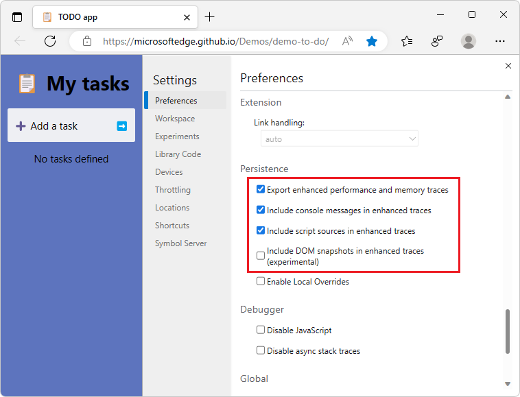
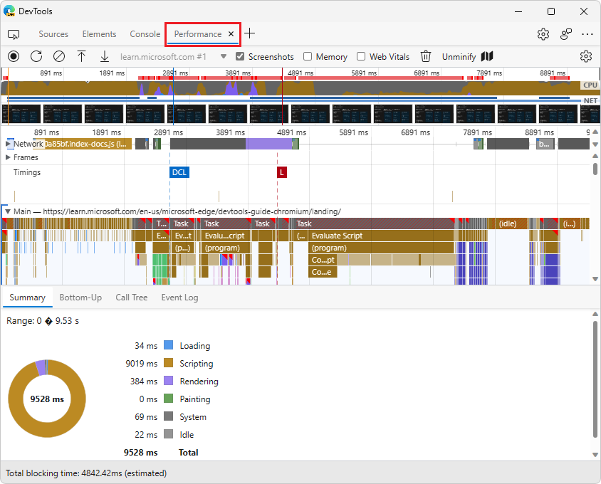
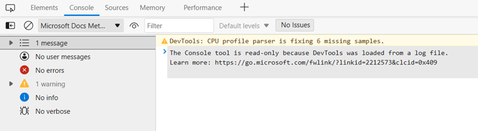
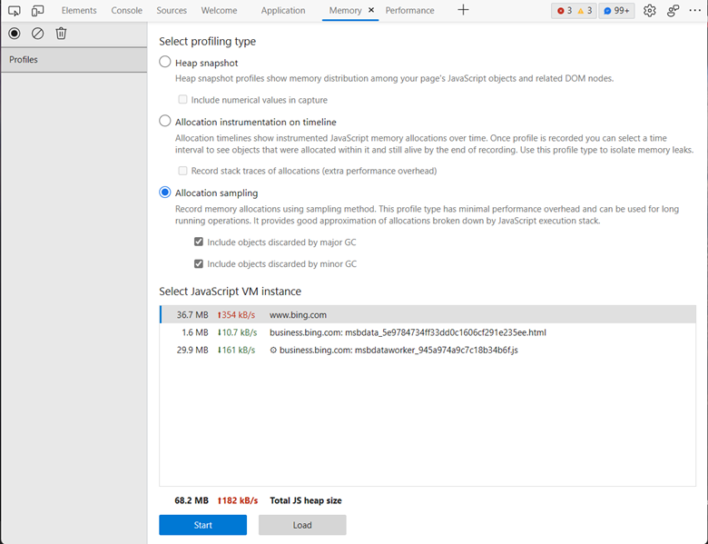
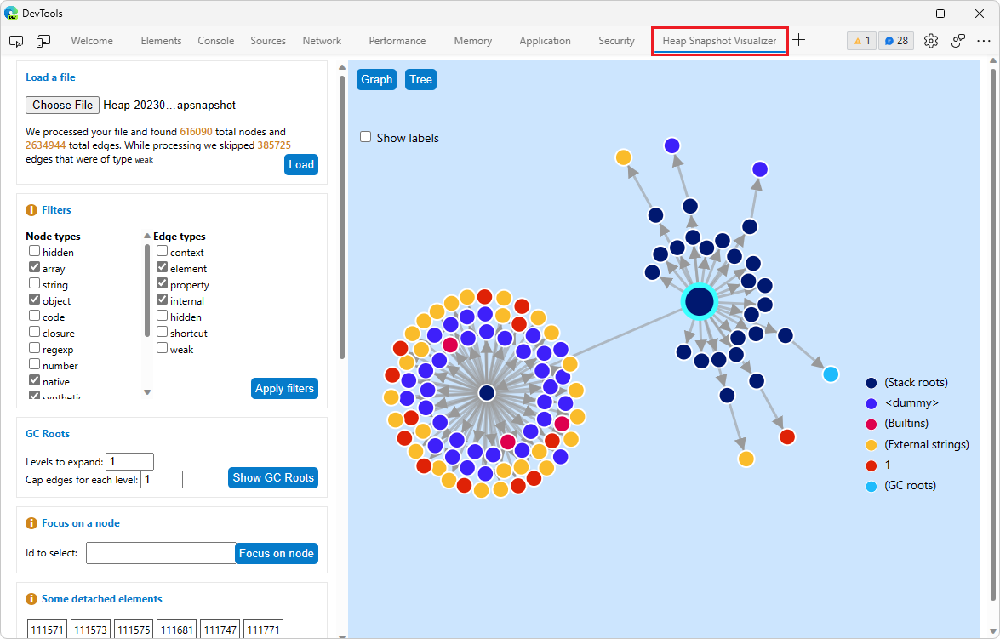
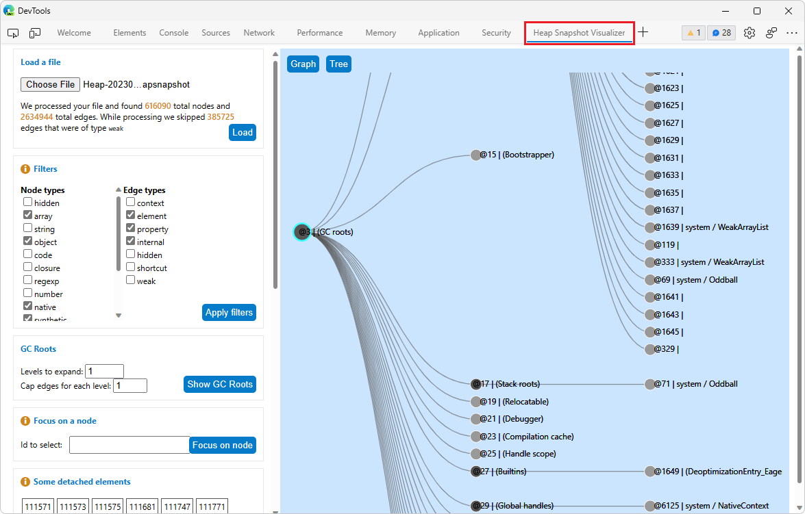
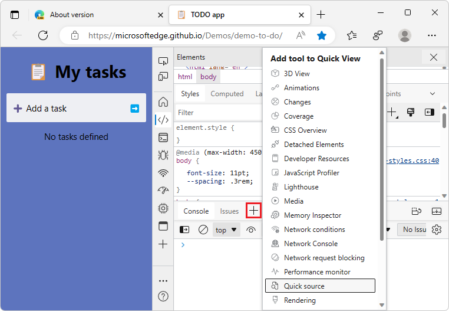
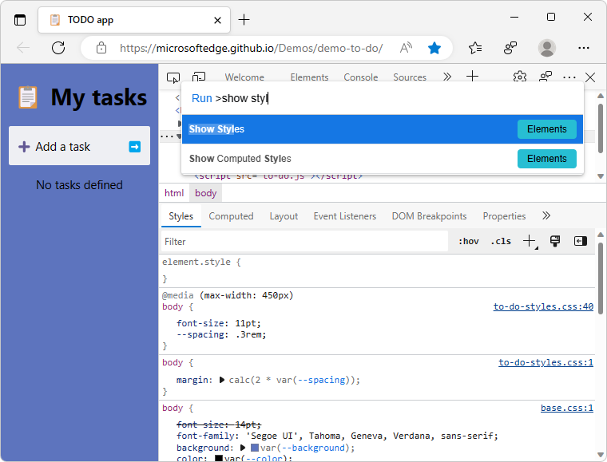

# What's New in DevTools (Microsoft Edge 109)

[!INCLUDE [Microsoft Edge team note for top of What's New](../../includes/edge-whats-new-note.md)]

<!-- ====================================================================== -->
## Import and export your DevTools instances with the new enhanced traces feature

<!-- Subtitle: Use enhanced traces to preserve Console messages, DOM snapshots, and the JavaScript running on the page when exporting a heap snapshot or performance trace. -->

In Microsoft Edge 109, you can turn on new settings to export enhanced traces from the **Performance** and **Memory** tools.  These enhanced traces include more information, such as:
*  Messages logged to the Console.
*  The JavaScript that was running on the page at the time of recording.
*  Snapshots of the DOM.

When saving performance profiles, heap snapshots, allocation timelines, or allocation sampling, you can now export a new `.devtools` file format.  When you then import the `.devtools` file, a new instance of DevTools opens, with the state of your **Elements**, **Console**, and **Sources** tools preserved.  These enhanced traces offer a powerful new way to collaborate and share the information in your DevTools.

To try the enhanced traces feature:

1. In DevTools, click the **Settings** () button.

1. In the **Persistence** section of the **Preferences** settings page, select the **Export enhanced performance and memory traces** checkbox:

   

1. If you want to preserve Console messages, JavaScript, or DOM snapshots, select the corresponding checkboxes.

1. Click the **Close** (**x**) button in DevTools **Settings**.

1. In the **Performance** tool, take a recording.

1. Click the **Save profile** () button.

1. In the **Save As** dialog, save the new `.devtools` file.

**Importing:**

1. Import the `.devtools` file from within the **Performance** tool by clicking the **Load profile** () button:

   

1. A new DevTools window opens, containing a subset of the tools, including the **Performance** tool loaded with the profile that you just recorded.  The **Elements**, **Console**, and **Sources** tools are also pre-populated with their preserved state:

   

You can also export from the **Memory** tool with the new `.devtools` file format.  This is a new feature that the DevTools team is actively experimenting with, so please send us your feedback in [[Feedback] Enhanced Traces experiment #122](https://github.com/MicrosoftEdge/DevTools/issues/122).

See also:
* [Share enhanced performance and memory traces](../../../experimental-features/share-traces.md)

<!-- ====================================================================== -->
## Debug long-running Recalculate Style events with new selector stats

<!-- Subtitle: Understand which of your CSS selectors are contributing to slow performance of your website or app. -->

In Microsoft Edge 109, in the **Performance** tool, you can turn on the **Enable advanced rendering instrumentation (slow)** setting in the **Performance** tool to access the new selector stats feature.

With this setting turned on:

1. Select **Record**, and then run the scenario that you want to improve on your website or app.

1. Select **Stop**.

1. Select a **Recalculate Style** event.  In the bottom section of the **Performance** tool, select the **Selector Stats** tab:

   

The **Selector Stats** tab provides a list of all the CSS selectors that were calculated by the browser engine during the **Recalculate Style** event.  You can sort selectors by the **Elapsed** time they took to process, or by the number of elements they matched (the **Match Count** column).  Use this data to:

* Find selectors that take a long time for the browser to process, and simplify them.
* Make selectors more specific, to improve performance.

See also:
* [The truth about CSS selector performance](https://blogs.windows.com/msedgedev/2023/01/17/the-truth-about-css-selector-performance/) - blog post
* [[Feedback] Selector Performance Tracing Explainer · Issue #98](https://github.com/MicrosoftEdge/DevTools/issues/98)
* [Analyze selector performance during Recalculate Style events](../../../evaluate-performance/selector-stats.md)

<!-- ====================================================================== -->
## Track objects discarded by garbage collection when allocation sampling

<!-- Subtitle: Use the new options under Allocation sampling to track how much garbage your website or app is generating. -->
<!-- or: how much detached memory, memory leaks, unused allocated memory -->

In Microsoft Edge 109, the **Allocation sampling** profiling type in the **Memory** tool now has two new options:

*  **Include objects discarded by major GC**.

*  **Include objects discarded by minor GC**.

Without selecting these options, the **Memory** tool will continue to work as it did before, reporting allocations that are still alive at the end of the profiling session.  In this mode, objects that are generated and garbage-collected (GC'd) and then disappear aren't tracked by allocation sampling.

Select both options if you want to track garbage that is being generated by your website or app.  In the resulting profile, you'll be able to see garbage that was generated by your JavaScript functions that was then GC'd.  Use these options if you want to reduce the amount of garbage that your code is generating.  To learn more about the differences between major and minor GC, see [Trash talk: the Orinoco garbage collector](https://v8.dev/blog/trash-talk).

 
See also:
* [Investigate memory allocation by function](../../../memory-problems/index.md#investigate-memory-allocation-by-function) in _Fix memory problems_.
* [Reduce garbage with additional settings for allocation sampling](../../../memory-problems/index.md#reduce-garbage-with-additional-settings-for-allocation-sampling) in _Fix memory problems_.

<!-- ====================================================================== -->
## Try the new Heap Snapshot visualizer extension for DevTools

<!-- Subtitle: Visualize the data in your heap snapshot like you've never seen before, as a directed graph or a tree. -->

Add the new **Heap Snapshot Visualizer** extension to Microsoft Edge to get new visualizations of the data that's in your heap snapshot files.  Installing this extension adds a new **Heap Snapshot Visualizer** tool in DevTools.  In the **Heap Snapshot Visualizer** tool, you can load a heap snapshot file to see it represented either as a directed graph or as a tree.  These new visualizations enable you to explore the retainers chain from the garbage-collection (GC) root to an individual node.

Graph view:

Tree view:

See also:
* [Heap Snapshot Visualizer](https://microsoftedge.microsoft.com/addons/detail/heap-snapshot-visualizer/fceldlhognbemkgfacnffkdanocidgce) - Microsoft Edge Add-ons Store.

<!-- ====================================================================== -->
## Improvements to Quick View in Focus Mode

<!-- Subtitle: Quick View now allows you to pick any tool, show several tools at once and persists across sessions. -->

We listened to your feedback and improved the **Quick View** options in Focus Mode.  Instead of offering only a subset of the tools in a **Quick View** dropdown list, you can now select any DevTools tool by clicking the **More tools** () button, like in the main toolbar of DevTools.  Load any tool in the **Quick View** panel of DevTools, to show multiple tools at the same time.

The state of your **Quick View** toolbar persists across DevTools sessions.  The **Quick View** panel automatically collapses if you open the same tool in the upper pane of DevTools.

<!-- ====================================================================== -->
## Navigate directly to the Styles and Computed Styles tabs of the Elements tool

<!-- Subtitle: Use the Command Palette to directly navigate to the Styles tab of the Elements tool. -->

There was an accessibility issue where voice-command users couldn't navigate to the **Styles** tab or **Computed** tab in the **Elements** tool.  You can now access these tabs through two new commands in the Command Palette:
* **Show Styles**
* **Show Computed Styles**

See also:
* [Run commands in the Command Menu](../../../command-menu/index.md)
* [Navigate DevTools with assistive technology](../../../accessibility/navigation.md)

<!-- ====================================================================== -->
## Announcements from the Chromium project

Microsoft Edge 109 also includes the following updates from the Chromium project:

* [Show actual function names in performance's recordings](https://developer.chrome.com/blog/new-in-devtools-109/#performance)
* [New keyboard shortcuts in the Console & Sources panel](https://developer.chrome.com/blog/new-in-devtools-109/#keyboard-shortcuts)
* [Improved JavaScript debugging](https://developer.chrome.com/blog/new-in-devtools-109/#debugging)

<!-- ====================================================================== -->
<!-- uncomment if content is copied from developer.chrome.com to this page -->

<!-- > [!NOTE]
> Portions of this page are modifications based on work created and [shared by Google](https://developers.google.com/terms/site-policies) and used according to terms described in the [Creative Commons Attribution 4.0 International License](https://creativecommons.org/licenses/by/4.0).
> The original page for announcements from the Chromium project is [What's New in DevTools (Chrome 109)](https://developer.chrome.com/blog/new-in-devtools-109) and is authored by [Jecelyn Yeen](https://developers.google.com/web/resources/contributors#jecelynyeen) (Developer advocate working on Chrome DevTools at Google). -->

<!-- ====================================================================== -->
<!-- uncomment if content is copied from developer.chrome.com to this page -->

<!-- 
This work is licensed under a [Creative Commons Attribution 4.0 International License](https://creativecommons.org/licenses/by/4.0). -->
