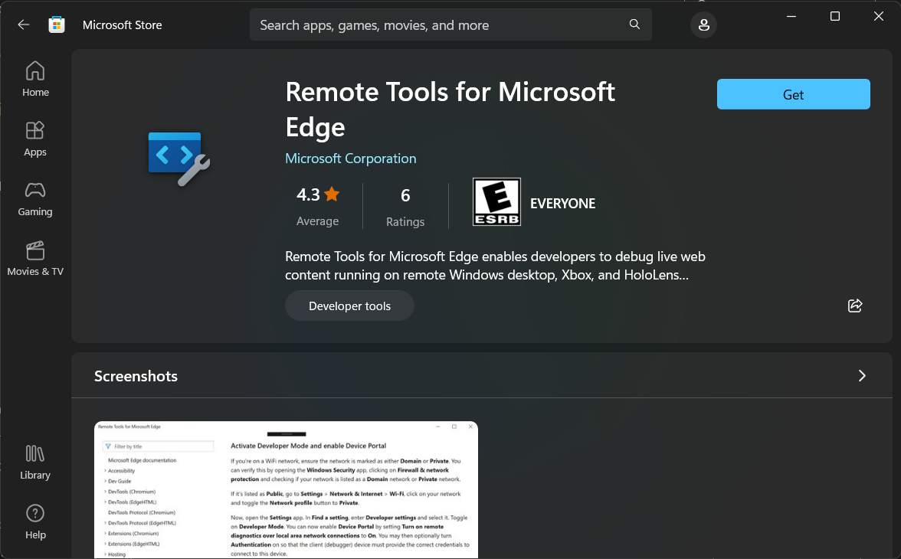
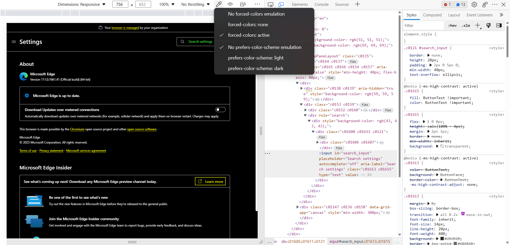
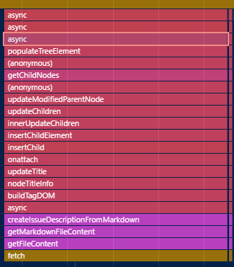
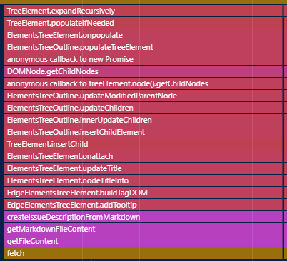
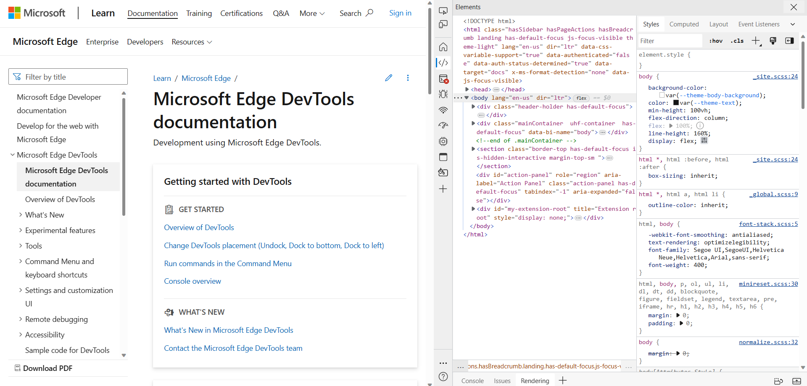
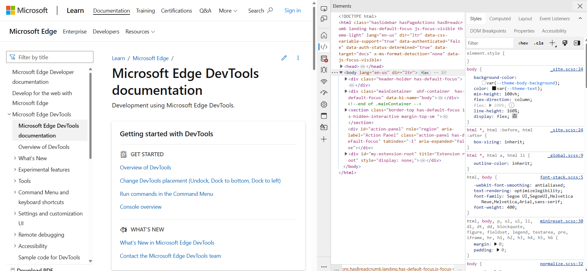
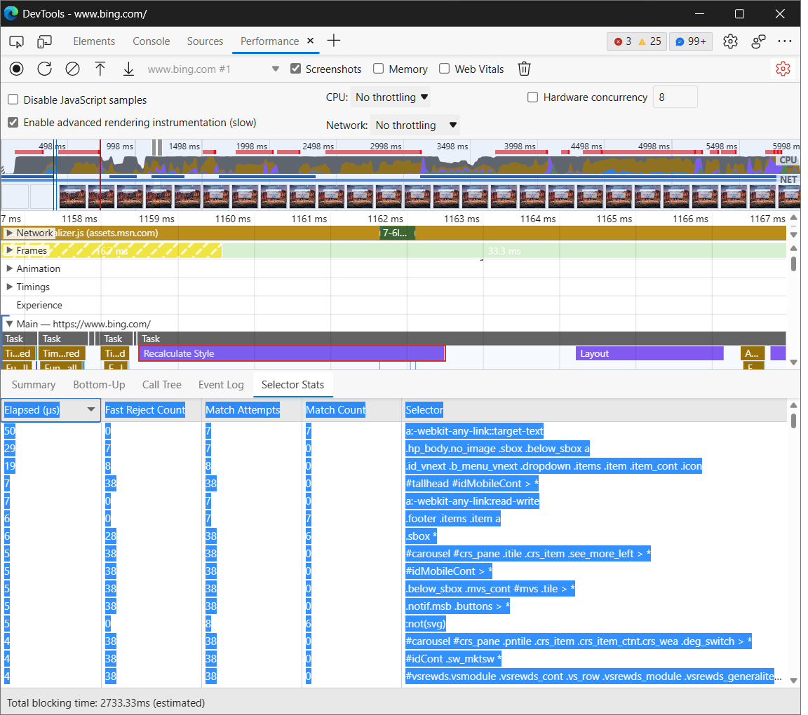
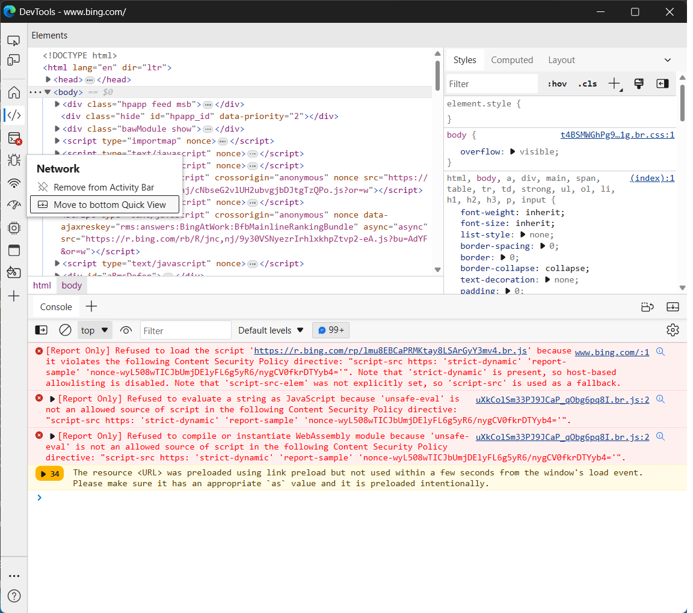

# What's New in DevTools (Microsoft Edge 111)

[!INCLUDE [Microsoft Edge team note for top of What's New](../../includes/edge-whats-new-note.md)]

<!-- ====================================================================== -->
## Remote debugging of Microsoft Edge, PWAs, and WebView2 controls on HoloLens 2 devices

<!-- Subtitle: Get the Remote Tools for Microsoft Edge app from the Microsoft Store to set up remote debugging today! -->

The **Remote Tools for Microsoft Edge** app is now available on HoloLens 2 devices.  The **Remote Tools for Microsoft Edge** app is a plug-in for the **Windows Device Portal for Desktop** that enables remote debugging for tabs in Microsoft Edge, Progressive Web Apps (PWAs), and WebView2 controls.  By using remote debugging, you can run web content on a remote device and debug it right from your development machine.

With remote debugging enabled, you don't need to open DevTools on HoloLens 2 devices any more.  Instead, you can connect to the remote HoloLens 2 device using the Device portal, open the `edge://inspect` page, and then select the target (tab, PWA, or WebView2 control) that you want to use with DevTools.

To give us feedback on the remote debugging flow for Microsoft Edge, leave a comment in [Issue 136: Remote debugging HoloLens 2 devices is now available with the latest version of the Remote Tools for Microsoft Edge app](https://github.com/MicrosoftEdge/DevTools/issues/136).

See also:
* [Remotely debug Windows devices](../../../remote-debugging/windows.md)
* [Windows Device Portal for Desktop](/windows/uwp/debug-test-perf/device-portal-desktop)
* [Remote debugging WebView2 WinUI 2 (UWP) apps](../../../../webview2/how-to/remote-debugging.md)

<!-- ====================================================================== -->
## Device Mode toolbar has emulation controls for themes and vision deficiencies

<!-- Subtitle: Use the new Eyedropper and Eye icons from the Device Mode toolbar to test how your web content responds to light, dark, and high contrast themes and vision deficiencies like color blindness. -->

In previous versions of Microsoft Edge, to emulate different themes or vision deficiencies, you would use the **Rendering** tool to, for example, emulate Achromatopsia, which is when the user is unable to perceive any color.

In Microsoft Edge 111, you can now access these theme and vision deficiency emulation controls directly from the **Device Mode** toolbar, in addition to using the **Rendering** tool.

For example, to emulate high contrast mode and test how your web content responds:

1. In the **Device Mode** toolbar, to the right of the **Throttling** dropdown list, click **Emulate Media Features** (the Eyedropper icon, ).
1. Select **forced-colors: active**:

You can also emulate vision deficiencies by clicking the Eye icon next to the Eyedropper icon.  For example, to emulate blurred vision:

1. Click **Emulate Vision Deficiency** (the eye icon, ).
1. Select **Blurred vision**:

See also:
* [Emulate mobile devices (Device Emulation)](../../../device-mode/index.md)
* [Check for contrast issues with dark theme and light theme](../../../accessibility/test-dark-mode.md)
* [Emulate vision deficiencies](../../../accessibility/emulate-vision-deficiencies.md)

<!-- ====================================================================== -->
## Performance tool unminifies file and function names when profiling production code
<!-- if change heading: update link in what's new item that links to here -->

<!-- Subtitle: As long as the Performance tool can find sourcemaps from Symbol Server, the Performance tool automatically presents the original file and function names in the flame chart. -->

Microsoft Edge 99 added a new feature to the **Performance** tool called **Unminify**. This **Unminify** feature applied sourcemaps to a profile that was recorded with the **Performance** tool, and then downloaded the unminified profile to your machine. The **Unminify** feature is described in [Use your source maps to display original function names in performance profiles](../../2022/03/devtools.md#use-your-source-maps-to-display-original-function-names-in-performance-profiles) in _What's New in DevTools (Microsoft Edge 99)_.

In Microsoft Edge 111, this feature has been removed, because the Performance tool now automatically provides the original file and function names while profiling production code, as long as source maps are loaded.  Source maps can be loaded reliably and securely by hosting them on Azure Artifacts Symbol Server.

In the following image, you see minified function names in the flame chart when profiling production code:

Now in Microsoft Edge 111, the **Performance** tool automatically unminifies function names in the flame chart when profiling production code:

See also:
* [Securely debug original code by publishing source maps to the Azure Artifacts symbol server](../../../javascript/publish-source-maps-to-azure.md)
* [Securely debug original code by using Azure Artifacts symbol server source maps](../../../javascript/consume-source-maps-from-azure.md)
* [Record performance](../../../evaluate-performance/reference.md#record-performance) in _Performance features reference_.

<!-- ====================================================================== -->
## The Styles pane is easier to use in Focus Mode

<!-- Subtitle: In previous versions of Microsoft Edge, the Styles pane of the Elements tool didn't provide easy access to all of the sections within it. This issue has now been fixed in Microsoft Edge 111. -->

In previous versions of Microsoft Edge, in **Focus Mode**, the **Elements** tool didn't provide an easy way to access all of the tabs within the **Styles** pane.  In Microsoft Edge 111, this issue has been fixed. When the **Styles** pane has a narrow viewport and can't display all of the other available tabs, click the **More tabs** expander icon ():

To display only a few of the tabs within the **Styles** pane, click the **More tabs** collapser icon ():

See also:
* [CSS features reference](../../../css/reference.md)

<!-- ====================================================================== -->
## Copy Selector Stats table from Performance tool to Excel

<!-- Subtitle: In Microsoft Edge 111, you can copy and paste Selector Stats data from the Performance tool for aggregate selector performance analysis. -->

Microsoft Edge 109 introduced the **Selector Stats** feature in the **Performance** tool.  With the **Enable advanced rendering instrumentation (slow)** setting turned on in the **Performance** tool, selecting any **Recalculate Styles** event in the flame chart adds a **Selector Stats** tab in the bottom pane.  See [Debug long-running Recalculate Style events with new selector stats](../../2023/01/devtools-109.md#debug-long-running-recalculate-style-events-with-new-selector-stats) in _What's New in DevTools (Microsoft Edge 109)_.

In Microsoft Edge 111, you can now export the **Selector Stats** table for each **Recalculate Styles** event to a Microsoft Excel workbook.  You can then use Excel to do aggregate selector performance analysis, and identify the most costly selectors over the lifetime of the profile.

To export the **Selector Stats** table:

1. Click the upper left cell with the mouse, and then drag to select to the bottom right cell.
1. Right-click the table, and then select **Copy**.  Or, press **Ctrl+C** (Windows, Linux) or **Command+C** (macOS).
1. Paste the table into Excel.

See also:
* [Analyze selector performance during Recalculate Style events](../../../evaluate-performance/selector-stats.md)

<!-- ====================================================================== -->
## In Focus Mode, assistive technology announces when you move a tool to Quick View

In previous versions of Microsoft Edge, assistive technology, such as screen readers, didn't announce confirmation when moving a tool from the **Activity Bar** to the **Quick View** toolbar.  In Microsoft Edge 111, this issue has been fixed.  Screen readers now announce "Successfully added Network to Quick View" when you move the **Network** tool from the **Activity Bar** to the **Quick View** toolbar:

See also:
* [Navigate DevTools with assistive technology](../../../accessibility/navigation.md)

<!-- ====================================================================== -->
## Announcements from the Chromium project

Microsoft Edge 111 also includes the following updates from the Chromium project:

* [Debugging HD color with the Styles pane](https://developer.chrome.com/blog/new-in-devtools-111/#color)
* [Enhanced breakpoint UX](https://developer.chrome.com/blog/new-in-devtools-111/#breakpoint-redesign)
* [Better syntax highlight for Angular](https://developer.chrome.com/blog/new-in-devtools-111/#syntax)
* [Reorganize caches in the Application panel](https://developer.chrome.com/blog/new-in-devtools-111/#cache)

<!-- ====================================================================== -->
<!-- uncomment if content is copied from developer.chrome.com to this page -->

<!-- > [!NOTE]
> Portions of this page are modifications based on work created and [shared by Google](https://developers.google.com/terms/site-policies) and used according to terms described in the [Creative Commons Attribution 4.0 International License](https://creativecommons.org/licenses/by/4.0).
> The original page for announcements from the Chromium project is [What's New in DevTools (Chrome 111)](https://developer.chrome.com/blog/new-in-devtools-111) and is authored by [Jecelyn Yeen](https://developers.google.com/web/resources/contributors#jecelynyeen) (Developer advocate working on Chrome DevTools at Google). -->

<!-- ====================================================================== -->
<!-- uncomment if content is copied from developer.chrome.com to this page -->

<!-- 
This work is licensed under a [Creative Commons Attribution 4.0 International License](https://creativecommons.org/licenses/by/4.0). -->
