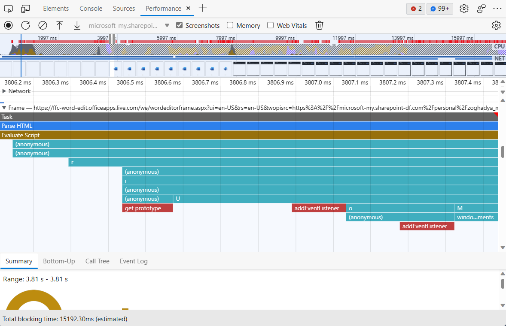

# What's New in DevTools (Microsoft Edge 112)

[!INCLUDE [Microsoft Edge team note for top of What's New](../../includes/edge-whats-new-note.md)]

<!-- ====================================================================== -->
## The Performance tool can now unminify JavaScript running in out-of-process iframes

<!-- Subtitle: As long as DevTools can load your sourcemaps, you now have unparalleled insight into JavaScript execution within an iframe. -->

In previous versions of Microsoft Edge, JavaScript execution in an out-of-process iframe (OOPIF) was isolated from the DevTools.  As a result, the Performance tool was not able to apply sourcemaps to performance events from the OOPIF.  When recording a profile in the Performance tool, the tool can only display the unminified file and function names in the flame chart.

In Microsoft Edge 112, the Performance tool now loads and applies sourcemaps to the performance events tracked in OOPIFs.  As a result, you can now see unminified file and function names for the JavaScript execution within an OOPIF when recording a profile in the Performance tool.

See also:
* [Performance tool unminifies file and function names when profiling production code
](./devtools-111.md#performance-tool-unminifies-file-and-function-names-when-profiling-production-code) in *What's new in DevTools (Microsoft Edge 111)*
* [Securely debug original code by publishing source maps to the Azure Artifacts symbol server](../../../javascript/publish-source-maps-to-azure.md)
* [Securely debug original code by using Azure Artifacts symbol server source maps](../../../javascript/consume-source-maps-from-azure.md)
* [Record performance](../../../evaluate-performance/reference.md#record-performance) in _Performance features reference_.

<!-- For our reference
- https://dev.azure.com/microsoft/Edge/_git/chromium.devtools-frontend/pullrequest/8414709
- https://dev.azure.com/microsoft/Edge/_workitems/edit/43100332/
- https://microsoft.visualstudio.com/Edge/_workitems/edit/43100279
 -->

<!-- ====================================================================== -->
## The CSS Overview tool displays a list of non-simple selectors for quick performance wins

<!-- Subtitle: Non-simple selectors can be common culprits for long-running Recalculate Styles events in the Performance tool. Take a quick snapshot in the CSS Overview tool to see your non-simple selectors. -->

The **CSS Overview** tool has a new section, called **Non-simple selectors** which displays a list of non-simple CSS selectors when you take an overview of your web page's CSS.  This list of non-simple selectors provides a quick way to identify common culprits for long-running **Recalculate Styles** events in the **Performance** tool.  You can try to change these selectors so that they are more specific and match fewer elements, reducing the amount of time the browser takes to calculate styles when:

- Elements are added to or removed from the DOM.
- An element's attributes are changed, such as `class` or `id`.
- User input occurs, such as a mouse move or focus change, which can affect `:hover` rules.

You can analyze the impact of your changes and individual selector performance with the **Selector Stats** feature in the **Performance** tool.  Quickly jump to the **Performance** tool by selecting the **Performance** button from the **Non-simple selectors** section of the **CSS Overview** tool and ensure the **Enable advanced rendering instrumentation (slow)** setting is turned on before beginning profiling.

See also:
* [Optimize CSS styles with the CSS Overview tool](../../../css/css-overview-tool.md)
* [Analyze selector performance during Recalculate Style events](../../../evaluate-performance/selector-stats.md)

<!-- ====================================================================== -->
## Item 3

<!-- Subtitle: . -->

<!-- 
See also:
* 
-->

<!-- ====================================================================== -->
## Announcements from the Chromium project

Microsoft Edge 112 also includes the following updates from the Chromium project:

* [Elements > Styles updates](https://developer.chrome.com/blog/new-in-devtools-112/#elements-styles)
   * [CSS documentation](https://developer.chrome.com/blog/new-in-devtools-112/#css)
   * [CSS nesting support](https://developer.chrome.com/blog/new-in-devtools-112/#nesting)
* [Marking logpoints and conditional breakpoints in the Console](https://developer.chrome.com/blog/new-in-devtools-112/#logpoint)
* [Ignore irrelevant scripts during debugging](https://developer.chrome.com/blog/new-in-devtools-112/#ignore-list)
* [JavaScript Profiler deprecation started](https://developer.chrome.com/blog/new-in-devtools-112/#js-profiler-deprecation)
* [Emulate reduced contrast](https://developer.chrome.com/blog/new-in-devtools-112/#reduced-contrast)
* [Lighthouse 10](https://developer.chrome.com/blog/new-in-devtools-112/#lighthouse)
* [Miscellaneous highlights](https://developer.chrome.com/blog/new-in-devtools-112/#misc)

<!-- ====================================================================== -->
<!-- uncomment if content is copied from developer.chrome.com to this page -->

<!-- > [!NOTE]
> Portions of this page are modifications based on work created and [shared by Google](https://developers.google.com/terms/site-policies) and used according to terms described in the [Creative Commons Attribution 4.0 International License](https://creativecommons.org/licenses/by/4.0).
> The original page for announcements from the Chromium project is [What's New in DevTools (Chrome 112)](https://developer.chrome.com/blog/new-in-devtools-112) and is authored by [Jecelyn Yeen](https://developers.google.com/web/resources/contributors#jecelynyeen) (Developer advocate working on Chrome DevTools at Google). -->

<!-- ====================================================================== -->
<!-- uncomment if content is copied from developer.chrome.com to this page -->

<!-- 
This work is licensed under a [Creative Commons Attribution 4.0 International License](https://creativecommons.org/licenses/by/4.0). -->
