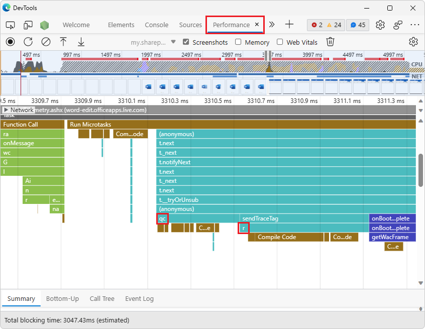
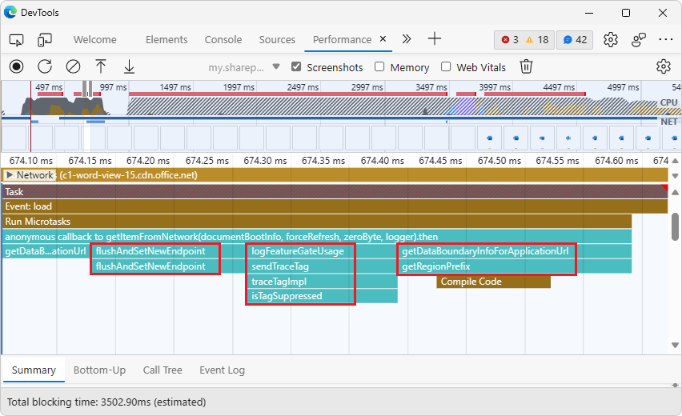
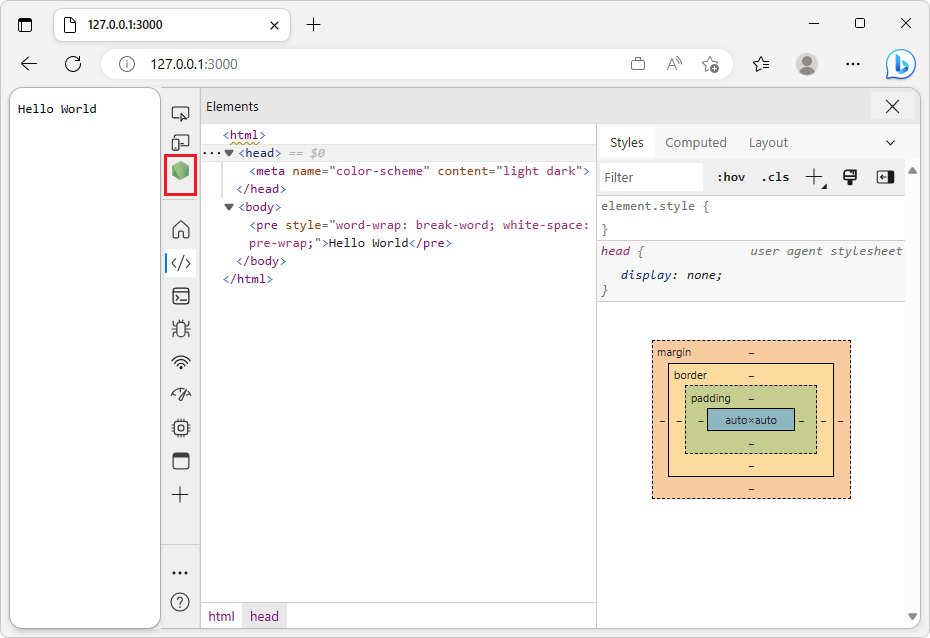
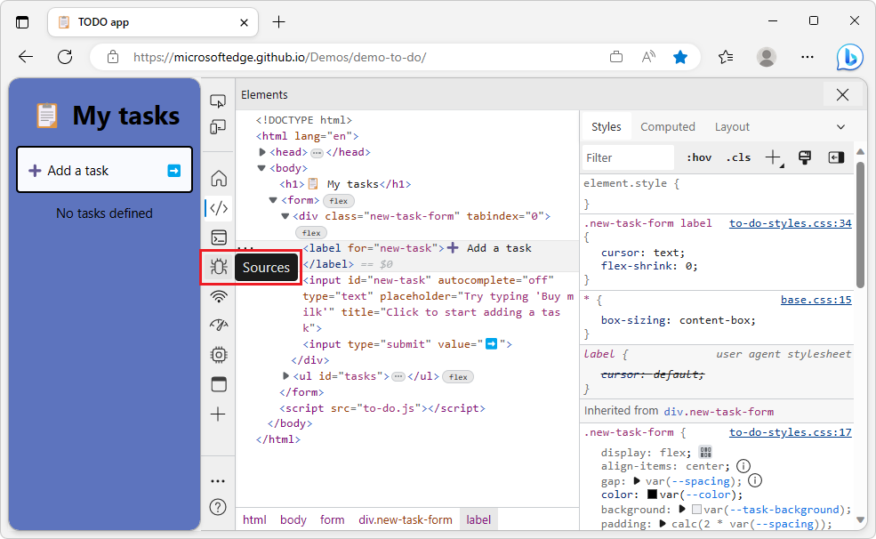

# What's New in DevTools (Microsoft Edge 112)

[!INCLUDE [Microsoft Edge team note for top of What's New](../../includes/edge-whats-new-note.md)]

<!-- ====================================================================== -->
## Performance tool unminifies JavaScript running in out-of-process iframes

<!-- Subtitle: As long as DevTools can load your sourcemaps, you now have unparalleled insight into JavaScript execution within an iframe. -->

In previous versions of Microsoft Edge, JavaScript execution in an out-of-process iframe (OOPIF) was isolated from DevTools.  As a result, the **Performance** tool was not able to apply sourcemaps to performance events that are from an OOPIF.  When recording a profile in the **Performance** tool, the tool can only display the minified file and function names in the flame chart, not the unminified names:

<!-- maint:
1. Go to https://word.new/
2. Open the Performance tool.
3. Click the Refresh button in the tool to start profiling and refresh the page.
4. After the profile loads after some 15 seconds, navigate underneath the Main section of the flame chart to find a frame and then zoom in on a call stack to show that the function names are minified.
-->

In Microsoft Edge 112, the **Performance** tool now loads sourcemaps and applies them to the performance events that are tracked in OOPIFs.  As a result, after recording a profile in the **Performance** tool, you can now see unminified file and function names for the JavaScript execution that occurs within an OOPIF:

<!-- maint:
1. Connect Symbol Server via a PAT to the Office org. https://learn.microsoft.com/microsoft-edge/devtools-guide-chromium/javascript/consume-source-maps-from-azure
2. Repeat the above steps to show the original file and function names in the flame chart.
-->

See also:
* [Performance tool unminifies file and function names when profiling production code](../03/devtools-111.md#performance-tool-unminifies-file-and-function-names-when-profiling-production-code) in _What's New in DevTools (Microsoft Edge 111)_.
* [Securely debug original code by publishing source maps to the Azure Artifacts symbol server](../../../javascript/publish-source-maps-to-azure.md)
* [Securely debug original code by using Azure Artifacts symbol server source maps](../../../javascript/consume-source-maps-from-azure.md)
* [Record performance](../../../evaluate-performance/reference.md#record-performance) in _Performance features reference_.

<!-- ====================================================================== -->
## CSS Overview tool displays non-simple selectors for quick performance gains

<!-- Subtitle: Non-simple selectors can be common culprits for long-running Recalculate Styles events in the Performance tool. Take a quick snapshot in the CSS Overview tool to see your non-simple selectors. -->

The **CSS Overview** tool has a new **Non-simple selectors** section, which displays a list of non-simple CSS selectors when you take an overview snapshot of your webpage's CSS.  This list of non-simple CSS selectors in the **CSS Overview** tool provides a quick way to identify common culprits that might be causing long-running **Recalculate Styles** events:

This is a list of selectors that could possibly reduce performance.  To determine whether these selectors are actually reducing performance, use the **Selector Stats** feature in the **Performance** tool.

You can try to change these selectors so that they are more specific and match fewer elements, reducing the amount of time the browser takes to calculate styles in the following cases:

- When elements are added to or removed from the DOM.
- When an element's attributes are changed, such as `class` or `id`.
- When user input occurs, such as a mouse move or a change of focus, which can affect `:hover` rules.

To analyze individual CSS selector performance and analyze the impact of your changes, use the **Selector Stats** feature in the **Performance** tool.

See also:
* [Optimize CSS styles with the CSS Overview tool](../../../css/css-overview-tool.md)
* [Analyze selector performance during Recalculate Style events](../../../evaluate-performance/selector-stats.md)

<!-- ====================================================================== -->
## The JSON Viewer in Microsoft Edge supports code folding

<!-- Subtitle: Use code folding when looking at JSON to collapse and expand objects and arrays. -->

Starting with Microsoft Edge 110, you have access to an experimental feature for viewing JSON directly in the browser: the **JSON Viewer**.  Previously, you may have used browser extensions or text editors for viewing JSON, but now you can inspect JSON payloads directly in Microsoft Edge, whether the JSON is from the network or from disk.

Starting in Microsoft Edge 112, the JSON Viewer now supports code folding.  The JSON Viewer is an experimental feature.  To turn on the JSON Viewer and access code folding:

1. Go to `edge://flags`.

1. In the **Search flags** text field, start typing **JSON Viewer**.

1. In the **JSON Viewer** dropdown menu, select **Enabled**.  A **Restart** button appears in the lower right.

1. Click the **Restart** button.

1. Go to a JSON file, such as https://microsoftedge.github.io/Demos/json-dummy-data/256KB.json.  Line numbers appear on the left.

1. Click the gear<!--no tooltip--> () icon in the top right corner, and then select the **Code folding** checkbox.

With code folding turned on, you can now expand and collapse objects and arrays within the JSON you're inspecting:

Please send us your [feedback](../../../contact.md)!

See also:
* [View formatted JSON](../../../json-viewer/json-viewer.md)

<!-- ====================================================================== -->
## Focus Mode improvements

<!-- Subtitle: Pressing Esc now hides or shows the Quick View, the Node icon for dedicated DevTools no longer overlaps the first icon in the Activity Bar, and more. -->

**Focus Mode** is a new, experimental user interface for DevTools.  Focus Mode simplifies and streamlines the DevTools UI, providing maximum customizability without compromising on the robust set of features in the tools.  In Microsoft Edge 112, Focus Mode received the following improvements:

<!-- ------------------------------ -->
#### Pressing Esc shows or entirely hides Quick View

In previous versions of Microsoft Edge, in **Focus Mode**, the **Quick View** panel was always displayed, as either collapsed or expanded.  Pressing **Esc** expanded the **Quick View** panel if it was collapsed, and vice versa.  However, when the **Console** tool was selected in the **Activity Bar**, pressing **Esc** when the **Quick View** panel was collapsed displayed a blank view.  In Microsoft Edge 112, this issue has been fixed.

Pressing **Esc** now shows or entirely hides the **Quick View** panel.  If the **Quick View** panel is currently hidden, pressing **Esc** shows the **Quick View** panel, expanded:

If the **Quick View** toolbar is currently displayed (whether the **Quick View** panel is collapsed or expanded), pressing **Esc** entirely hides the **Quick View** toolbar and panel:

<!-- ------------------------------ -->
#### The Node icon for dedicated DevTools no longer overlaps the first icon in the Activity Bar

In Focus Mode, when DevTools detects that a Node.js server is running, the Node icon is displayed.  Clicking this icon opens the dedicated DevTools for Node.

Before Microsoft Edge 112, the Node icon overlaps the first tool icon when the **Activity Bar** is in vertical orientation, making it harder to select the first tool.  This issue has now been fixed; there's no overlapping of the Node icon and the first tool icon when the **Activity Bar** is vertical:

<!-- screenshot:
https://nodejs.org/en/docs/guides/getting-started-guide
$ cd C:/Users/username/GitHub/node-test/
$ node --inspect app.js
-->

<!-- ------------------------------ -->
#### With the vertical Activity Bar, only one label is shown for each tool icon when hovering

In **Focus Mode**, when the **Activity Bar** is in the vertical orientation, a tool name label is displayed when you hover over an icon or select an icon with the keyboard.  These labels help you learn the icon for each tool in the **Activity Bar**.

Previously, selecting an icon with the keyboard or hovering over an icon with the mouse displayed two labels simultaneously.  This issue has now been fixed; only one label is displayed:

<!-- ====================================================================== -->
## Announcements from the Chromium project

Microsoft Edge 112 also includes the following updates from the Chromium project:

* [Elements > Styles updates](https://developer.chrome.com/blog/new-in-devtools-112/#elements-styles)
* [Marking logpoints and conditional breakpoints in the Console](https://developer.chrome.com/blog/new-in-devtools-112/#logpoint)
* [Ignore irrelevant scripts during debugging](https://developer.chrome.com/blog/new-in-devtools-112/#ignore-list)
* [JavaScript Profiler deprecation started](https://developer.chrome.com/blog/new-in-devtools-112/#js-profiler-deprecation)
* [Emulate reduced contrast](https://developer.chrome.com/blog/new-in-devtools-112/#reduced-contrast)
* [Lighthouse 10](https://developer.chrome.com/blog/new-in-devtools-112/#lighthouse)

<!-- ====================================================================== -->
<!-- uncomment if content is copied from developer.chrome.com to this page -->

<!-- > [!NOTE]
> Portions of this page are modifications based on work created and [shared by Google](https://developers.google.com/terms/site-policies) and used according to terms described in the [Creative Commons Attribution 4.0 International License](https://creativecommons.org/licenses/by/4.0).
> The original page for announcements from the Chromium project is [What's New in DevTools (Chrome 112)](https://developer.chrome.com/blog/new-in-devtools-112) and is authored by [Jecelyn Yeen](https://developers.google.com/web/resources/contributors#jecelynyeen) (Developer advocate working on Chrome DevTools at Google). -->

<!-- ====================================================================== -->
<!-- uncomment if content is copied from developer.chrome.com to this page -->

<!-- 
This work is licensed under a [Creative Commons Attribution 4.0 International License](https://creativecommons.org/licenses/by/4.0). -->
