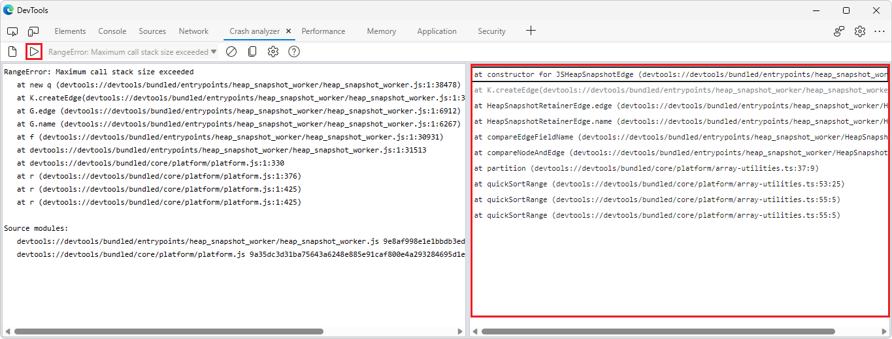
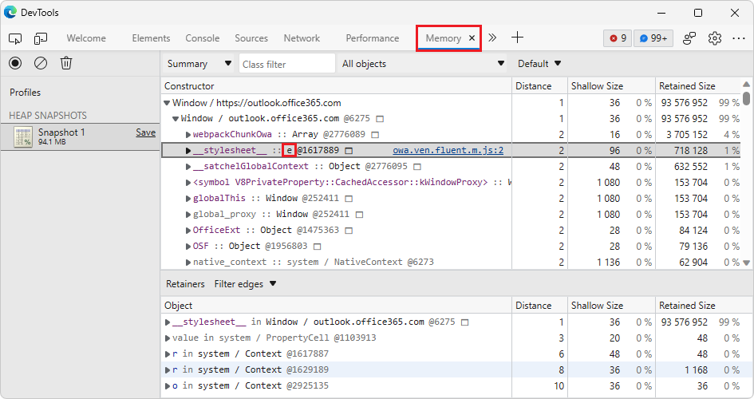
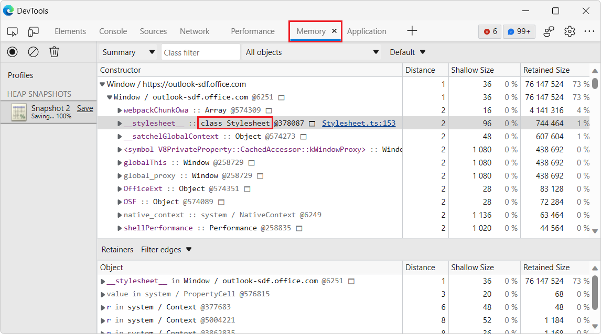
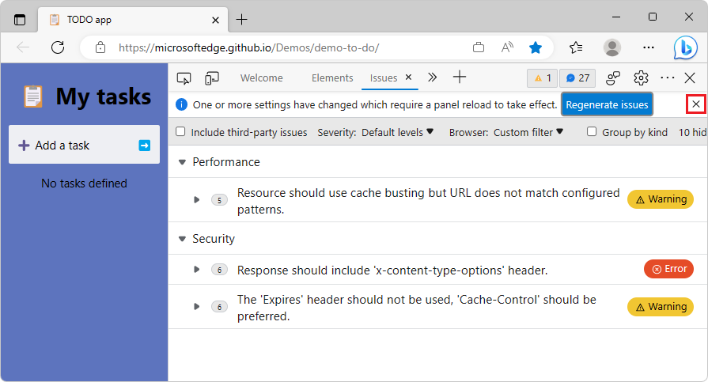
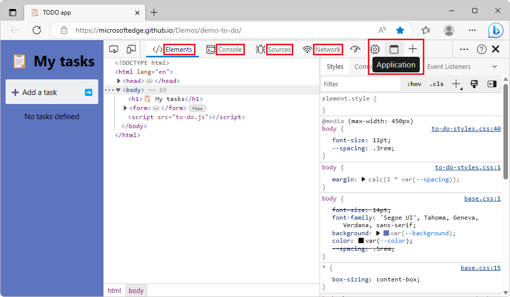
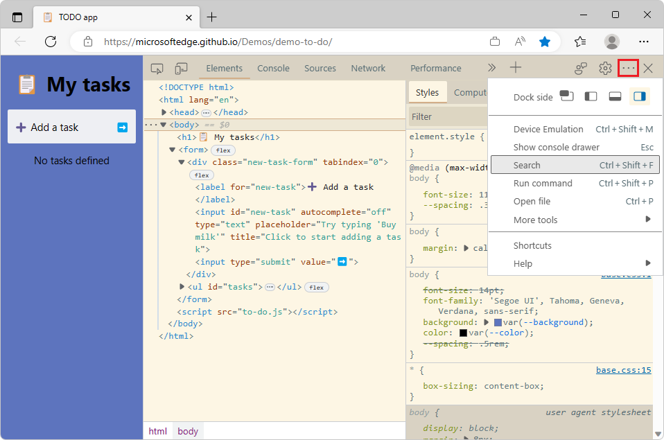
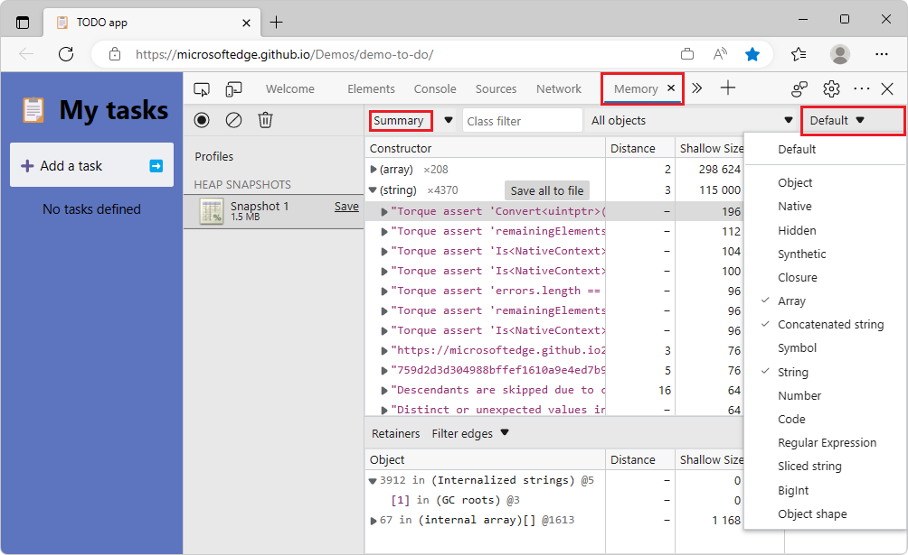
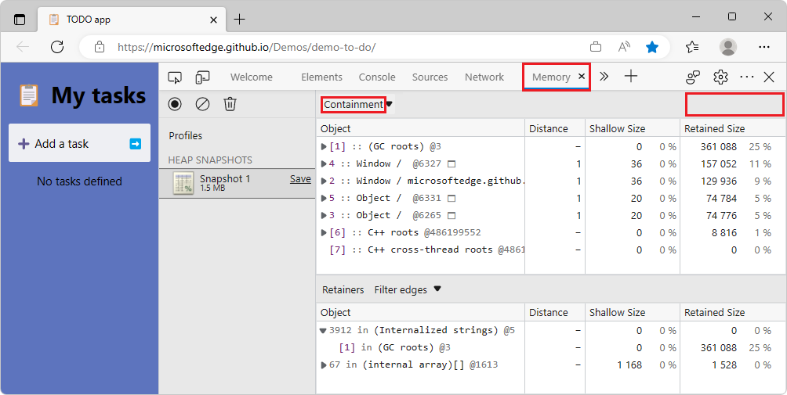

# What's New in DevTools (Microsoft Edge 113)

[!INCLUDE [Microsoft Edge team note for top of What's New](../../includes/edge-whats-new-note.md)]

> [!TIP]
> The **Microsoft Build 2023** conference was on May 23-25, 2023.  Learn more about new features for memory, performance, and production debugging in DevTools, as well as new capabilities for PWAs in the sidebar, WebView2, and Chat Plugins, in the following videos:
> * [Microsoft Edge | State of web developer tools](https://www.youtube.com/watch?v=yDFmQNu3TSg&list=PL4z1-7pjJU6zJT3PBQ4mTbNg2wtX7Lt52)
> * [Microsoft Edge | Building Progressive Web Apps for the sidebar](https://www.youtube.com/watch?v=9u8lRzRUayw&list=PL4z1-7pjJU6zJT3PBQ4mTbNg2wtX7Lt52)
> * [Microsoft Edge | Bringing WebView2 to Microsoft Teams and beyond](https://www.youtube.com/watch?v=s3tDUvaoCP4&list=PL4z1-7pjJU6zJT3PBQ4mTbNg2wtX7Lt52)
> * [Building Chat Plugins for Microsoft Bing and Edge](https://www.youtube.com/watch?v=Q-5M7EYjl6U&list=PL4z1-7pjJU6zJT3PBQ4mTbNg2wtX7Lt52)

<!-- ====================================================================== -->
## Debug JavaScript error stack traces by using the Crash Analyzer tool

<!-- Subtitle: Turn on the "Enable Crash Analyzer" experiment and paste in your error stack trace with source map references for faster debugging. -->

The new **Crash analyzer** tool is available as an experiment in Microsoft Edge 113.  In the **Crash analyzer** tool, you can input a JavaScript stack trace, such as for non-fatal JavaScript exceptions, and then have your sourcemaps applied to the stack trace so that you can debug faster.

To access the **Crash analyzer** tool, select the **Enable Crash Analyzer** experiment in **Settings** > **Experiments**.  See [Turning an experiment on or off](../../../experimental-features/index.md#turning-an-experiment-on-or-off).

You can report non-fatal JavaScript exceptions or similar data to tools such as Azure Application Insights:

1. First, in order to use the **Crash analyzer** tool, you need specially-formatted stack traces that include a section called `Source modules`.  This section contains the sourcemap references to the JavaScript functions that were part of the error stack trace.  You can produce these stack traces by using the [Crash Analyzer Support](https://www.npmjs.com/package/@microsoft/edge-devtools-crash-analyzer-support) npm package.

1. Then you need a way to actually receive the stack traces from the browsers that are running your code.  One such way is to use Azure Application Insights; see [Application Insights overview](/azure/azure-monitor/app/app-insights-overview).

1. Once you have a stack trace, paste it into the left pane of the **Crash analyzer** tool.

1. In the **Crash analyzer** tool, click the **Analyze** button (or press **Ctrl+Enter**).  The right-hand pane shows the original file and function names that make up the stack trace:

   

1. Click through the individual stack frames to see the lines in your original code that caused the error.

<!-- todo: For more information, see [Crash Analyzer](../../../crash-analyzer/index.md). -->

See also:
* [throw - JavaScript | MDN Web Docs](https://developer.mozilla.org/docs/Web/JavaScript/Reference/Statements/throw)
* [Application Insights overview](/azure/azure-monitor/app/app-insights-overview)
* [Crash Analyzer Support | npm](https://www.npmjs.com/package/@microsoft/edge-devtools-crash-analyzer-support)

<!-- ====================================================================== -->
## The Memory tool can unminify object names in heap snapshots

<!-- Subtitle: DevTools applies your sourcemaps to a heap snapshot in the Memory tool, so that you can see unminified object names. -->

In Microsoft Edge 113, the **Memory** tool now automatically provides the original object names when taking a heap snapshot, as long as source maps are loaded.  Source maps can be loaded reliably and securely by hosting them on Azure Artifacts Symbol Server.

In the following image, the minified object name `e` is shown in a heap snapshot in the **Memory** tool:

Now in Microsoft Edge 113, the **Memory** tool automatically unminifies object names in the heap snapshot:

<!-- todo
1. Open Edge Stable.
2. Go to: https://outlook-sdf.office.com/mail/
3. Don't show the Outlook UI - undock DevTools.
4. Open DevTools > Memory.
5. Take a heap snapshot.
6. Expand Window, expand Window, find stylesheet e and draw a red box around e.
-->

See also:
* [Securely debug original code by publishing source maps to the Azure Artifacts symbol server](../../../javascript/publish-source-maps-to-azure.md)
* [Securely debug original code by using Azure Artifacts symbol server source maps](../../../javascript/consume-source-maps-from-azure.md)
* [Take a snapshot](../../../memory-problems/heap-snapshots.md#take-a-snapshot) in _Record heap snapshots using the Memory tool_.

<!-- ====================================================================== -->
## The Issues tool has better support for keyboard navigation

<!-- Subtitle: In previous versions of Microsoft Edge, certain Close buttons in the issues tool were not displayed when navigating via the keyboard. In Microsoft Edge 113, this issue has been fixed. -->

In the **Issues** tool, changing the **Severity** or **Browser** filters displays an info bar at the top of the **Issues** tool, containing a **Regenerate issues** button.  In previous versions of Microsoft Edge, navigating this info bar with the keyboard caused the **Close** button to disappear.  In Microsoft Edge 113, this issue has been fixed:

See also:
* [Filter issues](../../../issues/index.md#filter-issues) in _Find and fix problems using the Issues tool_
* [Navigate DevTools with assistive technology](../../../accessibility/navigation.md)

<!-- ====================================================================== -->
## In Focus Mode, hovering over a tool no longer makes the name of each tool disappear in the Activity Bar

<!-- Subtitle: With the Activity Bar in the horizontal orientation, you can now see the name of each tool and hover over the tool icon to see a tooltip. -->

In previous versions of Microsoft Edge, in Focus Mode, hovering over a tool's icon in the **Activity Bar** in horizontal mode caused the names of the other tools in the **Activity Bar** to disappear.  In Microsoft Edge 113, this issue has been fixed.  When you hover over a tool icon to see the name of the tool in a tooltip, the names of the other tools remain displayed in the **Activity Bar**:

<!-- ====================================================================== -->
## The Customize DevTools menu has better support for VS Code themes

<!-- Subtitle: Customize DevTools to match VS Code with themes like Solarized Light, Kimbie Dark, Monokai, or Tomorrow Night Blue. -->
<!-- Reviewer: Irene Cho -->

In previous versions of Microsoft Edge, applying themes from Microsoft Visual Studio Code such as Solarized Light or Kimbie Dark caused low-contrast issues when hovering over items in the **Customize and control DevTools** menu.  In Microsoft Edge 113, this issue has been fixed.  Items in the **Customize and control DevTools** menu are now displayed with sufficient color contrast:

See also:
* [Apply a color theme to DevTools](../../../customize/theme.md)
* [Test text-color contrast using the Color Picker](../../../accessibility/color-picker.md)
* [Check text-color contrast in the default state using the Inspect tool](../../../accessibility/test-inspect-text-contrast.md)

<!-- ====================================================================== -->
## The Node Types filter in the Memory tool now only displays in the Summary view of a heap snapshot

<!-- Subtitle: The Containment and Statistics views for heap snapshots no longer display the Node Types filter, since the filter doesn't apply to those views. -->

In [Microsoft Edge 100](../../2022/03/devtools-100.md#filter-heap-snapshots-summary-by-node-type), we added a **Node Types** filter to the **Memory** tool so you can focus only on specific types of objects, such as `Array` or `String`, when looking at a heap snapshot.  This **Node Types** filter only applies to objects that are displayed in the **Summary** view of a heap snapshot.

The **Node Types** filter was also displayed when the **Containment** or **Statistics** views of the heap snapshot were selected, even though the filter doesn't apply to those views.  This issue has been fixed.  In Microsoft Edge 113, the **Node Types** filter is only displayed when the **Summary** view is selected:

In the **Containment** and **Statistics** views, the **Node Types** filter is no longer displayed, since it doesn't apply:

See also:
* [Filter heap snapshots summary by node type](../../2022/03/devtools-100.md#filter-heap-snapshots-summary-by-node-type)  in _What's New in DevTools (Microsoft Edge 100)_
* [Take a snapshot](../../../memory-problems/heap-snapshots.md#take-a-snapshot) in _Record heap snapshots using the Memory tool_.

<!-- ====================================================================== -->
## Announcements from the Chromium project

Microsoft Edge 113 also includes the following updates from the Chromium project:

* [Override network response headers](https://developer.chrome.com/blog/new-in-devtools-113/#network)
* [Nuxt, Vite, and Rollup debugging improvements](https://developer.chrome.com/blog/new-in-devtools-113/#debug)
* [CSS improvements in Elements > Styles](https://developer.chrome.com/blog/new-in-devtools-113/#css)
   * [Invalid CSS properties and values](https://developer.chrome.com/blog/new-in-devtools-113/#invalid-css)
   * [Links to key frames in the animation shorthand property](https://developer.chrome.com/blog/new-in-devtools-113/#animation-key-frames)
* [New Console setting: Autocomplete on Enter](https://developer.chrome.com/blog/new-in-devtools-113/#console)
* [Command Menu emphasizes authored files](https://developer.chrome.com/blog/new-in-devtools-113/#command-menu)
* [JavaScript Profiler deprecation: Stage two](https://developer.chrome.com/blog/new-in-devtools-113/#js-profiler)

<!-- ====================================================================== -->
<!-- uncomment if content is copied from developer.chrome.com to this page -->

<!-- > [!NOTE]
> Portions of this page are modifications based on work created and [shared by Google](https://developers.google.com/terms/site-policies) and used according to terms described in the [Creative Commons Attribution 4.0 International License](https://creativecommons.org/licenses/by/4.0).
> The original page for announcements from the Chromium project is [What's New in DevTools (Chrome 113)](https://developer.chrome.com/blog/new-in-devtools-113) and is authored by [Jecelyn Yeen](https://developers.google.com/web/resources/contributors#jecelynyeen) (Developer advocate working on Chrome DevTools at Google). -->

<!-- ====================================================================== -->
<!-- uncomment if content is copied from developer.chrome.com to this page -->

<!-- 
This work is licensed under a [Creative Commons Attribution 4.0 International License](https://creativecommons.org/licenses/by/4.0). -->
