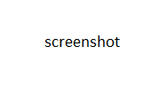

# What's New in DevTools (Microsoft Edge 114)

[!INCLUDE [Microsoft Edge team note for top of What's New](../../includes/edge-whats-new-note.md)]

> [!TIP]
> The **Microsoft Build 2023** conference was on May 23-25, 2023.  Learn more about new features for memory, performance, and production debugging in DevTools, as well as new capabilities for PWAs in the sidebar, WebView2, and Chat Plugins, in the following videos:
> * [Microsoft Edge | State of web developer tools](https://www.youtube.com/watch?v=yDFmQNu3TSg&list=PL4z1-7pjJU6zJT3PBQ4mTbNg2wtX7Lt52)
> * [Microsoft Edge | Building Progressive Web Apps for the sidebar](https://www.youtube.com/watch?v=9u8lRzRUayw&list=PL4z1-7pjJU6zJT3PBQ4mTbNg2wtX7Lt52)
> * [Microsoft Edge | Bringing WebView2 to Microsoft Teams and beyond](https://www.youtube.com/watch?v=s3tDUvaoCP4&list=PL4z1-7pjJU6zJT3PBQ4mTbNg2wtX7Lt52)
> * [Building Chat Plugins for Microsoft Bing and Edge](https://www.youtube.com/watch?v=Q-5M7EYjl6U&list=PL4z1-7pjJU6zJT3PBQ4mTbNg2wtX7Lt52)

<!-- ====================================================================== -->
## Entry 1

<!-- Subtitle: . -->

See also:
* todo

<!-- ====================================================================== -->
## Entry 2

<!-- Subtitle: . -->

See also:
* todo

<!-- ====================================================================== -->
## Entry 3

<!-- Subtitle: . -->

See also:
* todo

<!-- ====================================================================== -->
## Entry 4

<!-- Subtitle: . -->

See also:
* todo

<!-- ====================================================================== -->
## Entry 5

<!-- Subtitle: . -->

See also:
* todo

<!-- ====================================================================== -->
## Announcements from the Chromium project

Microsoft Edge 114 also includes the following updates from the Chromium project:

* [WebAssembly debugging support](https://developer.chrome.com/blog/new-in-devtools-114/#wasm)
   * [Improved stepping behavior in Wasm apps](https://developer.chrome.com/blog/new-in-devtools-114/#wasm-step)
* [Debug Autofill using the Elements panel and Issues tab](https://developer.chrome.com/blog/new-in-devtools-114/#autofill)
* [Lighthouse 10.1.1](https://developer.chrome.com/blog/new-in-devtools-114/#lighthouse)
* [Performance enhancements](https://developer.chrome.com/blog/new-in-devtools-114/#performance)
   * [performance.mark() shows timing on hover in Performance > Timings](https://developer.chrome.com/blog/new-in-devtools-114/#mark)
   * [profile() command populates Performance > Main](https://developer.chrome.com/blog/new-in-devtools-114/#profile)
   * [Warning for slow user interactions](https://developer.chrome.com/blog/new-in-devtools-114/#slow-interaction-warning)
* [JavaScript Profiler deprecation: Phase three](https://developer.chrome.com/blog/new-in-devtools-114/#js-profiler)
* [Miscellaneous highlights](https://developer.chrome.com/blog/new-in-devtools-114/#misc)

<!-- ====================================================================== -->
<!-- uncomment if content is copied from developer.chrome.com to this page -->

<!-- > [!NOTE]
> Portions of this page are modifications based on work created and [shared by Google](https://developers.google.com/terms/site-policies) and used according to terms described in the [Creative Commons Attribution 4.0 International License](https://creativecommons.org/licenses/by/4.0).
> The original page for announcements from the Chromium project is [What's New in DevTools (Chrome 114)](https://developer.chrome.com/blog/new-in-devtools-114) and is authored by [Jecelyn Yeen](https://developers.google.com/web/resources/contributors#jecelynyeen) (Developer advocate working on Chrome DevTools at Google). -->

<!-- ====================================================================== -->
<!-- uncomment if content is copied from developer.chrome.com to this page -->

<!-- 
This work is licensed under a [Creative Commons Attribution 4.0 International License](https://creativecommons.org/licenses/by/4.0). -->
