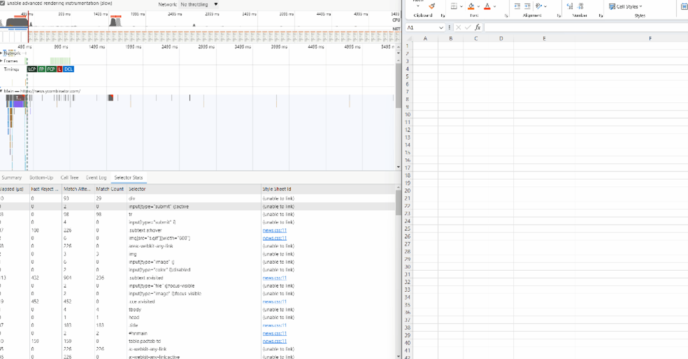
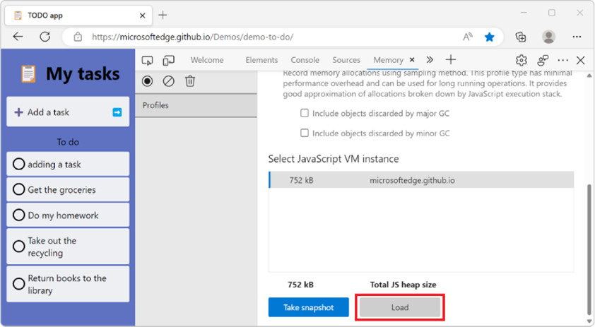
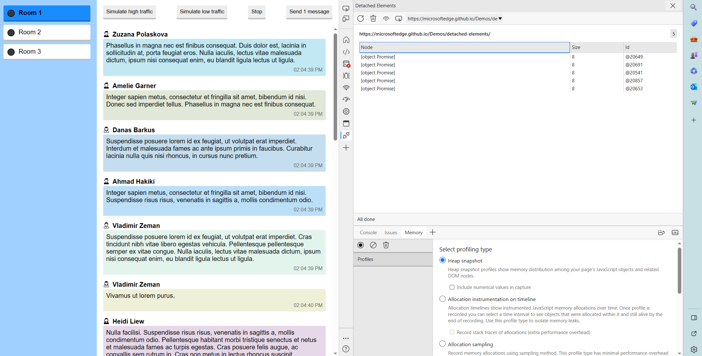
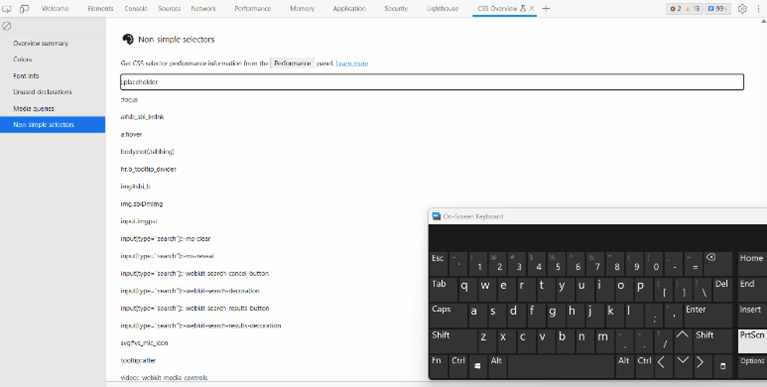
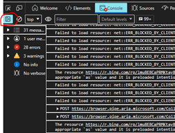

# What's New in DevTools (Microsoft Edge 114)

[!INCLUDE [Microsoft Edge team note for top of What's New](../../includes/edge-whats-new-note.md)]

> [!TIP]
> The **Microsoft Build 2023** conference was on May 23-25, 2023.  Learn more about new features for memory, performance, and production debugging in DevTools, as well as new capabilities for PWAs in the sidebar, WebView2, and Chat Plugins, in the following videos:
> * [Microsoft Edge | State of web developer tools](https://www.youtube.com/watch?v=yDFmQNu3TSg&list=PL4z1-7pjJU6zJT3PBQ4mTbNg2wtX7Lt52)
> * [Microsoft Edge | Building Progressive Web Apps for the sidebar](https://www.youtube.com/watch?v=9u8lRzRUayw&list=PL4z1-7pjJU6zJT3PBQ4mTbNg2wtX7Lt52)
> * [Microsoft Edge | Bringing WebView2 to Microsoft Teams and beyond](https://www.youtube.com/watch?v=s3tDUvaoCP4&list=PL4z1-7pjJU6zJT3PBQ4mTbNg2wtX7Lt52)
> * [Building Chat Plugins for Microsoft Bing and Edge](https://www.youtube.com/watch?v=Q-5M7EYjl6U&list=PL4z1-7pjJU6zJT3PBQ4mTbNg2wtX7Lt52)

<!-- ====================================================================== -->
## Aggregate Selector Stats in the Performance tool 

<!-- Subtitle:  -->

The selector stats are used to see which CSS selectors are slowing down performance. The **Selector Stats** are in the **Performance tool** and show the table of selectors. In this update the selector stats are always shown when styles are recalculated. Users can see and link the style sheet and copy the table of selector stats data.

<!-- todo
1. Open Devtools and navigate to the performance tool
2. Hit the capture settings button
3. Check the box at the top that says "Enable advanced rendering instrumentation (slow)"
4. Click on a purple "Recalculate style" box
5. Click on the Selector stats button on the bar below
-->

<!-- ====================================================================== -->
## The Issues tool now warns you when CSS properties trigger reflow 

<!-- Subtitle: -->

This update, located in the styles panel, raises a warning using squiggles to alert the developer which CSS properties in their code trigger reflow, or the re-calculating of the positions of different elements in a document. This helps users recognize methods they can use to improve their code performance.

<!-- todo
1. 
-->

<!-- ====================================================================== -->
## You can now load Enhanced Traces larger than 1 GB in DevTools 

<!-- Subtitle: -->

An enhanced trace is a file that contains more information about a webpage than a normal trace. With more information and runtime data from the webpage, the user can more easily recreate the webpage’s environment. Now Enhanced Traces larger than 1 GB can be loaded into DevTools.

<!-- todo
Steps from What's New in Edge 109

1. Import the .devtools file from within the Performance tool by clicking the load profile button

2. A new DevTools window opens, containing a subset of the tools, including the Performance tool loaded with the profile that you just recorded.  The Elements Console, and Sources tools are also pre-populated with their preserved state:
-->

<!-- ====================================================================== -->
## The Detached Elements tool now displays properly 

<!-- Subtitle:  -->

The Detached Elements tool helps examine DOM memory leaks. This version updates the icons in the Detach Element tool, including the refresh, trash bin, and search icons. 

<!-- todo
1. Open the Detached Elements demo application
2. Open DevTools
3. On the main toolbar click the More Tools + button
4. Click on the Detached Elements button

-->

<!-- ====================================================================== -->
## Accessibility improvements for the CSS Overview tool 

<!-- Subtitle:  -->

In this update, multiple changes were made to improve accessibility. An aria alert message was added, allowing the screen reader to announce status information when clicking on a ‘Copy CSS selector button’ in the ‘Non-simple selector’ group. Also, the label is now updated to accurately define list items inside the ‘Non-simple selector’ group.

Keyboard navigation was also updated. The user can access items in the non-simple selector list using the up and down arrow keys. They can use the tab key to exit the list.

<!-- todo
1. Open the Edge Canary browser.
2. Open Devtools using 'Ctrl+Shift+ I' or (Settings and more -> More tools -> Developer tools).
3. Navigate to 'CSS selector overview' tab item and invoke it.
4. Navigate to ‘capture overview’ button and invoke it. 
5. Navigate and invoke the ‘Non-simple selectors’ menu item in the left navigation. 
6. Navigate to the list items present under ‘Non-simple selectors’ heading and hit enter and listen to the Screen reader announcement.  
-->

<!-- todo
1. Open Edge Canary browser.
2. Open Devtools using 'Ctrl+Shift+ I' or (Settings and more -> More tools -> Developer tools).
3. Navigate to 'CSS selector overview' tab item and invoke it.
4. Navigate to ‘capture overview’ button and invoke it. 
5. Navigate and invoke the ‘Non-simple selectors’ menu item 
6. Now navigate to the list items using keyboard using tab & Arrow keys and observe the behavior.
-->

<!-- ====================================================================== -->
## Debugging Microsoft Edge in VS Code has better support for high contrast mode 

<!-- Subtitle: -->

This update improves the high contrast toolbar. Specifically, the ‘Toggle Element State’ button is now visible in High Contrast mode using the Aquatic theme. The button appears with a black background and white icon when not highlighted. This improves the experience of low vision users. 

<!-- todo

Prerequisites:
 1. Install 'Visual Studio Code' application.
 2. Add 'Microsoft edge' file in vs code.
 3. Turn on Windows High contrast theme (Settings->Accessibility->High Contrast->Turn on High 4. Contrast->Select High Contrast Aquatic)

Steps: 
1. Launch VS code application and launch an instance.
2. Navigate and invoke 'Elements' tab item and invoke it.
3. Navigate to 'Styles' tab item and invoke it.
4. Tab to navigate to  'Toggle Element State' button and apply High Contrast mode of Aquatic theme and observe.
-->

<!-- ====================================================================== -->
## Announcements from the Chromium project

Microsoft Edge 114 also includes the following updates from the Chromium project:

* [WebAssembly debugging support](https://developer.chrome.com/blog/new-in-devtools-114/#wasm)
   * [Improved stepping behavior in Wasm apps](https://developer.chrome.com/blog/new-in-devtools-114/#wasm-step)
* [Debug Autofill using the Elements panel and Issues tab](https://developer.chrome.com/blog/new-in-devtools-114/#autofill)
* [Lighthouse 10.1.1](https://developer.chrome.com/blog/new-in-devtools-114/#lighthouse)
* [Performance enhancements](https://developer.chrome.com/blog/new-in-devtools-114/#performance)
   * [performance.mark() shows timing on hover in Performance > Timings](https://developer.chrome.com/blog/new-in-devtools-114/#mark)
   * [profile() command populates Performance > Main](https://developer.chrome.com/blog/new-in-devtools-114/#profile)
   * [Warning for slow user interactions](https://developer.chrome.com/blog/new-in-devtools-114/#slow-interaction-warning)
* [JavaScript Profiler deprecation: Phase three](https://developer.chrome.com/blog/new-in-devtools-114/#js-profiler)
* [Miscellaneous highlights](https://developer.chrome.com/blog/new-in-devtools-114/#misc)

<!-- ====================================================================== -->
<!-- uncomment if content is copied from developer.chrome.com to this page -->

<!-- > [!NOTE]
> Portions of this page are modifications based on work created and [shared by Google](https://developers.google.com/terms/site-policies) and used according to terms described in the [Creative Commons Attribution 4.0 International License](https://creativecommons.org/licenses/by/4.0).
> The original page for announcements from the Chromium project is [What's New in DevTools (Chrome 114)](https://developer.chrome.com/blog/new-in-devtools-114) and is authored by [Jecelyn Yeen](https://developers.google.com/web/resources/contributors#jecelynyeen) (Developer advocate working on Chrome DevTools at Google). -->

<!-- ====================================================================== -->
<!-- uncomment if content is copied from developer.chrome.com to this page -->

<!-- 
This work is licensed under a [Creative Commons Attribution 4.0 International License](https://creativecommons.org/licenses/by/4.0). -->
