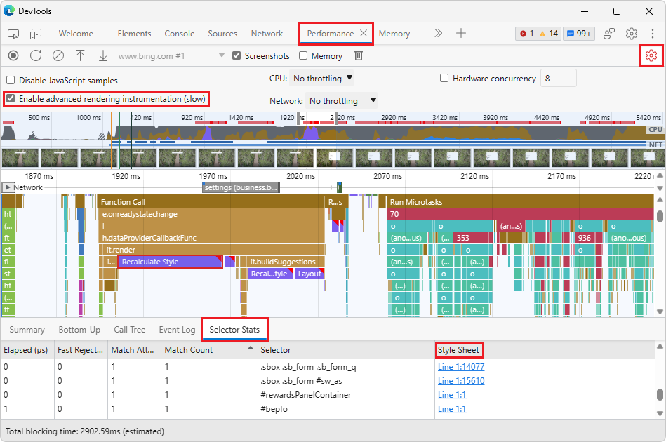
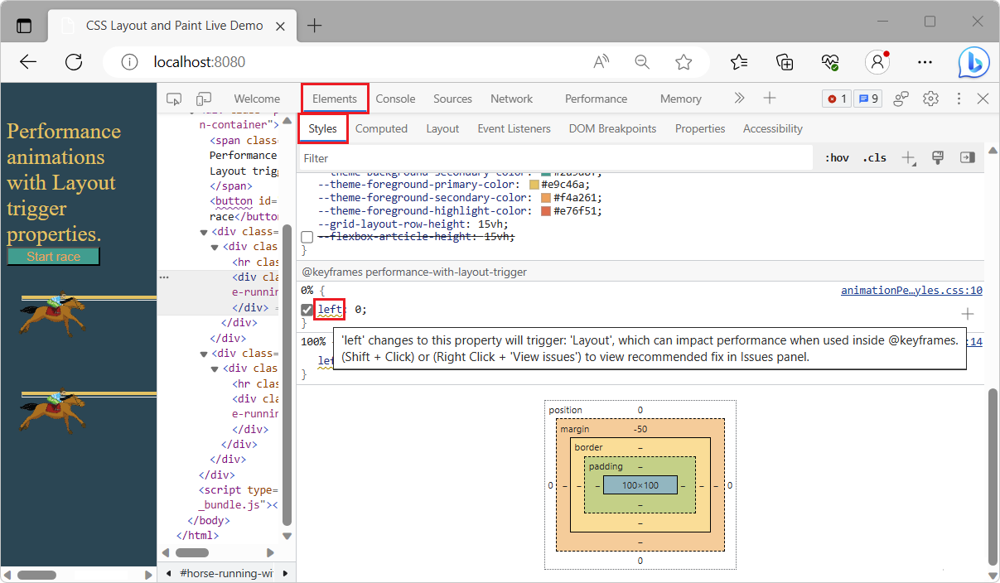
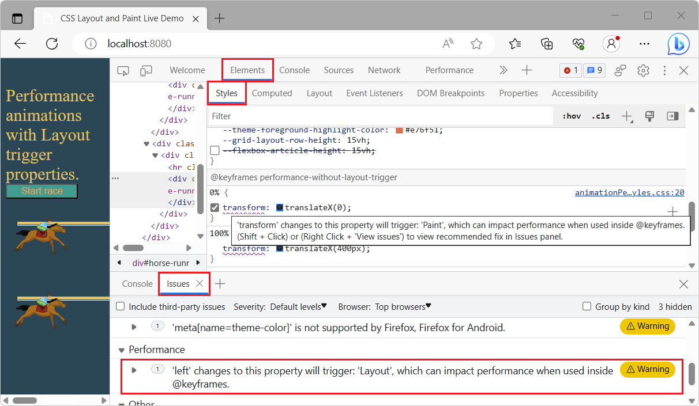
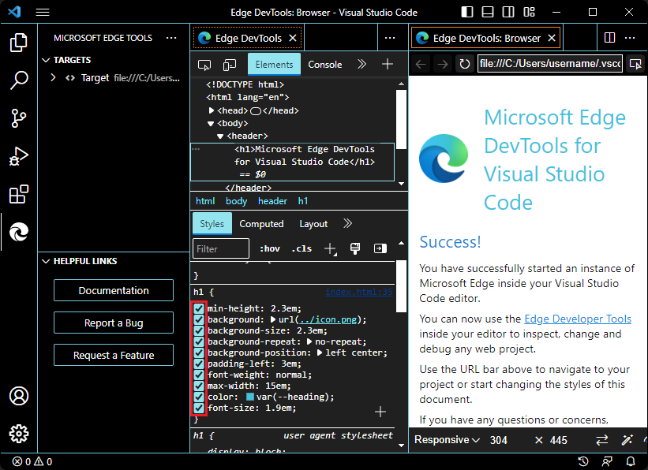
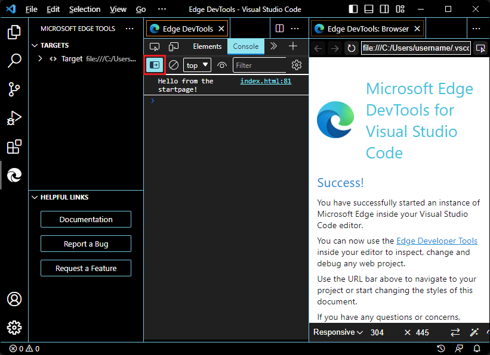

# What's New in DevTools (Microsoft Edge 114)

[!INCLUDE [Microsoft Edge team note for top of What's New](../../includes/edge-whats-new-note.md)]

> [!TIP]
> The **Microsoft Build 2023** conference was on May 23-25, 2023.  Learn more about new features for memory, performance, and production debugging in DevTools, as well as new capabilities for PWAs in the sidebar, WebView2, and Chat Plugins, in the following videos:
> * [Microsoft Edge | State of web developer tools](https://www.youtube.com/watch?v=yDFmQNu3TSg&list=PL4z1-7pjJU6zJT3PBQ4mTbNg2wtX7Lt52)
> * [Microsoft Edge | Building Progressive Web Apps for the sidebar](https://www.youtube.com/watch?v=9u8lRzRUayw&list=PL4z1-7pjJU6zJT3PBQ4mTbNg2wtX7Lt52)
> * [Microsoft Edge | Bringing WebView2 to Microsoft Teams and beyond](https://www.youtube.com/watch?v=s3tDUvaoCP4&list=PL4z1-7pjJU6zJT3PBQ4mTbNg2wtX7Lt52)
> * [Building Chat Plugins for Microsoft Bing and Edge](https://www.youtube.com/watch?v=Q-5M7EYjl6U&list=PL4z1-7pjJU6zJT3PBQ4mTbNg2wtX7Lt52)

<!-- ====================================================================== -->
## Aggregate Selector Stats in the Performance tool

<!-- Subtitle: Instead of selecting individual Recalculate Style events when recording a profile, the Selector Stats tab now aggregates data across all Recalculate Style events-->

Microsoft Edge 109 added the **Selector Stats** feature to the **Performance** tool.  You can use the data from **Selector Stats** to understand which CSS selectors are taking the most time during **Recalculate Style** events in the **Performance** tool and are contributing to slow performance.

In Microsoft Edge 114, you no longer need to select an individual **Recalculate Style** event to see the selectors that were recalculated during that event.  Instead, the **Selector Stats** tab in the bottom pane of the **Performance** tool automatically aggregates the data across all of the **Recalculate Style** events in the recorded profile.  As you zoom into specific parts of the profile, the **Selector Stats** tab updates to only show data from the portion of the profile that you are currently analyzing.

Also, a new **Style Sheet** column has been added to the **Selector Stats** tab.  The **Style Sheet** column contains a link for each selector back to the stylesheet where the selector is defined.

Thank you for using the **Selector Stats** feature and sharing your feedback with us in [GitHub Issue #98: \[Feedback\] Selector Performance Tracing Explainer](https://github.com/MicrosoftEdge/DevTools/issues/98)!

See also:
* [Analyze selector performance during Recalculate Style events](../../../evaluate-performance/selector-stats.md)
* [GitHub Issue #98: \[Feedback\] Selector Performance Tracing Explainer](https://github.com/MicrosoftEdge/DevTools/issues/98)
* [Debug long-running Recalculate Style events with new selector stats](../01/devtools-109.md#debug-long-running-recalculate-style-events-with-new-selector-stats) in _What's New in DevTools (Microsoft Edge 109)_.

<!-- ====================================================================== -->
## The Issues tool and Styles pane warn about CSS properties that trigger Layout

<!-- Subtitle: The Styles pane shows a wavy underline on CSS properties that trigger Layout, and the Issues tool warns about such properties. This warning helps limit re-calculating positions and geometries of elements, to avoid blocking user interaction. -->

DevTools now detects and warns about CSS properties that can cause Layout-based performance issues when using CSS animation in the webpage, such as moving text.  _Layout_ is the web browser process for recalculating the positions and geometries of elements in the document, to re-render part or all of the document.  Because Layout is a user-blocking operation in the browser, we recommend limiting Layout as much as possible, to keep your web content smooth and responsive to interaction.

Some CSS properties don't trigger a Layout operation, because they run on the compositor thread in the browser, such as [transform](https://developer.mozilla.org/docs/Web/CSS/transform) and [opacity](https://developer.mozilla.org/docs/Web/CSS/opacity).  However, even CSS properties that don't trigger Layout can trigger a Paint operation which, when used in combination with CSS animations, can lead to a negative performance impact.

In the **Styles** pane in the **Elements** tool, a wavy underline and tooltip has been added on CSS properties that trigger Layout or Paint operations.  To view the issue in a tooltip, hover over the wavy underline:

In the **Issues** tool, in the **Performance** category, a new kind of issue is reported, such as "Changes to this property will trigger: 'Layout', which can impact performance when used inside @Keyframes."  When you're using the **Styles** pane, to open the issue in the **Issues** tool, **Shift**+click the wavy underline on such a property, or right-click the wavy underline and then select **View issues**.  The **Issues** tool opens in the Drawer at the bottom of DevTools:

See also:
* [Minimizing browser reflow | PageSpeed Insights](https://developers.google.com/speed/docs/insights/browser-reflow) - _reflow_ includes Paint, Composite, and Layout operations.
* [Layout](../../../rendering-tools/index.md#layout) in _Troubleshooting common performance issues_.
* [Open issues from the DOM tree](../../../issues/index.md#open-issues-from-the-dom-tree) in _Find and fix problems using the Issues tool_.
* [Using CSS animations](https://developer.mozilla.org/docs/Web/CSS/CSS_Animations/Using_CSS_animations), at MDN.
* [Inspect and modify CSS animation effects](../../../inspect-styles/animations.md)

<!-- ====================================================================== -->
## The Memory tool can load enhanced traces larger than 1 GB

<!-- Subtitle: In previous versions of Microsoft Edge, loading enhanced traces larger than 1 GB produced an error. In Microsoft Edge 114, this issue has been fixed. -->

In previous versions of Microsoft Edge, loading an enhanced trace larger than 1 GB failed.  In Microsoft Edge 114, this issue has been fixed.  You can now successfully load enhanced traces of any size.

Enhanced traces is an experimental feature in Microsoft Edge that allows you to export and import entire DevTools instances, saved as `.devtools` files, with as much state as possible preserved across the **Memory**, **Performance**, **Elements**, **Console**, and **Sources** tools.  A `.devtools` file opens in a separate DevTools instance, and loads the following trace information, while retaining references to source code:
* DOM snapshots.
* Console messages.
* Heap snapshots.
* Performance profiles.

See also:
* [Share enhanced performance and memory traces](../../../experimental-features/share-traces.md)
* [GitHub Issue #122: \[Feedback\] Enhanced Traces experiment](https://github.com/MicrosoftEdge/DevTools/issues/122)

<!-- ====================================================================== -->
## The Memory tool more accurately compares two heap snapshots

<!-- Subtitle: In previous versions of Microsoft Edge, the Memory tool incorrectly reported lots of new and deleted objects when comparing two heap snapshots. This issue has now been fixed.-->

In the **Memory** tool, you can take multiple heap snapshots and compare them to find differences in the objects in the heap.  In previous versions of Microsoft Edge, the **Memory** tool reported too many new and deleted objects when comparing heap snapshots, because object IDs weren't being tracked consistently by the tool.  Actually, many of these are likely the same objects.

In Microsoft Edge 114, this issue has been fixed, by ensuring that consistent object IDs are tracked across multiple snapshots.

See also:
* [View snapshots](../../../memory-problems/heap-snapshots.md#view-snapshots) in _Record heap snapshots using the Memory tool_.
* [Change List 4278992: Produce consistent IDs for Oilpan objects in heap snapshots](https://chromium-review.googlesource.com/c/v8/v8/+/4278992)
* [Issue 1286500: Heap snapshot comparison incorrectly reports large numbers of new and deleted objects](https://bugs.chromium.org/p/chromium/issues/detail?id=1286500)

<!-- ====================================================================== -->
## Accessibility improvements for the CSS Overview tool

<!-- Subtitle: The CSS Overview tool is now easier to use with assistive technology such as screen readers. -->

In Microsoft Edge 112, the **CSS Overview** tool was updated to display a list of non-simple selectors when taking an overview snapshot of a webpage's CSS.  In Microsoft Edge 114, the **Non-simple selectors** section of the **CSS Overview** tool is now easier to use with assistive technology, such as screen readers.

When you click a selector, or navigate to a selector and then press **Enter**, screen readers now announce "Copied CSS selector":

See also:
* [CSS Overview tool displays non-simple selectors for quick performance gains](../04/devtools-112.md#css-overview-tool-displays-non-simple-selectors-for-quick-performance-gains) in _What's New in DevTools (Microsoft Edge 112)_.
* [Non-simple selectors](../../../css/css-overview-tool.md#non-simple-selectors) in _Optimize CSS styles with the CSS Overview tool_.
* [Navigate DevTools with assistive technology](../../../accessibility/navigation.md)

<!-- ====================================================================== -->
## DevTools extension for VS Code has better support for high contrast mode

<!-- Subtitle: Hovering over icons in high contrast mode in the VS Code extension now renders with sufficient contrast. -->

In previous versions of the Microsoft Edge DevTools extension for Visual Studio Code, in high contrast mode, hovering over icons within the tools didn't render the UI controls with sufficient contrast.  This issue has been fixed.

For example, in the **Styles** pane in the **Elements** tool, checkboxes for applying styles to elements now render correctly in high contrast mode:

Also, in the **Console** tool, icons such as **Show console sidebar** now render correctly in high contrast mode:

See also:
* [Microsoft Edge DevTools extension for Visual Studio Code](../../../../visual-studio-code/microsoft-edge-devtools-extension.md)
* [Turn high contrast mode on or off in Windows](https://support.microsoft.com/windows/turn-high-contrast-mode-on-or-off-in-windows-909e9d89-a0f9-a3a9-b993-7a6dcee85025)

<!-- ====================================================================== -->
## Announcements from the Chromium project

Microsoft Edge 114 also includes the following updates from the Chromium project:

* [Debug Autofill using the Elements panel and Issues tab](https://developer.chrome.com/blog/new-in-devtools-114/#autofill)
* [Lighthouse 10.1.1](https://developer.chrome.com/blog/new-in-devtools-114/#lighthouse)
* [Performance enhancements](https://developer.chrome.com/blog/new-in-devtools-114/#performance)
   * [performance.mark() shows timing on hover in Performance > Timings](https://developer.chrome.com/blog/new-in-devtools-114/#mark)
   * [profile() command populates Performance > Main](https://developer.chrome.com/blog/new-in-devtools-114/#profile)
   * [Warning for slow user interactions](https://developer.chrome.com/blog/new-in-devtools-114/#slow-interaction-warning)
* [JavaScript Profiler deprecation: Phase three](https://developer.chrome.com/blog/new-in-devtools-114/#js-profiler)

<!-- ====================================================================== -->
<!-- uncomment if content is copied from developer.chrome.com to this page -->

<!-- > [!NOTE]
> Portions of this page are modifications based on work created and [shared by Google](https://developers.google.com/terms/site-policies) and used according to terms described in the [Creative Commons Attribution 4.0 International License](https://creativecommons.org/licenses/by/4.0).
> The original page for announcements from the Chromium project is [What's New in DevTools (Chrome 114)](https://developer.chrome.com/blog/new-in-devtools-114) and is authored by [Jecelyn Yeen](https://developers.google.com/web/resources/contributors#jecelynyeen) (Developer advocate working on Chrome DevTools at Google). -->

<!-- ====================================================================== -->
<!-- uncomment if content is copied from developer.chrome.com to this page -->

<!-- 
This work is licensed under a [Creative Commons Attribution 4.0 International License](https://creativecommons.org/licenses/by/4.0). -->
