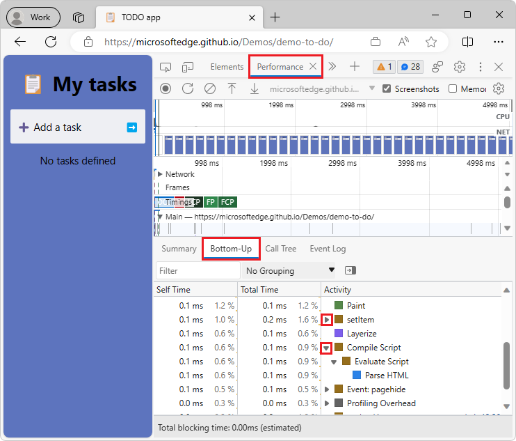

# What's New in DevTools (Microsoft Edge 115)

[!INCLUDE [Microsoft Edge team note for top of What's New](../../includes/edge-whats-new-note.md)]


<!-- ====================================================================== -->
## Improvements for connecting DevTools to Azure Artifacts symbol server

<!-- Subtitle: You can now use Microsoft Entra ID for authentication instead of Personal Access Tokens (PATs). You can connect to multiple symbol servers and filter which sourcemaps you want DevTools to fetch. -->

In Microsoft Edge 115, it's easier and more customizable to connect DevTools to Azure Artifacts symbol server.  In previous versions of Microsoft Edge, to authenticate to the symbol server, you had to generate Personal Access Tokens (PATs) in Azure DevOps and then paste them into DevTools. Now, as long as you're logged into Microsoft Edge using a work account, you can connect to the symbol server by using Microsoft Entra ID.
<!-- re: work account, possibly:
enterprise customers who are signed into Microsoft Edge with a Microsoft Entra ID account
a Microsoft account (MSA) that's a work account
-->

Additionally, you can now connect to multiple symbol servers, in case you need to fetch sourcemaps from different Azure DevOps organizations. You can also filter which sourcemaps you want DevTools to fetch from the symbol server, by specifying the sourcemap URLs in an inclusion or exclusion list.


The message **An Azure DevOps organization must be selected** means double-click the organization, or click it and then press **Enter**.


<!-- ------------------------------ -->
#### Wildcards

In the **Filter behavior** text box, the following wildcards are supported:

| Wildcard | Meaning |
|---|---|
| ? | Matches a single character. |
| * | Matches one or more of any character. |

If you select **Exclusion List**, DevTools attempts to look up any source maps for scripts except those that have a URL that matches one of the entries in the list.

If you select **Inclusion List**, DevTools only attempts to look up source maps for scripts that have URLs that match one of the entries in the list.  For example, suppose you select **Inclusion List** in the **Filter behavior** dropdown list, and then enter the following in the **Filter behavior** text box:

```http
https://cdn.contoso.com/*
https://packages.contoso.com/*
```

In this example, DevTools only attempts to resolve source maps that match these two URL patterns, and doesn't attempt to load source maps for other scripts.

<!-- The [Source Maps Monitor tool](../../../source-maps-monitor/source-maps-monitor-tool.md) has also been updated, to show which URL lookups have or haven't been attempted. -->

See also:
* [Securely debug original code by publishing source maps to the Azure Artifacts symbol server](../../../javascript/publish-source-maps-to-azure.md)
* [Securely debug original code by using Azure Artifacts symbol server source maps](../../../javascript/consume-source-maps-from-azure.md)


<!-- ====================================================================== -->
## Memory tool enhancements

<!-- Subtitle: The "Allocation instrumentation on timeline" profiling type in the Memory tool now samples the heap at variable intervals, depending on the size of the heap. Heap snapshots are now more accurate and don't show objects that should have been garbage-collected. -->

In previous versions of Microsoft Edge, in the **Memory** tool, when using the **Allocation instrumentation on timeline** option, the **Memory** tool takes a sample of the heap every 50 milliseconds.  However, taking a sample of the heap scales with the size of the heap, so with a heap size of 200 MB, the sample actually takes 1.5 seconds to generate.  As a result, there's little time left on the main thread for your website, outside of generating heap samples.  When **Allocation instrumentation on timeline** is running, it might look like your web content is hanging or blocked.

In Microsoft Edge 115, the sample rate for the heap now scales to the time it takes to generate a sample, freeing up the main thread so that you can interact with your web content while profiling.


Additionally, in previous versions of Microsoft Edge, heap snapshots would sometimes include objects that should have been garbage-collected (GC'd).  In Microsoft Edge 115, this issue has been fixed and heap snapshots are now more accurate.

See also:
* [Limit proportion of CPU time given to requestHeapStatsUpdate (4469909) · Gerrit Code Review](https://chromium-review.googlesource.com/c/v8/v8/+/4469909)
* [Make heap snapshots more precise (4499405) · Gerrit Code Review](https://chromium-review.googlesource.com/c/v8/v8/+/4499405)


<!-- ====================================================================== -->
## Refreshed DevTools icons and buttons

<!-- Subtitle: New icons and buttons give an update to the DevTools look and feel. -->

In Microsoft Edge 115, the DevTools UI has gotten a makeover with new icons and buttons.  For example, when debugging in the **Sources** tool, the current frame in the call stack is indicated by a right-pointing blue arrow.  This icon is more consistent with the debugging icons in Microsoft Visual Studio and Microsoft Visual Studio Code:


In previous versions of Microsoft Edge, in the **Bottom-Up** view in the **Performance** tool, the triangle buttons for collapsing and expanding the recorded activities rendered incorrectly.  In Microsoft Edge 115, this issue has been fixed and you can now expand and collapse individual activities to see which functions are calling them:



See also:
* [Step through code](../../../javascript/reference.md#step-through-code) in _JavaScript debugging features_.
* [The Bottom-Up tab](../../../evaluate-performance/reference.md#the-bottom-up-tab) in _Performance features reference_.


<!-- ====================================================================== -->
## Screen readers correctly announce dropdown state in Device Mode

<!-- Subtitle: In Device Mode, screen readers now correctly announce the state of dropdown menus (for example, announcing "collapsed" when the dropdown menu is collapsed). -->

In previous versions of Microsoft Edge, in Device Mode, screen readers incorrectly announced the state of dropdown menus as "expanded" when these menus were actually collapsed.  In Microsoft Edge 115, this issue has been fixed and screen readers now correctly announce the state of dropdown menus in Device Mode as "collapsed" or "expanded":


See also:
* [Emulate mobile devices (Device Emulation)](../../../device-mode/index.md)


<!-- ====================================================================== -->
## Profiling improvements for the Performance tool

<!-- Subtitle: Your web content will now be more responsive while profiling in the Performance tool, and "Profiler Overhead" blocks of CPU time have been added, to account for the additional time Microsoft Edge needs when profiling. -->

When recording a profile in the **Performance** tool, the V8 JavaScript engine takes periodic samples of all the JavaScript functions that are running, to accurately report CPU time in the flame chart.  When profiling a website that has many cross-domain iframes, these samples take a long time to collect.  This results in significant overhead, slowing down the main thread, which slows down the performance of the website while profiling.  In Microsoft Edge 115 on Windows, V8 collects these samples more efficiently, resulting in better site performance while profiling.

Additionally, in the **Performance** tool, you can now see a representation of profiler overhead in the flame chart when recording a profile. This block of time represents the CPU time that's needed to sample and parse events when recording a profile, and doesn't represent CPU time that the users of your website are actually encountering.  **Profiling Overhead** events have been added to the flame chart to help focus your performance investigations on **Compile Code** and **Evaluate Script** events that affect your actual users, rather than events that only take time while you're profiling in the **Performance** tool:


See also:
* [Avoid busy-waiting in sampler thread if Windows supports precise sleep (4453767) · Gerrit Code Review](https://chromium-review.googlesource.com/c/v8/v8/+/4453767)
* [Show V8.FinalizeDeserialization time as profiler overhead (4504370) · Gerrit Code Review](https://chromium-review.googlesource.com/c/devtools/devtools-frontend/+/4504370)
* [Issue 1428605: V8's code cache deserialization is 2-4× slower than a regular uncached compilation when CPU profiling is enabled](https://bugs.chromium.org/p/chromium/issues/detail?id=1428605)


<!-- ====================================================================== -->
## Announcements from the Chromium project

Microsoft Edge 115 also includes the following updates from the Chromium project:

* [Elements improvements](https://developer.chrome.com/blog/new-in-devtools-115/#elements)
   * [New CSS subgrid badge](https://developer.chrome.com/blog/new-in-devtools-115/#subgrid)
   * [Selector specificity in tooltips](https://developer.chrome.com/blog/new-in-devtools-115/#specificity)
   * [Values of custom CSS properties in tooltips](https://developer.chrome.com/blog/new-in-devtools-115/#css-variable-values)
* [Sources improvements](https://developer.chrome.com/blog/new-in-devtools-115/#sources)
   * [CSS syntax highlighting](https://developer.chrome.com/blog/new-in-devtools-115/#css)
   * [Shortcut to set conditional breakpoints](https://developer.chrome.com/blog/new-in-devtools-115/#breakpoint)
* [Application > Bounce Tracking Mitigations](https://developer.chrome.com/blog/new-in-devtools-115/#bounce-tracking)
* [Ignore content scripts by default](https://developer.chrome.com/blog/new-in-devtools-115/#content-script)
* [Network > Response pretty-printing by default](https://developer.chrome.com/blog/new-in-devtools-115/#network)


<!-- ====================================================================== -->
<!-- uncomment if content is copied from developer.chrome.com to this page -->

<!-- > [!NOTE]
> Portions of this page are modifications based on work created and [shared by Google](https://developers.google.com/terms/site-policies) and used according to terms described in the [Creative Commons Attribution 4.0 International License](https://creativecommons.org/licenses/by/4.0).
> The original page for announcements from the Chromium project is [What's New in DevTools (Chrome 115)](https://developer.chrome.com/blog/new-in-devtools-115) and is authored by [Jecelyn Yeen](https://developers.google.com/web/resources/contributors#jecelynyeen) (Developer advocate working on Chrome DevTools at Google). -->


<!-- ====================================================================== -->
<!-- uncomment if content is copied from developer.chrome.com to this page -->

<!-- [](https://creativecommons.org/licenses/by/4.0)
This work is licensed under a [Creative Commons Attribution 4.0 International License](https://creativecommons.org/licenses/by/4.0). -->
