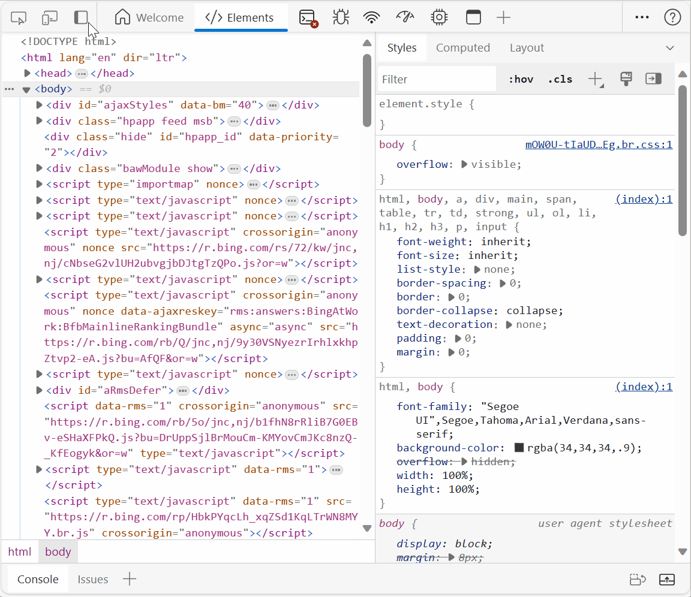
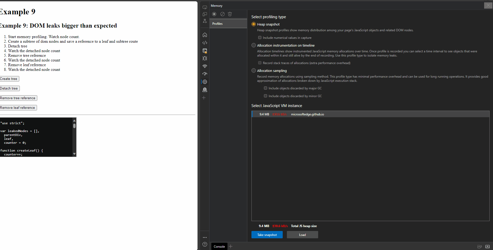
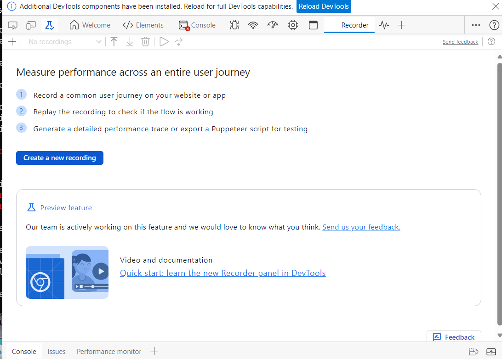
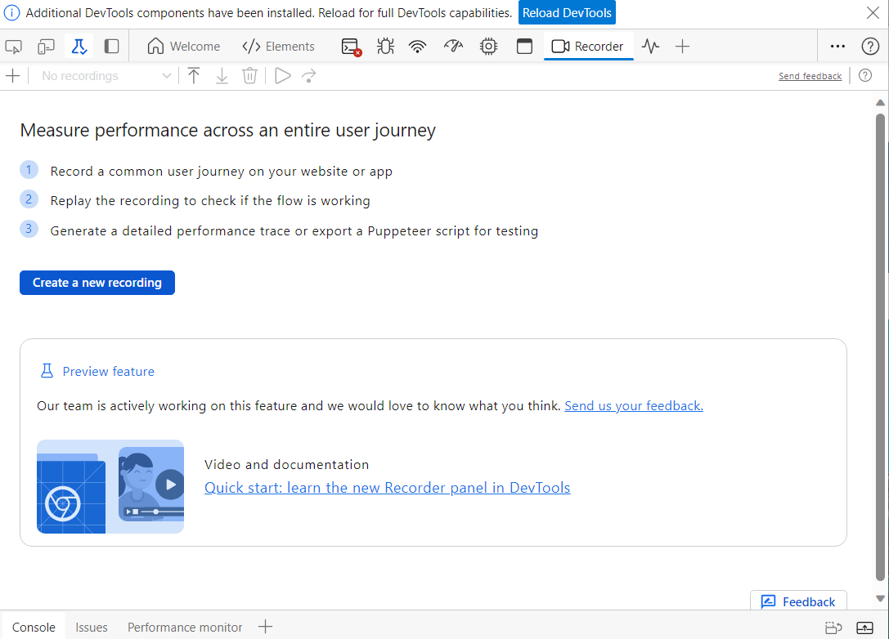

# What's New in DevTools (Microsoft Edge 116)

[!INCLUDE [Microsoft Edge team note for top of What's New](../../includes/edge-whats-new-note.md)]

<!-- ====================================================================== -->
## Activity bar has a "Move Activity Bar" button

While in Focus Mode, you now have the ability to easily move the Activity bar's location with a single button-click.  In the upper left of DevTools, to the right of the **Inspect** button and **Device Emulation** button, there's now a **Move Activity Bar to left** or **Move Activity Bar to top** button:

For example, by default, the Activity bar's orientation is horizontal, but you can change it to vertical by simply clicking the new **Move Activity Bar to left** button in the Activity bar, instead of having to go into the DevTools **Settings** (...) menu.

See also:
* [What's New entries about Focus Mode](/search/?scope=Microsoft%20Edge&terms=focus%20mode)
<!--
* [Dec. 2023 blog post about Focus Mode]() - todo: link -->

<!-- ====================================================================== -->
## React Developer Tools extension retains state of tools

Prior to Microsoft Edge 116, if you were in Focus Mode while using the React Developer Tools extension, the state of a tool in DevTools wasn't maintained when you switched to another tool and then switched back.  This issue has been fixed.

See also:
* [React Developer Tools](https://microsoftedge.microsoft.com/addons/detail/react-developer-tools/gpphkfbcpidddadnkolkpfckpihlkkil) - extension at the Edge Add-ons store
* [What's New entries about Focus Mode](/search/?scope=Microsoft%20Edge&terms=focus%20mode)
<!--
* [Dec. 2023 blog post about Focus Mode]() - todo: link -->

<!-- ====================================================================== -->
## "Containment Diff" view in Memory tool when multiple heap snapshots

In the **Memory** tool, if there's more than one heap snapshot, a **Containment Diff** view is now available through the **View** dropdown menu in the upper left of the **Memory** tool:

The Containment Diff view shows only the new objects, deleted objects, or objects in the retaining chain that will eventually lead to either a new or deleted node.  The "." symbol means that it's a node in the retaining chain.  Expanding the view displays the node that's new or deleted.

See also:
* [Record heap snapshots using the Memory tool](../../../memory-problems/heap-snapshots.md)

<!-- ====================================================================== -->
## Recorder tool's tab includes an icon

<!-- todo: can't just mention update of Recorder tool, since the Recorder tool has never been mentioned or introduced as new in What's New.  Need What's New entry "Microsoft Edge v123 added the Recorder tool from the Chromium engine" -->

Before Microsoft Edge 116, there was no icon in the **Recorder** tool's tab on the Activity bar:

Microsoft Edge 116 adds an icon in the **Recorder** tool's tab on the Activity bar:

See also:
* [Record, replay, and measure user flows (Recorder tool)](https://developer.chrome.com/docs/devtools/recorder)
* [Recorder features reference](https://developer.chrome.com/docs/devtools/recorder/reference)
* [Customize the Recorder with extensions](https://developer.chrome.com/docs/devtools/recorder/extensions)
<!-- todo: link to local articles -->

<!-- ====================================================================== -->
## Announcements from the Chromium project

Microsoft Edge 116 also includes the following updates from the Chromium project:

* [Improved debugging of missing stylesheets](https://developer.chrome.com/blog/new-in-devtools-116/#stylesheets)
* [Linear timing support in Elements > Styles > Easing Editor](https://developer.chrome.com/blog/new-in-devtools-116/#linear)
* [Storage buckets support and metadata view](https://developer.chrome.com/blog/new-in-devtools-116/#storage)
* [Accessibility: Keyboard commands and improved screen reading](https://developer.chrome.com/blog/new-in-devtools-116/#accessibility)

<!-- ====================================================================== -->
<!-- uncomment if content is copied from developer.chrome.com to this page -->

<!-- > [!NOTE]
> Portions of this page are modifications based on work created and [shared by Google](https://developers.google.com/terms/site-policies) and used according to terms described in the [Creative Commons Attribution 4.0 International License](https://creativecommons.org/licenses/by/4.0).
> The original page for announcements from the Chromium project is [What's New in DevTools (Chrome 116)](https://developer.chrome.com/blog/new-in-devtools-116) and is authored by [Sofia Emelianova](https://developers.google.com/web/resources/contributors#jecelynyeen) (Developer advocate working on Chrome DevTools at Google). -->

<!-- ====================================================================== -->
<!-- uncomment if content is copied from developer.chrome.com to this page -->

<!-- 
This work is licensed under a [Creative Commons Attribution 4.0 International License](https://creativecommons.org/licenses/by/4.0). -->
