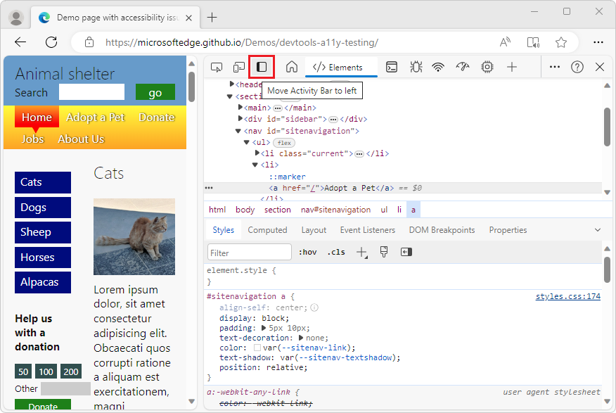
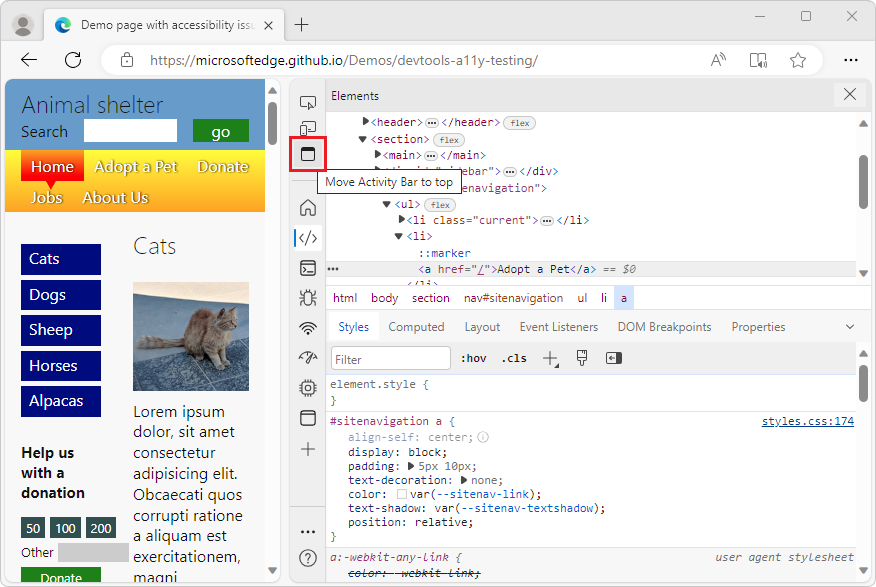
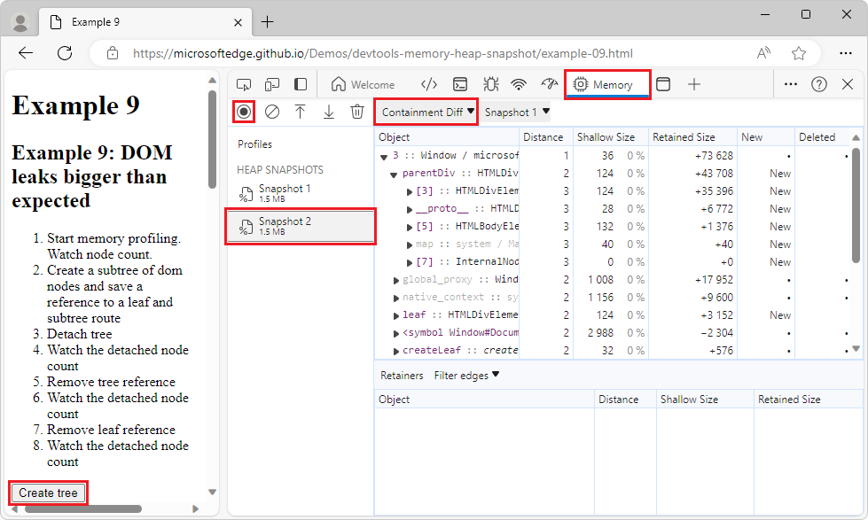

# What's New in DevTools (Microsoft Edge 116)

[!INCLUDE [Microsoft Edge team note for top of What's New](../../includes/edge-whats-new-note.md)]

<!-- ====================================================================== -->
## New "Move Activity Bar" button directly on the Activity Bar

In Focus Mode, you now can quickly move the **Activity Bar** with a single mouse-click.  In the upper left of DevTools, next to the **Inspect** button and **Device Emulation** button, there's now a **Move Activity Bar to left** or **Move Activity Bar to top** button:

For example, by default, the **Activity Bar** is horizontal, but you can change it to vertical by simply clicking the new **Move Activity Bar to left** button in the **Activity Bar**, instead of having to go into the DevTools **Settings** (...) menu.

See also:
* [What's New entries about Focus Mode](/search/?scope=Microsoft%20Edge&terms=focus%20mode)

<!-- ====================================================================== -->
## React Developer Tools extension retains state of tools

Prior to Microsoft Edge 116, if you were in Focus Mode while using the React Developer Tools extension, the state of a tool in DevTools wasn't maintained when you switched to another tool and then switched back.  This issue has been fixed.

See also:
* [React Developer Tools](https://microsoftedge.microsoft.com/addons/detail/react-developer-tools/gpphkfbcpidddadnkolkpfckpihlkkil) - extension at the Edge Add-ons store
* [What's New entries about Focus Mode](/search/?scope=Microsoft%20Edge&terms=focus%20mode)

<!-- ====================================================================== -->
## "Containment Diff" view in Memory tool when multiple heap snapshots

In the **Memory** tool, when there's more than one heap snapshot, a **Containment Diff** view is now available in the **Perspective** dropdown menu in the upper left of the **Memory** tool:

The **Containment Diff** view shows only the new objects, deleted objects, or objects in the retaining chain that will eventually lead to either a new or deleted node.  The dot symbol • means that it's a node in the retaining chain.  Expanding the view displays the node that's new or deleted.

For example: 

1. Open the example webpage [Example 9: DOM leaks bigger than expected](https://microsoftedge.github.io/Demos/devtools-memory-heap-snapshot/example-09.html) in a new window or tab.

1. Right-click the webpage and then select **Inspect**.  DevTools opens.

1. In the **Activity Bar**, select the **Memory** tool.

1. Click the **Take heap snapshot** button, in the upper left.  **Snapshot 1** is listed in the **Profiles** section.

1. In the rendered example webpage, click the **Create tree** button.

1. In the **Memory** tool, click the **Take heap snapshot** button again.  **Snapshot 2** is added in the **Profiles** section.

1. In the **Perspective** dropdown menu, instead of **Summary**, select **Containment Diff**.

1. In the **Object** column, expand an entry.

See also:
* [Record heap snapshots using the Memory tool](../../../memory-problems/heap-snapshots.md)
* [Demo webpage: Example 9: DOM leaks bigger than expected](../../../memory-problems/heap-snapshots.md#demo-webpage-example-9-dom-leaks-bigger-than-expected) in _Record heap snapshots using the Memory tool_.

<!-- ====================================================================== -->
## Announcements from the Chromium project

Microsoft Edge 116 also includes the following updates from the Chromium project:

* [Improved debugging of missing stylesheets](https://developer.chrome.com/blog/new-in-devtools-116/#stylesheets)
* [Linear timing support in Elements > Styles > Easing Editor](https://developer.chrome.com/blog/new-in-devtools-116/#linear)
* [Storage buckets support and metadata view](https://developer.chrome.com/blog/new-in-devtools-116/#storage)
* [Accessibility: Keyboard commands and improved screen reading](https://developer.chrome.com/blog/new-in-devtools-116/#accessibility)

<!-- ====================================================================== -->
<!-- uncomment if content is copied from developer.chrome.com to this page -->

<!-- > [!NOTE]
> Portions of this page are modifications based on work created and [shared by Google](https://developers.google.com/terms/site-policies) and used according to terms described in the [Creative Commons Attribution 4.0 International License](https://creativecommons.org/licenses/by/4.0).
> The original page for announcements from the Chromium project is [What's New in DevTools (Chrome 116)](https://developer.chrome.com/blog/new-in-devtools-116) and is authored by [Sofia Emelianova](https://developers.google.com/web/resources/contributors#jecelynyeen) (Developer advocate working on Chrome DevTools at Google). -->

<!-- ====================================================================== -->
<!-- uncomment if content is copied from developer.chrome.com to this page -->

<!-- 
This work is licensed under a [Creative Commons Attribution 4.0 International License](https://creativecommons.org/licenses/by/4.0). -->
