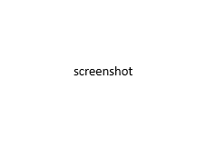

# What's New in DevTools (Microsoft Edge 116)

[!INCLUDE [Microsoft Edge team note for top of What's New](../../includes/edge-whats-new-note.md)]

<!-- ====================================================================== -->
## Entry 1

<!-- Subtitle: . -->

<!-- todo: steps to re-create screenshot -->

<!--
See also:
* 
-->

<!-- ====================================================================== -->
## Entry 2

<!-- Subtitle: . -->

<!-- todo: steps to re-create screenshot -->

<!--
See also:
* 
-->

<!-- ====================================================================== -->
## Entry 3

<!-- Subtitle: . -->

<!-- todo: steps to re-create screenshot -->

<!--
See also:
* 
-->

<!-- ====================================================================== -->
## Announcements from the Chromium project

Microsoft Edge 116 also includes the following updates from the Chromium project:

<!-- todo: maybe delete some links -->
* [Improved debugging of missing stylesheets](https://developer.chrome.com/blog/new-in-devtools-116/#stylesheets)
* [Linear timing support in Elements > Styles > Easing Editor](https://developer.chrome.com/blog/new-in-devtools-116/#linear)
* [Storage buckets support and metadata view](https://developer.chrome.com/blog/new-in-devtools-116/#storage)
* [Lighthouse 10.3.0](https://developer.chrome.com/blog/new-in-devtools-116/#lighthouse)
* [Accessibility: Keyboard commands and improved screen reading](https://developer.chrome.com/blog/new-in-devtools-116/#accessibility)
* [Miscellaneous highlights](https://developer.chrome.com/blog/new-in-devtools-116/#misc)

<!-- ====================================================================== -->
<!-- uncomment if content is copied from developer.chrome.com to this page -->

<!-- > [!NOTE]
> Portions of this page are modifications based on work created and [shared by Google](https://developers.google.com/terms/site-policies) and used according to terms described in the [Creative Commons Attribution 4.0 International License](https://creativecommons.org/licenses/by/4.0).
> The original page for announcements from the Chromium project is [What's New in DevTools (Chrome 116)](https://developer.chrome.com/blog/new-in-devtools-116) and is authored by [Jecelyn Yeen](https://developers.google.com/web/resources/contributors#jecelynyeen) (Developer advocate working on Chrome DevTools at Google). -->

<!-- ====================================================================== -->
<!-- uncomment if content is copied from developer.chrome.com to this page -->

<!-- 
This work is licensed under a [Creative Commons Attribution 4.0 International License](https://creativecommons.org/licenses/by/4.0). -->