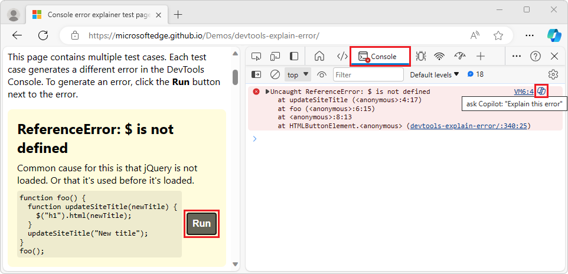

# What's New in DevTools (Microsoft Edge 118)

[!INCLUDE [Microsoft Edge team note for top of What's New](../../includes/edge-whats-new-note.md)]

<!-- ====================================================================== -->
## Updates to the "Explain Console errors using Copilot in Sidebar" experiment

A recent experimental feature explains errors or warnings that are listed in the DevTools Console by using Microsoft Copilot in the Microsoft Edge Sidebar.  In Microsoft Edge 118, this feature has the following updates.

<!-- --------------------------------- -->
#### Updated icon and tooltip on each error

In Console error entries, the Copilot chat icon has been updated, and the tooltip text has been updated to **ask Copilot: "Explain this error"**:

<!-- --------------------------------- -->
#### Consent dialog

The first time you use the "explain Console errors using Copilot" feature, a consent dialog now appears, titled **Allow Microsoft to access page content**, containing a **Confirm and continue chatting** button:

<!-- --------------------------------- -->
#### Chat includes error message and stack info

The chat prompt now includes the error message and stack information.

<!-- --------------------------------- -->
#### Enabling the experimental feature

To enable the "explain Console errors using Copilot" feature, do either of the following:

* In Microsoft Edge, go to `edge://flags/`, find the **Explain DevTools with AI** section, select **Enabled** in the drop-down menu, and then click the **Restart** button.

* Start Microsoft Edge from the command line using the feature flag `msEdgeAIExplainConsoleError`.

See also:
* [Explain DevTools Console errors and source code using Copilot in Edge](../../../experimental-features/copilot-explain.md)

<!-- ====================================================================== -->
## Announcements from the Chromium project

Microsoft Edge 118 also includes the following updates from the Chromium project:

* [More local overrides improvements](https://developer.chrome.com/blog/new-in-devtools-118#overrides)
* [Enhanced search](https://developer.chrome.com/blog/new-in-devtools-118#search)
* [Improved Sources panel](https://developer.chrome.com/blog/new-in-devtools-118#sources)
   * [Streamlined workspace in the Sources panel](https://developer.chrome.com/blog/new-in-devtools-118#workspace)
   * [Reorder panes in Sources](https://developer.chrome.com/blog/new-in-devtools-118#reorder-panes)
   * [Syntax highlighting and pretty-printing for more script types](https://developer.chrome.com/blog/new-in-devtools-118#syntax)
* [Emulate prefers-reduced-transparency media feature](https://developer.chrome.com/blog/new-in-devtools-118#reduced-transparency)
* [Accessibility improvements](https://developer.chrome.com/blog/new-in-devtools-118#accessibility)

<!-- ====================================================================== -->
<!-- uncomment if content is copied from developer.chrome.com to this page -->

<!-- > [!NOTE]
> Portions of this page are modifications based on work created and [shared by Google](https://developers.google.com/terms/site-policies) and used according to terms described in the [Creative Commons Attribution 4.0 International License](https://creativecommons.org/licenses/by/4.0).
> The original page for announcements from the Chromium project is [What's New in DevTools (Chrome 118)](https://developer.chrome.com/blog/new-in-devtools-118) and is authored by [Sofia Emelianova](https://developers.google.com/web/resources/contributors) (Senior Technical Writer working on Chrome DevTools at Google). -->

<!-- ====================================================================== -->
<!-- uncomment if content is copied from developer.chrome.com to this page -->

<!-- 
This work is licensed under a [Creative Commons Attribution 4.0 International License](https://creativecommons.org/licenses/by/4.0). -->
