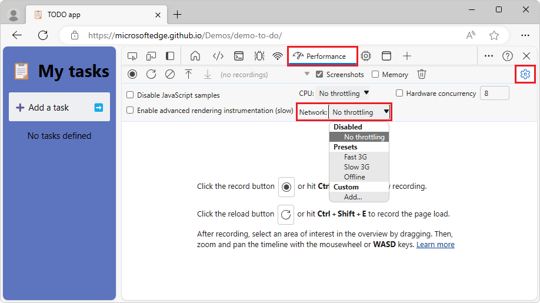
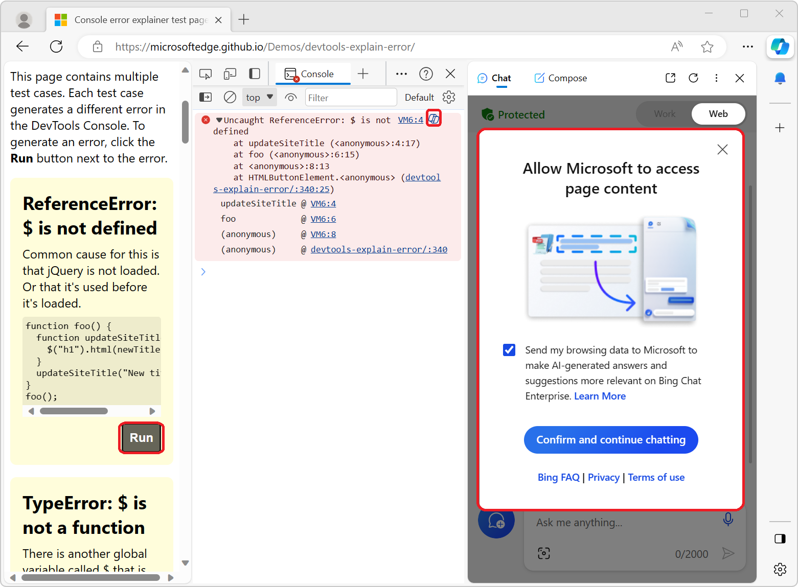

# What's New in DevTools (Microsoft Edge 118)

[!INCLUDE [Microsoft Edge team note for top of What's New](../../includes/edge-whats-new-note.md)]

<!-- ====================================================================== -->
## DevTools defaults to no throttling instead of offline

Prior to Edge 118, there was a bug where DevTools would default to offline or become unresponsive when opened. This happened if the "Emulate Microsoft-recommended hardware and network performance presents" experiment was enabled, then disabled, and DevTools was reloaded. We have now fixed this issue so that DevTools defaults to no throttling instead of offline.

<!-- ====================================================================== -->
## Updates to Explain console errors/warnings with Copilot in Sidebar Experiment

You can use Microsoft Copilot in the Microsoft Edge Sidebar to explain DevTools console errors. This experiment is disabled by default and can be enabled with feature flag msEdgeAIExplainConsoleError. 

We've updated the chat icon and the tooltip text:

We've added a consent form dialog that appears the first time you use this feature. If you confirm, then Copilot will proceed to explain the selected console error. 

Also, the chat prompt was updated to include the error messages and stack information whenever you invoke the feature.

<!-- ====================================================================== -->
<!-- uncomment if content is copied from developer.chrome.com to this page -->

<!-- > [!NOTE]
> Portions of this page are modifications based on work created and [shared by Google](https://developers.google.com/terms/site-policies) and used according to terms described in the [Creative Commons Attribution 4.0 International License](https://creativecommons.org/licenses/by/4.0).
> The original page for announcements from the Chromium project is [What's New in DevTools (Chrome 117)](https://developer.chrome.com/blog/new-in-devtools-117) and is authored by [Sofia Emelianova](https://developers.google.com/web/resources/contributors) (Senior Technical Writer working on Chrome DevTools at Google). -->

<!-- ====================================================================== -->
<!-- uncomment if content is copied from developer.chrome.com to this page -->

<!-- 
This work is licensed under a [Creative Commons Attribution 4.0 International License](https://creativecommons.org/licenses/by/4.0). -->
