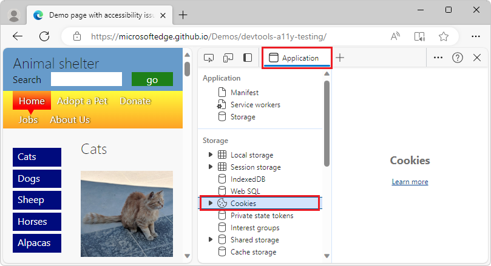

# What's New in DevTools (Microsoft Edge 119)

[!INCLUDE [Microsoft Edge team note for top of What's New](../../includes/edge-whats-new-note.md)]

<!-- ====================================================================== -->
## Increased text color contrast for Error pills (badges) in the Issues tool

Before Microsoft Edge 119, users with low vision might face difficulties with the color contrast ratio for the orange oval **Error** pills (or badges) in the **Issues** tool.  The contrast ratio between the foreground color and background color has been increased, to meet the Web Content Accessibility Guidelines for minimum contrast:

See also:
* [Contrast (Minimum)](https://www.w3.org/WAI/WCAG21/Understanding/contrast-minimum.html)
* [Find and fix problems using the Issues tool](../../../issues/index.md)

<!-- ====================================================================== -->
## Increased text color contrast for tree items on the left side of the Application tool

While navigating or hovering over a tree item in the left part of the **Application** tool, the tree item wasn't clearly visible, which might impact users with low vision, or keyboard users.  The text color is now darker, and the tree item is now clearly visible when selected:

See also:
* [Application tool, to manage storage](../../../storage/application-tool.md)

<!-- ====================================================================== -->
<!-- uncomment if content is copied from developer.chrome.com to this page -->

<!-- > [!NOTE]
> Portions of this page are modifications based on work created and [shared by Google](https://developers.google.com/terms/site-policies) and used according to terms described in the [Creative Commons Attribution 4.0 International License](https://creativecommons.org/licenses/by/4.0).
> The original page for announcements from the Chromium project is [What's New in DevTools (Chrome 119)](https://developer.chrome.com/blog/new-in-devtools-119) and is authored by [Sofia Emelianova](https://developers.google.com/web/resources/contributors) (Senior Technical Writer working on Chrome DevTools at Google). -->

<!-- ====================================================================== -->
<!-- uncomment if content is copied from developer.chrome.com to this page -->

<!-- 
This work is licensed under a [Creative Commons Attribution 4.0 International License](https://creativecommons.org/licenses/by/4.0). -->
