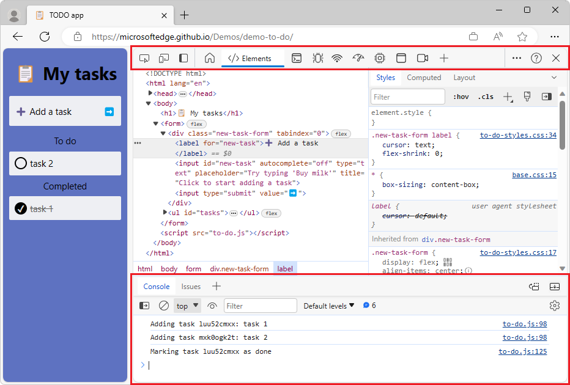

# What's New in DevTools (Microsoft Edge 120)

[!INCLUDE [Microsoft Edge team note for top of What's New](../../includes/edge-whats-new-note.md)]

<!-- ====================================================================== -->
## DevTools has a new user interface

<!-- Subtitle: Introducing the all-new Edge DevTools user interface.  Check out our blog post to learn about the new Activity Bar, Quick View, and how to customize your developer tools in the redesigned DevTools UI. -->

DevTools has a new look, starting with Microsoft Edge 120!  The major design updates are:
* The new **Activity Bar** with icons.
* **Quick View** in place of the Drawer at bottom of DevTools.
* The **Activity Bar** and **Quick View** can be switched to a vertical orientation.
* You can easily open, close, and move tools around.

See the blog post: [Inside the all-new Edge DevTools user interface](https://blogs.windows.com/msedgedev/2023/12/20/inside-the-all-new-edge-devtools-ui/).

If you prefer the legacy UI, you can switch back by going to DevTools > **Settings** > **Preferences** and selecting the **Switch back to the legacy DevTools UI** checkbox.  After reloading DevTools, the legacy UI appears.

<!-- ====================================================================== -->
## The "Explain with Copilot in DevTools" feature is generally available

<!-- Subtitle: Debug source code by having Copilot explain lines of code.  You can ask Copilot to read lines of code for you and describe what the code is doing for an easier time debugging. -->

You can now ask DevTools to explain any Console error, Console warning, or code snippet by using Copilot in Edge:

This feature is enabled by default, starting with Microsoft Edge 120.  See the blog post: [Navigate the unexpected: using Copilot in Edge and DevTools](https://blogs.windows.com/msedgedev/2023/12/14/navigate-the-unexpected-using-copilot-in-edge-and-devtools/).

If you don't see the feature, you might need to enable it.  To enable this feature, follow the steps in [Enable the features](../../../experimental-features/copilot-explain.md#enable-the-features), in the article _Explain DevTools Console errors and source code using Copilot in Edge_.

If you have any questions, comments, or feedback about the feature, please leave a comment in the GitHub Issue: [\[Feedback\]\[Experiment\] Explain errors, warnings, and source code in the Console and Sources tools](https://github.com/MicrosoftEdge/DevTools/issues/203).

<!-- ====================================================================== -->
## New Recorder tool to record and replay user flows and measure performance

<!-- Subtitle: Debug and share common user journeys by recording them. You can generate a performance trace, and then analyze it by using the Performance tool. -->

Use the **Recorder** tool to help you record and replay common user flows and measure performance.  You can edit your recordings and share them by importing and exporting. 

The initial view in the **Recorder** tool gives an overview of how to use the tool:

After you click the **Create a new recording** button, you can name the recording and specify a selector attribute:

During recording, interactions with the webpage are listed:

See also:
* [Record and replay user flows and measure performance](../../../recorder/index.md)

<!-- ====================================================================== -->
## Announcements from the Chromium project

Microsoft Edge 120 also includes the following updates from the Chromium project:

* [Third-party cookie phaseout](https://developer.chrome.com/blog/new-in-devtools-120#3pc)
* [Analyze your website's cookies with the Privacy Sandbox Analysis Tool](https://developer.chrome.com/blog/new-in-devtools-120#ps-analysis-tool)
* [Enhanced ignore listing](https://developer.chrome.com/blog/new-in-devtools-120#ignore-listing)
   * [Default exclusion pattern for `node_modules`](https://developer.chrome.com/blog/new-in-devtools-120#default-regex)
   * [Exceptions now stop execution if caught or passing through non-ignored code](https://developer.chrome.com/blog/new-in-devtools-120#exceptions)
   * [`x_google_ignoreList` renamed to `ignoreList` in source maps](https://developer.chrome.com/blog/new-in-devtools-120#ignore-list-spec)
* [The Elements panel now shows URLs for `#document` nodes](https://developer.chrome.com/blog/new-in-devtools-120#document-urls)
* [Effective Content Security Policy in the Application panel](https://developer.chrome.com/blog/new-in-devtools-120#csp)
* [Improved animation debugging](https://developer.chrome.com/blog/new-in-devtools-120#animations)
* ['Do you trust this code?' dialog in Sources and self-XSS warning in Console](https://developer.chrome.com/blog/new-in-devtools-120#self-xss)
* [Event listener breakpoints in web workers and worklets](https://developer.chrome.com/blog/new-in-devtools-120#worker-breakpoints)
* [The new media badge for `<audio>` and `<video>`](https://developer.chrome.com/blog/new-in-devtools-120#media)
* [Preloading renamed to Speculative loading](https://developer.chrome.com/blog/new-in-devtools-120#speculative-loading)
* [Accessibility improvements](https://developer.chrome.com/blog/new-in-devtools-120#accessibility)

<!-- ====================================================================== -->
<!-- uncomment if content is copied from developer.chrome.com to this page -->

<!-- > [!NOTE]
> Portions of this page are modifications based on work created and [shared by Google](https://developers.google.com/terms/site-policies) and used according to terms described in the [Creative Commons Attribution 4.0 International License](https://creativecommons.org/licenses/by/4.0).
> The original page for announcements from the Chromium project is [What's New in DevTools (Chrome 120)](https://developer.chrome.com/blog/new-in-devtools-120) and is authored by [Sofia Emelianova](https://developers.google.com/web/resources/contributors) (Senior Technical Writer working on Chrome DevTools at Google). -->

<!-- ====================================================================== -->
<!-- uncomment if content is copied from developer.chrome.com to this page -->

<!-- 
This work is licensed under a [Creative Commons Attribution 4.0 International License](https://creativecommons.org/licenses/by/4.0). -->
