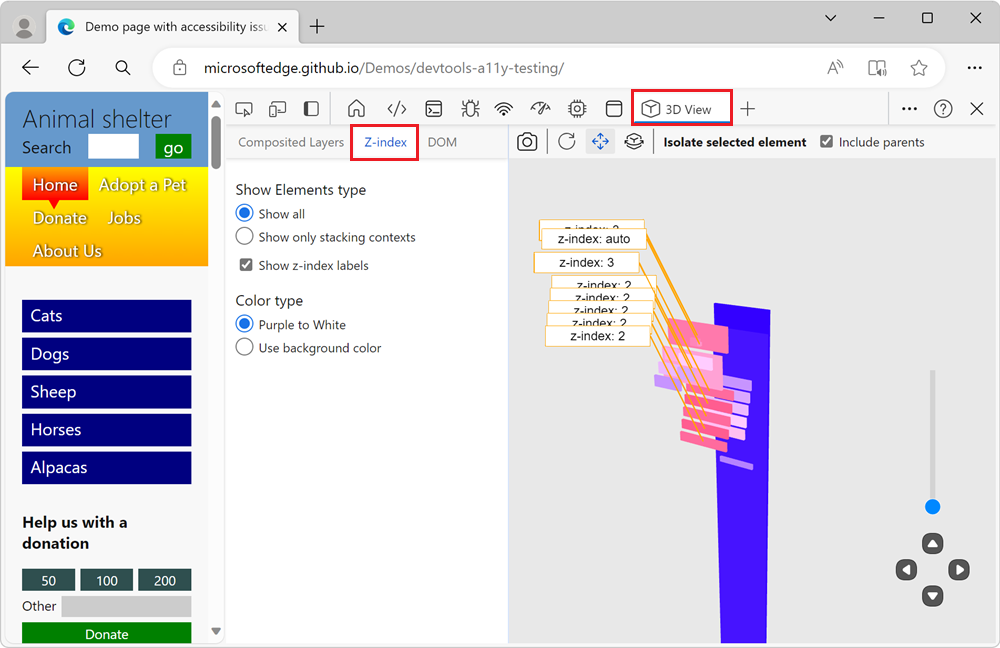
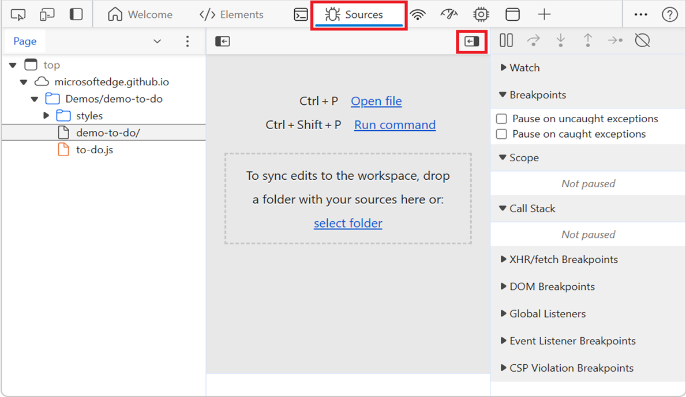
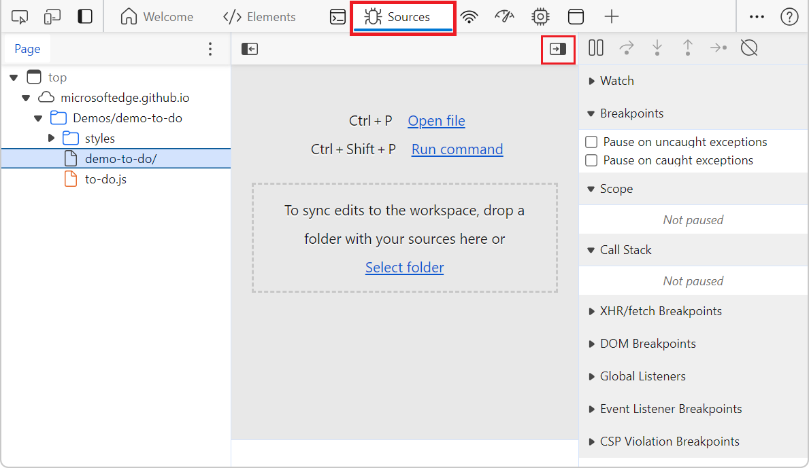
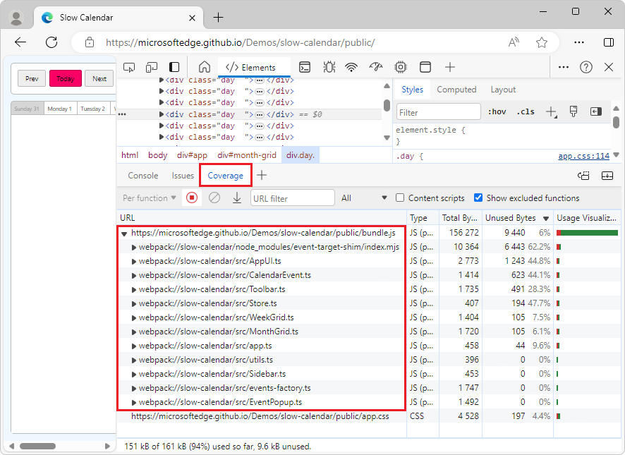
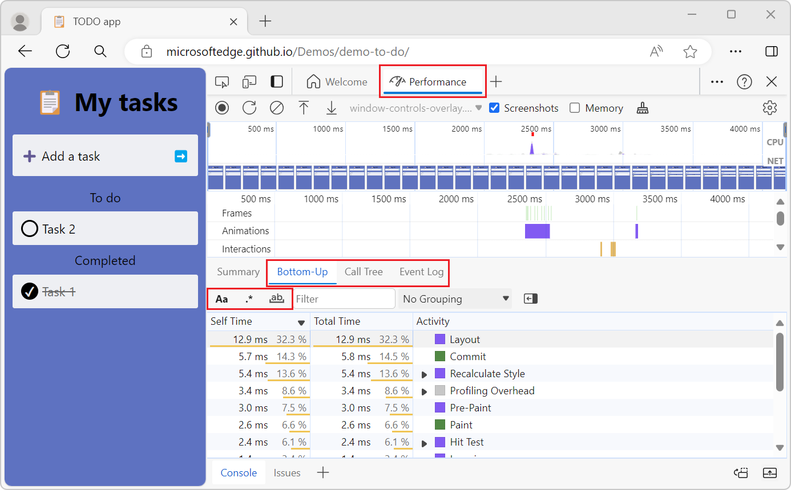
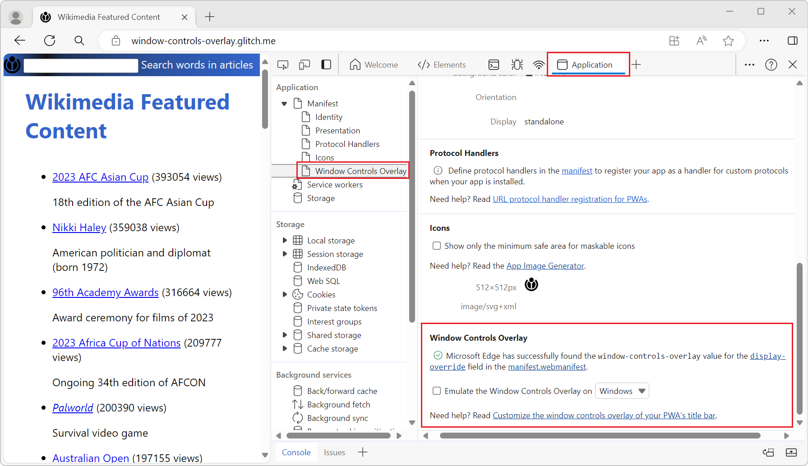

# What's New in DevTools (Microsoft Edge 121)

[!INCLUDE [Microsoft Edge team note for top of What's New](../../includes/edge-whats-new-note.md)]

<!-- ====================================================================== -->
## Z-index and DOM tabs in 3D View tool are now working

<!-- Subtitle: In recent versions of Microsoft Edge, the Z-index and DOM tabs weren't working. In Microsoft Edge 121, this issue has been resolved. -->

In recent versions of Microsoft Edge, there was a bug in the **3D View** tool that caused the **Z-index** and **DOM** tabs to not work correctly.  The tabs would crash or freeze and show the content for the **Composited Layers** tab instead.  This issue has been fixed in Microsoft Edge 121:

See also:
* [Navigate webpage layers, z-index, and DOM using the 3D View tool](../../../3d-view/index.md)

<!-- ====================================================================== -->
## Correct Hide debugger or Show debugger icon is shown in Sources tool

<!-- Subtitle: In previous versions of Microsoft Edge, the Hide debugger icon was displayed instead of the Show debugger icon and vice versa in the Sources tool. In Microsoft Edge 121, this issue has been resolved. -->

The icon used to collapse or expand the **Debugger** pane on the right in the **Sources** tool was incorrect.  The **Hide debugger** icon was displayed instead of the **Show debugger** icon, and vice versa:

In Microsoft Edge 121, the correct icon is now shown:

See also:
* [Sources tool overview](../../../sources/index.md)

<!-- ====================================================================== -->
## Added source map support in the Coverage tool

<!-- Subtitle: Quickly identify and eliminate unused code with the improved source map support in the Coverage tool. -->

Before Microsoft Edge 121, the **Coverage** tool only displayed information for generated files, and omitted source files even when a source map was attached.  The **Coverage** tool has now been improved so that when a generated file has a source map attached, the **Coverage** tool displays information for the source file as well as for the generated file.

For example, before Microsoft Edge 121, the coverage report for the [Slow Calendar demo page](https://microsoftedge.github.io/Demos/slow-calendar/public/) contained only a single, static line, for the `bundle.js` file.  The `bundle.js` line in the coverage report can now be expanded to show all of the original source files that make up this compiled `bundle.js` file:

See also:
* [Find unused JavaScript and CSS code with the Coverage tool](../../../coverage/index.md)

<!-- ====================================================================== -->
## Advanced filtering capabilities in the Bottom-Up, Call Tree, and Event Log tabs in the Performance tool

<!-- Subtitle: Use advanced filters (Match Case, Use Regular Expression, and Match whole word) in the Performance tool's Bottom-Up, Call Tree, and Event Log tabs, to give more focused results. -->

In the **Performance** tool, the following advanced filtering buttons were added to the **Bottom-Up**, **Call Tree**, and **Event Log** tabs:
* **Match Case**.
* **Use Regular Expression**.
* **Match whole word**.

Also, in the **Bottom-Up** tab, the filter has been updated to now only apply to the top-level items, instead of matching every node.

See also:
* [Introduction to the Performance tool](../../../evaluate-performance/index.md)

<!-- ====================================================================== -->
## Tooling for PWA Window Controls Overlay

<!-- Subtitle: Easily view window controls for your PWA without having to install it multiple times. -->

The **Application** tool has a new **Window Controls Overlay** section under **Manifest**, to help PWA developers see a preview of how their application handles window controls, without having to install the PWA and make the styling changes that are necessary to accommodate window controls:

Use the **Window Controls Overlay** section to emulate window controls for Windows, Linux, and macOS.

See also:
* [Application tool, to manage storage](../../../storage/application-tool.md)

<!-- ====================================================================== -->
## Announcements from the Chromium project

Microsoft Edge 121 also includes the following updates from the Chromium project:

* [Elements improvements](https://developer.chrome.com/blog/new-in-devtools-121#elements)
   * [@font-palette-values support](https://developer.chrome.com/blog/new-in-devtools-121#font-palette)
   * [Supported case: Custom property as a fallback of another custom property](https://developer.chrome.com/blog/new-in-devtools-121#custom-fallback)
* [Improved source map support](https://developer.chrome.com/blog/new-in-devtools-121#variables)
* [Performance panel improvements](https://developer.chrome.com/blog/new-in-devtools-121#perf)
   * [Enhanced Interactions track](https://developer.chrome.com/blog/new-in-devtools-121#interactions)
   * [Advanced filtering in Bottom-Up, Call Tree, and Event Log tabs](https://developer.chrome.com/blog/new-in-devtools-121#filters)
* [Indentation markers in the Sources panel](https://developer.chrome.com/blog/new-in-devtools-121#sources)
* [Helpful tooltips for overridden headers and content in the Network panel](https://developer.chrome.com/blog/new-in-devtools-121#overrides)
* [New Command Menu options for adding and removing request blocking patterns](https://developer.chrome.com/blog/new-in-devtools-121#command-menu)
* [The CSP violations experiment is removed](https://developer.chrome.com/blog/new-in-devtools-121#csp-violations)
* [Accessibility](https://developer.chrome.com/blog/new-in-devtools-121#accessibility)

<!-- ====================================================================== -->
<!-- uncomment if content is copied from developer.chrome.com to this page -->

<!-- > [!NOTE]
> Portions of this page are modifications based on work created and [shared by Google](https://developers.google.com/terms/site-policies) and used according to terms described in the [Creative Commons Attribution 4.0 International License](https://creativecommons.org/licenses/by/4.0).
> The original page for announcements from the Chromium project is [What's New in DevTools (Chrome 121)](https://developer.chrome.com/blog/new-in-devtools-121) and is authored by [Sofia Emelianova](https://developers.google.com/web/resources/contributors) (Senior Technical Writer working on Chrome DevTools at Google). -->

<!-- ====================================================================== -->
<!-- uncomment if content is copied from developer.chrome.com to this page -->

<!-- 
This work is licensed under a [Creative Commons Attribution 4.0 International License](https://creativecommons.org/licenses/by/4.0). -->
