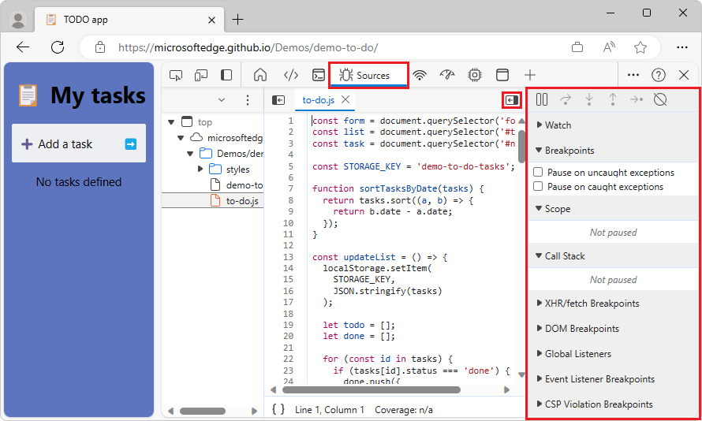

# What's New in DevTools (Microsoft Edge 121)

[!INCLUDE [Microsoft Edge team note for top of What's New](../../includes/edge-whats-new-note.md)]

<!-- ====================================================================== -->
## Z-Index and DOM tabs in 3D View panel are now working

<!-- Subtitle: In previous versions of Microsoft Edge, the Z-Index and DOM tabs weren't working. In Microsoft Edge 121, this issue has been resolved. -->

There was a bug in the 3D View panel that caused the DOM and Z-Index tabs not to work correctly. The main issues with the tabs were that they would crash or freeze and get stuck on the page. This has been fixed for Edge 121.

<!-- ====================================================================== -->
## Corrected the open/close right panel button in the Sources panel

<!-- Subtitle: In previous versions of Microsoft Edge, the close icon was displayed instead of the open icon and vice versa in the Sources panel. In Microsoft Edge 121, this issue has been resolved. -->

The icon used to collapse/expand the right panel in the Sources panel was incorrect. The close icon was displayed instead of the open icon and vice versa:

In Edge 121, the icon has been updated to show the correct one:

<!-- ====================================================================== -->
## Announcements from the Chromium project

Microsoft Edge 121 also includes the following updates from the Chromium project:

<!-- todo: add annoucnements here -->

<!-- ====================================================================== -->
<!-- uncomment if content is copied from developer.chrome.com to this page -->

<!-- > [!NOTE]
> Portions of this page are modifications based on work created and [shared by Google](https://developers.google.com/terms/site-policies) and used according to terms described in the [Creative Commons Attribution 4.0 International License](https://creativecommons.org/licenses/by/4.0).
> The original page for announcements from the Chromium project is [What's New in DevTools (Chrome 120)](https://developer.chrome.com/blog/new-in-devtools-120) and is authored by [Sofia Emelianova](https://developers.google.com/web/resources/contributors) (Senior Technical Writer working on Chrome DevTools at Google). -->

<!-- ====================================================================== -->
<!-- uncomment if content is copied from developer.chrome.com to this page -->

<!-- 
This work is licensed under a [Creative Commons Attribution 4.0 International License](https://creativecommons.org/licenses/by/4.0). -->
