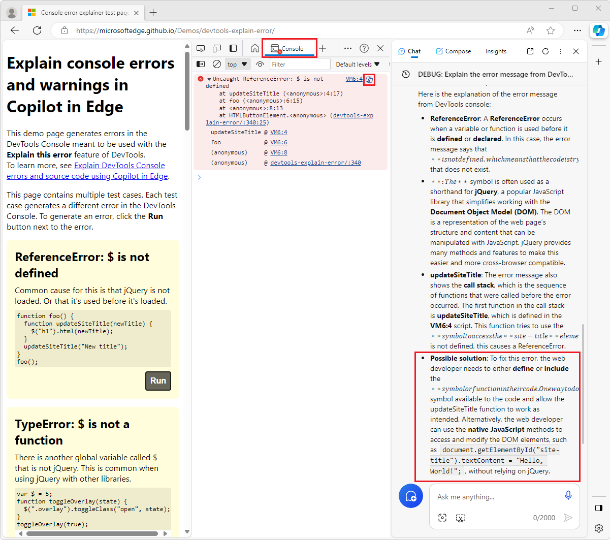
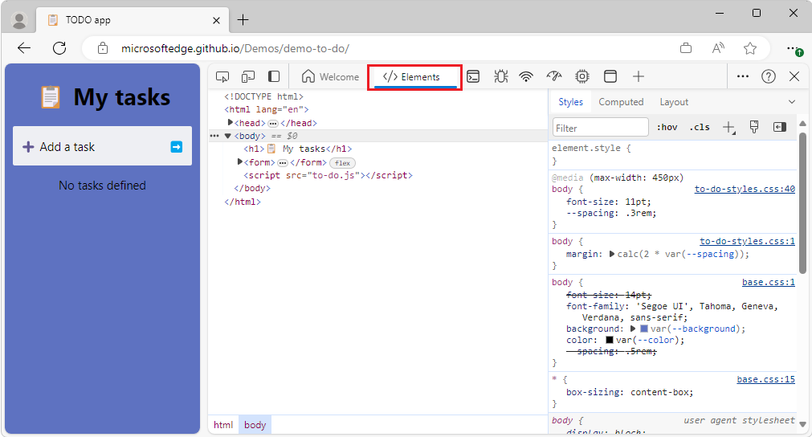
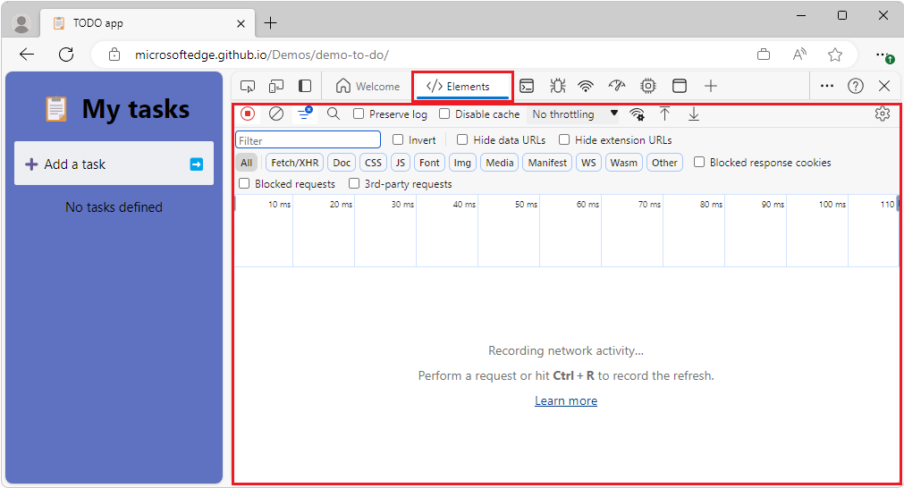

# What's New in DevTools (Microsoft Edge 122)

[!INCLUDE [Microsoft Edge team note for top of What's New](../../includes/edge-whats-new-note.md)]

<!-- ====================================================================== -->
## Copilot's explanation of Console errors includes a suggested fix

<!-- Subtitle: Use Copilot to explain Console errors along with a suggested fix in a new Possible solution section. -->

When using Copilot to help explain errors that are shown in the **Console**, a **Possible solution** section has been added, below the error explanation:

<!-- ====================================================================== -->
## Keyboard shortcut to move through the open tools is working correctly

<!-- Subtitle: In previous versions of Microsoft Edge, the Ctrl + ]/[ keyboard shortcut wasn't working correctly. In Microsoft Edge 122, this issue has been resolved. -->

In previous releases, when pressing the **Ctrl+]** and **Ctrl+[** keyboard shortcuts, the next tool's tab in the **Activity Bar** wasn't selected and the **Activity Bar** wouldn't update, so it looked like the previous tool was still selected, even though the content of the panel changed to show the correct content for the next tool.  For example, suppose that initially, the **Elements** tool's tab and panel content are displayed:

After pressing **Ctrl+]** or **Ctrl+[** to move through the tool tabs on the **Activity Bar**, the **Elements** tab remained highlighted, incorrectly, although the **Network** tool's content was correctly displayed:

This issue has been fixed in Microsoft Edge 122; the correct tool tab is highlighted.

<!-- ====================================================================== -->
## Icons are displayed correctly in high-contrast mode

<!-- Subtitle: In recent versions of Microsoft Edge, icons were missing or were colored incorrectly. In Microsoft Edge 122, this issue has been resolved. -->

When using high-contrast mode, icons were missing, had the wrong background color, or didn't work, throughout DevTools.  In Microsoft Edge 122, these icons are correctly displayed in high-contrast mode.

<!-- ====================================================================== -->
## Announcements from the Chromium project

Microsoft Edge 122 also includes the following updates from the Chromium project:

* [The official collection of Recorder extensions is live](https://developer.chrome.com/blog/new-in-devtools-122#recorder-extensions)
* [Network improvements](https://developer.chrome.com/blog/new-in-devtools-122#network)
   * [Failure reason in the Status column](https://developer.chrome.com/blog/new-in-devtools-122#failure-status)
   * [Improved Copy submenu](https://developer.chrome.com/blog/new-in-devtools-122#copy-submenu)
* [Performance improvements](https://developer.chrome.com/blog/new-in-devtools-122#perf-improvements)
   * [Breadcrumbs in the Timeline](https://developer.chrome.com/blog/new-in-devtools-122#perf-breadcrumbs)
   * [Event initiators in the Main track](https://developer.chrome.com/blog/new-in-devtools-122#event-initiators)
* [Elements improvements](https://developer.chrome.com/blog/new-in-devtools-122#elements-improvements)
   * [The align-content property support for block containers](https://developer.chrome.com/blog/new-in-devtools-122#align-content-in-blocks)
* [New shortcut and command in Sources](https://developer.chrome.com/blog/new-in-devtools-122#sources)
* [Posture support for emulated foldable devices](https://developer.chrome.com/blog/new-in-devtools-122#device-posture)
* [Dynamic theming](https://developer.chrome.com/blog/new-in-devtools-122#dynamic-theming)
* [Third-party cookies phaseout warnings in the Network and Application panels](https://developer.chrome.com/blog/new-in-devtools-122#3pc)
* [Accessibility](https://developer.chrome.com/blog/new-in-devtools-122#accessibility)

<!-- ====================================================================== -->
<!-- uncomment if content is copied from developer.chrome.com to this page -->

<!-- > [!NOTE]
> Portions of this page are modifications based on work created and [shared by Google](https://developers.google.com/terms/site-policies) and used according to terms described in the [Creative Commons Attribution 4.0 International License](https://creativecommons.org/licenses/by/4.0).
> The original page for announcements from the Chromium project is [What's New in DevTools (Chrome 122)](https://developer.chrome.com/blog/new-in-devtools-122) and is authored by [Sofia Emelianova](https://developers.google.com/web/resources/contributors) (Senior Technical Writer working on Chrome DevTools at Google). -->

<!-- ====================================================================== -->
<!-- uncomment if content is copied from developer.chrome.com to this page -->

<!-- 
This work is licensed under a [Creative Commons Attribution 4.0 International License](https://creativecommons.org/licenses/by/4.0). -->
